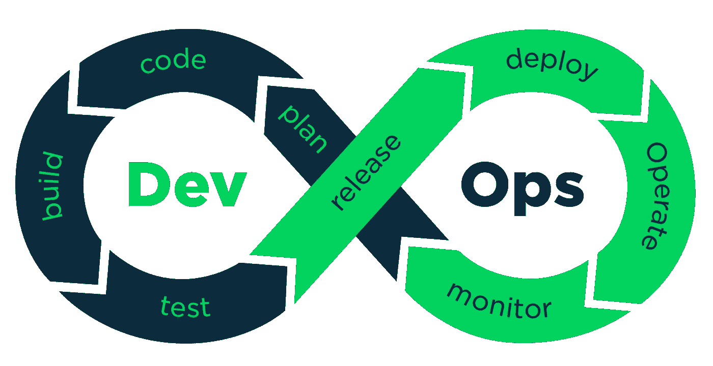

# DevOps 如何加速您的产品开发？

> 原文：<https://medium.com/quick-code/how-devops-can-accelerate-your-product-development-c6edb0733233?source=collection_archive---------0----------------------->

在当今竞争激烈的世界，只有速度和质量才能让你领先于竞争对手。

你越快将产品推向市场，就越有利于公司的发展。这就是为什么世界各地的公司总是在寻找加速产品开发生命周期的方法。

但是，在不牺牲质量的情况下实现速度通常是大多数公司面临的挑战。

这就是 DevOps 发挥作用的地方…

# **什么是 DevOps？**

[根据维基百科](https://en.wikipedia.org/wiki/DevOps) …

> DevOps 是一组实践，它将软件开发(Dev)和 IT 运营(Ops)结合起来，以缩短软件开发的生命周期，同时根据业务目标持续交付更新、功能和修复。

简单地说，DevOps 是关于监控产品开发生命周期的所有阶段，从概念化到设计、开发、集成、部署、测试和发布。

术语“DevOps”是由 [Patrick Debois 和 Andrew Shafer](https://en.wikipedia.org/wiki/DevOps#Definitions_and_History) 在 2008 年敏捷多伦多会议的“敏捷基础设施”演讲中首次提出的。

从那时起，DevOps 方法开始成为主流。事实上，许多软件和移动应用程序开发公司已经意识到对 DevOps 的需求，并开始采用它的实践。

下面是 DevOps 如何加速产品开发生命周期。

# **devo PS 如何加快产品开发周期？**

公司有很多方法可以加速他们的产品开发周期。但是，以下是加速产品开发的最有效的方法。

# **1 —更快的功能交付**

当开发人员构建软件或应用程序时，他们与 IT 运营团队联系，将产品送去测试。

现在，如果软件或应用程序是全新的，那么测试团队需要首先建立一个测试环境。

另一方面，如果应用程序的软件只是一个更新的版本，并且已经创建了一个测试环境，IT 运营部门仍然需要添加接口、辅助应用程序并对它们进行配置。

这意味着，开发人员只能在 IT 运营团队已经测试过的情况下部署产品。

总之整个过程非常耗时。

但是，DevOps 可以使用自动化测试消除整个过程。

通过 DevOps 的自动化测试，开发团队可以获得快速反馈，自动化集成使代码自动更改。因此，公司可以更快地发布产品的小更新。

# **2 —提高效率**

DevOps 方法鼓励开发人员将最大的时间投入到创造价值的工作中。由于自动化测试和集成负责常规的乏味工作，开发人员确实需要等待代码集成或配置。这两项任务都可以通过单击按钮来完成。

因此，他们的工作效率得到了提高，他们可以更加专注于具有挑战性和创造价值的工作。

# **3-代码质量提高&故障快速恢复**

每当一个软件、应用程序或产品在市场上发布时，开发人员通常会立即进行下一个项目，并且错误修复和未来的更新成为运营团队的责任。

但是 DevOps 可以帮助开发人员在整个生命周期中保持循环，而不仅仅是在开发阶段。这最终会提高代码的质量，因为开发人员可以很容易地识别并修复错误，同时保持相同的编码标准。

结果，代码的质量得到了提高，更新和修复交付得更快。

# **使用 DevOps 的顶级公司**

正如您所看到的，DevOps 可以极大地影响您的产品开发生命周期。它节省了时间、金钱和资源，最重要的是，它缩短了产品的上市时间。

事实上，以下全球品牌也实现了这些优势。

# **网飞**

当网飞推出时，没有任何商业工具可以平稳地运行云基础设施。因此，网飞转向开源解决方案来处理他们的云基础设施。

在志愿者的帮助下，网飞创建了[猿猴军](https://github.com/Netflix/SimianArmy)，这是一套自动化工具。

西米安军队允许网飞在臭虫影响他们的客户之前自动测试和解决臭虫。从那时起，网飞开始使用开源工具和自动化，这使得他们每天可以部署数千次代码。

# **Airbnb**

Airbnb 也是像网飞一样的第三方平台公司。该公司利用移动、分析、社交和云来提供服务。

由于 Airbnb 是一个第三方平台，该公司别无选择，只能采用 DevOps。因此，DevOps 帮助 Airbnb 快速有效地发布了多个小版本。

# **Etsy**

Etsy 是一个销售古董、手工制品和工艺用品的电子商务网站。在最初的日子里，Etsy 挣扎了很久，因为有很多孤岛，开发和运营团队之间没有合作。

这导致该公司疲于应对缓慢的部署。在采用 DevOps 之前，该公司每周只部署两次新功能和更新。但是在采用了 DevOps 即服务之后，该公司现在每天能够部署 50 次新代码。

从上面三个例子可以看出，DevOps 极大地延长了产品开发生命周期，并帮助公司高速交付新功能和更新。

# **结论**

今天，各行各业的竞争都很激烈。如果你想击败你的竞争对手，那么你必须努力更快地将你的产品推向市场。因此，如果您想要缩短产品的上市时间，那么在您的产品开发中识别和采用正确的 DevOps 实践是非常必要的。