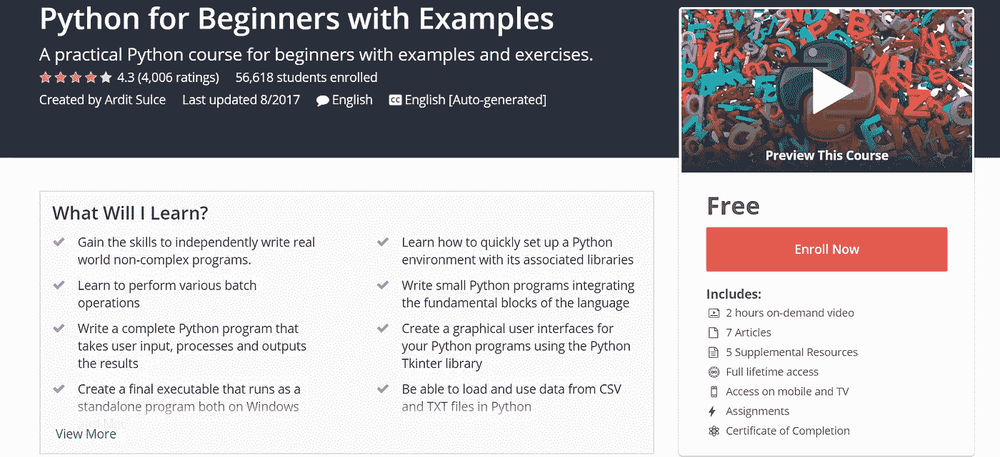

# 免费的 Udemy 课程如何赚钱？

> 原文：<https://medium.com/quick-code/how-do-free-udemy-courses-make-money-b5fd7a096881?source=collection_archive---------4----------------------->

Udemy 的免费课程不直接赚钱。它们是带动其他球场交通的好方法。

**举例-**

*   参见[教程 *Python 初学者用例*](https://www.udemy.com/ardit-sulce-python-for-beginners/?LSNPUBID=Fh5UMknfYAU&siteID=Fh5UMknfYAU-RmmHvX0kiFSJRGRXnhPGjQ) **。**
*   作为初学者学习 python 是一门**免费**课程。迄今为止，已有近 56，618 名学生选修了这门课程。
*   学生完成本课程后，教师会询问学生是否有兴趣学习 Python 的高级课程，并推荐另一门课程:[*Python 大型课程:构建 10 个真实世界的应用程序*](https://www.udemy.com/the-python-mega-course/?LSNPUBID=Fh5UMknfYAU&siteID=Fh5UMknfYAU-VsoXclkuUefG5vAsWn0XTg) (来自同一教师)。
*   第二道菜不是免费的。学生很有可能会为第二个课程付费。假设只有 10%的学生愿意为第二个课程付费，那么将会有 5600 名学生为第二个课程付费。

因此，免费课程试图在要求用户付费学习其他课程之前为用户提供价值。每个人都喜欢免费的东西。

*原载于 www.quora.com***。**