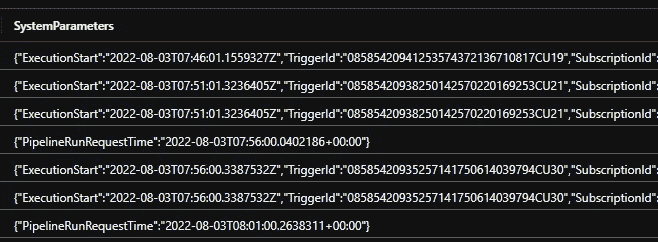
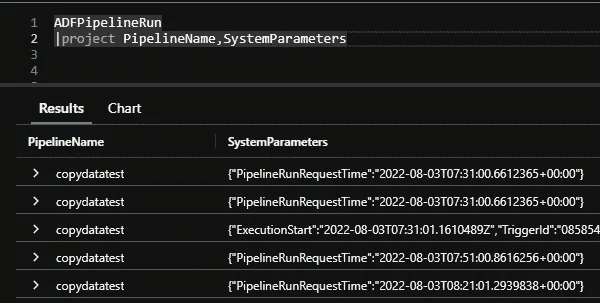
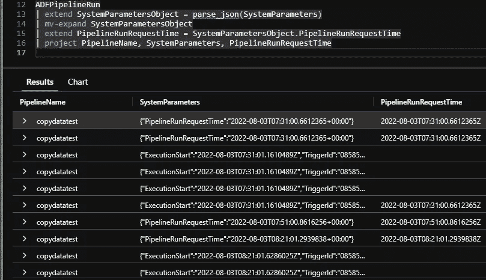

# 如何在日志分析中查询 JSON？

> 原文：<https://medium.com/version-1/how-do-i-query-json-in-log-analytics-ce289b4b1fb5?source=collection_archive---------1----------------------->

JSON — not always fun to query…..

Azure 日志通常包含 JSON 数据，我们需要“打开”这些数据来检索特定的值。

**ADF 日志就是一个很好的例子:**

SystemParameters data in JSON

***系统参数*** 包含一些关于管道运行请求时间的有用数据——那么我们如何将其提取到自己的列中呢？

## 这是一个非常简单的三阶段过程:

*   [***【parse _ json()***](https://docs.microsoft.com/en-us/azure/data-explorer/kusto/query/parsejsonfunction)函数—将 JSON 数据加载到单个对象中
*   [***mv-展开***](https://docs.microsoft.com/en-us/azure/data-explorer/kusto/query/mvexpandoperator)*—*将 JSON 对象展开到其单独的记录中**
*   **[***扩展***](https://docs.microsoft.com/en-us/azure/data-explorer/kusto/query/extendoperator)—Kusto 操作符为了创建计算列，我们引用我们感兴趣的 JSON 记录(PipelineRunRequestTime)并将其作为新的结果列进行表面处理。**

****

**PipelineRunRequestTime surfaced in its own column**

**值得注意的是，Kusto 优雅地处理丢失的数据，JSON 中没有的行被忽略，而不是抛出错误——很好！**

**就是这样！嵌套的 JSON 数据和数组会增加复杂性，但希望这是在日志分析中处理 JSON 的一个快速而简单的开始。**

****

****关于作者:** Mike Knee 是 Azure 1.0 版的高级数据开发人员。**