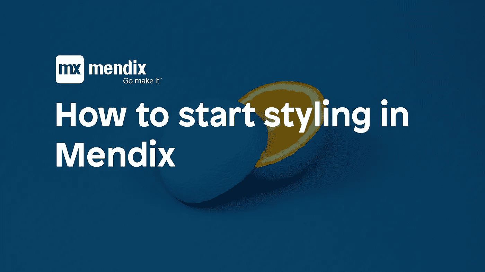
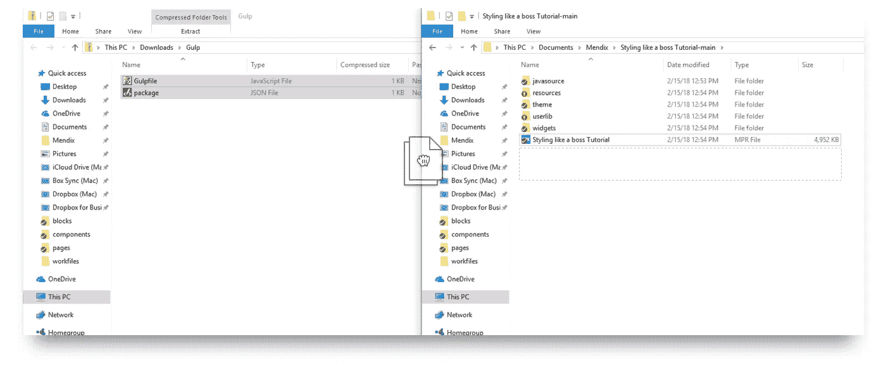
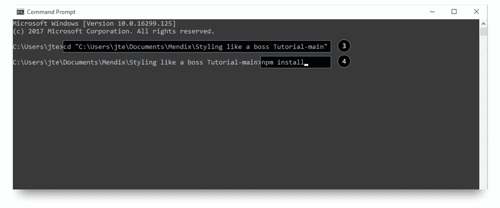
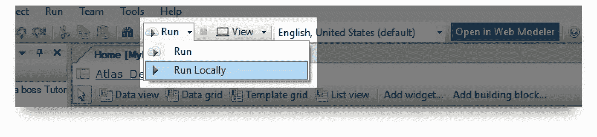
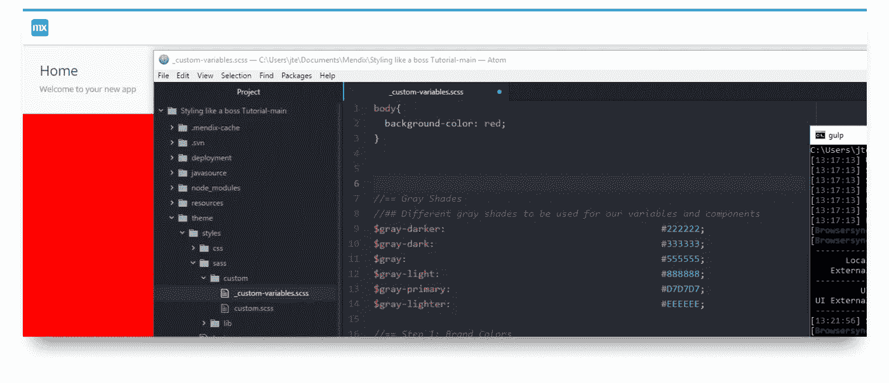

# 如何在 Mendix 中开始造型(Gulp & Sass)

> 原文：<https://medium.com/mendix/how-do-i-start-styling-in-mendix-gulp-sass-6b37ddaf8de6?source=collection_archive---------0----------------------->

**(编辑:2019 年 9 月 27 日)Mendix 刚刚发布了他们的** [**Calypso Sass 编译器**](https://docs.mendix.com/howto/front-end/calypso) **，它比 gulp 编译器需要更少的设置，更容易满足大多数日常造型需求。)**

> 所有的荣誉都归于 Jelte，他是创造 Git 回购的天才。

你是来回答一个问题的吗:把我可爱的设计变成你的浏览器能理解的东西的最有效的方法是什么？

如需快速指南，请访问 Jelte 的 Git repo [这里](https://github.com/mendix/ux-theming)。如果你像我一样，不是超级技术人员，或者对 Terminal、Gulp 和 Sass 没有信心，那么这个指南就是为你准备的。

## 我们想要什么？

*   Sass(专业造型)
*   自动刷新(让生活变得简单)
*   吞咽(使上述所有工作)

## 先决条件

1-从[这里](https://nodejs.org/en/)安装节点

2-在终端键入`npm install gulp-cli -g`安装 Gulp

# 装置

1-在此下载**gulp . zip**T24

2-在你的项目根文件夹中解压。

3-在你的终端中，通过键入`cd`进入你的项目根文件夹，然后将你的根文件拖到终端中。 *如果您在 Windows 上执行此操作，并且在安装依赖项时遇到错误，请以管理员身份打开 CMD 或 Powershell。*

4-使用`npm install`安装依赖项

# 使用

1-在你的根目录中键入`gulp dev` *如果你刚刚完成安装，你应该还在你的根目录中，否则键入* `*cd*` *而不是把你的根目录文件拖到终端中。*

2-确保您的 Mendix 项目正在运行

就是这样。
快速测试一下是否一切正常，转到`theme/styles/sass/custom/_custom-variables.scss`，输入:
`body{ background-color: red; }` 你的背景会是一个漂亮的红色，就这样。

> Protip:如果您在 mac 上使用 parallels，您可以通过 windows-10:3000 在 Mac 浏览器上访问您的 Mendix 项目

# 完成的

此外，不要忘记用乌龟取消你的节点文件夹的链接(Mendix 只适用于 1.7，你可以在这里下载)

就这样，现在你可以开始用 Sass 设计你的 Mendix 应用了

在 [Dribbble](https://dribbble.com/jasonteunissen) 上找到我
在[Github](https://github.com/JelteMX)上找到 Jelte 了解如何使用[Sass](http://sass-lang.com/)使用 [Atlas UI 构建块](http://atlas.mendix.com)在 Mendix
中下载 [Mendix](https://developer.mendixcloud.com/link/referral/?ref=46568)

 [## 杰森·特尼森

### 用户界面/UX 设计师(可以前端)

dribbble.com](https://dribbble.com/jasonteunissen)