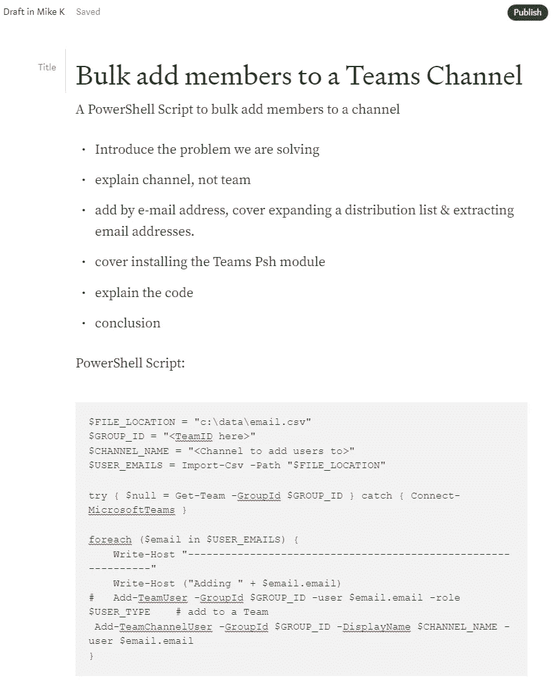

# 我如何开始写技术博客？

> 原文：<https://medium.com/version-1/how-do-i-start-technical-blogging-f0661ad9f8bf?source=collection_archive---------2----------------------->

想在技术/IT 领域开始写博客，但不知道从哪里开始？

这里有一些想法可能会帮助你开始…

## 使用草稿

创建一个快捷方式到您的媒体帐户。当你有了一个想法或者已经研究出一些很酷的东西时，迅速“写故事”&记下一些要点或者可能插入几行代码。

这是我如何做的一个典型例子——我一直在用 PowerShell 向一个团队频道添加成员，并决定在我记忆犹新的时候快速编写一些项目符号和代码。

这花了我不到 5 分钟的时间&当我花时间完成它的时候，希望会形成一个体面的职位…

Bullet Points & some code — took 3 minutes.

## 使用博客作为你的文档库

这就是 SQL 权威人物 Pinal Dave 如何开始写博客的。

他厌倦了研究技术，后来找不到代码/例子&不得不再次研究同样的东西。

他开始写博客只是为了存储自己的知识和代码片段，这样他就可以再次找到它们。使用草稿，并在那时快速记下想法——你以后会感谢你自己的！

这对 Pinal Dave 来说效果很好，至少你会有一个可以在几秒钟内找到的想法和技术的仓库。

## 不需要 100%原创

你的帖子不需要 100%是新的，原创的想法和内容。有时候，将其他博客或文档中的信息整合在一起是有价值的。

价值可能在于将几个信息源集中在一个地方&通过实例或概念的实际应用来增加清晰度/价值。

例如，我写了一篇关于弹性搜索中的[同义词的帖子](/version-1/synonyms-in-elasticsearch-c527280ba8a5)——帖子中的所有内容都来自文档或其他博客，但没有人对一些例子进行过简单的排练&信息在几个地方。这是我最受欢迎的第 1 版博客帖子！

## 如果你必须用谷歌搜索某样东西，其他人也一样

[https://blog.hubspot.com/marketing/google-logo-history](https://blog.hubspot.com/marketing/google-logo-history)

如果你必须研究谷歌技术或找到解决问题的方法，其他人也会这样做。

如果你不得不花超过 5 或 10 分钟来找到解决方案，那么这可能是一篇博文的好候选，很明显，你试图寻找的信息并不容易获得——把它写在博客上！

请在评论中告诉我你开始写博客的建议。

**关于作者:** Mike Knee 是 Azure 第一版的数据开发人员。