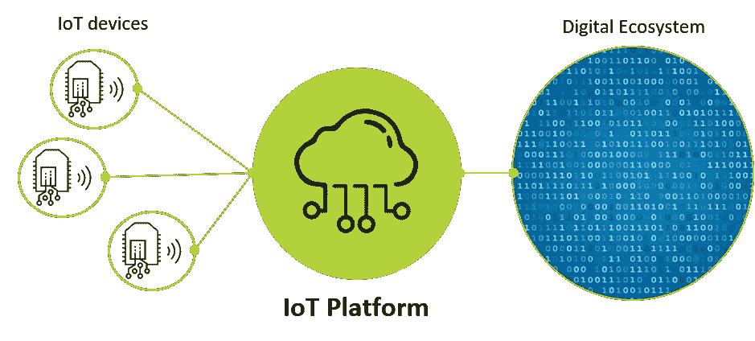
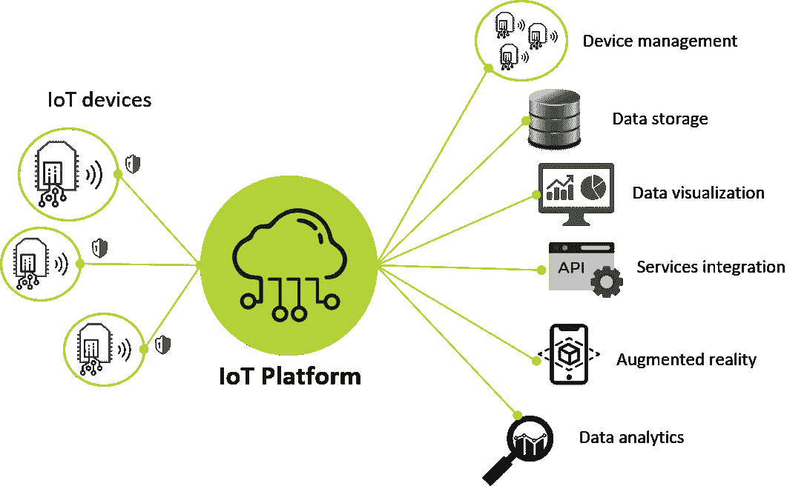
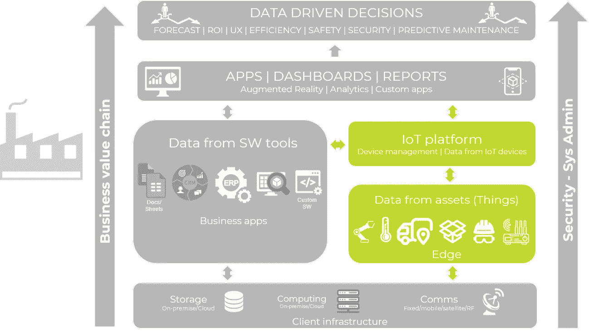
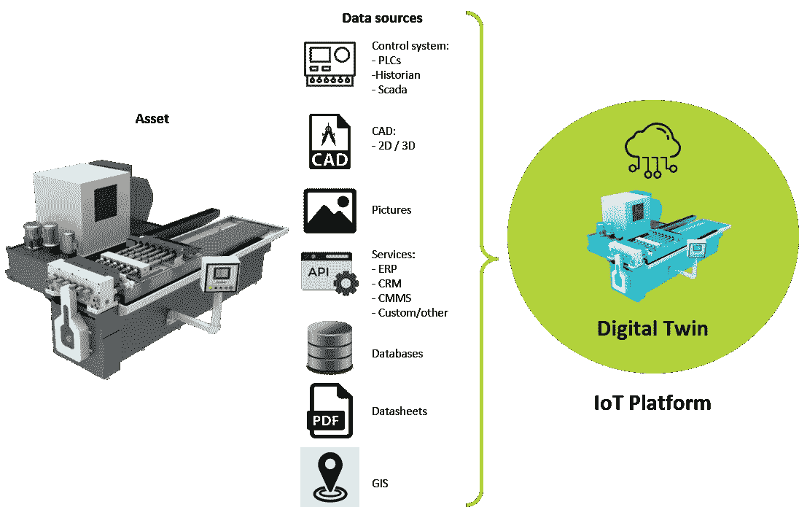
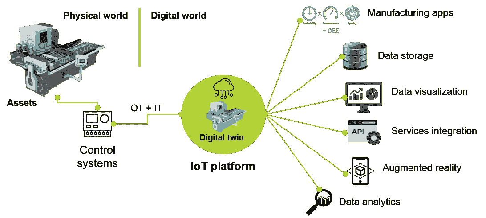
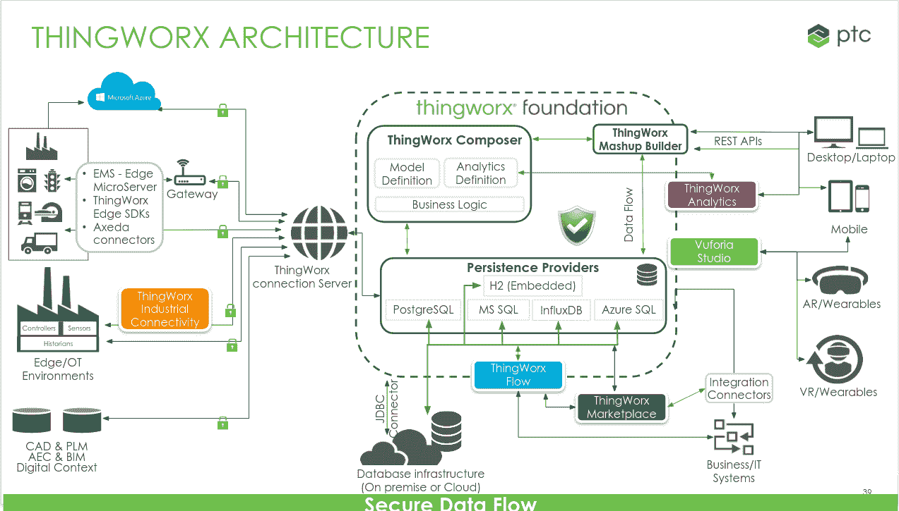
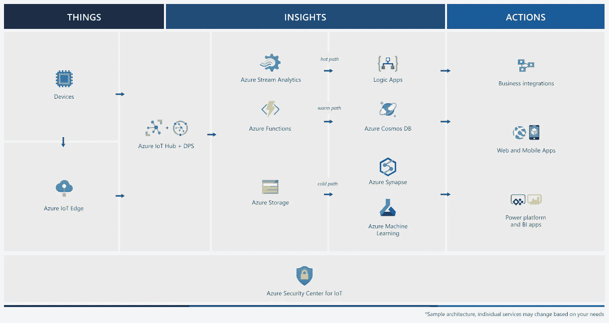

# 物联网平台如何融入？

> 原文：<https://medium.com/globant/how-do-iot-platforms-fit-in-e94d1c2eee2c?source=collection_archive---------0----------------------->

> 物联网平台:作为物联网设备和数字生态系统之间桥梁的关键要素。

# 介绍

在物联网生态系统中，有一个重要的元素越来越受到关注，因为它可以作为物联网设备和数字世界之间的桥梁进行交互:物联网平台。在下图中，我们有一个代表这个想法的参考图。

IoT platform reference diagram. Source: IoT Studio — Globant

物联网设备与物联网平台建立安全连接，该平台支持与数字生态系统交换基于物联网的数据。物联网平台的主要功能之一是设备生命周期管理( [OTA](https://searchmobilecomputing.techtarget.com/definition/OTA-update-over-the-air-update) 、[供应](https://davra.com/how-iot-device-provisioning-works/)、设备和安全管理等。).除此之外，该平台的目标是将设备数据与其他数字解决方案集成，如数据可视化工具、数据存储策略、web/移动应用集成、增强/虚拟现实和数据分析。

# 物联网平台如何融入？

下图展示了企业在数字化转型和[工业 4.0](https://www.forbes.com/sites/bernardmarr/2018/09/02/what-is-industry-4-0-heres-a-super-easy-explanation-for-anyone/?sh=3fa5b6119788) 背景下寻求的模式。

Industry 4.0 model. Source: IoT Studio — Globant

在左边，横跨整个模型的是业务价值链:石油和天然气、采矿、汽车、保险、零售、银行等。

从根本上说，每个客户都有一个由三个主要组件组成的基础架构:存储、计算和通信。这个基础设施支持两个数据源，众所周知的来自软件工具(业务应用程序)的数据和来自资产(事物)的数据，这对您来说可能是一个新的元素。

*   绿色的第一个元素是物联网平台。该组件的主要思想是对资产的数字表示进行建模，并如前所述，实现物联网数据与数字解决方案的交互，特别是其他软件工具( [ERP](https://en.wikipedia.org/wiki/Enterprise_resource_planning) 、 [CRM](https://en.wikipedia.org/wiki/Customer_relationship_management) 、 [CMMS](https://en.wikipedia.org/wiki/Computerized_maintenance_management_system) 等)。)或支持基于物联网数据和其他数据源的应用程序的开发和集成，以向最终用户提供更多上下文。
*   绿色的第二个元素代表资产(事物)。如今，我们有更多的传感器和设备跨越商业价值链进行交互。在许多情况下，这些资产正在从孤岛场景扩展到集成不同的流程。例如，一家公司将其制造控制系统连接到互联网，其车队用于产品交付。

根据这两个数据源(软件工具和物联网数据)，模型的下一个组件是应用程序、仪表盘和报告。不仅以传统方式(移动/网络应用)开发，而且基于新趋势，我们可以拥有增强/虚拟现实和基于分析的应用。

在图表的顶部，我们有一个元素，它代表模型的所有元素和用户之间的协作，以支持数据驱动的决策，从而改善他们的预测、投资回报、用户体验、效率、安全性和安全性，并支持预测性维护，这是许多行业都需要的新功能。

最后，在模型的右边，有一个箭头穿过模型，代表两个关键的组件:安全性和 sysadmin，用于协调模型中的所有组件。

# 数字双胞胎和物联网平台

物联网平台的目的之一是对资产的数字表示进行建模。在工业 4.0 和工业物联网(IIoT)的背景下，这种类型的实现有着巨大的潜力，可以命名为基于数字双胞胎的实现。如下图所示，创建数字表示的想法是考虑流程中每个资产的几个数据源。

Asset modeling. Source: IoT Studio — Globant

在下图中，我们有一个与用作简介的图表相似的图表，但这次侧重于 IIoT 的上下文。一旦实现了资产的数字表示，物联网平台就可以实现物理世界和数字世界之间的交互。资产物联网数据摄取来自控制系统，通过[运营技术(oT)和信息技术(IT)](https://www.i-scoop.eu/internet-of-things-guide/industrial-internet-things-it-ot/) 的融合。这些物联网数据在资产模型中由来自其他来源的数据补充，如数据库和/或业务应用程序( [ERP](https://en.wikipedia.org/wiki/Enterprise_resource_planning) 、 [CRM](https://en.wikipedia.org/wiki/Customer_relationship_management) 、 [CMMS](https://en.wikipedia.org/wiki/Computerized_maintenance_management_system) 等)。).一旦所有这些信息被集成，它就可以通过与基于数据可视化、数据分析和增强/虚拟现实的应用程序进行交互来实现最终用户的协作。

IIoT reference diagram. Source: IoT Studio — Globant

# 物联网平台主要组件

在进入参考架构之前，让我们先了解物联网平台的主要组件。

*   设备支持:供应商提供 SDK，有时还提供实时操作系统(RTOS)。这里的主要方面是将通信和连接能力集成到设备的固件/嵌入式软件中，以实现与给定物联网平台的安全连接。值得注意的是，在某些情况下，SDK 可以作为一种机制来连接基于软件的服务，而不是设备与平台。
*   连接:供应商在设备和平台之间提供不同的基于互联网的连接方法；一个常见的例子是启用一个 [MQTT 代理](https://www.hivemq.com/blog/mqtt-essentials-part-3-client-broker-connection-establishment/)或类似的面向开放物联网协议的策略。在其他情况下，供应商可以拥有自己的专有协议。
*   物联网服务:这是物联网平台的核心，如前所述，其理念是启用所有设备管理功能，开发资产建模，添加业务逻辑服务，并创建与其他类型的服务和应用程序的集成。
*   内置连接器:这是一个基本功能，取决于您想要集成物联网平台的场景，内置连接器可用于集成特定的用例。比如一个 [SAP](https://news.sap.com/what-is-sap/) 连接器，将 [SAP](https://news.sap.com/what-is-sap/) 维护模块数据集成到你需要开发的物联网平台应用。
*   安全性:这个主要组件可能隐含在其他组件中，但重要的是要注意，因为需要有机制来管理设备和平台之间的安全连接，不仅是为了数据交换，而且是为了允许可靠地管理设备。

# 物联网平台参考架构

考虑到在本文中，我们一直专注于 IIoT，并基于最新的 [Gartner 工业物联网平台魔力象限](https://www.gartner.com/en/documents/3991952/magic-quadrant-for-industrial-iot-platforms)，现在让我们快速回顾一下该魔力象限中两个领导者的参考架构: [PTC](https://www.ptc.com/en/resources/iiot/white-paper/gartner-mq-for-iiot) 和 [Azure](https://azure.microsoft.com/en-us/blog/microsoft-named-a-leader-in-gartner-s-2020-magic-quadrant-for-industrial-iot-platforms/) 。

## PTC — Thingworx

PTC 的 [ThingWorx](https://www.ptc.com/en/resources/iiot/product-brief/thingworx-platform#:~:text=The%20ThingWorx%20platform%20is%20a,augmented%20reality%20%28AR%29%20experiences.) 平台是一个完整的端到端技术平台，专为工业物联网(IIoT)而设计。它提供工具和技术，使企业能够快速开发和部署应用程序以及增强现实(AR)体验。在下图中，我们有一个平台架构，其中有四个主要元素:

*   物联网数据来源:在这种情况下，主要分组为三个组件，使用 [Thingworx Edge 微服务或 Edge SDKs](https://support.ptc.com/help/thingworx_hc/thingworx_edge_sdks_ems/) 与 IIoT 平台 [AlwaysOn](http://support.ptc.com/help/thingworx_edge_sdks_ems/wsems_545/en/index.html#page/thingworx_edge_sdks_ems/c_twx_always_on_protocol.html) 专有协议建立安全连接的设备。第二组是来自 OT 生态系统的设备，它们主要通过支持各种工业协议的 [Thingworx 工业连接](https://www.ptc.com/en/resources/iiot/product-brief/thingworx-industrial-connectivity)与平台连接。最后，通过 SDK 可以与平台建立连接的其他补充数据源。
*   Thingworx foundation:这是 Thinworx 的物联网核心，也分为三个组件，Thingworx Composer，其中开发团队通过服务实现所有的资产建模、业务逻辑和分析定义。第二个要素是持久性提供者，这意味着平台需要一个数据库来管理物联网数据持久性策略。如图所示，支持许多替代方案。最后，第三个组件是 Thingworx Mashup Builder，它使基于 web 的应用程序能够集成模型、业务逻辑和数据策略，使用保存在给定数据库中的数据。
*   交互:围绕 Thingworx foundation，我们可以看到不同类型的交互，首先是将通过 REST API 使用来自 web/移动终端的应用的最终用户，然后是通过专用模块或连接器实现的几个功能，以促进与增强/虚拟现实、数据分析、业务系统集成、数据库集成等相关的其他类型应用的集成。
*   安全性:在整个架构图中，我们有一个安全的数据流，旨在表示面向管理物联网数据源、平台和终端用户应用之间的安全连接的所有策略。

Thingworx reference architecture. Source: PTC

## 微软— Azure 物联网

[Azure IoT](https://azure.microsoft.com/en-in/overview/iot/) 是一个跨越边缘和云的托管和平台服务集合，用于连接、监控和控制数十亿物联网资产。它还包括设备和装置的安全和操作系统，以及帮助企业构建、部署和管理物联网应用的数据和分析。在下图中，我们有一个参考体系结构，其中我们还可以找到四个主要元素:

*   物联网数据源(事物):在这个架构中，我们有两种类型的设备。在第一种情况下，我们有运行 [SDK](https://docs.microsoft.com/en-us/azure/iot-hub/iot-hub-devguide-sdks) 或 [Azure RTOS](https://azure.microsoft.com/en-us/services/rtos/) 的设备来管理与平台入口点的连接。在第二种情况下，我们有边缘设备，这些设备在设备本身或基于 [Azure IoT Edge](https://docs.microsoft.com/en-us/azure/iot-edge/) 的现场网关中执行数据处理。重要的是要记住 Azure 引入的概念，即有两种方法来处理遥测数据，热路径和冷路径。这种差异与延迟和数据访问要求有关。热路径在数据到达时近乎实时地对其进行分析。冷路径以更长的时间间隔(每小时或每天)执行批处理。
*   见解:在这里，有一个组件也可以从设备(事物)的角度来看，它提供了平台的入口点，并通过设备内的 SDK 来支持。这个元素是带有 [DPS](https://docs.microsoft.com/en-us/azure/iot-dps/about-iot-dps) (设备供应服务)的 [Azure IoT Hub](https://azure.microsoft.com/en-us/services/iot-hub/) ，它支持您的应用程序和设备之间的安全通信。从这一点来看，这个想法是为了促进其他 Azure 服务和物联网数据的集成，这些数据由人或人工智能(AI)进行分析并转化为可操作的知识。
*   动作:这个组件与人们响应这些洞察的方式(架构的第二个元素)相关，并将他们连接到他们的业务，以及他们通过其他基于 Azure 的服务使用的系统和工具。
*   安全性:与之前的参考架构类似，在这种情况下，Azure 提供了 [Azure 物联网安全性](https://azure.microsoft.com/en-us/overview/iot/security/)服务，以保证安全连接和保护云服务。

Azure IoT reference architecture. Source: Azure

# 结论

在本文中，我们回顾了物联网平台如何被视为物联网设备和数字生态系统之间的桥梁。然后引入 IIoT 和工业 4.0 背景下的模型，以确定这些物联网平台如何适应以解决方案为导向的背景，以促进数据驱动的决策。我们看到了从 IIoT 解决方案的角度开发的数字孪生概念的出现。这有助于解释物联网平台的主要组件。最后，在较高的层面上，我们回顾了来自最近 [Gartner 工业物联网平台魔力象限](https://www.gartner.com/en/documents/3991952/magic-quadrant-for-industrial-iot-platforms)的两位领导者的参考架构: [PTC](https://www.ptc.com/en/resources/iiot/white-paper/gartner-mq-for-iiot) 和 [Azure](https://azure.microsoft.com/en-us/blog/microsoft-named-a-leader-in-gartner-s-2020-magic-quadrant-for-industrial-iot-platforms/) 。

# 推荐读物

如果您有兴趣了解更多有关实施基于物联网平台的解决方案的信息，我邀请您阅读文章 [A digital twins PoC](/globant/a-digital-twins-poc-b68c633aaeb9) 。

如果您有兴趣了解更多关于 PTC-thing worx 的信息，请访问 [Thingworx 开发者门户](https://developer.thingworx.com/en)。

最后，如果你有兴趣了解更多关于微软 Azure IoT 的信息，请访问[Azure IoT 简介](https://docs.microsoft.com/en-us/learn/paths/introduction-to-azure-iot/)。