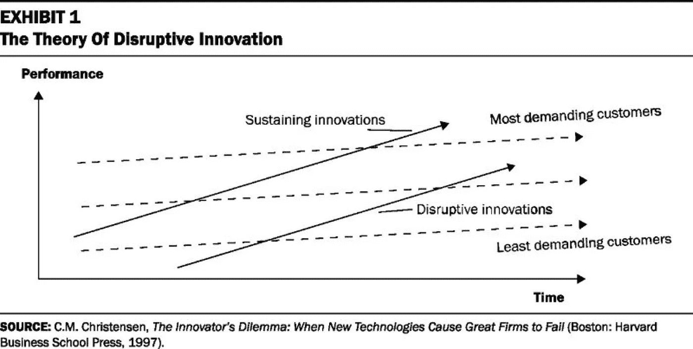
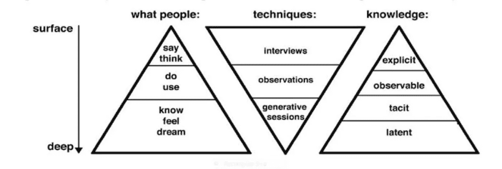

# 我们如何区分我们认为用户需要的和他们实际需要的？

> 原文：<https://medium.com/google-developer-experts/how-do-we-differentiate-between-what-we-think-our-users-need-and-what-they-actually-need-b58724546faf?source=collection_archive---------1----------------------->

昨晚有人问了我一个问题，大概是这样的:

> 我们如何区分我们认为用户需要的和他们实际需要的？

这个问题还附有一句引言:

> 如果我问人们想要什么，他们会说更快的马——亨利·福特。

我知道如果我不回答这个问题，那天晚上我会睡不着，因为这是那些至关重要的问题之一，尤其是当你在创造科技产品的时候，同时也是我最喜欢讨论的话题之一。你会在下面找到我的答案，或者更确切地说，是它的扩展版，风格更流畅，更面向商业。

这个问题可以在多个层面上讨论。我们说他们需要什么，而客户实际上需要的是两种不同的鱼。第一个(我们)应该总是比另一个(客户端)足够大，以便我们能够测试出尽可能多的解决方案。因此，拥有快速的实现和测试周期总是好的(长达一周的开发冲刺促进了这一点)，这样你就可以看到你想要的是否是用户需要的。像这样的每一次成功的测试都离最佳产品更近了一步。但是，这个过程是危险的，因为最终的结果可能是福特所说的“更快的马”。

诸如此类的事情时有发生，因为每一次迭代修改都是基于逆向思维——你试图看到与一天、一周、一个月前相比，产品现在在哪些方面做得更好。评估来自分析系统的数据也是如此——它总是植根于过去。相反，你应该总是试图预见未来。

对我来说，这是一条迭代的道路——从目前的状态中挤出最多的东西。就像当你给处理器或引擎增压时，你总会达到某种技术、物理或物流的极限。另一方面，来自一个完全不同的市场的东西，是从零开始构建的，没有遗留代码或现有结构，被证明更快，更有吸引力。这有助于创造一个无与伦比的优势，并将那些已经背负包袱的老对手留在后面。

Clayton Christensen 的《创新者的困境》很好地描述了基于优化当前解决方案的迭代方法的风险。作者将此类行动的效果称为“持续创新”。

克里斯腾森确实表示，公司过于听取客户的意见。人们总是用现在的术语来描述未来:“我们想要同样的东西，但是更快”。这是一个自然的思维陷阱，因为你怎么会想要一个还不存在的东西呢？当公司不断取悦他们当前的客户时，在车库的某个地方有一家初创公司，它还没有客户，开始创造一种更便宜、更不稳定的解决方案，没有明确的增长路径，但具有成为游戏规则改变者的巨大潜力。Airbnb 不会出现在希尔顿酒店，优步也不会作为出租车公司的一部分成立——希尔顿酒店的客人和出租车乘客根本不知道他们需要如此截然不同的方式来满足他们的需求。

> 人们总是用现在的术语来描述未来:“我们想要同样的东西，但是更快”。这是一个自然的思维陷阱，因为你怎么会想要一个还不存在的东西

说到这里，为了回答这个问题，我认为有两种方法可以找到答案:一种是迭代的，另一种是基于 leap 的。前者已经讨论过了，后者是一种自我分裂的方法，在外界的人这么做之前。

第二条道路是质量途径。它基于比迭代变化更大胆的假设。归根结底，破坏性创新永远不会从 A/B 测试中产生。我再次倾向于克里斯滕森，确切地说，是“要做的工作”理论。

JBTD 假设你“利用”了你所拥有的一切资源来完成工作——满足需求。然而，人们如何选择满足需求的特定方式并不总是很清楚。你们总是有相同的需求(睡眠、食物、归属感、互动等。)，你总是想找到更好的方法来实现它们，但你无法理性地沟通。为了达到这些洞见，你必须激发情感、怀旧和感官——理性思维不会干预的领域。

在这种情况下，除了其他方法之外，一个人使用生成技术来帮助达到所谓的*隐藏知识*，那是人们感觉和梦想的东西。

研究结果显示的是极端情况，通常在定量研究中趋于平缓并消失。然而，它们为“为什么”这个问题提供了更好的答案，而不仅仅是“如何？”人们会做决定吗？这有助于您了解实际的驱动程序，这些驱动程序可能与您的产品没有多少共同之处。因此，不要试图创造一个更好的产品，而是通过更精确地理解它来寻找更好地满足需求的方法。

> 你不是试图创造一个更好的产品，而是通过更精确地理解它来寻找更好地满足需求的方法。

苹果超越了这种方法，不仅创造了更好的产品，还将用户推向了它认为更有可能满足他们需求的地方。以 iPhone 6s 为例。这款智能手机很容易厚几毫米，因此电池寿命延长一倍——每个用户都会喜欢它。

但苹果坚持并推动用户使用尽可能薄的设备，同时试图打破障碍，煽动人们觉得他们手中握着一件神奇的作品(这是客户愿意支付溢价的真正需求)。

> 总而言之，你永远不知道你的用户到底想要什么。很大程度上是因为他们自己也不知道。

总而言之，你永远不知道你的用户到底想要什么。很大程度上是因为他们自己也不知道。你能做的就是在一个场合和他们保持亲近，相信他们的意见，而在另一个场合故意忽略他们。努力用不同的方式做事，希望你能让他们接受新的想法，他们甚至没有意识到这些想法的存在。

只要确保你一路上不会搞混太多东西。