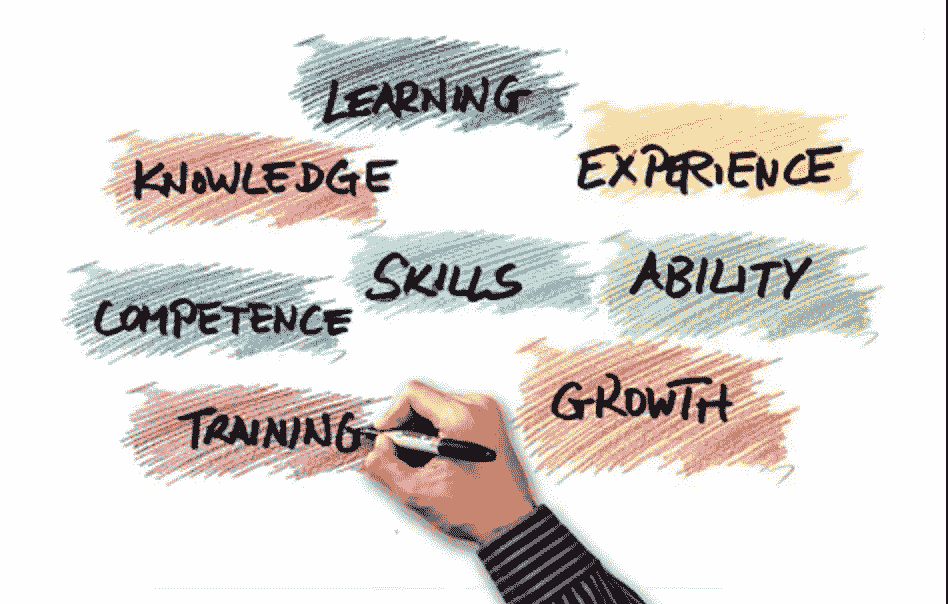

# 你如何决定个人贡献者(IC)或工程经理角色是否适合你？

> 原文：<https://medium.com/walmartglobaltech/how-do-you-decide-whether-an-individual-contributor-ic-or-engineering-manager-role-is-right-for-f46251f1a4cd?source=collection_archive---------0----------------------->

Source: Pixabay

你是否正处在一个十字路口，你会问“*我应该追求一个工程经理(EM)的角色，还是继续走卷起袖子写代码的个人贡献者(IC)的道路？”*

那这篇文章就送给你了！

一个普遍的误解是，当经理只是你已经在做的事情的更高层次的版本。肯定不是！这是一种不同的心态，也是你将要解决的一系列不同的问题。一些人认为*过渡是一个默认步骤*。他们只是觉得是时候了。有些人觉得技术阶梯不容易爬上去，所以他们转向管理道路。而另一些人认为他们在技术岗位上做得很好，因此他们自然会在经理岗位上做得更好。不幸的是，以上都不是真实的指标。许多人认为人员管理的责任是理所当然的，没有充分认识到这种角色所需的必要技能和承诺。有时候，即使认识到了这种严重性，有些人还是不知道(还不知道？)即使他们希望成为领导者，他们也注定要成为领导者。最后，有些人可能不想成为经理，即使他们有这方面的天赋。在我的职业生涯中，我有幸身兼两职，学到了很多关于如何在日常工作中珍惜什么的知识。请注意，在大多数组织中，超过 60%的工程师因为他们的经理而离职。是的，这句谚语经常是正确的:*人们离开经理，而不是公司。当你开始在任何一条道路上稳步前进时，考虑以下问题，以确定你真正想从职业生涯中得到什么。*

1.  **你喜欢解决问题还是帮助别人解决问题？**

Source: Pixabay

> “良好的管理是一门艺术，它让问题变得如此有趣，让解决方案变得如此有建设性，以至于每个人都想开始工作并处理它们。”——保罗·霍肯。

IC 通常是寻求棘手情况或挑战的答案或复杂解决方案和情况解决者的最佳 POC 人选/故障解决者/问题解决者。但是，一个经理应该了解她/他的团队的优势，倾听他们的问题，解决冲突，并帮助解决冲突——无论是大是小。经理是一个真正从帮助他人解决问题和实现目标中找到快乐和满足感的人，尽管经理可以自己解决问题或者知道谁更容易解决问题。经理评估机会和风险，并相应地将问题分配给团队成员，为他们提供解决问题的适当支持。

**2。你能在哪里产生最大的影响？**

Source: Pixabay

> "你做的比你说的有更大的影响。"—斯蒂芬·柯维

从设计/架构、弹性和可靠性的角度来看，ICs 喜欢高效和有效地构建大型项目或组织。他们发现编写、管理和扩展代码更有成就感。另一方面，管理者更倾向于培养和指导他人。更重要的是，他们专注于理解正在完成的工作背后的关键指标，然后帮助他们的团队更好地理解*为什么*部分。管理者从认知角度做出选择，更关注他人对自己的直接贡献。我个人经历中的一个例子——我们在作战室连续坐了 3-4 个月才推出一款产品！我们一起集思广益，运行多个并行线程，在完成一个想法所需的相同时间内完成了工作。通过这件事，我明白了一个人的影响力比*一起的影响力*更大。

**3。能轻松切换上下文吗？**

Source: Pixabay

> "对我来说，语境是关键——从语境中可以理解一切."—肯尼斯·诺兰达

ICs 主要关注完美地完成工作，然后转移到其他事情上，并不断重复。如果团队或经理提出要求，他们通常可以在转移到另一个优先级之前请求时间来完成现有的优先级。而一个经理，处理团队和竞争的优先权，经常会以同时处理多件事情而告终。因此，对于一个经理来说，转换环境和专注于正在完成的任务的意图是至关重要的。很多时候，团队认为他们的问题会被他们的经理解决。以同样的热情和热忱与不同性格、不同成熟度的人打交道，真的会使一个人成为管理者。我个人经历中的一个例子是，你几乎一整天都在打电话/开会——可能是高强度的系统讨论，接着是一对一或跳级会议，接着是采访等。帮助我进行上下文切换的几个技巧是一次专注于一项任务，只有当你觉得你能做到 100%正确时才参与讨论，并提前做好准备——哪怕只是短短的 2-5 分钟。帮助我更好地计划一天的另一个重要工具是遵循*“艾森豪威尔决策矩阵”*来区分紧急和重要的任务。

**4。能不能刚柔并济？**

Source: Pixabay

> “当你的团队赢的时候，做好强硬的准备，因为胜利会让你变得软弱。另一方面，当你的球队输了，要支持他们。坚持相信。”—薄·辛巴克勒

在大多数情况下，ICs 可能会很棘手，因为她/他对解决方案以及该解决方案在生态系统中的适用性非常感兴趣。很多时候，这涉及到说服多个团队的困难。这些解决方案可能会导致少数团队承担更多的工作，从而引发争论。这是 ICs 采取强硬立场的地方(可能听起来粗鲁/苛刻),因为他们非常注重质量和时间。但对于一个管理者来说，知道什么时候对她/他的团队强硬，什么时候手软，才是关键素质。经理们在感觉良好时通常很温和，而在感到压力时则很强硬。也许你对自己很软弱，需要学会在团队需要时变得强硬——甚至反之亦然。但是软和硬应该被看作是一个人根据*团队最需要什么*来使用的*工具*，而不是一个人此刻的感受。就我个人而言，从我的经验来看，这完全是关于理解、感知当前的情况，并知道何时对团队成员强硬，何时软弱——情况由各种参数控制，仅举几个例子，影响、紧迫性等。

**5。你愿意领导吗？**

Source: Pixabay

> “如果事情变糟了，是我干的。如果事情进展得不太顺利，我们做到了。如果一切进展顺利，那么你做到了。”—贝尔·布莱恩特

IC 通常负责设计/解决方案。但是经理要对团队的结果负责。作为一名经理，你通常是认可和庆祝团队胜利的人。经理也将承担责任，最重要的是，当出现问题时，代表团队承担*责任*。领导团队主要围绕四件事——

O***ne***，*看到每个团队成员身上的潜力*。时刻注意推动你的团队，让他们看到自己提高绩效的全部潜力。告诉他们自己的优势，或者找到一个他们更可能喜欢的高效流程。

T *wo* ，*遇事不慌不忙*。管理者花时间思考团队的未来情景——他们思考事情会变得多糟糕——然后他们的目标是好的结果。

TT*hree*，舒服于*给别人反馈*。积极和建设性的绩效管理是团队成功的关键。虽然 ICs 也给其他人反馈，但通常情况下，他们认为经理需要关注这些反馈，但这总是不正确的。ICs 也可以而且必须提供反馈。相对而言，管理者更坚信反馈是让环境和团队文化变得更好的必要工具。

F *丁山**无私*。毫无疑问，这对于集成电路和经理来说都是一个关键的品质，但经理们会有更多的倾向/期望。从架构的角度来看，集成电路是无私的，而管理者乐于接受他人的荣誉和公众的赞扬。

> “伟大的管理者是无私的领导者，他们希望团队共同成功。”——肯尼·阮。

ICs 倾向于从*我/我*和管理者*我们/我们*的角度思考。无私是作为一名领导者最难做到的事情之一，它需要能力和牺牲的意愿。我有幸追随的一位最好的领导者曾经告诉我:*“领导就是无私地服务；不多不少。”*

**6。你愿意发展更广泛或更深入的技能吗？**

Source: Pixabay

> “知识是幸福，因为拥有知识——广泛而深刻的知识——就能辨别真假，辨别高尚和低俗。”——海伦·凯勒

IC 倾向于在他们选择的每项技术中开发更深层次的技能，无论是 Hadoop 还是 Scala 等等。他们倾向于深入了解一切，并发现浅薄的知识很不舒服。另一方面，经理们最初可能仍然幻想着在所有技术方面保持最新，但他们很快意识到这是不现实的。管理者不是不断地学习你所在领域的每一个新发展，而是发展*更广泛的技能组合*刚好足以理解人口统计学和架构——需要注意的是，IC 在进入高层时也会经历这一过程。事实是，经理们没有时间像 ICs 那样停留在技术层面。通常，高效的经理会乐于磨练各种技能，例如以身作则的能力、清晰传达关键信息的能力、言简意赅的能力、根据情况需求迅速果断做出反应的能力、倾听团队上下成员的意见的能力、与他人友好相处的能力、展示善意和幽默的能力、言行一致的能力理解什么时候深入，什么时候保持浅层次，对高级 IC 和经理来说都很重要。

**7。什么是真实的你？**

Source: Pixabay

> “你寻求的所有奇迹都在你自己的内心”——托马斯·布朗爵士

你觉得延长的团队会议很无聊吗？你是不是更愿意低下头解决问题，而不是和别人讨论？你是否觉得对方的谈话不成熟，让你的工作效率降低？如果任何一个问题的答案是肯定的，那么你更倾向于 IC。一个人要成为经理，应该有一种内在的动力。这种动力通常来自于对你的团队的愿景或者对改善公司内部流程的渴望。但是你怎么知道你得到了呢？回答自己工作时什么占据了你的思想。如果你*经常*发现自己在想，“有一个更好的方法来做这件事”，那么你可能已经为管理职位做好了心理准备。另一件重要的事情是，请确定你为什么要做这个决定？是因为生态系统还是团队？很少有团队中的 IC 同时扮演技术&和管理的角色，这让人觉得“哦，我已经在做这个了，所以这应该是小菜一碟”*不一定是这样*。你最好自己更深入地了解*自己*,甚至咨询几个仍担任高级 IC 的人以及那些已经转变为经理角色的人。

**8。你有多相信建立关系？**

Source: Pixabay

> “建立一段健康稳定的关系就像建造一栋稳定的房子。你要确保基础稳固，能够经受住风暴的考验。”—未知

作为技术专家和问题解决者，ICs 经常被团队内部或团队外部的成员所接触。这是因为他们非常深刻地理解这个系统，并且能够给出关于地面事件的准确的、非糖衣的信息。但是经理们通常在桌子的另一边，也就是说，他们坚信*为了让团队成员畅通无阻*而识别合适的谈话对象。这基本上使经理们能够快速有效地处理各种情况。虽然建立关系可能被一些人视为办公室政治，但在午餐、咖啡或饮料时与其他领导建立正确的关系是非常有价值的。在公司和行业中拥有良好的关系将会让你在很多情况下为你的团队增加价值。经理们对*建立联系*的信心通常高于 ICs。

请记住，这是一个至关重要的决定，可能会影响您以及您周围的人。所以请不要回避准备这些问题，并在一段时间内*诚实地*和*快速地*从心底里回答它们，并进行评估。回答问卷时要放松，注意力集中。有时，您可能刚刚结束了一次不愉快的设计审查或不愉快的团队建设讨论，这些可能会影响您的回答！

此外，需要记住的一点很重要，虽然您是 IC，但您仍然可以从事管理工作。你*不需要经理的头衔就可以开始表现得像一个领导者*。给予深思熟虑的同事表扬和建设性的反馈，保持团队的积极性，在整个公司建立网络，帮助建立你的团队文化，这些都是你作为一名资深 IC 可以(也应该)做的事情。在你有机会做这些活动后，想想你有多喜欢这些活动，这将是你对管理感兴趣的一个很好的指标。最后一个考虑是，管理层的正式变动不一定是永久的转变。我认识一些人，他们已经经历了一段时间的管理路线，并真的错过了工作的实际操作部分，以至于他们决定回到高级集成电路的角色。他们最终积累了一些至关重要的领导技能和视角，帮助他们更好地完成自己的 IC 工作。职业生涯是漫长的，探索各种选择是成长和对工作保持兴奋的好方法！

Source: Pixabay

伙计们，结束了！！！

——作者:Naga (Nagaraja Rao Daivam)。总监 WalmartLabs。一个务实的领导者。