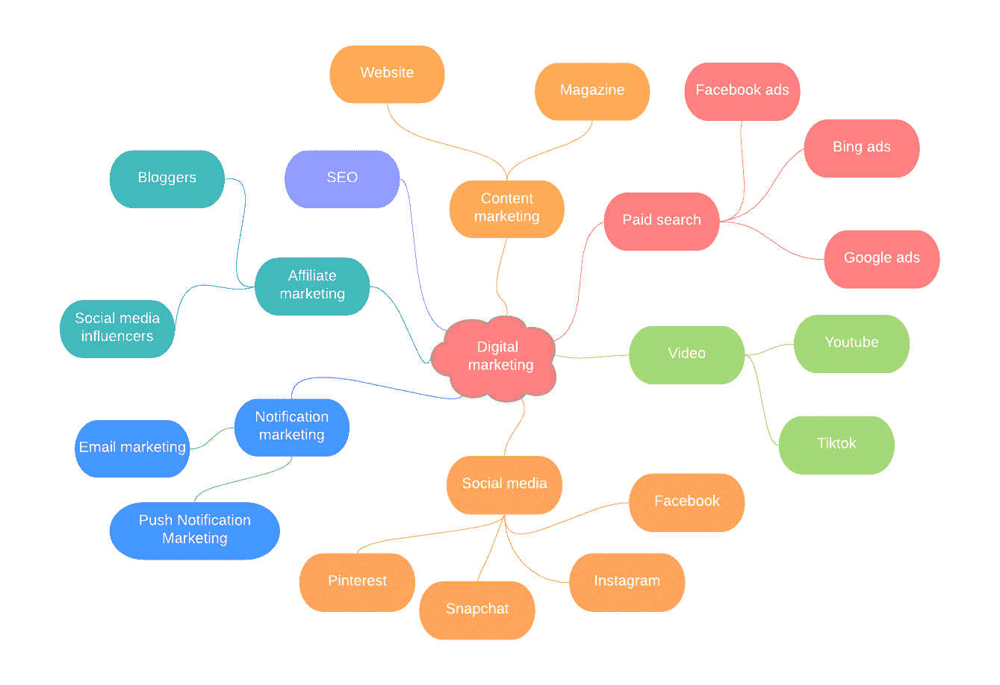
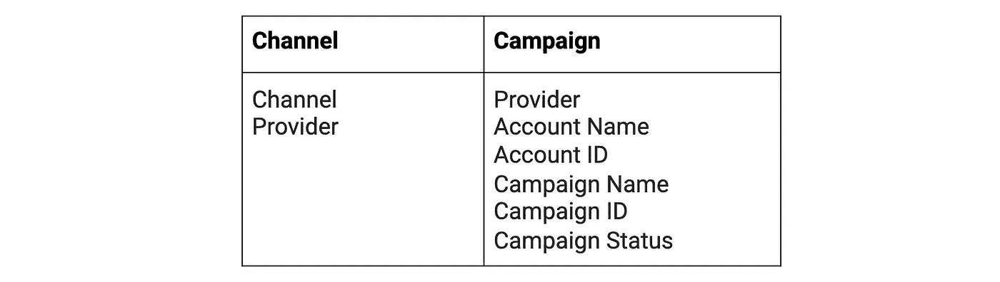
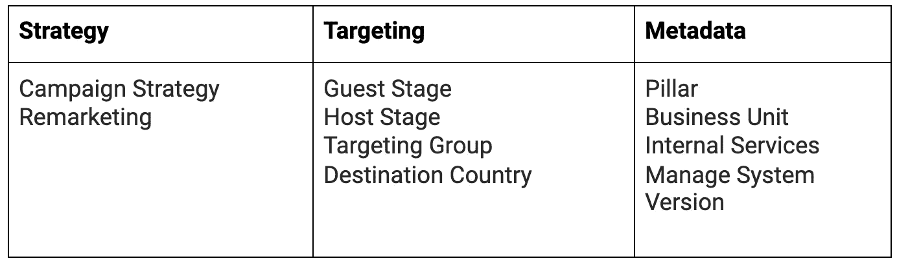
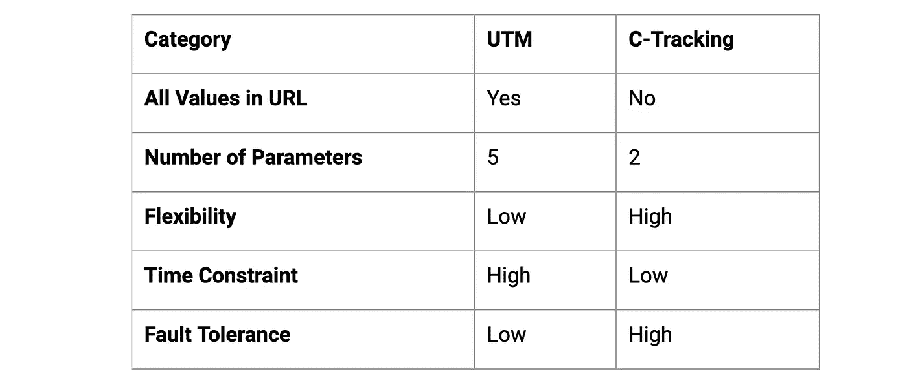
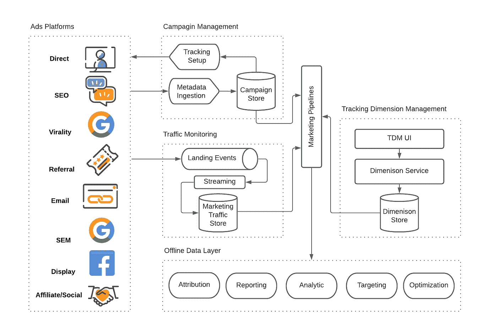
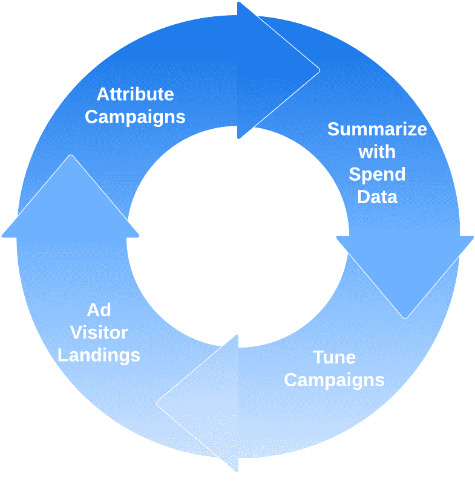

# Airbnb 如何跟踪和衡量增长型营销？

> 原文：<https://medium.com/airbnb-engineering/how-does-airbnb-track-and-measure-growth-marketing-15ee4ce55c5d?source=collection_archive---------0----------------------->

作者:、[吴经熊](/@henry_wu)、[阿布拉吉特·慕克吉](https://www.linkedin.com/in/abhrajitmukherjee/)、[史克·梅](https://www.linkedin.com/in/shike-m-a1178741/)

# 介绍

Airbnb 的使命是**“创造一个任何人都可以属于任何地方的世界。”**这一信息通过市场营销传递给世界各地的人们，例如[通过主持人](https://news.airbnb.com/made-possible-by-hosts/)看什么是可能的。它帮助 Airbnb 连接客人和主人，建立一个强大的社区，无疑有助于公司令人印象深刻的增长。

Figure 1\. Airbnb Marketing Domains

Airbnb 的营销令人兴奋——它在许多方面提出了挑战，其中之一是跨不同广告平台的活动跟踪(见图 1)。跟踪使营销团队能够全面分析活动的绩效和影响，然后进一步优化这些活动，以最小的预算实现其目标。

在这篇博文中，我们将讨论 Airbnb 如何通过引入 C 参数跟踪以及分析和增长评估系统来建立统一的跟踪测量系统，以支持营销活动。

# 概观

营销团队在各种渠道中开展客户获取活动、主持人招募活动和一般品牌营销活动，包括绩效营销、社交网络、网站/杂志帖子、联盟计划、品牌营销和国际奥委会(IOC)。与其他高增长公司一样，Airbnb 的营销策略是动态的——数字目标在特定情况下会有所变化，比如全球疫情。建立一个简单直观的系统，并适应高度动态和快速变化的情况，是使其成功的关键。

我们希望在设计中坚持几个主要的系统要求:

1.  **可扩展:**包括大型付费增长品牌，如谷歌和脸书。针对不同的市场和国家，有不同的广告平台。我们将需要任何广告平台，以最少的努力，很容易登上跟踪系统。
2.  **灵活:**在营销中，跟踪往往是第二优先考虑的事情。该系统必须足够灵活，以便能够跟踪即使是已经存在了很长时间的活动，而不会丢失任何流量。
3.  **容错:**考虑到广告平台和营销运营供应商的名单很长，内部跟踪系统必须能够检测和解决任何类型的跟踪故障。
4.  **高数据质量:**营销活动的数据质量至关重要。如果数据质量差且不完整，任何营销活动优化工作的价值都会降低。高质量的营销数据最终将帮助 Airbnb 节省数百万美元的营销预算。

# C 参数跟踪(C 跟踪)

对于支持程序化跟踪参数的营销渠道，Airbnb 开发了自己的嵌入在 URL 中的跟踪参数。它被称为 C(活动)参数跟踪。C 参数由两个参数组成:PI(平台 ID)和 PK(平台密钥)

[**http://airbnb.com？c=。pi{pi}。PK { PK }**](http://airbnb.com?c=.pi{pi}.pk{pk})

**PI:** PI 代表“平台 ID”，它是特定提供商的整数 ID 值，例如，对于 Google，PI = 0。

**PK:** PK 是特定平台上每个单独活动或营销活动的唯一标识符。它通常由带下划线的字母数字标识符组成。这里重要的是粒度要足够低，这样您就可以在尽可能低的级别应用元数据。各种营销目标需要不同的 PKs。假设您想要在最著名的博客中推广 Airbnb 品牌，现在您需要决定一组平台密钥来跟踪多个博客中的一系列活动:

*   博客 A:跨年促销
*   博客 B:让主机成为可能
*   博客 A:主持人赞赏
*   博客 B:情人节促销

一个 PK 定义为 **pk = blog_id** 似乎很好，但是如果我们想要跟踪“推广”级别的性能，这将没有帮助。我们需要**PK { blog _ id } _ { promotion _ id }**

对于付费营销，为了跟踪每个单独的关键词或显示广告的表现，PK 应该设置在尽可能低的水平；例如，Google 关键字级别的 C 参数:

[**http://airbnb.com？c = . pi0 . PK { ad group _ id } _ { creative _ id } _ { device } _ { keyword _ id**](http://airbnb.com?c=.pi0.pk{adgroupid}_{creative}_{device}_{keyword_id)**}**

# 跟踪维度

有了跟踪键，下一步就是将营销洞察添加到活动中。Marketing insights 在 Airbnb 内部被称为 tracking dimension，由三个部分组成:跟踪关键字、提供商元数据和营销元数据。

**跟踪关键字** : C 参数，用于跟踪增长营销流量和跟踪维度查找。

**提供商元数据**:来自广告平台和供应商的活动、账户和状态的详细信息。这些细节大多是通过各种数据接收管道收集的。提供商元数据包含营销渠道和活动信息。

**营销元数据**:关于营销目的的详细信息。这些细节有三个类别:策略用于对营销目的进行分类，如应用安装、访客/主机增长或通用品牌识别；目标定位用于对营销活动目标进行分类，如用户群或目的地国家；元数据是关于营销活动的所有其他元信息，如内部 CMS(活动管理系统)相关数据、活动活动时间、版本等。

通过结构良好的跟踪维度属性，营销人员或数据科学家能够以尽可能低的粒度对营销活动的绩效进行切片和切块。这样，他们就可以提出全面的营销见解，进一步优化营销转化。

# 为什么是 C-tracking 而不是 UTM？

UTM 跟踪是一个行业范围的跟踪标准，它也与谷歌分析无缝集成。一段[**【UTM】**](https://agencyanalytics.com/blog/utm-tracking)代码是一段简单的代码，添加到 URL 的末尾，用于跟踪营销活动和内容的表现。UTM 代码如下所示:

[https://yoursite.com/your-page/?utm_source=facebook&UTM _ medium = CPCT11**UTM _ campaign = spring _ sale&UTM _ content = shoe _ ad**](https://yoursite.com/your-page/?utm_source=facebook&utm_medium=cpc)

为什么 Airbnb 不直接使用 UTM 追踪？考虑到 Airbnb 营销策略的快速移动组件，Airbnb 的营销需要一种完全灵活的跟踪技术来支持任何跟踪粒度。同时，跟踪系统应表现出高度的容错能力，以便在不妨碍活动启动的情况下轻松修复任何可能的跟踪数据。下表列出了 UTM 与 C 跟踪之间的详细比较:

**URL 中的所有值**

UTM 代码在 URL 中具有主要的跟踪值，例如流量来源、活动名称等。相反，C-Tracking 只需要一个平台标识符 PI 和一个唯一的活动标识符 PK。所有其他活动细节都保存在 Airbnb 内部。因此，PK 可以被视为所有现有的或新添加的 UTM 参数的集合。除此之外，PK 还支持有意义的字母数字参数和 UUID 的组合。

**参数数量和灵活性**

UTM 跟踪 URL 的五种变体，包括 utm_source、utm_campaign、utm_content 和 utm_term。对于不同的营销活动，UTM 要求预先定义所有参数。解决同样的问题，C-Tracking 只需要 PI 和 PK 的组合。同时，PK 定义为营销团队提供了最佳的灵活性来跟踪任何级别的活动。为了实现相同的目标，UTM 跟踪需要向 URL 添加额外的参数，这增加了整个系统的复杂性。

**时间限制**

假设您想要发起一项重要的活动，需要在紧迫的时间内提供详细的报告。UTM 跟踪要求仔细预定义所有跟踪参数，这些参数在活动启动后不可修改。—否则，在任何新的更新之后，大量的流量将会永久丢失。但是，C-Tracking 只需要一个唯一标识符(PK)。这给 C-Tracking 带来了速度和性能的好处。跟踪设置不会阻止活动启动。

**容错**

C-Tracking 在活动分类方面具有充分的灵活性。即使在活动启动后发现了一些问题，营销团队也可以随时更新跟踪维度。这导致更精确地分析活动的高容错阈值。

# 分析和增长评估系统

在介绍完 C-Tracking 之后，下一个话题就是介绍 Airbnb 内部使用的系统(见图 2)来管理所有的 C-parameters，tracking dimensions，以及它们之间的查找。

Figure 2\. High-level view of the overall architecture

# 活动管理

供应商管理系统服务于两个主要功能:

1.  **数据摄取** —与第三方广告平台或活动管理供应商集成，以收集各种元数据。它用于收集我们可能想知道的营销活动的所有信息。与此同时，所有的性能数据，如成本，点击，印象，也收集在这个进程中。
2.  **跟踪设置** —对于支持程序化跟踪的广告平台，将在内部创建一个 C 参数。C 参数的这种自动创建防止了在供应商级别以及在 Airbnb 侧复制这些参数。

# 跟踪维度管理

跟踪维度管理(TDM)系统允许工程师、数据科学家和营销人员创建、插入和修改跟踪维度。它还支持其他管理功能，如跟踪维度验证、元数据查找(例如，提供商元信息、业务单位需求等。)和监控。

# 交通监控

来自营销活动的流量是至关重要的，但问题可能会出现。例如，一个 URL 可能包含特殊字符，从而使 URL 解析器失败。呈现的 URL 中的 c 参数可能被破坏，或者 TDM 系统中的跟踪维度数据可能丢失。为了在最短的延迟时间内获得处理所有可能问题的警报，营销流量监控中内置了两个主要功能。

**实时流量分类和警报**:为了覆盖 100%的营销活动跟踪，所有 Airbnb 登陆活动都经过预先分类，然后进行实时验证。经验证的流量被输入到德鲁伊，然后配置单元进行实时和批量分析。流作业中的验证可以在短时间内防止任何可能的跟踪问题。

**活动跟踪维度监控:**为了保证所有营销 C 参数的质量，系统还会扫描系统中的所有 C 参数，以验证跟踪维度，从而实现最高的营销数据质量。

# 离线数据层

最终，营销渠道将聚合多个数据源，并生成关于营销活动的完整数据集。它已被用作一个真实的单一来源，来表示数据仓库中存储的所有广告跟踪维度。在此基础上，有许多基于跟踪维度数据的数据应用程序，如转化归因、营销绩效报告、营销活动指标分析、目标优化和营销活动优化。离线数据系统的几个重点领域是:

*   **离线异常检测** —该系统检测尺寸和跟踪系统中的异常。任何偏差都将导致在 oncall 队列中归档一个票证。这种早期检测系统有助于防止损坏的数据向下游传播。
*   **属性** —收集最后 x 天的跟踪密钥元数据，并将其归属于转换。这里的转化可以是预订、体验、注册、主机列表创建等。这种归属系统有助于将每次转化与特定的营销渠道或直接流量相关联。
*   **分析—** 在属性之上是一组汇总数据集。这些数据集在营销活动和地理位置级别汇总。这里使用提供商和用户元数据以及成本和转换数据来获得每个活动的效率。随着循环的重复，效率数字有助于进一步调整营销活动(见图 3)。
*   **报告—** 报告层使用 Airbnb 的内部报告框架构建在属性和汇总数据集之上。这些关于花费、归属和汇总转化的报告包含有助于公司决策过程的关键指标。

Figure 3\. Attribution and Tuning Cycle

# 结论

活动跟踪和分类系统是支持 Airbnb 营销活动的关键部分。我们的数据模块和系统设计仍在不断发展，我们不断提高数据质量、可扩展性和营销绩效，即使我们面临着新产品需求。结果，该系统如今为 Airbnb 的 130 多个广告平台和 1 亿多个营销广告跟踪服务。

如果您对构建数据驱动系统以推动未来营销感兴趣，请联系或申请此处的。

# 承认

这项工作只有在我们整个组织的大力支持下才有可能完成。特别感谢丹·尼基丁、朱迪思·亨利克斯曼、劳伦·帕伦蒂、[迈克尔·穆森](https://www.linkedin.com/in/michael-m-a37b1932/)、[舍温·威廉森](https://www.linkedin.com/in/sherwainwilliamson/)和赵瞳。