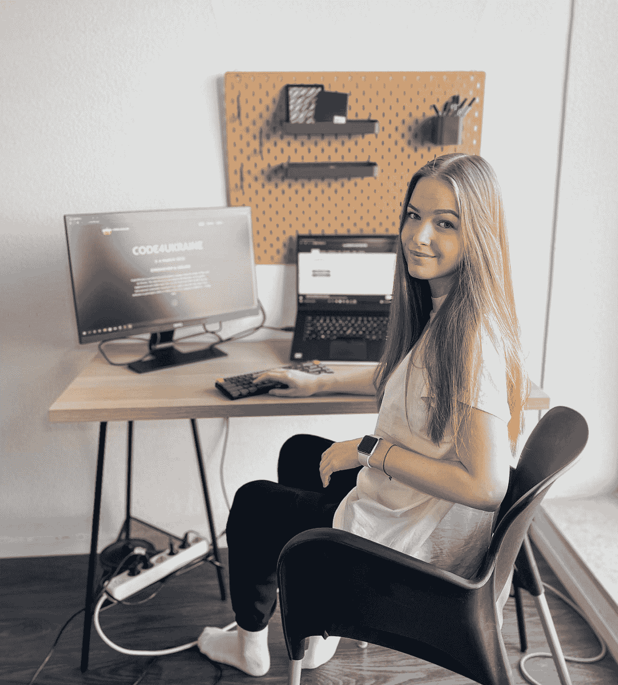
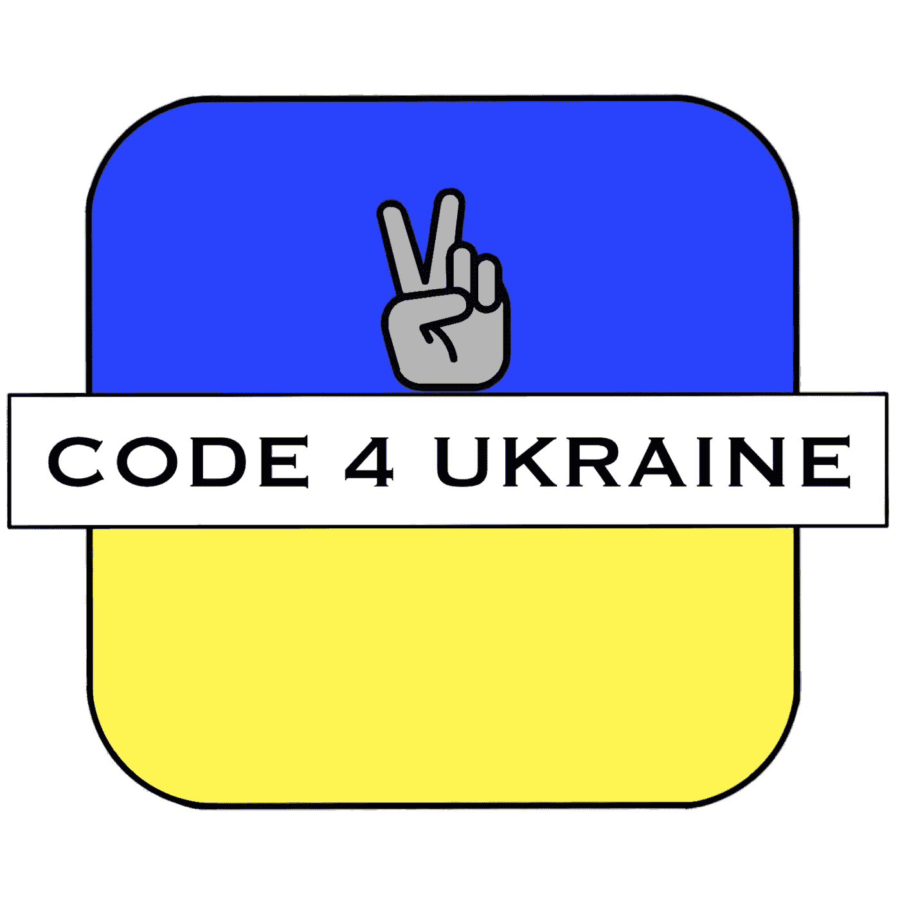
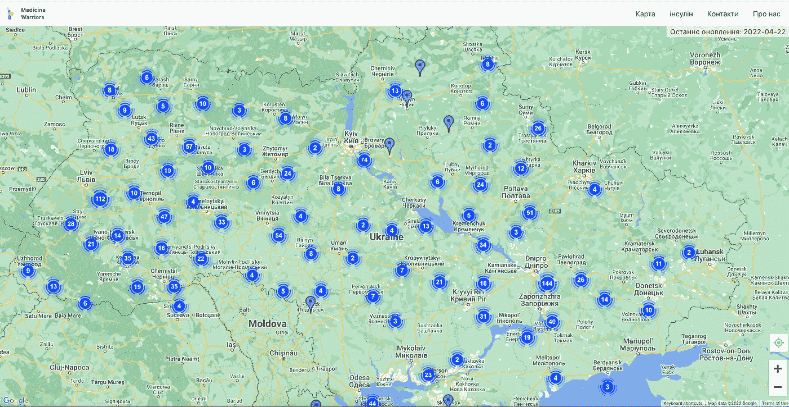
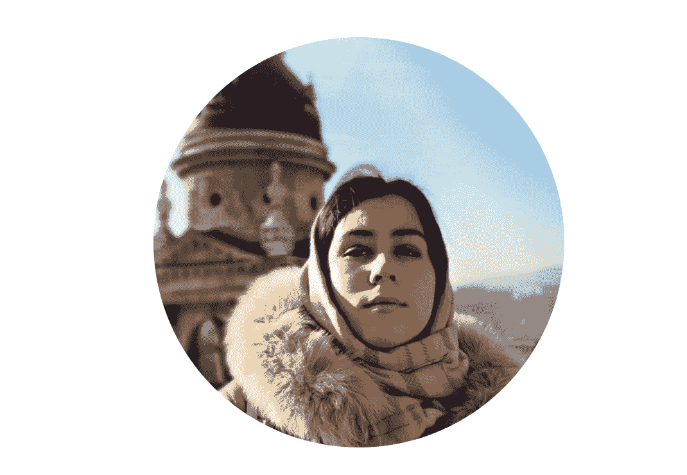
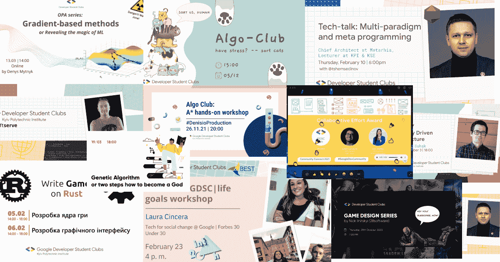
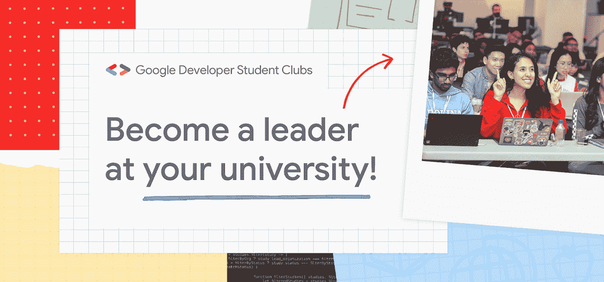

# GDSC 学生如何运用他们的技能支持乌克兰的社区

> 原文：<https://medium.com/google-developer-experts/how-gdsc-students-are-using-their-skills-to-support-communities-in-ukraine-6131c8b645db?source=collection_archive---------1----------------------->

*原载于* [*谷歌开发者博客*](https://developers.googleblog.com/2022/04/how-gdsc-students-are-using-their.html) *。*

**在危机时刻展现个性**

乌克兰冲突是一场人道主义危机，带来了复杂的挑战。在这个不确定的时期，学生开发人员社区展现了非凡的领导技能和同理心，因为他们团结起来支持那些受当前形势影响的人。学生[patrici Jia erkait](https://www.linkedin.com/in/patricija-cerkaite-7b4a821a2/)和她在荷兰[埃因霍温理工大学](https://gdsc.community.dev/eindhoven-university-of-technology/)的谷歌开发者学生俱乐部(GDSC)社区组织了 [Code4Ukraine](https://gdsc.community.dev/events/details/developer-student-clubs-eindhoven-university-of-technology-presents-code4ukraine/) ，这是一个国际黑客马拉松，于 2022 年 3 月 3 日至 4 日将 80 多名学生开发者聚集在一起，开发技术解决方案来支持受乌克兰冲突影响的人们。

即使在远离荷兰冲突的地方，他们也感到有必要施加影响。“我在乌克兰有亲戚；他们住在克里米亚，”Patricijia 说。“在我的童年，我经常在那里度过暑假，吃冰淇淋，在黑海游泳。”

*Patricijia 正在制定乌克兰代码 4 的细节。*

**抢着用技术帮助需要帮助的人**

时间是至关重要的。埃因霍温的组织团队联系了其他学生，联系了远近的社区，并迅速行动起来。该团队邀请了乌克兰 G [oogle 开发专家 Artem Nikulchenko](https://developers.google.com/community/experts/directory/profile/profile-artem-nikulchenko) 分享他的技术知识和关于他的国家正在发生的事情的第一手经验。学生们讨论了乌克兰人面临的问题，回顾了公民面临的问题，并围绕以技术为中心的解决方案进行了思考。恼怒、沮丧的感觉，最重要的是，希望变成了代码行。学生们一起构建了响应号召的解决方案:Code4Ukraine。

然后，通过协作努力、解决问题和数小时的辛勤工作，Code4Ukraine 黑客马拉松的获胜者逐渐出现: [Medicine Warriors](https://github.com/rupikon/medicine-warriors) ，这是一个由来自乌克兰、波兰和格鲁吉亚的多元化、跨文化本科生和 IT 专业人员组成的项目，旨在解决乌克兰的胰岛素短缺问题。该项目从乌克兰政府关于全乌克兰胰岛素可用性的公告中收集公开可用的数据，并以易于阅读的方式呈现出来。

*医学勇士应用设计照片*

**帮助:他们社区的核心**

获胜团队的一名成员是乌克兰国立技术大学基辅理工学院 GDSC 分部的负责人。叶卡捷琳娜说:“在乌克兰，有一句谚语:‘другпізнаєтьсявбіді,'，意思是‘当艰难时刻到来时，你会知道谁是你的朋友。’”。“现在，我可以说，GDSC 社区肯定是我的家庭名单。”

**Ekaterina Gricaenko，基辅理工学院 GDSC 主任**

Code4Ukraine 计划的目标是将其他人聚集在一起产生影响，这为谷歌开发者学生俱乐部(GDSC)计划的目标提供了一个绝佳的例子:让大学的学生开发者能够通过技术影响他们的社区。

回顾她领导基辅 GDSC 分会的经历， [Ekaterina](https://www.linkedin.com/in/ekaterina-gricaenko/?originalSubdomain=ua) 说:“我作为核心团队成员与 GDSC 一起开始了我的旅程，在那段时间里，我爱上了我们的社区、目标和关键理念。然后，我决定成为一名领导者，分享我的热情，支持学生追求他们的职业梦想。

基辅 GDSC 组织了超过 18 场研讨会，撰写了超过 200 篇文章，开办了多个学习小组，并在社交媒体上接触了超过 1000 名追随者。“意识到我们已经走了这么远，真是难以置信，”叶卡捷琳娜说。

*视觉拼贴展示了由*[*Ekaterina Gricaenko*](https://www.linkedin.com/in/ekaterina-gricaenko/?originalSubdomain=ua)领导的 GDSC KPI 组织的多项活动。

参与你的社区

通过 Code4Ukraine 等努力和其他鼓舞人心的解决方案，如 [2022 解决方案挑战](https://developers.google.com/community/gdsc-solution-challenge)，全球的学生在应对挑战和提出技术解决方案时给社区带来了希望。通过加入 GDSC，学生可以在点对点的学习环境中增长知识，并通过构建解决社区问题并产生重大影响的项目将理论付诸实践。

**了解更多关于谷歌开发者学生俱乐部的信息**

如果你想通过技术做出积极的改变，即将到来的 2022-2023 学年 GDSC 领导的申请现已开始。学生可以在 goo.gle/gdsc-leads[申请。如果你对技术充满热情，并准备用你的技能来帮助你的学生开发者社区，那么你应该考虑成为一名](http://goo.gle/gdsc-leads)[谷歌开发者学生俱乐部的领导者](https://developers.google.com/community/gdsc)！

我们鼓励所有感兴趣的学生在这里申请并尽快提交申请。欧洲的申请将开放至 2022 年 5 月 31 日。