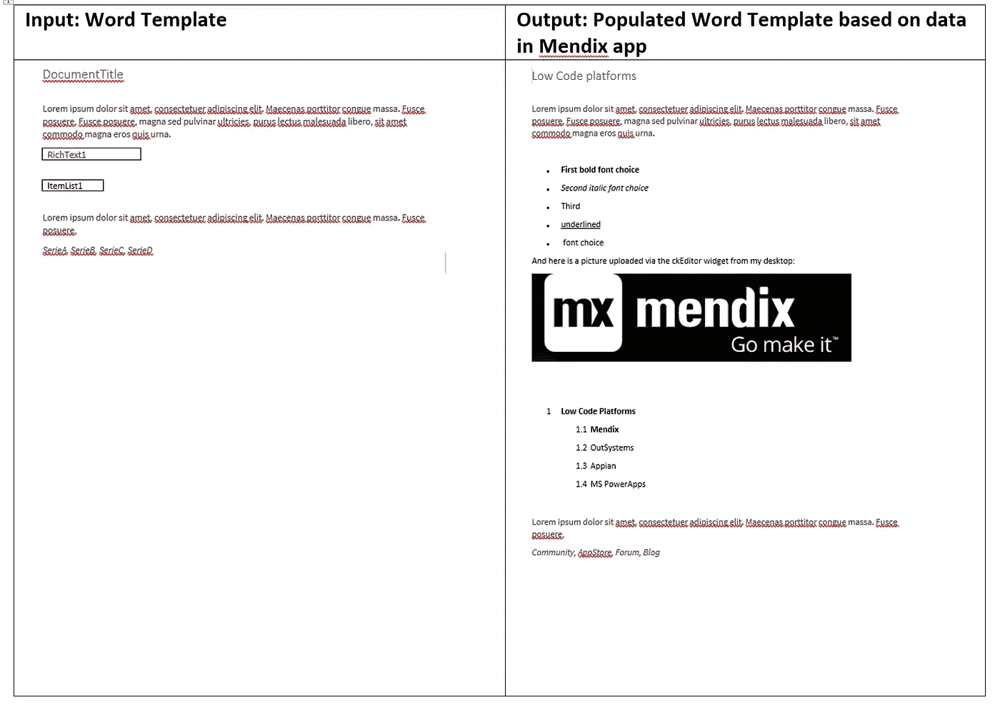
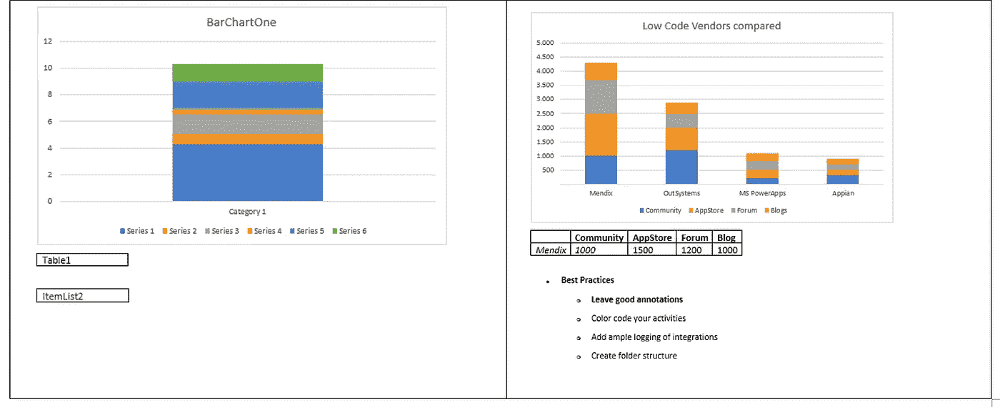
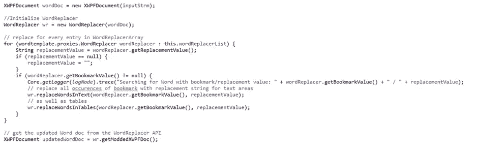
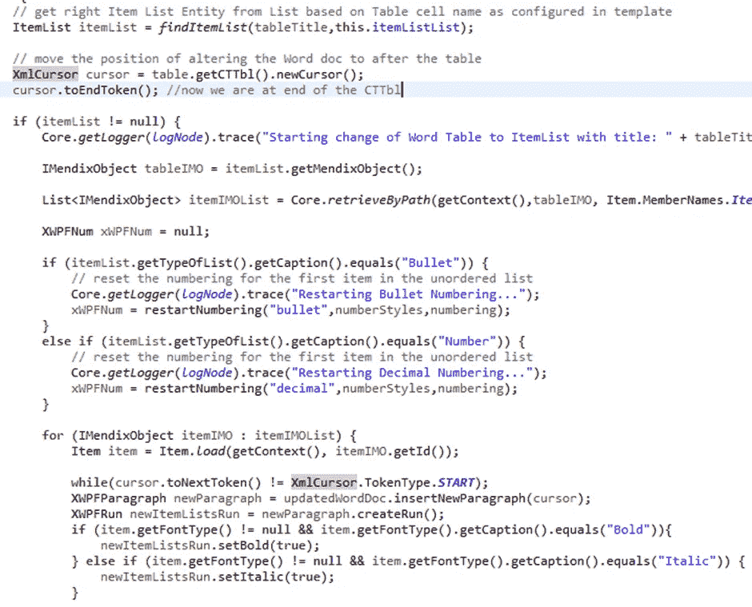
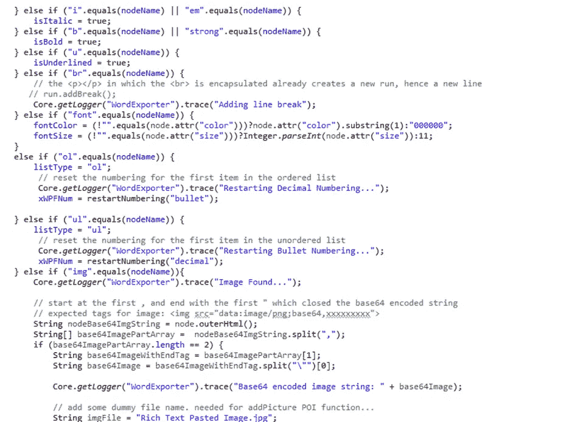
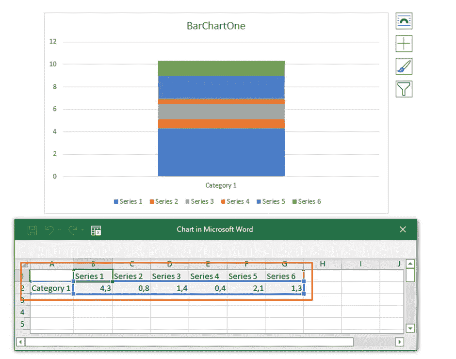
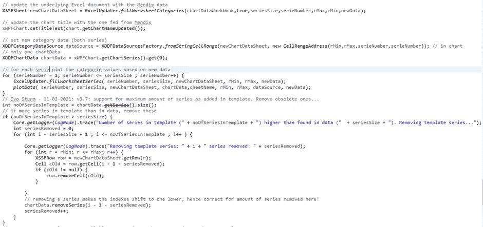
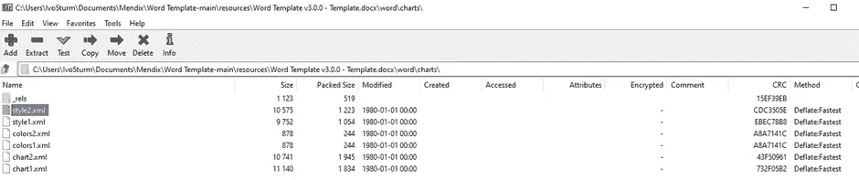
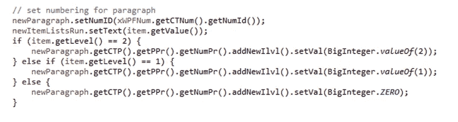

# 我如何使用 Apache POI API 在 Mendix 中自动化 Microsoft Word 模板

> 原文：<https://medium.com/mendix/how-i-automated-word-templating-in-mendix-with-the-apache-poi-api-4549163b0acc?source=collection_archive---------5----------------------->

## 全世界都爱微软 Office。因此，大多数 Mendix 开发人员将最终从事一个需要从您的应用程序生成 Word 文档的项目。

How I Automated Microsoft Word Templating in Mendix Using The Apache POI API

# **Mendix Word 文档生成**

说到 Word 文档，Mendix 有自己内置的文档模板设计系统。尽管使用起来有点笨拙，但你可以从你的 Mendix apps 数据中创建很棒的文档。主要概念是 **Mendix** 将创建包含所有数据的 Word 文档。

## **Word 模板**

在过去的八年中，我看到了几个需要在 Word 中维护模板并让 Mendix 添加/更改 Word 文档的用例。如果在一个 Mendix 应用程序中需要为不同的客户端生成多种类型的文档，这一点特别有趣；每个客户都需要在生成的 Word 文档中有自己的详细信息，但是模板在结构上对所有客户来说都是通用的。如果我们可以在 Word 中维护模板的基础，并让 Mendix 自动填充 Word 模板，使其特定于客户端，那该有多好？所以:

Dynamically change words in the template and add rich text, images and lists

Populate chart template with data from your Mendix app

# **阿帕奇兴趣点**

操作 MS office 文档的首选 Java 库是 [Apache POI 库](https://poi.apache.org/)。这个 Java 库有现成的 API 来创建和操作最常见的 Office 文档，如 Excel 和 Word。与导出到 Excel 和从 Excel 导入相关的 Mendix 模块都严重依赖于该库的使用。

我开始阅读 Apache POI 的可能性，似乎访问 word 模板不会太难。事实上，这并不是最难的部分。在大约五行代码中，可以打开一个 Word 文档并操作其内容。

我需要一些补充，Mendix 文档生成功能缺失:

**1。** **单词替换**:将带有书签值的特定单词替换为来自 Mendix 应用程序的另一个(特定于客户端的)值

**2。** **将内容**(表格、(不)有序列表、图像)放置在现有的 word 文档中

**3。** **丰富的文字支持**

**4。** **操纵图表**

下面我将介绍这四个挑战。我将用一个回退场景来总结，如果 Apache POI 库缺少一些直接的函数来获取您需要的东西，该怎么办。

## **单词替换**

看似非常标准的功能，结果却相当复杂。这也是为什么一些付费图书馆创建了他们自己的知识产权来访问 Word 文档中的单词的主要原因之一。

> 挑战来自于这样一个事实，即 word 文档中的任何单词都将被分成所谓的“*游程*”。人们无法预先知道一个单词将由多少个游程组成。

当然，添加不同的字体或字体大小会增加运行大小。单词越复杂(就长度和格式而言)，为单词创建的游程就越多。因此，如果您想以编程方式搜索 word 文档，您必须检查一个单词可能属于的所有可能的运行，组合这些运行中的文本，并与逻辑正在搜索的值进行比较。这是非常具有挑战性的，因为要研究的单词片段/游程的排列数量可能会快速增长。

令人高兴的是，有人找到了一个由三个字母组成的单词的解决方案。我通过添加 WordReplacer helper 类实现了[这个库](https://github.com/deividasstr/docx-word-replacer)，它有几个函数可以替换纯文本和表格中的单词:

> *作旁注；因为单词替换最多只支持三次运行，所以坚持使用简单的(无格式)和短的书签值，不使用空格/特殊字符。*

## **配售内容**

如果您想在现有文档中添加一些(丰富的)文本、表格、无序列表或图表，您需要一种机制来管理内容的添加位置。令人高兴的是，表在 Apache POI 库中得到了很好的支持，并且可以通过使用表作为占位符来检索准确的位置。想法是将这个 Mendix 内容关联到某个 Word 表格单元格内容名称。然后，该代码将打开 Word 文档，搜索一个 1 乘 1 的表格(因此只有一个单元格),并以该名称作为内容。它将在那里添加动态内容，并完全删除该表。

*Code Snippet 1: Moving to the position of the dummy table with the XMLCursor and adding content there with the help of this XMLCursor.*

## **富文本**

如果在你的 Mendix 应用程序中格式化为富文本的文本可以在 Word 文档中以同样的方式可视化，那该有多好？网页上的富文本通常是 HTML 格式的文本。基于 HTML 标签，可以推断出要添加什么字体格式。我找到了一个非常一致的库，叫做 [Jsoup](https://jsoup.org/) ，可以很好的处理富文本。Jsoup 引入了迭代堆叠 HTML 结构的概念，这正是富文本的含义。

只需使用 Mendix 的 CK 编辑器将您的文本作为富文本输入即可。该模块将使用 Jsoup 库来导航和迭代 HTML 结构，并使用 Apache POI 库来根据被迭代的 HTML 节点的类型强制特定的格式:

*Code Snippet 2: Part of the RichTextParser class I created for handling rich text*

## **操纵图表**

Mendix 文档生成中缺少的一个特性和一个真正“值得拥有的特性”是对 Word 文档中图表的支持。想法是默认的图表模板已经添加到 Word 模板中。根据 Mendix 数据，该图表可能由多个不同的系列构成。Apache POI 库可以访问 Word 图表用作数据源的 Excel 插件数据表:

The underlying Excel worksheet of a chart in Word

并直接操作该数据集，并基于该数据触发图表的刷新。

*Code Snippet 3: Fill the underlying Excel chart data with series/category data coming from your Mendix app.*

如果模板中的类别比 Mendix 中的多，这些过时的系列将被删除。

> *目前仅支持* ***(堆积)条形图和折线图***

## **缺少阿帕奇 POI 怎么办？**

Apache POI 库有一组功能丰富的函数，用于使用 Java 操作 MS Office 产品。然而，Apache POI 可能还不支持直接可用的 java 方法的特定特性，例如更改 Word graph 中的某些特定格式。总是尝试首先在模板中涵盖它，但是如果需要对 java 代码进行真正的扩展，重要的是要理解**Word 文件，就像 Excel 文件一样，只不过是 XML 文件的压缩文件夹**。通过解压缩和检查 XML，可以很容易地找到添加特定功能所需的确切 XML 标签。只需在 Word 中添加该功能，保存文件并检查 XML，它包含添加/更改的 XML 标签。项目附带的解压后的 Word 模板文件如下:

A Word document is actually a zipped XML archive

通过定位特定的 XML 标记，有一个后备方案，通过 Apache POI 库可以访问这些特定的标记并对其进行操作。例如，参见下面关于如何通过访问较低级别的 XML 标签(CTP、PPR、NumPr)来设置项目列表的编号的修正:

*Code Snippet 4: Accessing lower-level XML tags of Word document*

# **演示项目**

演示所有上述功能的完整工作演示项目在 Mendix 市场内[可用](https://marketplace.mendix.com/link/component/111539)。只需下载它，运行项目并上传项目附带的测试模板，即可快速查看其功能。测试模板可以在 resources 文件夹中找到。

> [**https://market place . mendix . com/link/component/111539/Valcon/Word-Template-Demo-Project**](https://marketplace.mendix.com/link/component/111539/Valcon/Word-Template-Demo-Project)

# **已知 bug**

目前，没有已知的错误。了解这个模块使用相同的 Java 库，Apache POI，这是 Mendix 模块“Excel Importer”和“Excel Exporter”使用的。**确保这些库保持一致**，这样所有模块都使用相同版本的 Apache POI 库，目前是 5.2.2。

# 演示应用程序

 [## 门迪克斯

### 编辑描述

word exporter 127-sandbox . MX apps . io](https://wordexporter127-sandbox.mxapps.io/index.html) 

## 阅读更多

 [## Apache POI——微软文档的 Java API

### Apache POI 团队很高兴地宣布 5.2.3 的发布。几个依赖项已更新到最新版本…

poi.apache.org](https://poi.apache.org/)  [## POI API 文档

### 您的浏览器禁用了 JavaScript。本文档旨在使用框架功能查看。如果你看到…

poi.apache.org](https://poi.apache.org/apidocs/4.1/) 

*来自发布者-*

*如果你喜欢这篇文章，你可以在我们的* [*中页*](https://medium.com/mendix) *找到更多喜欢的。对于精彩的视频和直播会话，您可以前往*[*MxLive*](https://www.mendix.com/live/)*或我们的社区*[*Youtube PAG*](https://www.youtube.com/c/MendixCommunity/community)*e .*

*希望入门的创客，可以注册一个* [*免费账号*](https://signup.mendix.com/link/signup/?source=direct) *，通过我们的* [*学苑*](https://academy.mendix.com/link/home) *获得即时学习权限。*

有兴趣加入我们的社区吗？加入我们的 [*Slack 社区频道*](https://join.slack.com/t/mendixcommunity/shared_invite/zt-hwhwkcxu-~59ywyjqHlUHXmrw5heqpQ) *。*