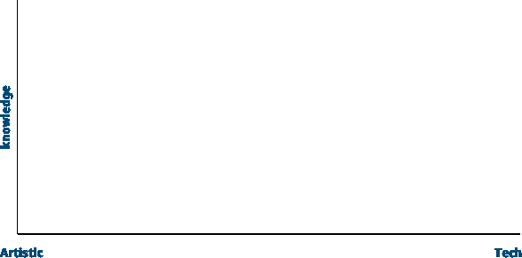
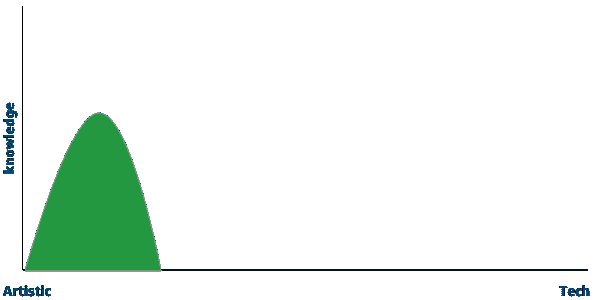
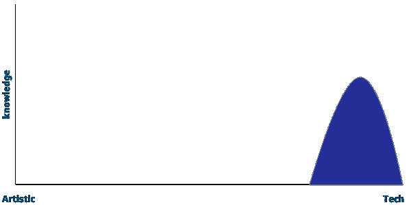
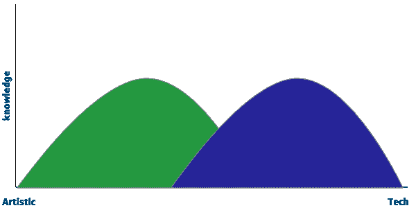
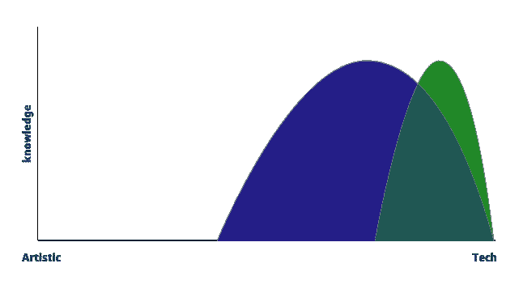
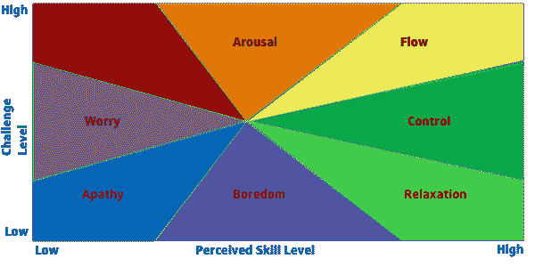

# 我如何成为一名更好的前端开发人员

> 原文：<https://medium.com/capital-one-tech/how-i-became-a-better-front-end-developer-by-creating-developer-personas-d88d415a9295?source=collection_archive---------3----------------------->

## 分析技能、知识和工作方式来确定你的开发人员角色

> 这个博客不是一个技术或图书馆的列表，而是一种看待职业发展的方式。

我从事开发工作已经超过 25 年了，成为一名优秀的开发人员一直是我的目标。有时候，我觉得我快成功了。其他时候我觉得我在百万英里之外。在这 25 年中，我在电信、石油和天然气、航运和金融等不同领域构建和管理了企业团队。所有这些部门的开发工作基本相同。以下是我一路走来发现的让我成为更好的开发人员(不仅仅是更好的前端开发人员)的秘密。

> *“知道你不知道的”*是我职业生涯中收到的最好的一条建议。

我从中得到的是，在发展中有许多事情我不是专家，但需要意识到它们的存在。你可能不知道所有的细节，比如说，一个网站的可访问性，但你应该注意它，为什么它对消费者网站至关重要，以及向谁寻求帮助来实现它。

反思我知道我不知道的事情，我可以评估它们有多重要，并优先学习它们。作为一名前端开发人员，如果您的网站是一个面向外部的网站，您可能希望优先学习如何提高用户的可访问性，而不是 CSS 变量。开发人员可以做的最好的事情之一是自我评估他们喜欢做什么，他们在开发中擅长什么，以及他们应该努力填补什么差距。你必须对自己做一个非常诚实的评估，这可能很难。然而，任何开发人员都可以从这项工作中受益。

根据我作为前端开发人员的经验，这里有一个您可以查看的示例。

# 确定你的兴趣和知识

大多数前端开发人员可以把自己放在一个他们的个性有多艺术或技术的光谱上。横轴将从对网页或原生前端的技术方面兴趣不大的非常有创造力的人延伸到只对开发的 1 和 0 感兴趣的人。纵轴将是他们对开发实践的知识。

A spectrum of Front-end Developer

如果你对此绘制一条[标准分布曲线](https://en.wikipedia.org/wiki/Normal_distribution)，它会描绘出你效率的总体感觉。

*Developer interest on the tech spectrum.*

*Developer interest on the tech spectrum.*

站在这一头或者那一头都没有错。然而，作为一名经理，我希望我的开发团队涵盖所有方面。有点像这样。

*Two users spanning the spectrum.*

通过在会议和焦点小组中与用户坐在一起，我对自己在这张图表中的位置有了一些认识。我不知道为什么动作按钮需要在页面的右侧，为什么文本长度应该在 80 个字符左右，或者为什么我们要在 12 个栏目中对齐。当我用管理的眼光审视自己时，我意识到我在图表中非常偏向于技术方面。为了让自己成为一个更高效的前端开发人员，我决定做两件事:

1.  将我的兴趣移向中间。
2.  拓宽我知识的标准差。

拥有广泛的知识基础将对你的职业生涯有所帮助，因为在为一个项目配备人员时，经理们通常必须就项目需要什么以及为什么需要特定的人才做出决定。很多时候，归结起来就是如何用最少的人做最多的工作。随着你开始拓宽你的知识面，你可以展示你的能力，不仅仅是做一小部分工作。此外，你将开始学习更多的尖端技术和技能，你可以影响你的公司的工作方式。所有这些都能让你成为更有价值的开发者。

对我来说，我决定通过学习更多关于 UI 设计方面的知识来拓宽我的知识面。这会让我在图上移动到这里。

*Developer interest moves to the middle with broader knowledge.*

对于前端开发人员来说，听取 UI/UX 方面的专家意见是了解设计常识的绝佳方式。首先，你可以学会对设计师如何解决问题感同身受。第二，它可以让你从可编程的角度插入为什么一个特定的设计不工作，以一种设计师会听到的方式。最后，如前所述，如果你能在一个团队中身兼数职，你会成为一个更有价值的开发人员。

# 随波逐流(图表)

着眼于开发角色的一个方面不足以成为一名更好的开发人员。你也应该评估你在什么样的环境中成长。有很多方法可以做到这一点，但让我们集中在一个。

心理学家米哈里·契克森米哈概述了一个理论，即人们处于“心流”时最快乐心流是一种状态，在这种状态下，人们如此深入地参与到一项活动中，以至于其他事情似乎都不重要了。这意味着大多数人喜欢以一种需要高技能水平的方式接受深刻的挑战。

对于日常工作，我不确定心流是可持续的。全神贯注以至于其他事情都不重要了，这可能在一段时间内无法实现，但生活确实发生了。家庭、疾病、疲劳、商业优先权的改变、工作场所的政治只是几件能让你离开这个区域的事情。然而，下面的 Csikszentmihalyi“流程”图可以告诉我们喜欢在哪里工作。

该图表从挑战性(纵轴)和技能水平(横向接触)两个方面描述了任务过程中可能出现的精神状态。对于人们承担的大多数任务来说，在这个图表中有一个顺时针方向的运动。当他们第一次统计时，他们开始冷漠。随着任务变得更具挑战性，但他们的技能还没有提高，用户将上升到担心，然后焦虑。随着他们在执行任务过程中技能水平的提高，他们将开始向右移动，走向心流。

让我们稍微修改一下这个图表，挑战水平(纵轴)不仅基于项目的难度，还基于项目的时间表。现在，我和一些需要处于焦虑、兴奋(如兴奋)或心流状态的人一起工作，否则他们会很快分心。他们需要挑战带来的肾上腺素激增。我也知道其他的开发人员，时间表的压力和完成工作的压力使他们身体不适。当他们处于焦虑或兴奋状态时，他们往往会犯更多的错误，他们喜欢生活在控制、放松或无聊(因为任务是例行公事)的部分。

对我来说，我喜欢生活在这个图表的控制部分。我想开动脑筋，找到解决严重问题的办法。然而，我喜欢有截止日期和达到应用程序的感知“完成”。我也不喜欢因为一些武断的截止日期而总是处于枪口之下的压力。

当你回顾你自己和你与这张图表的关系时，看看你喜欢住在哪里，以及如何移动指针以适应你的舒适水平。如果你的工作更适合冷漠或无聊的部分，但你喜欢更大的挑战，那么考虑设定人为的最后期限来增加挑战水平。相反的是增加你的估计，给自己更多的时间，把事情放在流畅或放松的部分。

对我来说，我对完成事情需要多长时间进行估计，管理对能够交付什么和能够交付什么的期望，并将“范围爬行”推向未来的冲刺。这些技巧让我停留在控制或放松的部分。

牢记在心；你可能只能把针移动到这个程度。在这个练习中，你可能需要回答一个棘手的问题——这份工作合适吗？我需要转换角色甚至职业吗？

# 与你自己融为一体

神奇的是，每个人都有成为优秀开发者的潜质。关键是要对自己诚实，也要让同事和同龄人在需要的时候提供诚实的反馈。自我评估应该每隔几年进行一次，或者当你开始一项新的重要任务或角色时进行。确保看看你自己和你的技能的其他方面，看看你可能需要改进的地方。所有这些都会让你成为更好的开发人员和团队成员。

# 相关:

*   [前端开发者——全栈开发者悖论](/capital-one-tech/the-front-end-developer-full-stack-developer-paradox-261034c8a09a)
*   [重新发现心流的状态](/capital-one-tech/rediscovering-the-state-of-flow-in-programming-f64f97495e27)

*以上观点为作者个人观点。除非本帖中另有说明，否则 Capital One 不隶属于所提及的任何公司，也不被其认可。使用或展示的所有商标和其他知识产权都是其各自所有者的所有权。本文为 2019 首都一。*