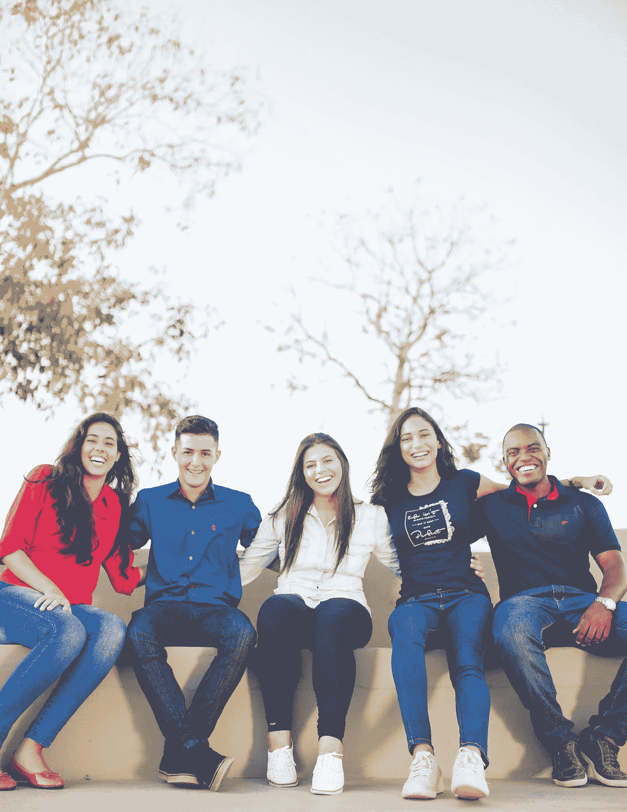
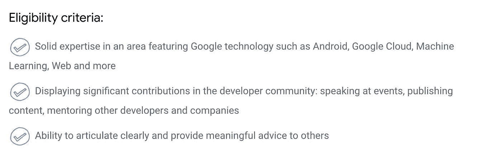
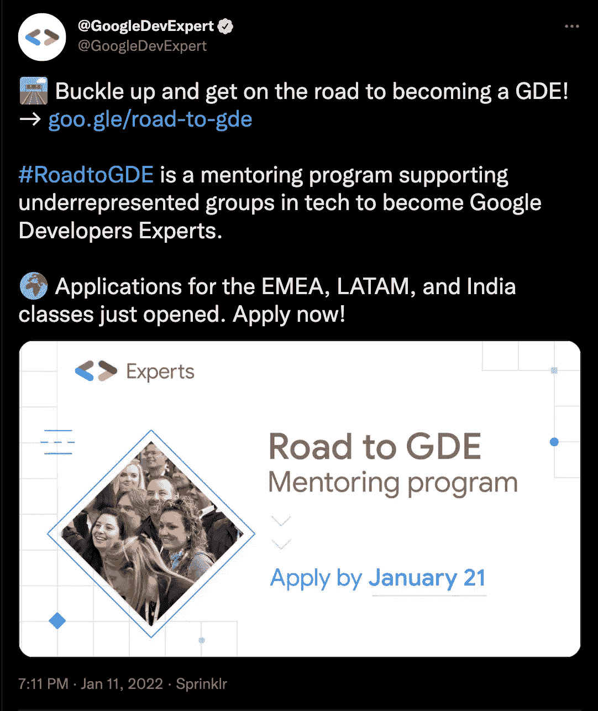
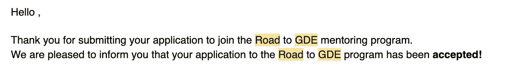
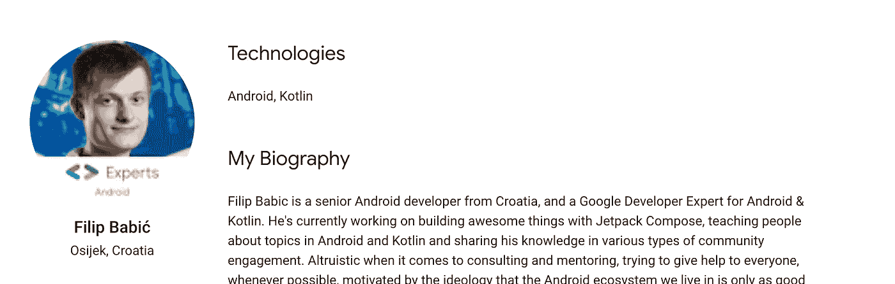
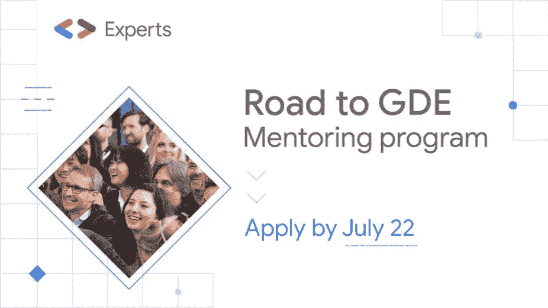
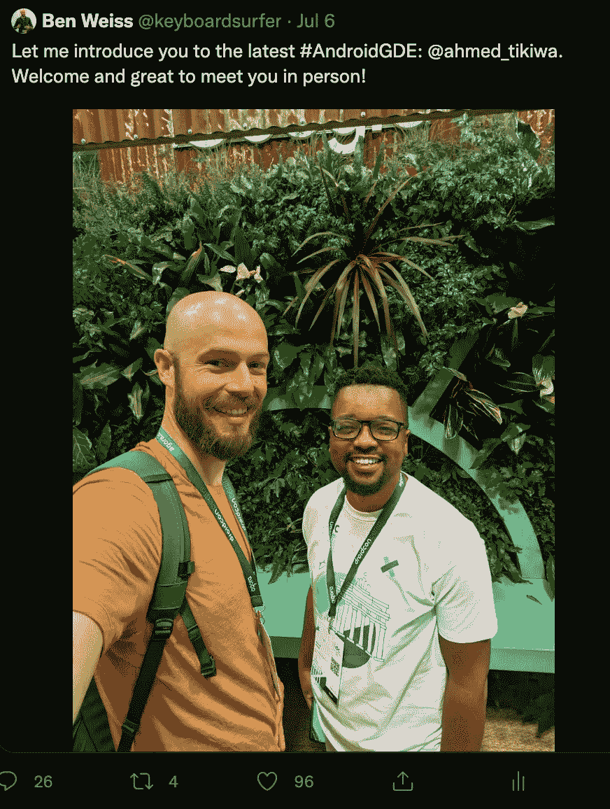
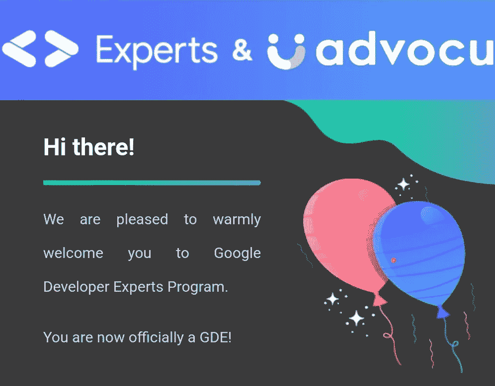

# 我如何在#RoadToGDE 计划的帮助下成为 Android 的谷歌开发专家(GDE)

> 原文：<https://medium.com/google-developer-experts/how-i-became-a-google-developer-expert-gde-for-android-with-the-help-of-the-roadtogde-program-2ba97729b469?source=collection_archive---------1----------------------->

上周，我成为了谷歌 Android 开发专家(GDE)。这是我第二次尝试申请，其中包括我是谷歌 GDE 之路项目的一部分。这篇文章强调了我在指导项目中的经历，以及它如何帮助我成为一名 GDE，以及你如何也能成为一名。

Naassom Azevedo on [Unsplash](https://unsplash.com/photos/Q_Sei-TqSlc?utm_source=unsplash&utm_medium=referral&utm_content=creditShareLink)

# 什么是谷歌开发者专家(GDE)？

一位[谷歌开发专家](https://developers.google.com/community/experts)(也称为 GDE)是一位经验丰富的技术专家，精通 Android、Angular、Flutter 等谷歌技术。目前有近千名专家参与了该项目。

成为谷歌开发专家有很多好处，比如:

*   通过专家网站和徽章认可他们的技能，
    专家可能会在他们的社交媒体档案或个人网站中使用这些徽章
*   促进对谷歌产品团队和项目的访问，
    包括早期访问计划
*   邀请参加世界各地的 Google 活动
*   支持他们参加会议，在会上谈论他们最喜欢的
    技术

为了能够加入专家计划，你首先需要由谷歌员工或现有的谷歌开发专家推荐。您还需要满足以下标准:

Source: [https://developers.google.com/community/experts](https://developers.google.com/community/experts)

# 我是如何听说“GDE 之路”计划的

去年年底，在与我所在的撒哈拉以南非洲地区的谷歌地区主管密切合作时，我申请了 GDE 项目。申请流程的第一部分是资格审查，谷歌团队评估申请人在过去一年中对社区的贡献(你需要在申请表上提供所有你对社区的贡献)。申请中检查了各种项目，包括一致性(你多久为社区做一次贡献)和影响(你的每一次贡献影响了多少人)。

我没有通过资格审查，在寻求反馈后，原因是我的贡献范围——我需要在更国际化的层面上扩大影响，例如，我的演讲主要涉及撒哈拉以南地区。我和我的地区领导同意在接下来的六个月里努力提高我的国际影响力，然后在下一年——今年——再次申请。他们还建议让我和我所在地区的一位 GDE 人结对，作为我的导师，帮助我实现目标。

由于临近 12 月的假期，我休了个假，打算在新年伊始重新开始工作。今年年初，我在 Twitter 上发现了谷歌开发者专家账户的一条推文:

Source: @GoogleDevExperts on Twitter

我的地区领导也告诉了我这件事，并建议我申请。我不知道我是否会成功，但我继续申请“通往 GDE 之路”项目。大约过了两周，我才收到确认邮件:

Confirmation email I received on being accepted in to the Road to GDE mentoring program

大约有 1500 份来自世界各地的申请，包括我在内只有 70 份被选中。

大约一周后，我收到了关于我的导师是谁以及下一步行动的信息。我和菲利普·巴比齐搭档，他是安卓和科特林的 GDE，也是一位了不起的导师:

Source: [https://developers.google.com/community/experts/directory/profile/profile-filip-babic](https://developers.google.com/community/experts/directory/profile/profile-filip-babic)

在我们举行了“通往 GDE 之路”动员会后，现在是学员安排与导师会面的时候了，以便开始他们的 GDE 之路之旅。

# 什么是 GDE 之路计划？

[通往 GDE 之路](https://events.withgoogle.com/road-to-gde/)计划是一个为期三个月的指导计划，旨在帮助那些在技术领域一直被低估的群体成为谷歌开发专家。在这个项目中，有抱负的 GDE，即学员，根据他们的关注领域(例如，Android、Angular、Cloud 等)、时区和语言，与现有的 GDE(导师)配对。

Source: @GoogleDevExpert on Twitter

在这三个月中，导师和学员将进行由学员组织的一对一讨论(最多五次),这些对话的目标是通过指导和预定义的目标帮助学员准备好申请成为 Google 开发者专家。在这三个月结束时，如果导师认为他们的学员已经准备好申请，学员可以继续申请。否则，如果他们还没有准备好申请，学员可以继续应用提供给他们的指导和导师，并在“通往 GDE 之路”计划之外继续努力，直到他们准备好申请。

# 开始通往 GDE 的旅程

学员有责任安排会议，并为每个会议制定议程。这是通过 Advocu 平台完成的。关键是建立一套目标，并与菲利普保持一致，这样他就可以指导我实现这些目标。每个学员都有自己的一套目标，我们的想法是让你为申请 GDE 项目做好准备。我传达了我第一次申请的反馈，我的总体目标是增加我的演讲的国际影响力。

就社区贡献而言，我的演讲并不是我过去一年所做的唯一事情。我把定期写博客定为目标——至少一个月一篇。然后，我还做了我的 app——[up next:TV Series Manager](https://devlibrary.withgoogle.com/products/android/repos/akitikkx-upnext)——一个社区可以借鉴的开源项目。也是在参加 GDE 之路辅导项目的头几天，我向[谷歌开发者开发库](https://devlibrary.withgoogle.com/)提交了我的开源应用，并被接受了。我有一篇关于我如何提交[的非常详细的文章。](https://proandroiddev.com/my-journey-to-having-my-open-source-android-app-featured-on-the-google-developers-dev-library-a7fe11284ea)

Source: @googledevs on Twitter

此外，我还是当地谷歌开发者组织(GDG)分会的联合组织者之一— [GDG 开普顿](https://gdg.community.dev/gdg-cape-town/)。

尽管如此，我和菲利普的目标是更国际化地说话，菲利普对此有最好的想法。

# 扩大我的影响范围——更加国际化

在北美、南美、欧洲、中东、北非、撒哈拉以南非洲、亚洲和大洋洲地区都有名为[谷歌开发团队(GDG)](https://gdg.community.dev/) 分会的社区。每一个项目背后的想法都是培养一个当地的开发者网络，他们可以通过聚会、研讨会、代码实验室，甚至像 DevFest 这样的会议，相互联系并学习谷歌的技术。GDG 开普敦就是这样一个分会，我是开普敦的协办者之一。

菲利普的想法是让我联系欧洲的 GDG 人(因为他们的时区和我的很接近)，看看他们是否愿意邀请我在他们的一次聚会上发言。我发现开始时接触到我的请求的章节是令人畏惧的，但是继续前进并且起草我的电子邮件。有一个[网站](https://gdg.community.dev/chapters/)包含所有 GDG 分会的目录，在那里你也可以按地区过滤。我联系了绝大多数的欧洲 GDG 人，令我惊讶的是，他们中的大多数人都给了我非常愉快的回复。

4 月，我们举办了“通往 GDE 之路”的中期项目活动，我们所有人(学员和导师)再次相聚，组织者向我们简要介绍了项目的最新情况，我们还进行了更多有趣的交流。

到 4 月底，我已经在 GDG 巴黎、 [GDG 奥斯陆](https://gdg.community.dev/gdg-oslo/)、 [GDG 奥西耶克](https://gdg.community.dev/gdg-osijek/)、 [GDG 柏林](https://gdg.community.dev/gdg-berlin/)和 [GDG 柏林 Android](https://gdg.community.dev/gdg-berlin-android/) 以及 [Conf42 Mobile 2022 大会](https://www.conf42.com/mobile2022)上发表了演讲(在开始 GDE 指导之路之前，我的论文征集(CFP)在那里被接受)。我感谢所有为我举办见面会的 GDG 家族。

除此之外，我继续通过我的开发库项目和博客为开源做出贡献。我还与菲利普进行了几次一对一的会谈，讨论我的进展和下一步行动。菲利普还帮助我了解了整个 GDE 申请过程，并帮助我做好准备。特别是，在资格审查之后是两次面试——一次与现有 GDE 的社区面试，以及一次与谷歌员工的产品面试，如果你通过了社区面试的话。

菲利普帮助我了解了这两个面试是如何组织的，他们关注什么，以及如何更好地为这两个面试做准备。

我也接触了更多的 GDG 氏症患者，这次是在美国，在那里我收到了他们中大多数人的积极反馈。其中的两个接纳了我，并给了我演讲的日期，我很感激，这将发生在我从 GDE 大学毕业之后。

# 模拟应用程序

在“通往 GDE 之路”辅导项目中，我们每个人都得到了一份模拟 GDE 申请模板，每位导师和学员都将通过该模板进行学习。该模板是实际的 GDE 申请表的代表，但采用 doc 格式。

我完成了我的模拟申请，包括我最近的演讲活动——包括即将在美国举行的两次演讲活动，并与菲利普分享了文档。在仔细研究了菲利普的反馈后，他进一步告诉我，他相信我已经准备好申请 GDE 项目了。我的意图是在即将到来的美国演讲活动上发言后申请。

# 毕业

此后不久，在 5 月底，我们从“通往 GDE 之路”辅导项目毕业。我们在网上举办了一场令人惊叹的毕业典礼，我们还回顾了过去的三个月以及在此期间发生的任何值得注意的事件。

那些导师表示支持他们的模拟申请的人被邀请与“通往 GDE 之路”团队分享这些申请。这也是为了让 GDE 之路团队看看并分享任何意见或建议。我与他们分享了我的模拟申请，大约两周后我收到了反馈，他们支持我申请 GDE 项目。

# 在 GDE 之路项目之后

我在美国的两个 GDG 演讲——GDG 硅斜坡(T1)(犹他州)和 T2 GDG 达拉斯(T3)(得克萨斯)。在我第二次申请 GDE 项目之前，我已经设法接触了欧洲和美国的社区。社区是我所做的一切的核心，我很感激我能够接触到世界上这么多的开发者，他们通过我的演讲、博客和我的开源代码向我学习。

7 月，我第二次申请了 GDE 项目。不到一周，我就收到了通过资格审查的确认，于是我和一位 GDE 一起进入了社区面试环节。

我们约定了日期，不久就见面了。这次面试非常具有对话性，因为这不是一次工作面试，而是一次围绕你的社区参与的讨论。第二天我收到了反馈，说我已经通过了这次面试，并进入了最后的面试——与一名谷歌员工的产品面试。

我们也约定了日期，第二天见面。我们进行了一次非常深入的交谈。这次面试更具技术性，但同样不是面试，而是集中在我申请的特定领域——Android。在我收到反馈我已经通过复试的第二天早上！

# 确认

在柏林 2022 年机器人展上，我有幸见到了来自谷歌的高级开发者关系[本·维斯](https://medium.com/u/65fe4f480b1c?source=post_page-----2ba97729b469--------------------------------)。本也是谷歌专家团队的一员。他亲自祝贺我成为最新的安卓 GDE，并通过推特与全世界分享。没有语言可以形容这一刻对我来说有多美妙:

@keyboardsurfer via Twitter

就在同一个星期，我收到了专家小组的正式邮件，说我现在正式成为 GDE 了:

My confirmation email from the Experts team

# 结论

如果我没有参加 GDE 之路辅导项目，我可能要花很长时间才能成为 GDE。我从我的导师菲利普·巴比那里得到了非常好的指导，通过我在这个项目中的经历，我把指导看得比以前更高了。我的导师了解我的目标，我想要达到的目标，并给了我可行的指导。我听了他的话，这打开了许多大门，增加了我的社区网络。

GDE 之路导师项目现已开始第四期课程，申请将于 2022 年 7 月 22 日截止。如果你相信你正在成为一名 GDE，对你的社区充满热情，并且是一名积极的贡献者，请申请吧。这个项目确实改变了我的生活，它也能改变你的生活！

今天在这里申请。