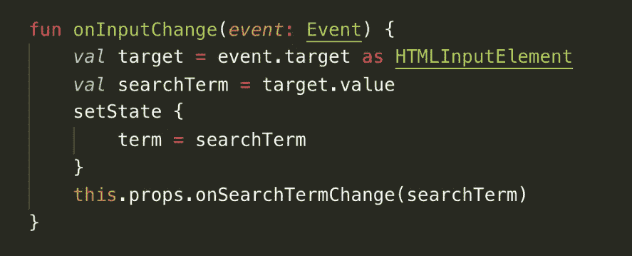

# 我如何在 Kotlin JS 中构建一个图像搜索网络应用程序

> 原文：<https://medium.com/globant/how-i-built-an-image-search-web-app-in-kotlin-js-994756c7ea5e?source=collection_archive---------5----------------------->

Photo by [Marvin Meyer](https://unsplash.com/@marvelous?utm_source=medium&utm_medium=referral) on [Unsplash](https://unsplash.com?utm_source=medium&utm_medium=referral)

# 科特林 JS

自从 Kotlin 在 Android 上获得一等公民身份后，我就想试试它。从那以后，它已经勾选了许多选项。

> 它已经成为 JVM 上第二流行的语言。
> 
> *它已经成为 StackOverflow 上最受欢迎的语言之一*
> 
> *这是 2019 年谷歌十大编程语言搜索趋势之一*

科特林的一些特征引起了我的注意:

*   与 Java 和 JavaScript 无缝互操作，意味着没有学习开销。这使得在您的项目中逐步适应 Kotlin 变得非常容易
*   能够编译到多种平台:基于 JVM 的平台、本地平台和 JS。瓶中闪电！
*   项目改进:迁移到 Kotlin 的传统 Java 项目受益于它的健壮性(零安全性)和简洁性。调试和开发速度更快。最重要的是，您的前端也采用它，统一开发的道路是清晰的，消除了前端和后端团队之间的障碍。
*   多平台:当团队在不同的应用程序上工作时，他们可以在一个地方编写特定于平台的公共逻辑，维护单一的事实来源，同时避免冗余。

我和 ReactJS 一起工作了很长时间，一直在寻找一种介于 Java 的严格性和 JavaScript 的自由性之间的东西。科特林符合这种描述。鉴于其反应的相似性，它出奇地容易写。

以下是我实验中的一些代码片段:

# Main.kt —入口点

Main function which injects our app in root element just like React

就像在 React 中一样，main file 将组件的整个层次结构注入到 DOM 的根 div 中，如上所示。除此之外，它还需要根级别的应用程序的整个 CSS。

我们现在深入到 app.kt，我们在上面的 main.kt 中对它进行了膨胀

# App.kt

App.kt

App.kt 是 searchBar、loading 和 errorView 组件的父组件。在这里，我们加载我们的图库时，不在加载或空列表状态。对于 div{}、br{}等 DOM 元素，它有一个类似对象文字的表示。JSX 盛传！

searchBar 组件:传递 onSearchTermChange 方法作为其 props，该方法在内部反跳 startSearch 方法。

Loading component:向其传递以 app 组件状态出现的加载变量，从而在组件的业务逻辑中扮演重要角色。

类似地，errorView 也与来自 app 组件状态的 errorMessage 一起传递，以便在出现任何错误时可以显示该消息。

让我们进一步深入层次，将这些组件视为它们自己。

# searchBar.kt

Portion of searchBar component showing a constructor and render method

Searchbar 是一个由 div、h2、input 和 p 元素组成的类组件，当用户键入术语时，input 元素触发 onInputChange 方法(如下)。

State and props!! React devs rejoice!

onInputChange 方法运行包含服务调用的函数。onSearchTermChange 是由 app.kt 从 props 传入的，它还用当前搜索词设置状态。

# loader.kt

loader component

Loader 是一个简单的功能组件，它从 app.kt 获取 isLoading 标志，并在获取时呈现一个 spinner div 和一个带有消息“正在加载…”的 h3。

# 图像库

Kotlin 与现有的 npm 库无缝协作。在这里，我们整合了 [react-photo-gallery](https://github.com/neptunian/react-photo-gallery) 来展示一幅拼贴画。简单地 npm 安装并导入库作为一个 jsModule

Class declaration of external JS library

# 服务

Search function called by onSearchTermChange

我们用 searchBar 组件传递的 searchTerm param 调用上面的函数。它利用 Kotlin 的[协程](https://kotlinlang.org/docs/reference/coroutines-overview.html)从 API 端点异步获取我们的图像。

# 摘要

科特林是这个街区的新成员，值得关注！它的多平台、协同程序、交叉编译能力和类型安全等特性使它与众不同。在我们上面的小探索中，我们看到了除了下面提到的主题之外，前端的反应非常相似:

> 类别和功能组件
> 
> 道具和状态
> 
> Http 服务集成
> 
> NPM 包装集成

# #BeKindKotlinChallenge

> *受科特林的启发，我们发起了一场由* [*Globant*](https://www.globant.com/) *和*[*Jetbrains*](https://www.jetbrains.com/)*支持的编程大赛。*
> 
> [*点击这里*](http://uiorbit.globant.com/) *了解更多！*

团队演职员表:[尼克希尔·贾达夫](https://medium.com/u/62658ead3a79?source=post_page-----994756c7ea5e--------------------------------) | [阿克沙塔·谢拉尔](https://medium.com/u/bb9487b17334?source=post_page-----994756c7ea5e--------------------------------) | [苏米特·苏塔尔](https://medium.com/u/fca6492380a9?source=post_page-----994756c7ea5e--------------------------------) | [阿尔卡纳 0623](https://medium.com/u/ddb5232e0b42?source=post_page-----994756c7ea5e--------------------------------)