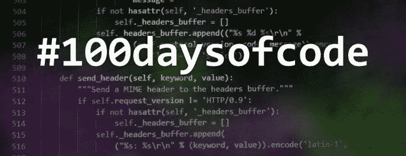
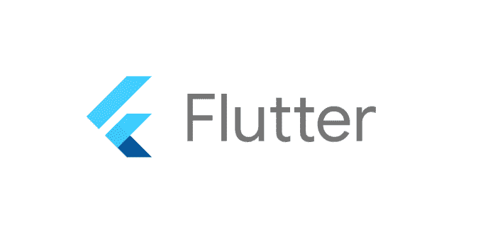
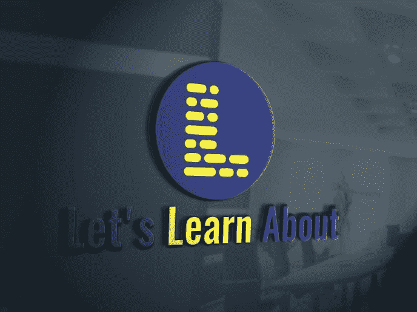
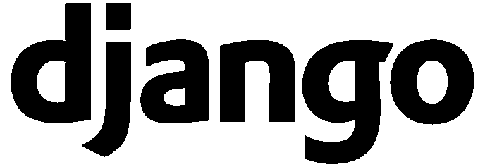

# 我是如何在#100DaysOfCode 挑战中失败的|或者也许我没有？

> 原文：<https://medium.com/quick-code/how-i-failed-my-100daysofcode-challenge-or-maybe-i-didnt-959cc216210e?source=collection_archive---------0----------------------->

我的#100DaysOfCode 失败了。在大约 70 天的挑战后，我只停止了一天。去休息。

10 天后，我注意到我不会回来了，我不得不放弃学习#Flutter 的想法。

但我为什么要这么做？当我接近完成它的时候我是如何失败的？或者更重要的是:

我真的失败了吗？

# #100DaysOfCode |我的挑战，Flutter

Flutter 是一个由 Google 支持的 Dart 框架，可以让你为 iOs 和 Android 创建本地应用。只有 Dart，我们才能创建 iOs 和 Android 原生应用。一种语言，一个代码，两个应用。

这将与我的后端和前端工具(Django 和 Vue)完美匹配。

通过[学习 Flutter](https://letslearnabout.net/100daysofcode/im-joining-100daysofcode-again-flutter-time/) ，我可以做新的事情。学习另一个后端或前端框架来做我现在能做的事情，对我没有好处。于是，我决定学习 Flutter。

但是，与[不同，我的第一次挑战](https://letslearnabout.net/100daysofcode/why-i-am-joining-100daysofcode/)，我失败了。

# 为什么我停止了挑战

但是，尽管我很喜欢 Flutter 和我接近完成挑战的程度，我还是让它停下来了。

为什么？

Flutter 很棒，但我现在不会在实际工作中使用它。不是今天，不是明天，不是一年后。

我为希望升级到工业 4.0 的工厂和企业创建 web 应用程序的前端部分。我们不需要创建 web 应用程序。

我计划在目前的工作岗位上多呆几个月(除非我的老板反对😃)，所以我没必要学。即使我有，我也没有时间在自己的时间里使用它。我讨厌学了东西两三个月就忘了。

在我身上发生了很多。

# 我从失败中学到了什么

但这不是白做的！70 天我学到了很多！

*   **我学会了 Dart，一种美丽的语言**:我喜欢 Dart，因为它对我来说像是 Javascript 和 Python 的混合体，但是是强类型的，带有一点 C#的味道。其他人可能不同意，但对我来说，这感觉很熟悉。
*   我知道 Flutter 如何工作:我知道 Flutter 如何工作，小部件如何工作，设计如何工作，我可以毫无问题地阅读代码。我喜欢这样。
*   **旋舞就是未来**:即使我现在不需要，我知道旋舞就是未来。通过创建一个代码，你可以创建 iOs 和 Android 应用程序，但是也有计划(像[蜂鸟](https://blog.geekyants.com/web-dashboard-in-flutter-hummingbird-7becad465889))来创建网络和桌面应用程序。4 个不同的应用程序，只有一个代码！太不可思议了。

但即使颤振是未来，它不是我的未来。至少，不是我短期的未来。

# 为什么我没有时间接受挑战

我没有时间完成它(也没有在完成挑战后跟进 Flutter)，因为我被占用了。

除了用[美汤](https://letslearnabout.net/python/beautiful-soup/your-first-web-scraping-script-with-python-beautiful-soup/)和 Scrapy 改进我的 Python(新的教程系列本周即将推出！)，我想改进我喜欢的框架。我没有时间在我现在的工作中或者工作之外继续使用它:姜戈。

我用 Vue，我用 Javascript。我想和姜戈成为好朋友。

但是我也一直在改进我的博客[通过重新编辑旧的帖子，标题，改进搜索引擎优化和创建新的帖子和教程。很快你就会有新的文章和教程供你学习。](https://letslearnabout.net/)

我对此很有抱负，因为我想帮助所有正在阅读这些文字的人。

我想为你提供有用的内容，像 Scrapy 教程，Flask 和 Django 速成课程，教你如何使用 Javascript 库，Vue 如何工作等等。

此外，我也一直在改进我的 Youtube 频道。从 6 个月前上传[美人汤 2 部教程](https://www.youtube.com/watch?v=HIjejEdPr3I)到现在我没有录过任何视频。

我计划每周至少制作两个教程视频，重点是 Python 和 Javascript。

如果你不想错过任何东西，在这里订阅[我的频道](http://tiny.cc/z0u5bz)。

此外，新的重新设计正在进行中。新的介绍和结尾视频，标志，缩略图和更多。

这里先睹为快新的标志:

# 又一个#100DaysOfCode 出现了？什么时候？

没错。很快。

如我所说，我想成为一名优秀的 Django 程序员。我可以毫无问题地用一点 AJAX 和 Javascript 编写普通的 web 应用程序，或者创建带有身份验证和授权的基本 REST APIs。但对我来说，这还不够。

我想了解更多。更多内容:

我想学习如何提高 Django 的性能和安全性。如何使用条纹？如何用 Docker 部署？我想用 WebSockets 创建一个 REST API，用 Redis，Django Channels 和 Celery。要使用 GeoDjango 创建地图，请了解如何制作推送通知等。

总而言之，我想提升我的姜戈。

从今年 9 月 23 日开始，我将和姜戈一起开始我的第三个# 100 日代码。

# 结论

虽然我可能在#100DaysOfCode 挑战中失败了，但我学到了很多 Flutter 和它美丽的语言 Dart。

我想了解更多。这不是我和 Flutter 的最后一支舞。我知道它很快会变得很大。

我在 2020 年面临的第一个挑战之一，如果不是第一个，那就是颤振。

但是现在，我的注意力集中在 Django，我的博客和 T2 的 Youtube 频道上

我将创造内容，这样你就可以受益。你很快就会读到它。

你呢？你在#100DaysOfCode 中学到了什么？

[Github 上的最终代码](https://github.com/david1707/scrapy_tutorial/tree/01_lesson)

[在 Twitter 上联系我](https://twitter.com/DavidMM1707)

[我的 Youtube 教程视频](https://www.youtube.com/channel/UC9OLm6YFRzr4yjlw4xNWYvg?sub_confirmation=1)

[我的博客](https://letslearnabout.net)

*原载于 2019 年 9 月 3 日*[*https://letslearnabout.net*](https://letslearnabout.net/blog/how-i-failed-my-100daysofcode-challenge/)*。*