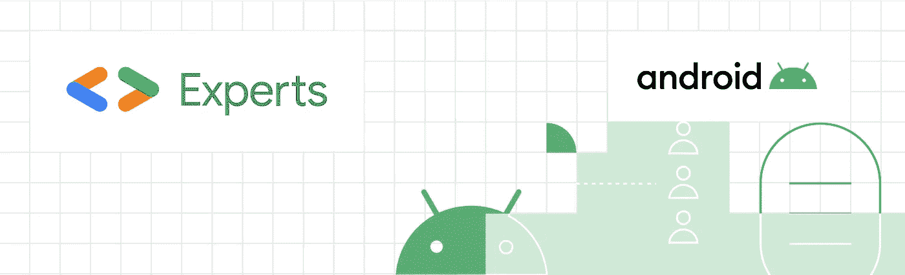
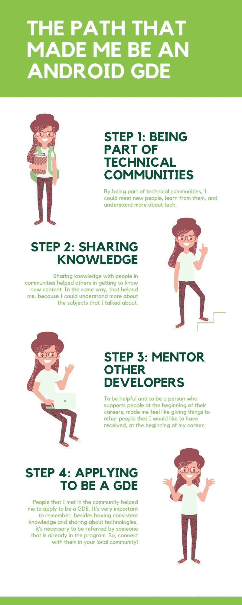

# 我是如何加入谷歌开发者专家计划的

> 原文：<https://medium.com/google-developer-experts/how-i-joined-the-google-developers-experts-program-52428d2c2d06?source=collection_archive---------1----------------------->

自从我在 2020 年 9 月成为 Android Google 开发者专家以来，很多人都在问我是如何做到这一点的。因此，在这篇文章中，我将尝试解释一些步骤，使这成为可能。

如果你不知道什么是谷歌开发者专家计划，这里有一个来自[官方专家计划网页](https://developers.google.com/community/experts)的解释:

> 谷歌开发者专家计划是一个由经验丰富的技术专家、有影响力的人和思想领袖组成的全球网络，他们通过在活动中发言、发布内容来积极支持开发者、公司和技术社区。

# 经验和坚持

首先，在申请成为 GDE 之前，有必要对某个技术领域有一些持续的了解。

我从 2012 年开始做安卓开发者，那时我还在上大学，从开发安卓应用的实习生做起。所以，当我申请专家项目时，我已经在这个领域有了 8 年多的经验。

如果你没有这么多年的经验，不代表你不能申请。但是有必要拥有**一致的知识。**

然后，**坚持**贯穿了我的整个职业生涯。很多时候我认为成为一名 Android 开发人员不适合我，或者这个职业将是暂时的，有一天我肯定会转向另一个职业。我有这种感觉，直到不久前。

也许你也有这样的感受。如果是这样——试着找一个支持你的网络，和那些能给你帮助和建议的人在一起。您可以在工作中、学生团体中或更广泛的开发人员社区中找到它们。

也许你认识的人有时会有这种感觉。帮助这个人。成为他们需要的支持。首先，听听他们的意见，看看他们是否愿意谈，然后试着展示这个人可以选择哪些职业来获得成功。

# 永远挑战自己

我主要在初创公司和咨询公司工作，从基础上构建 Android 项目并支持现有的应用程序，从修复小错误到构建大规模战略。在我的职业生涯中，我总是试图遵循我在旅程开始时从一个朋友那里听到的这句话:**“永远呆在你能学到新东西的地方。”**

所以，试着不断挑战自己，这并不容易，但最终，你会发现这是值得的。

## 应对冒名顶替综合症

我的整个职业生涯都在巴西的公司工作，我知道我是一个拥有很多特权的人，这帮助我走到了现在。但是，在我的职业生涯中，我仍然不得不面对一些问题。

例如，很多时候，我是团队中或大学里(那里大多数人是男性)唯一不同于*【模式】*的人。很多次我试着说话，但没人听我说。很多次我听到类似*“哦，你好像不是 Android 开发者，我发誓你是(任何非技术角色)”的短语。*而且很多时候我在社区里看 android 开发者的时候，看不到很多和“格局”不一样的人。

这些事情让我觉得我不属于一个技术领域，即使人们相信我的潜力。我是第一个对自己产生怀疑的人。

因此，成为一名安卓 GDE 对我来说似乎是一个非常遥远的目标，直到来自**专家项目团队**的人找到我，告诉我更多关于这个惊人机会的事情。

同样改变的是，我改变了我的职业道路，去了那些与我的文化一致、我的工作得到认可的公司工作。从职业和个人角度来说，在 ThoughtWorks Brasil 工作是我人生中一个巨大的积极变化。

嗯，这是一个非常敏感的话题，尤其是因为冒名顶替综合症是我直到今天都需要面对的事情。但是，也许如果我写下这些，更多的人可以理解他们的感受，然后找到解决的方法。😊*(笑脸)*

## 技术社区如何提供帮助

作为技术社区的一员，我学到了很多东西。

首先，我通过参加活动来学习，在这些活动中，我可以观察其他开发人员，了解某些技术，并用不同的想法来激励自己。

此外，我可以**遇到**其他开发人员，他们与我在工作中遇到的不同，有着不同的经历。我真的很感谢见到他们中的一些人，他们帮助我审阅我的文章，给我的演讲提供反馈，甚至帮助我准备申请 GDE 项目(特别感谢[瓦尔米尔·卡瓦略](https://medium.com/u/68f2f1ed5a52?source=post_page-----52428d2c2d06--------------------------------)！).

在技术社区做了一段时间的观察者后，我开始自己分享知识。一开始，这很可怕(*现在仍然有点儿*)，但随着时间的推移，我可以看到，通过分享知识，我在帮助别人学习新的东西，同时我自己也学到了更多(*你知道***方法吗？*)。*

*也是在这些社区中，我遇到了刚刚踏上征程的 Android 开发者。我现在正在指导一些开发人员，尤其是女孩。这样，我努力成为我职业生涯开始时需要的支持。*

# *让我成为机器人 GDE 的道路*

*简而言之，这是让我成为安卓 GDE 的途径:*

**

## ***第一步:成为技术社区的一员***

*作为技术社区的一员，我可以认识新的人，向他们学习，了解更多关于技术的知识。*

## ***第二步:分享知识***

*与社区中的人分享知识有助于其他人学习新事物。同时，它帮助我更好地理解了我所谈论的主题。*

*这里有一件非常重要的事情:*

> *你不需要知道关于一个主题的一切来谈论它，你只需要有足够的知识来分享。*

*请记住，技术社区是巨大的，有些人正在开始他们的旅程，有些人是某些领域的专家，但对其他领域一无所知。不可能成为所有领域的专家。我知道这是老生常谈，但对我来说，这是千真万确的:我研究得越多，就越觉得还有很多我还不知道的东西。*

## ***第三步:指导其他开发人员***

*乐于助人，在人们职业生涯开始时给予他们支持，这让我觉得我想在职业生涯开始时给别人一些我希望收到的东西。*

## ***第四步:申请成为 GDE***

*我在社区里遇到的人帮助我申请成为 GDE。非常重要的是要记住，除了拥有一致的知识和分享技术之外，有必要由已经在计划中的人推荐。因此，**在你当地的社区中与他们建立联系！***

*申请成为 GDE 的过程很简单。首先，你必须填写一些信息，比如你对社区的贡献。然后，这个过程后面是一些面试，如果一切顺利，你就通过了，最后，你就成为了 GDE。*

*如果申请成为 GDE 对你来说还是一个遥远的梦想，试着分析一下上面的步骤。制定一个计划，目标是在未来的某一天申请 GDE 项目，也许是在朋友或导师的帮助下。这个目标会帮助你更加努力，去完成你想要的。*

# *最后的想法和一些建议*

*如果你是一名女性技术专家，继续做你的工作。试着找到一个支持你实现目标的网络，在你需要的时候倾听你，在你需要的时候给你需要的建议。*

*我希望未来我们会有一个在各方面都更加多样化的技术社区，对所有人都公平和认可。为此，不要放弃！即使我们需要面对困难，也是有可能成功的，所以坚持尝试你所相信的，永远！💜*(紫心)**

*我真的希望我能在这篇文章中帮助到别人，如果你有任何问题，请随时联系我！😉*(眨眼脸)**

*如果你想成为一名 GDE，和你当地社区附近的 GDE 或者谷歌负责你所在地区的项目经理讨论你的目标。*

*祝你好运！🍀*(四叶草)**