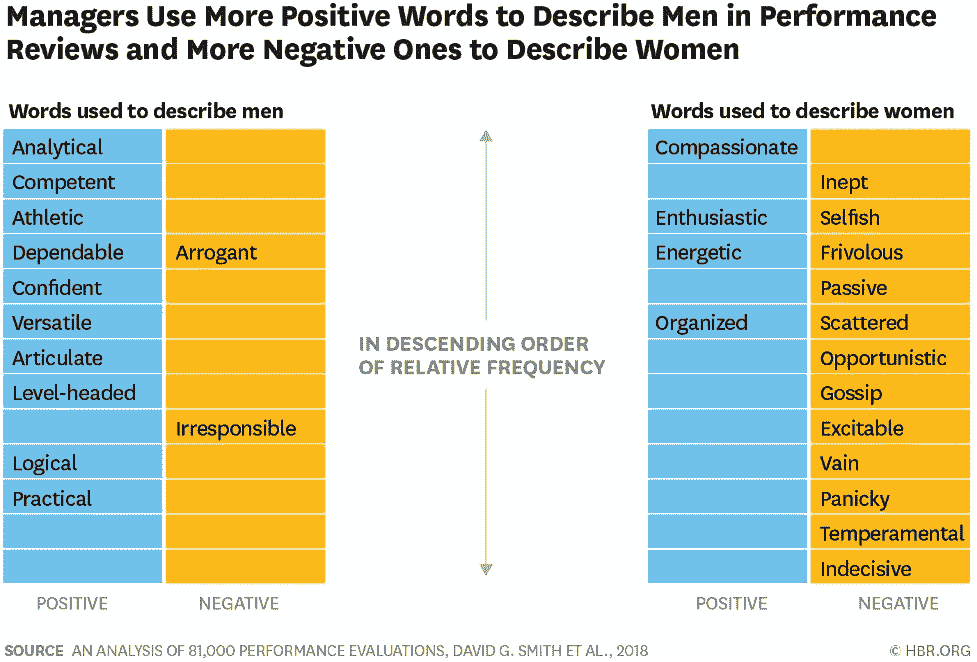

# 我如何学会写客观的绩效评估

> 原文：<https://medium.com/walmartglobaltech/how-i-learned-to-write-objective-performance-reviews-18689f9f8d22?source=collection_archive---------0----------------------->

(Image created and owned by Walmart Global Tech)

直到职业生涯 20 年后，我才了解到绩效评估中无意识的性别偏见。直到我参加了一个以此为主题的会议，我才真正考虑过这个问题。

在一次小组讨论中，我听发言人分享了描述职场女性的常用词的数据，当我从自己的绩效评估中认出许多相同的词时，我突然灵光一现。*太苛刻*、*太直白*、*需要提高高管风度*。当演讲者问观众中有谁听过绩效评估中的这些短语时，几乎所有在场的女性都举起了手。事实上，多项研究已经证明了这个概念。这里有一张来自[的图表，特别是来自*哈佛商业评论*](https://hbr.org/2018/05/the-different-words-we-use-to-describe-male-and-female-leaders) 。

Photo credit: [Harvard Business Review](https://hbr.org/2018/05/the-different-words-we-use-to-describe-male-and-female-leaders)

另一项《哈佛商业评论》的研究显示，女性收到批评性主观反馈的可能性是积极反馈或批评性客观反馈的 1.4 倍。问题是，如果你给男人客观的反馈，给女人主观的反馈，男人会继续进步，而女人更可能停滞不前。

即使男性和女性拥有相同的资格，研究表明，男性在绩效评估中的排名也高于女性。如果由于无意识的偏见，女性的评价一直低于男性，她们的加薪就会更低，随着时间的推移，她们的职业生涯就会受到阻碍，从而使女性更难晋升到领导岗位。

在无意识偏见的世界里，一个经常被谈论的东西是双重束缚的概念。如果女人很温柔，说话轻声细语，她们就不会被重视。但是如果女性坚定而热情，那么她们会被认为是粗鲁的。本质上，如果你做，你会被诅咒，如果你不做，你也会被诅咒。

回想我的评论，我被告知我太苛刻，或者需要改善“高管形象”，我没有得到如何根据反馈采取行动的明确指导，但我尽力了。我试图通过轻声说话来减少我的严厉，并积极地缓和我的激情。我的大多数决定都是由数据驱动的，所以很难主观判断。我不得不思考我是如何工作的，我说了什么，当我说的时候我的表情是什么样的(甚至当我不说话的时候)。这不公平，也不正确，但我只知道我必须做出改变，否则就会在事业上落后。事情不应该是这样的。我希望我们，作为一个社会，能够远离这些，因为我希望人们能够来工作，做他们自己。毕竟，那是我们工作最好的时候。

> 作为经理，我们需要了解影响他人职业生涯的巨大压力。

那么，我们如何才能让工作场所成为一个更加公平和包容的空间，让人们可以做自己呢？我认为应该从教育人们关于无意识偏见开始。

## 无意识偏见到底是什么？

我们都有无意识的偏见。这是人类数百年来发展起来的一种生物机制，可以对威胁做出快速反应。这是我们需要的一种机制，但有时当我们基于偏见做出无意识的假设和决定时，它会把我们引入歧途。值得注意的是，偏见本身没有好坏之分*——*有问题的是我们如何对待这种偏见。

## **提高对无意识偏见的认识**

在我了解到无意识的性别偏见如何在绩效评估中表现出来后，我开始和人们谈论这个问题。我会问他们，“你们会说吉姆(我认为他比我严厉得多)严厉吗？或者你会说他充满激情？”人们会说，“哦，是的，我想我会说他充满激情。”(请记住，这需要人们对对话保持开放的态度；我不会和每个人都谈这个话题。)

我们都必须寻找那些愿意倾听和谈论无意识偏见如何影响商界女性的倡导者和赞助商。最终，公司需要训练管理者认识和面对他们自己无意识的偏见。如果经理们解决了自己的偏见，他们可以采取措施使绩效评估更加客观。

## **我如何改变写绩效评估的方式**

> **1。关注结果和行为**
> 
> 在写评论之前，确定每个人产生的四个积极结果和两个消极结果。思考贵公司关心的行为(例如，领导行为、团队行为等。)以及对每种行为重要的标准。
> 
> 对照这些行为观察每个人，找出他们体现这些行为的具体例子，以及他们可以改进的例子。然后，根据这些结果和行为进行评估。
> 
> **2。提供可行的反馈**
> 
> 对于他们可以改进的每个领域，给出他们如何改进的指导。观察他们的挑战，找出导致该行为的触发因素，并确定当触发因素发生时他们可以采取哪些不同的措施。
> 
> 举个例子，我是那种一坐下开会就只想进入正题的人。我不必谈论天气或运动。不是每个人都是那样的，所以我有一个导师，他告诉我在开始任何会议之前，看一下手表，等五分钟。我第一次做的时候，那是极其残酷的五分钟，前几次我甚至做不到。但过了一段时间，它训练我与人交流，观察他们的舒适度——即使我现在只等两分钟，而不是五分钟。
> 
> **3。留意有偏见的语言**
> 
> 写完评论后，回去通读一遍。特别注意你使用的描述，尤其是对你的女性同事的描述(使用上面的图表来检查你的评论中常见的有偏见的语言)。如果你发现这些词用得太多，考虑在你的评估中使用更客观的标准。最后，检查你是否将他们的表现归因于性格或运气(而不是他们的行为和成就)。

为了对抗无意识的偏见，管理者需要有意识地提出一个计划，根据客观标准来评估他们的同事。否则，我们会默认什么是自然的，这是无意识偏见蔓延的地方。这并不是说经理们打算做坏事，而是我们需要有目的地打算做正确的事情。