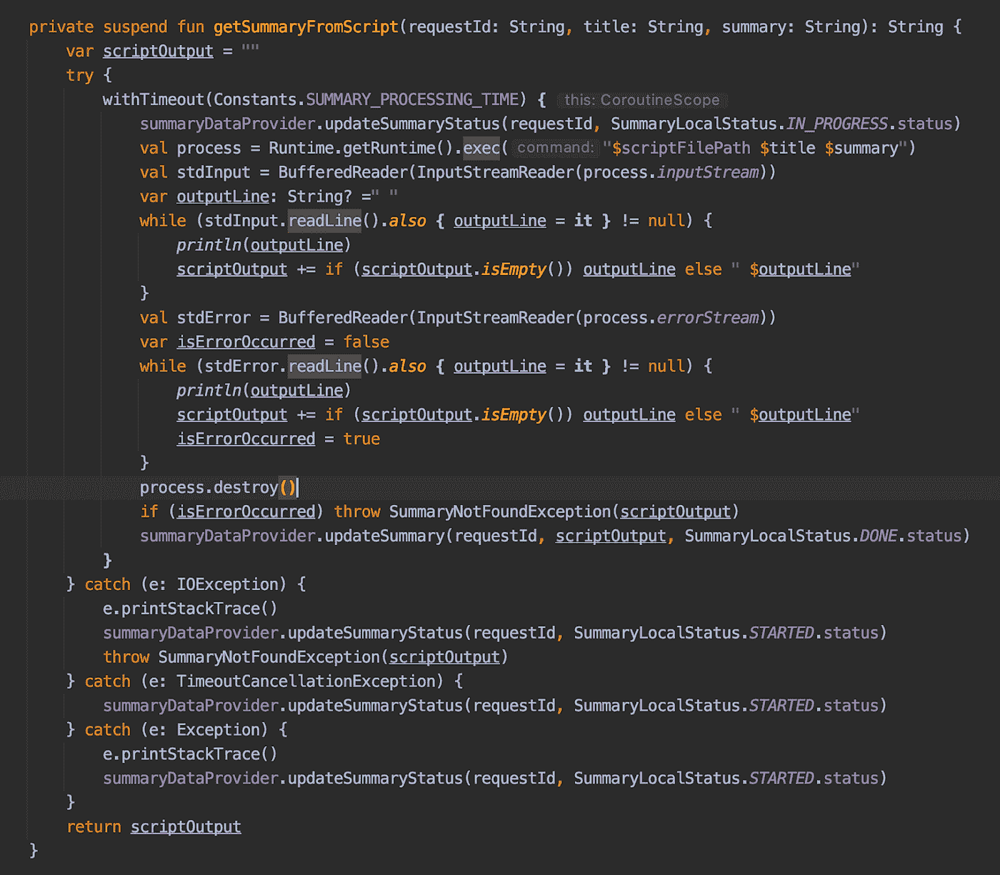
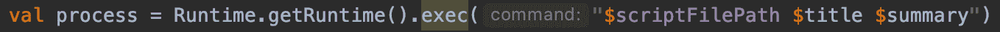
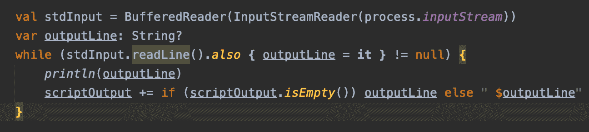
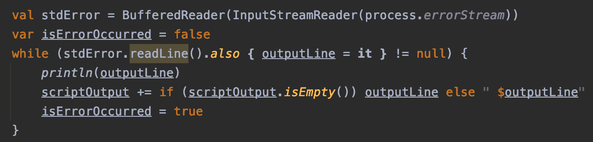

# 我如何让 Python 与 Kotlin 互操作

> 原文：<https://medium.com/globant/how-i-made-python-interoperate-with-kotlin-a11358e48da?source=collection_archive---------2----------------------->

我正在使用 POC(概念验证),我们使用 Ktor (Kotlin 框架)作为后端 DSL。在那个项目中，我们从大量文本中提取摘要。我们发现用 Kotlin 编写机器学习代码很有挑战性。与 Python、R 等相比，Kotlin 是年轻的。

我们选择的任何技术都需要:

*   拥有强大的库支持，使我们能够专注于业务问题
*   平台独立性
*   良好的开发效率
*   大规模可靠
*   经得起未来考验，能够支持我们的业务增长

我们带着这些需求比较了各种语言。我们制作了下面的图表来帮助我们比较和对比每个选项的优势和劣势。

## **语言对比**

## **巨蟒**:

> 优点:

*   简洁明了
*   一个伟大的图书馆生态系统
*   灵活性
*   平台独立性
*   社区支持

> 缺点:

*   低速
*   运行时错误
*   不容易测试

## r:

> 优点:

*   开放源码
*   用于数据争论
*   用于质量绘图和制图
*   独立于平台
*   变得受欢迎

> 缺点:

*   弱起源
*   数据处理
*   基本安全
*   低速

## 科特林:

> 优点:

*   继承了 Java 生态系统。
*   零安全
*   快速且可扩展
*   具有用于并发的本机原语

> 缺点:

*   对机器学习的支持有限
*   社区支持有限

我们同意使用 Python 进行机器学习。后端是用 Kotlin 语言开发的，文本摘要是用 Python 完成的。我们需要在 Kotlin 和 Python 之间进行互操作。这些是 Kotlin-Python 互操作性的一些选项。

## 互操作选项

## Jython:

> 优点:

*   互动实验(Kotlin/Java & Python)
*   快速应用开发
*   与 Python 相比，性能更好

> 缺点:

*   并非所有的库都支持 Jython
*   需要额外的设置来运行程序

## 与 Kotlin 服务器交互的独立 Python 服务器:

> 优点:

*   灵活性
*   关注点分离

> 缺点:

*   潜伏
*   额外网络呼叫

这两个选项都不符合要求，所以我们决定使用 Python 脚本而不是 Python 项目。Python 脚本将在 Kotlin 服务器可用的同一台机器上运行。

## 环境设置

Python 脚本需要不同的库来执行。所以我们需要为它设置一些环境。对于设置，请遵循以下步骤:

1.  使用命令“Python-version”检查 Python 是否安装在您的系统上。如果没有安装 Python，请安装。
2.  使用“pip —版本”命令检查 pip 是否安装在您的系统上。如果没有安装 pip，请安装它。

*   使用“Python3 get-pip.py”命令安装 pip。
*   将 pip 更新至最新版本“pip3 安装—升级 pip”。

3.使用 pip 将所需的库安装到 Python 脚本中，如(Numpy 和 NLTK)。

4.运行 Python 脚本。关于我们如何构建 Python 脚本的更多信息，请参考这篇[文章](/@miteshdewda783/cdbe4b27ee6)。

在本地机器上运行 Python 脚本需要上述设置。所以另一个挑战是从 Kotlin 代码运行 Python 脚本并获得输出。

## 最终互操作

这是一段我们用来从 Kotlin 代码运行 Python 脚本的代码。

这段代码负责执行脚本并从中获取输出。让我们一步一步地理解代码:

1.  **创建一个进程来运行脚本:**

创建一个将摘要脚本文件路径、摘要文本和摘要标题作为输入参数的流程。该进程负责在终端上执行命令并生成输出。

**2。读取输出:**

我们正在创建 BufferReader，用于从终端逐行读取输出。

**3。读取错误日志:**

如果在运行脚本或生成输出时出错，那么我们需要读取脚本或流程生成的错误日志。使用 BufferReader 读取打印在终端上的错误日志。

**4。销毁进程:**读完脚本的输出，我们需要终止进程。

## 摘要

使用上述步骤，我们能够执行 Python 脚本、处理错误并将其输出作为响应提供给我们的客户端。希望它能帮助那些正在寻找 Kotlin-Python 互操作性的好解决方案的人。要更多地了解这一部分如何融入我们的大项目，请参考以下文章:

[**UI 和整体架构**](/@mahesh.jadkar/cd1b9deb5771)

[**摘录摘要**](/@miteshdewda783/cdbe4b27ee6)

[**抽象概括**](/@miteshdewda783/bccb4bf5851c)

特别感谢 [**穆昆德·夏尔马**](https://www.linkedin.com/in/mukund-sharma/)[**马赫什·贾德卡尔**](https://in.linkedin.com/in/mahesh-jadkar-456b055b) 和 [**米特什·杜达**](https://www.linkedin.com/in/miteshdewda/) 构思和编辑本文。