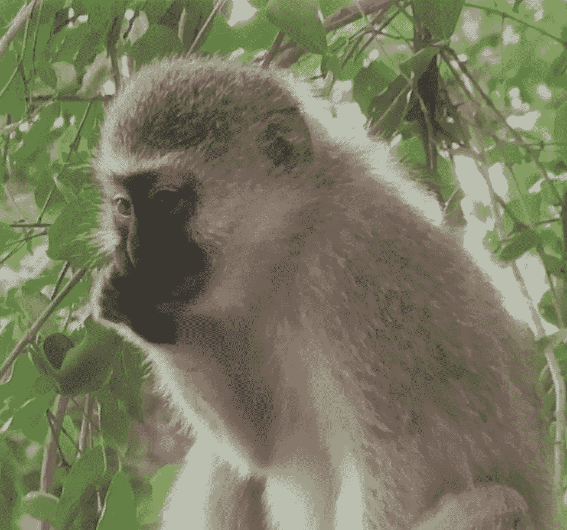
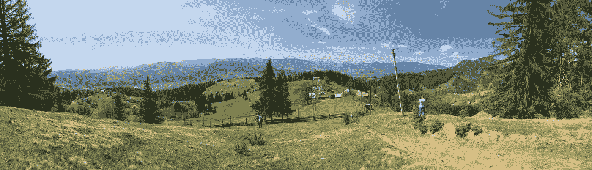

# 我如何管理我的项目

> 原文：<https://medium.com/quick-code/how-i-manage-my-projects-c17c78c796c4?source=collection_archive---------1----------------------->

Image Credit: My friend Betty, buybycountry.com

2013 年是我第一次使用“任务跟踪器”。在那之前，我的团队领导使用的是 ***螳螂*** (bug 追踪器)。
客户通过电子邮件向我发送错误/功能请求。有时候他们发一个文档，附上截图，很牛逼。这就是为什么我学会了如何管理自己的工作。

在我之前的公司，我们开始使用 Trello 板。

1 块板= 1 个项目。规则、风格、看板——我们从来没有过。

我只是存储了对我有用的数据。
然后我们用了 **Redmine** 。我们从 **HostedReadmine** 开始(因为它是免费在线的)——但是他们缺少一个截图上传器。
所以我们安装了本地版本。它只在办公室有效——而且并不酷。
几个月后，它崩溃了，让我们的工作瘫痪了几个星期(我的浏览器中有很多打开的标签，所以我创建了截图并从头开始复制)

我们开始使用 JIRA。我爱 JIRA。我看到了经验丰富的项目经理如何优雅地使用它，使用它的软件开发是一种企业标准。
这很酷——当项目经理存在于团队中，并且他有“直手”时。但是不用花时间准备工作——使用像 JIRA 这样的工具已经过时了。就像用 M16 打鸟一样。
你可以用石头代替。

我还用了***合流****——她非常适合公司内部文档。你可以在里面和客户交谈——讨论进度、财务等。*

*最初，JIRA 没有一个很棒的 git 和 google docs 集成。它甚至不便宜。
和所有功能，如 **Hipchat** 集成(Skype/Slack 的替代方案)——都需要额外的费用。当我们的钱用完时，我开始寻找免费的替代品。我从 JIRA 做了一个出口，但是如何使用它呢？如果我没有使用 *Atlassian* 产品，我该怎么办？
一无所有；)它只是消耗了我硬盘上的空间。我选择了****Asana***因为我不想继续和 Trello 在一起。体式很简单，我理解它的功能。但是过了一段时间，我放弃了。我不知道为什么…**

**现在我每天都使用 **Slack** 和 **Github** ，并且每次都在单独的标签页中打开 Asana 我不想打开很多其他标签页。我对 chrome 标签上瘾…**

**我想创建一个 Slack bot 来帮助我管理我的 GitHub 库。
可以看[【此处】](https://chatbotslife.com/earwig-bot-basic-functionality-list-4ab4bfde2555) …**

**如果你在 GitHub 上打开[我的项目](https://github.com/GroceriStar)——你会看到一片混乱。**

**我意识到这些任务只是 ***OK*** 。现在是改变的时候了。所以我正致力于创建系统的项目计划。**

**当我决定用实习生建立一个团队时——我更新了*自述文件*，创建了几个简单任务的*未来版本*，等等。
为了简化事情。详情[【此处】](/groceristar/groceristar-roadmap-intro-part-1-b2cabc59f789)可以阅读**

**如果你有一个团队——花时间教你的团队成员如何使用 GitHub，如何使用标志、标签、交叉链接等。**

**我将任务绑定在一起=我创建一个主任务，并将其他子任务分配给该主任务。
我们也有里程碑和发布。你也可以使用 **GitHub 项目**进行同样的操作。**

**和 IDE 一样，我用****Atom***因为它有很好的插件，是 Github 团队打造的。当我懒得通过 CLI 提交时，我会使用 GitHub 桌面。***

**但是多年来我一直使用 Sublime Text 作为代码编辑器。**

**我在用 ***Astro*** ，以便最大限度地减少打开邮件所需的时间。现在，我的邮箱看起来像天堂——美丽的&简单。
我在**Google Docs**+**Dropbox**存储不同的文档，但是我把很多文档转移到 GitHub，因为它很方便。我不再对我的文件疑神疑鬼，因为我没有被视为竞争对手…..*还没有。也许将来有人会创造一个工具，允许在 GitHub 中存储密码。这将需要密钥生成和一些盐来使其具有吸引力。***

****互动。发起**和**让**参与进来。鼓掌激励！**

****

**Ukrainian Wild West. Copyright: My friend Denis Petrov**