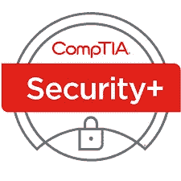
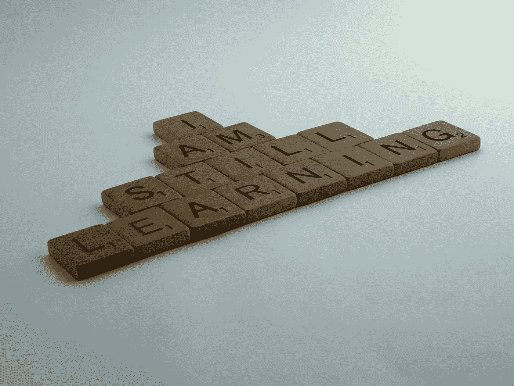

# 我是如何通过 CompTIA Security+的

> 原文：<https://medium.com/version-1/how-i-passed-comptia-security-8c1d16aaa415?source=collection_archive---------0----------------------->

我选择了安全作为我的 Q1 2022 CPD KPI 之一，并开始制定考试计划，遵循安全相关的学习路径。我不是专门的安全人员；我管理着一个由 Azure 云顾问和管理员组成的团队。因此，我不会很快成为蓝队或红队的成员，但就像所有事情一样，仅仅说安全完全取决于安全团队是不够的，每个人都需要安全焦点。现在比以往任何时候都多。

我选择了三个与我日常工作相关的考试

> CompTIA 安全+(SY0–601)
> 
> 微软安全运营分析师助理(SC-200)
> 
> Microsoft 身份和访问管理员(SC-300)

像所有的考试一样，他们现在可以在网上在家或从考试中心参加考试。我是守旧派，所以这是一个皮尔逊 Vue 考试中心。

CompTIA 考试是一个入门级的安全基础考试，即使你有很长的 IT 工作经验，也是一个很好的起点。很多时候，概念和术语会随着时间的推移而变化，尽管我们认为自己懂得很多，但进行最新的认证有助于提高我们的技能，纠正我们多年来积累的任何误解。同样的资格考试有两种版本。我选择了两种考试中较新的一种——考试代码 SY0–601。我发现了一个比较两种考试的[差异的好博客，这有助于我的选择。](https://www.testpreptraining.com/blog/comptia-security-501-vs-601-what-is-the-difference/)

该考试在 [Comp TIA 主页](https://www.comptia.org/certifications/security)上有描述，涵盖 5 个主要安全领域；

> 攻击、威胁和漏洞
> 
> 建筑和设计
> 
> 履行
> 
> 运营和事故响应
> 
> 治理、风险和合规

我订阅了两个学习平台，O'Reilly Media 和 PluralSight。两人都有优秀的 CompTIA 考试培训课程，在我准备考试的两天时间里，O'Reilly 有一个现场培训晚会。我发现莎莉·格林的视频课程非常棒，包含在我的奥赖利订阅中。这是我训练的基础。

**有什么难的？**

考试面广。这使得覆盖所有领域成为一项挑战。这也有点“以美国为中心”。有几个关于标准和政策的问题只适用于美国，例如美国军方使用的准入卡的类型！如果你在美国，这些对你来说可能更自然——我不是，所以这些东西不是我以前遇到过的。

**有什么容易的？**

总的来说，这并不是一个很难的考试，如果你在这方面工作或者已经把自己投入到材料中。许多材料是概念性的，因此是直观的，所以把重点放在非直观的事实上；安全标准、通用端口、攻击类型。

**题型**

大多数问题都很简单，是选择题。我没有发现任何特别棘手或者我觉得不公平的问题。

考试从几个情景问题开始。我只看到了一个场景。我相信这可能因考试而异。该问题提出了一个由组织的安全部门规定的安全策略，然后提出了一些实现该策略的建议措施。像许多考试一样，这个场景是一个独立的部分，一旦完成，你就不能再返回。

考试是 90 分钟，我需要所有的时间——这是一个相当完整的考试，平均有 90 个问题，所以一分钟一个问题是一个具有挑战性的速度！

**CompTIA 的 CPD 哲学。**

CompTIA 的认证不会过期，只要你在通过考试后的 3 年内完成 150 个 CE 学分。一旦你坚持这样做，你将保持认证。需要注意的是，继续教育单位(CEUs)每年的费用为 50 美元，因此 3 年后将认证延期总共需要 150 美元。我们每个人都必须评估它的价值，但有一点很好；如果您参加其他 CompTIA 考试，则“CE 费用只需在持有的最高认证级别支付”，(A+、Network+、Security+、Linux+、Cloud+、PenTest+、CySA+或 CASP+) CE 费用适用于所有 CompTIA 认证的更新。没有必要为每个认证单独付费。

**花了多长时间？**

我喜欢花 1 个月时间参加考试。我预定了 4 周以后的考试，然后利用我能得到的所有资料开始学习计划。你们每个人都有自己的学习方法和不同的学习时间。只要确保你已经涵盖了所有的考试目标，并达到这些概念在你大脑中成为第二天性的程度。O'Reilly 订阅提供了一个模拟测试，这让我对考试充满了信心，但它没有考试那么深入，所以要小心。

值得吗？

如果值得的话，你可以在这里阅读 CompTIA 的观点。如果你想证明自己，那么这绝对是值得的，并且有助于获得一份新工作或晋升。对我来说，这次考试没有涵盖任何我不应该知道的内容，但它仍然是我参加下一次更具体的产品考试的一个很好的敲门砖。但是，我对付费的继续教育元素仍然没有看法。

**注意事项**

提到的所有产品、人员或公司都是我在培训过程中使用或参考的。除了说我个人觉得它们很有帮助之外，这些都不是认可。我们都有自己的训练风格，应该选择适合自己学习的材料。最后，除了作为客户之外，我与上述任何产品都没有任何关系，也没有索要或接受任何赠品或诱惑。快乐学习！

**关于作者:**

Simon Grant 是版本 1 的服务交付经理。