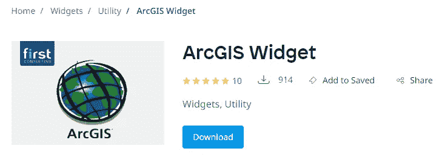
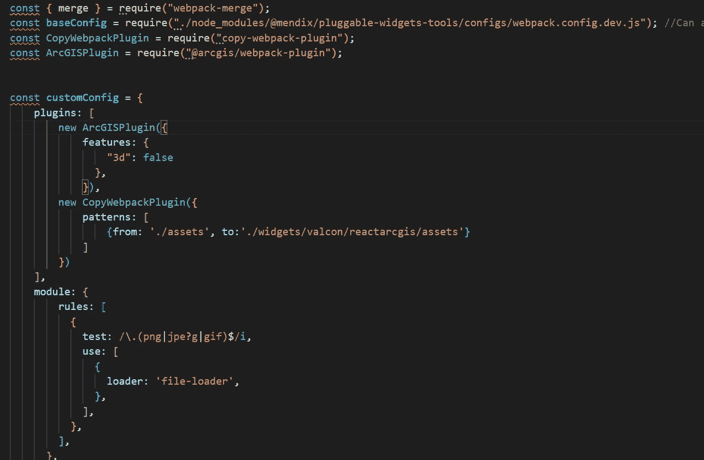
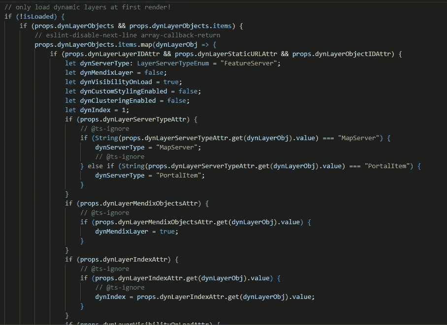
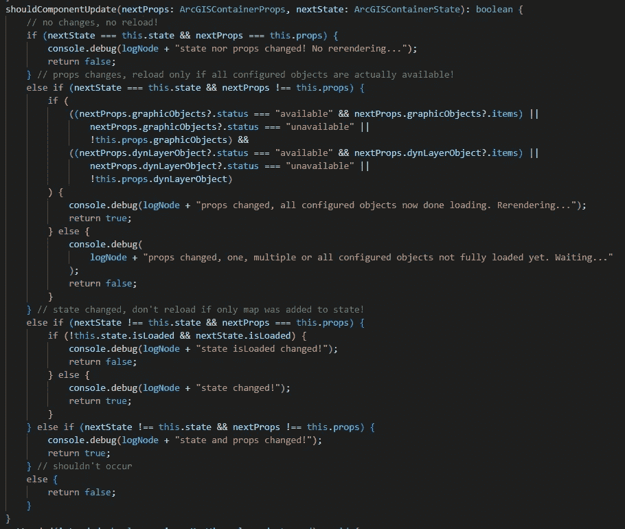
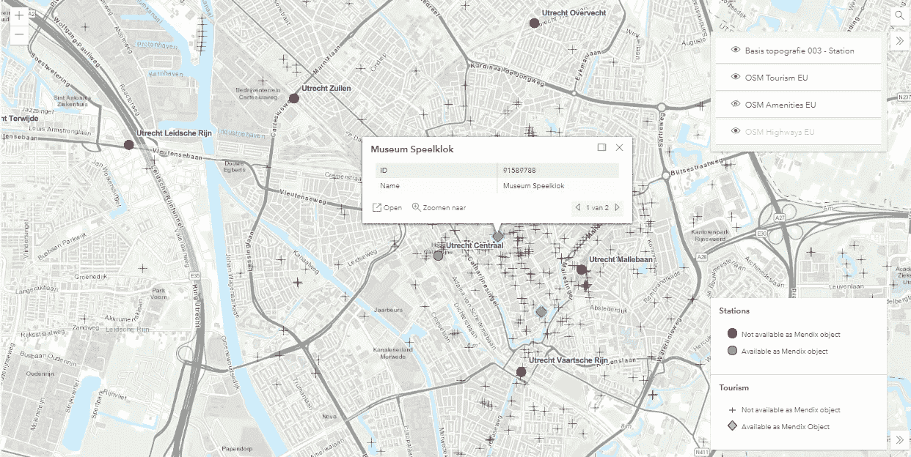

# 我如何在 React TypeScript 中重写 Mendix ArcGIS 微件

> 原文：<https://medium.com/mendix/how-i-rewrote-the-mendix-arcgis-widget-in-react-typescript-4cf2158c2267?source=collection_archive---------4----------------------->

How I rewrote the Mendix ArcGIS widget in React TypeScript

# **Mendix 中的地理可视化**

在过去的 10 年里，我在 Valcon 工作时已经开发了许多应用程序。对于我们的许多客户来说，他们业务的地理方面是日常工作的重要组成部分。例如，基础设施公司拥有资产，建筑公司在多个地方开展项目，公用事业公司使用资源。因此，我们开展的大多数 Mendix 项目都有地理成分。在这类项目中，将日常业务与地理可视化联系起来是很重要的。

将日常业务连接到地理可视化的第一步是决定使用哪个平台。两个常用的可视化工具是 Google(地图)和 Esri (ArcGIS)。在[我之前的博客](/p/cfc6f9a17f66)中，我分享了我如何构建一个通用但完全可定制的谷歌地图小工具的心得。今天，我想分享我在构建另一个出色的免费 ArcGIS 微件方面的心得。

## Esri ArcGIS 与谷歌地图

对于更高级的 GIS 需求，ArcGIS 是一个开箱即用功能更丰富的平台。ArcGIS 旨在通过扩展各种现成的 GIS 功能来支持日常工作中的业务运营。构建(Mendix)小部件时，需要一个 API 来集成两个平台。

*   就 API 而言，ArcGIS API 是一个非常完整的 API，提供了大量功能来满足各种地理需求。
*   需要在图层中对位置进行分组，需要图层的图例？需要用户切换层中的可见性吗？所有这些东西都是现成的，只需要几行代码，而在谷歌地图中，这些东西需要自己构建。
*   其次，ArcGIS 自带地理空间数据库，因此无需自己存储位置。
*   但是有一个缺点，目前还没有完整的基于 React 的 ArcGIS API。另一方面，谷歌地图有多个。所以，我接受了挑战！a

## **升级 ArcGIS widget**

一段时间以来，Mendix 一直在将其完整的前端从 Dojo 转移到 React。大约五年前，我使用 Dojo 构建了一个 [ArcGIS widget](https://marketplace.mendix.com/link/component/106094) ，它已经被许多客户成功使用，下载量接近 1000 次:

该微件是使用旧的 Mendix 客户端 API 和现已过时的 ArcGIS JavaScript API v3 构建的。升级这个小工具将是一个巨大的挑战。我不得不基于 React 和 TypeScript、最新的 ArcGIS API 和 Mendix 可插拔小部件 API 完全重写 ArcGIS 小部件。这一充满挑战的过程可以用以下六点来总结:

## *1。没有完全基于 React 的版本*

第一个挑战是没有完整的基于 React 的 ArcGIS API 版本。对于谷歌地图，有多个。我猜主要原因是 ArcGIS API 非常广泛，因此创建和维护基于 React 的版本是一项巨大的工作。最后，我使用 **useEffect** 钩子和一些 **React Refs** 编写了一个带有加载事件的完整小部件，以确保我可以在 React 认为必要的每个 rerender 过程中始终访问数据的正确版本。

## *2。ArcGIS API 非常庞大！*

由于 ArcGIS JavaScript API 具有如此广泛的功能，所有特定的功能都很好地构建在单独的 JavaScript 文件中。这些文件也需要用小部件加载。在当前版本中，**需要加载近 25 MB 的 JavaScript/CSS 文件**才能使 ArcGIS API 正常运行。为此，最重要的部分是将下面的代码添加到文件 *webpack.config.dev.js* 中。

通过检查 *package.json* 文件，一定要检查哪些(开发)库需要和 NPM 一起安装。

## *3。主 ArcGIS 对象需要一个 Mendix 对应物*

通过可插拔微件 API，新的 ArcGIS 微件现在可以通过所有数据源(如 nanoflows)提供。因此，Mendix 对象将在小部件中可用。Mendix 对象(点、图层)需要通过 ArcGIS API 转换为 ArcGIS 对象才能显示在地图上。小部件需要跟踪所有对象的两个数组:一个在 Mendix 对象(数据源)中，另一个在 ArcGIS JS API 的 typings 中。为此，我使用 **React Refs** 来确保在每次重新渲染 React 认为必要时，我总是拥有对象的正确版本。

## *4。要知道什么要创建一次，什么要更新*

我向 ArcGISContainer 组件的状态添加了一个 isLoaded boolean，它也作为一个属性与其父 ReactArcGIS 组件共享。通过这种方式，ArcGISContainer 和 ReactArcGIS 组件始终“知道”微件是否已加载。只加载一次的是图层，包括静态配置的图层和来自数据源的动态图层:

注意 *@ts-ignore* :这不是最佳实践，但在这里是需要的，因为 get 函数在 TypeScript 中不被识别，但确实存在。

## 5.仅当数据源发生变化时才重新呈现

对于 Mendix 中数据源的状态，React 有其重新呈现的机制。数据源可以有多种状态，对于每个状态变化(即“正在加载”>“可用”)，都会触发一个重新呈现器。有时，这会导致不必要的重新渲染，从而妨碍贴图的流畅运行。因此，我实现了一个布尔函数，用于检查主数据源、图层和 GIS 对象是否处于“可用”状态。只有这样，小工具才会自己重新呈现

## *6。自定义弹出窗口:使用 ArcGIS 和 Mendix 'owned '属性*

该微件的一个重要特性是它可以连接 Mendix 和 ArcGIS，并访问 ArcGIS 属性和 Mendix 拥有的属性。这样，弹出的信息窗口可以访问和显示两个平台的数据。为此，我创建了我的*自定义弹出框*组件和*弹出框* TSX 文件。由于 Pluggable widgets API 的缺点，仍然需要加载客户机 API 来访问以前没有通过数据源加载的对象的所有属性。

# 结果呢

结果是一个[面向未来的 ArcGIS 微件](https://marketplace.mendix.com/link/component/120041),具有更多功能，如

*   动态加载层
*   配置也存在于 Mendix 中的多层对象
*   启用每个图层的标记聚类
*   能够使用 ArcGIS 和 Mendix 中拥有的字段完全配置信息窗口内容
*   向地图添加三个子微件(位置搜索、切换图层可见性、图例)以增强用户交互的选项:

## 演示项目

为每个场景(监听网格、所有对象、标记聚类等)挑选出所需的配置可能很棘手。).因此，我创建了一个[全功能演示项目](https://marketplace.mendix.com/link/component/119997)，它将解释屏幕上每个场景的设置。

# **结论**

重新编写 ArcGIS 微件以响应 TypeScript 被证明是一个真正的挑战，但结果甚至比其前身更好，无论是在功能还是用户界面方面。如有疑问，请使用 Mendix 论坛、联系我或亲自研究 GitHub 上的[公开代码。](https://github.com/ivosturm/ArcGIS-React)

## 阅读更多

 [## 使用 React 在 Mendix 中构建小部件—第 1 部分—颜色计数器

### Mendix 是一个低代码平台，让制造商更快地交付价值，轻松地构建应用程序。和门迪克斯一起…

medium.com](/mendix/build-widgets-in-mendix-with-react-part-1-colour-counter-f1e400c3cdff)  [## widgets-resources/packages/pluggableWidgets at master mendix/widgets-resources

### Mendix 平台支持的小部件的 Mono 存储库-小部件-资源/包/可插拔的 widget at master…

github.com](https://github.com/mendix/widgets-resources/tree/master/packages/pluggableWidgets)  [## 构建可插入的 Web 小部件:第 1 部分

### 这篇操作指南将教你创建一个可插入的 web 小部件。

docs.mendix.com](https://docs.mendix.com/howto/extensibility/create-a-pluggable-widget-one/)  [## 构建可插入的 Web 小部件:第 2 部分(高级)

### 这个操作指南将教你如何给你的文本框输入部件添加高级功能。

docs.mendix.com](https://docs.mendix.com/howto/extensibility/create-a-pluggable-widget-two/)  [## 证明文件

### 使用 ArcGIS 产品的技术文档、教程、课程和其他资源的门户。

doc.arcgis.com](https://doc.arcgis.com/en/) 

*来自发布者-*

*如果你喜欢这篇文章，你可以在我们的* [*中页*](https://medium.com/mendix) *找到更多喜欢的。对于精彩的视频和直播会话，您可以前往*[*MxLive*](https://www.mendix.com/live/)*或我们的社区*[*Youtube PAG*](https://www.youtube.com/c/MendixCommunity/community)*e .*

*希望入门的创客，可以注册一个* [*免费账号*](https://signup.mendix.com/link/signup/?source=direct) *，通过我们的* [*学苑*](https://academy.mendix.com/link/home) *获得即时学习。*

有兴趣加入我们的社区吗？加入我们的 [*松弛社区频道*](https://join.slack.com/t/mendixcommunity/shared_invite/zt-hwhwkcxu-~59ywyjqHlUHXmrw5heqpQ) *。*