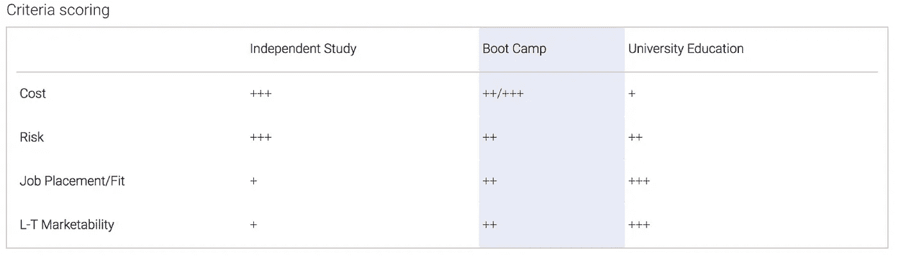
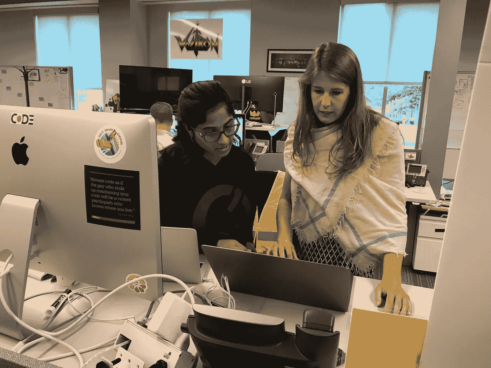

# 当我成为一名软件工程师时，我是如何权衡我的教育选择的

> 原文：<https://medium.com/capital-one-tech/how-i-weighed-various-training-paths-to-become-a-software-engineer-boot-camps-9bcd03cd55e?source=collection_archive---------0----------------------->

## 我过去常常为人们推销令人愉快的产品和体验，现在我创造了它们！

*本帖原载于*[*lemon water . io*](https://lemonwater.io/)*。*

在将职业领域转向软件工程之前，我是 Capital One 的一名出色的产品营销人员和产品经理。我在英国工作，为我们的技术组织营销职业机会，研究当前和潜在的候选人。我变得非常熟悉在这些领域成为强有力的候选人意味着什么，以及日常项目和期望是什么样的。而且，在写我们的招聘资料时，我开始质疑为什么我没有在这些简历中填写……嗯，是我。

在大学里(我的英国读者称之为 uni ),我攻读的是商业学位，但我的选修课显示出对软件工程的浓厚兴趣；直到很久以后我才意识到。我用我的额外学分选择了包装科学、计算机历史和网页设计课程，而我的许多同龄人选择了潜水或插花。我对图形设计和数学有热情，这种热情我已经用在了市场营销上，但是为什么不能用在软件工程上呢？

所以我开始收听和关注我正在参加的聚会的不同方面(初衷是吸引强有力的候选人)。我被聊天机器人和无服务器技术的内容迷住了。我开始在网上学习一些免费课程，并开发应用程序来探索这是否像在大学里一样有趣。当它超出我的预期，我开始拒绝社交活动，留在家里测试我的 Alexa 技能时，我开始研究如何才能转行。成为一名软件工程师已经成为现实。

# 评估选项

今天，有许多选择来训练成为一名软件工程师。这些选择包括但不限于:独立学习、在职培训、代码学校和传统的大学教育。

我彻底评估了我的所有选择，为我选择了正确的行动路线，无论是短期还是长期结果。如果你像我一样已经决定进入软件工程，或者只是在考虑改变时收集信息，我希望这有助于你了解可用选项的广度，以便找到最适合你的一个。

为了简单起见，我将成为软件工程师的途径分为三大类:

*   利用各种在线资源进行独立学习。
*   参加新兵训练营。
*   获得大学学位。

此外，我用来帮助我在三者之间做出决定的标准包括:

**工作安置/适合的可能性—** 我期望的雇主会雇佣有这种经历的我吗？进入这个新领域，有两种文化需要考虑:公司文化和一般技术文化。我会喜欢在这两个地方工作吗？

**风险—** 如果不是我梦想的那样呢？如果这份工作不适合我，我该如何重返之前的工作，甚至是另一份工作？

**L-T 适销性—** 我的个人品牌和我的技能在这个新职位上的适销性。除了我的感受，我还必须考虑我想去哪里工作，以及被录用的可能性有多大。

**成本—** 这里有两项成本需要考虑:

*   教育的货币成本。
*   我在学习期间薪酬的机会成本。

我在计算中也考虑了投资回报。软件工程的报酬很高，而且还在上升，因为对这个人才库的需求远远超过了供给。

我鼓励你利用这个模板来衡量最适合你的标准！在下面的标准矩阵中，“+”代表最不看好的选项，而“++++”代表我所看到的最看好的选项。

现在，我将分享一些影响我个人得分的思考和想法。

# 我决定参加新兵训练营

对于我的个人需求，根据这个标准矩阵，新兵训练营是正确的选择。关于那个选择我脑子里在想什么？

## 新兵训练营——工作安排/适合的可能性

对于初级软件工程师的角色，我确信新兵训练营是一条可雇佣的路线。我查阅了许多我感兴趣的公司的职位描述，其中大部分都提到了“计算机科学学士学位或相关技术领域，或同等的实践经验。”

就适合度而言，技术和营销确实有不同的文化。因为新兵训练营比其他教育项目都要短，它保证了在更短的时间内投入和体验的能力。我在完成新兵训练营并进入软件工程领域后观察到了一些文化差异:

*   在科技领域，交流更加频繁，但交流更加数字化。我发现面对面的互动少了，电脑对电脑的互动多了。Slack 现在已经成为我目前使用最多的沟通渠道。虽然这有时对活泼外向的我来说很难！我已经适应了在工作之外进行口头交流，而不是像我以前的角色那样在工作中进行。
*   在科技领域，工作的时间表更短，工作更容易消化。作为一个新手，我觉得敏捷环境有助于我更快地生产出高质量的代码，因为训练有素的故事彻底地展示了满足验收标准所需的任务。在完成 JIRA 的故事时，检查我的“待办事项”是非常令人满意的。每天的检查也有助于清除一些粘性物质，并迅速为正确的人设置障碍。
*   在技术领域，性别平衡与我来自的营销世界形成了鲜明对比！在我的团队中，五个成员中有三个是女性，但这不一定是常态。
*   这种文化令人惊讶的主观和创造性。因为有如此多的技术、语言、工具和方法来编写特定的逻辑，所以在项目的设计中有很多主观性。

## 新兵训练营风险

一想到要离开我的角色几个月到不到一年，我就害怕。我认为离开的原因是为了追求激情和学习有价值的技能。此外，如果没有成功，我的营销技能仍然是最新的。如果软件工程不成功，这些因素会降低我在以前职位上被录用的风险。这是一个非常主观的标准，可能因人而异。在做决定时，确保投入足够的时间考虑你自己的个人风险因素。

## 新兵训练营 L-T 销售能力

新兵训练营和工作经验非常有价值，但即使对于一个明星工程师来说，一些角色也会有正式的教育要求。在这些情况下，你在这些公司的销售能力会很低。我鼓励你花时间提前研究这个问题，确保你感兴趣的公司有资格参加新兵训练营。记住——你现在可以参加一个新兵训练营，等你准备好升到更高的职位时，再去读一个正式的大学学位。

## 新兵训练营费用

我很幸运，因为我选择的新兵训练营不需要工作间隙(因此也不需要收入),而且自付费用很低。通常，与攻读学位相比，训练营的费用更低，尽管这将因项目而异。除了新兵训练营的成本节约，更快的完成时间表，新兵训练营路线以收入损失的形式节约了机会成本。一些项目仅通过夜校运作，这样你甚至不必在追求额外教育的同时停止赚钱。

# 我的旅程怎么样？

最后，我选择了一个结合了两个月现场课堂培训和六个月在职实习的项目。在课堂培训部分，我学习了编码语言、工具和计算机科学原理，并构建了三个 web 应用程序。这是一个超快的 2 个月，但我熟悉了课程，并学会了如何快速采用新技术。

在课堂培训中，我了解到:

*   语言(Languages)—Java 是我们后端 web 开发的主要语言，而 HTML、CSS、JavaScript、AngularJS 共享前端 web 开发的平台。我们还学习了使用 SQL 访问和操作数据，并尝试了 Python、GO 和 Spring。
*   **工具**——一些我们非常熟悉的工具包括:GitHub、Cucumber、Gherkin、Postman、Chef、Jenkins 和 AWS(S3、EC2 和 Route53)。

实习中学到的东西因职位不同而不同——我的帮助巩固了我对 Python、Java、AWS 和 Jenkins 的知识；以及将 Spark、Splunk、Docker、JMeter 和 Ruby 添加到我的工具集中。

> *我对软件工程这一职业非常满意——非常感谢我不可思议的 Capital One 网络鼓励并帮助我做出转变！*

在新兵训练营结束时，我从一名首席助理产品营销人员和经理变成了一名全栈高级助理软件工程师。在新兵训练营的另一边，我可以看到自己有一天会重返校园，获得另一个学位。但是在我职业生涯的这个阶段，我从工作经历中学到了很多。

## 这篇文章最初出现在我的博客 [lemonwater.io](https://lemonwater.io/) 上。查看更多关于初级软件工程师入门的内容！

*披露声明:这些观点是作者的观点。除非本帖中另有说明，否则 Capital One 不属于所提及的任何公司，也不被其认可。使用或展示的所有商标和其他知识产权都是其各自所有者的所有权。本文为 Capital One 2018。*