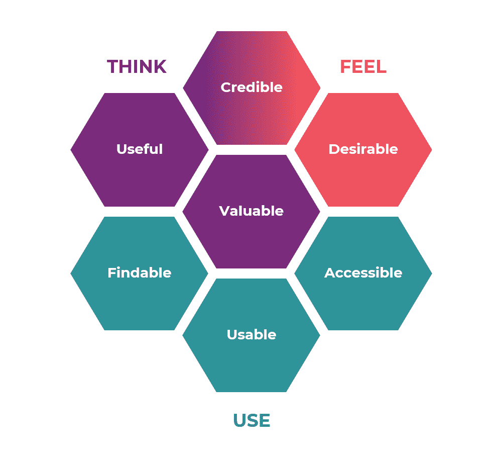
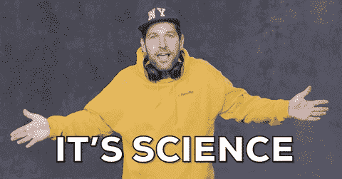
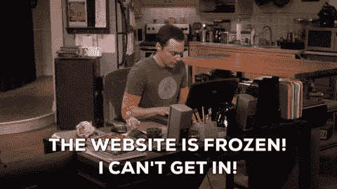

# 如何将 UX 应用到您的数字营销战略中来促进您的业务发展

> 原文：<https://medium.com/globant/how-implementing-ux-to-your-digital-marketing-strategy-can-boost-your-business-deb9be4157f5?source=collection_archive---------2----------------------->

There are a lot of digital marketers who rely on good UX to help guide their audience through all phases of the customer journey.

当讨论网页设计时,“用户体验”( UX)这个术语经常被提起。但是，你有没有想过用户体验如何影响数字营销人员的工作？

当你在处理一份文案时，比如一篇博文、一段视频、甚至一个网站，你有没有想过它会如何引起你的观众的共鸣？

如果设计元素不是决定性的，它们会对你的营销业绩产生什么影响？它们会对整体客户体验产生什么影响？

UX 在数字世界中至关重要，它长期以来一直是一个受欢迎的按需组件。对于我们很多人来说，用户体验可能不在我们的脑海里，但它是创造成功转化的关键。有很多数字营销人员依靠好的 UX 来帮助引导他们的观众走过顾客旅程的所有阶段。

GIF Source: GIPHY

什么是 UX？

用户在与产品、系统或服务交互时的态度、反应和情绪被称为用户体验。这与浏览、阅读、与网站上的单个内容互动以及在线观看广告有关。

‘UX Honeycomb’ Visual representation (Source: Peter Morville)

Peter Morville 为“UX 蜂巢”建模，这是用户体验设计不同方面的可视化表示。Peter 相信这个新的图表将有助于客户教育，因为这个领域有许多超出可用性的元素。蜂窝有助于在积极的用户体验的不同方面之间找到平衡。

> ***“营销是将目标受众吸引到你的网站的原因，但积极的用户体验是留住他们的关键。”***

当你的用户体验的核心是糟糕的时候，当你使用战略和战术来吸引人们进入你的业务时，营销是一种浪费。UX 和数字营销密不可分，缺一不可。

我已经列出了将 UX 融入你的数字营销战略的好处，以及为什么 UX 对营销至关重要。

# **1。愉快的 UX 对客户满意度至关重要**

> **到 2020 年，CX 将取代价格和产品成为关键的品牌差异化因素。**
> 
> **资料来源:Walkerinfo**

提高客户满意度和回头客需要为目标受众创造积极的用户体验。在当今竞争激烈的市场中，这也是让你的产品或服务脱颖而出的最佳方式。一个积极的 UX 培养了你与客户的积极关系，这反过来有助于你建立一个忠诚的客户群。

GIF Source: GIPHY

当用户访问我们的商业网站，UX 需要建立一个无缝和难忘的用户体验。用户体验会影响用户是否会在第一次访问时返回网站或进行购买。

如果你的前端工具和网站因为设计不佳而失败，客户体验会受到负面影响。虽然这只是整体用户体验的一部分，但可用性对客户的正面和负面体验都至关重要。

> **在一个网站上的一次不好的经历，让用户再次访问该网站的可能性降低了 88%。**
> 
> 【Econsultancy.com】来源:T2

我们可以使用用户体验来描绘客户的整个旅程。“吸引”和“转化”是最终的营销目标，UX 帮助美国营销人员识别客户转化的可能障碍，从而为优化的用户体验创建一个明确的漏斗。

# **2。UX 帮助您提高投资回报率**

> **有意识的战略性用户体验有可能将转化率提高 400%。**
> 
> **资料来源:福布斯**

客户之旅甚至在用户成为客户之前就已经开始了。用户会一直看到我们的广告，如果他们觉得广告的内容和视觉效果对他们没有吸引力，他们会倾向于滚动浏览。如果他们发现它是相关的，只有这样他们才有可能访问我们的网站来了解更多。

这就是 UX 发挥作用的时候。一个好的 UX 会无缝地引导用户通过营销漏斗，增加转化率的机会。

> **对网站可信度的判断，75%是基于一个网站的整体审美。**
> 
> **(资料来源:BCS——英国特许信息技术协会)**

GIF Source: GIPHY

页面速度、相关内容、颜色、图像质量和清晰的 CTA 位置不仅是营销的关键因素，也是 UX 促进用户转化的关键因素，无论是从你的网站上购物还是简单地订阅时事通讯。

> **“一个好的营销策略会把用户带到你的网站，一个好的 UX 会引导用户转化。”**

# **3。响应式移动网站对 UX 和营销至关重要**

> 如果一个网站不是手机友好型的，50%的用户会减少使用它，即使他们喜欢这个业务。
> 
> 来源:用谷歌思考

自从智能手机用户急剧增加以来，人们与网站互动的方式发生了巨大变化。建立一个对所有尺寸的设备都有反应的网站既重要又具有挑战性。

GIF Source: GIPHY

谷歌在 2015 年开始优先考虑移动友好型网站，这意味着那些针对移动优化的网站将比那些没有优化的网站排名更高。这就是为什么我们需要优化我们的网站，使之适合移动设备的主要原因之一。

> **当人们在手机上有负面品牌体验时，他们将来购买该品牌产品的可能性比有正面体验时低 60%以上。**
> 
> **来源:用谷歌思考**

为了给消费者提供最好的用户体验，你的内容和付费广告应该针对移动和桌面屏幕进行优化。

# **4。UX 在降低跳出率方面发挥了重要作用**

> **67%的客户声称不愉快的经历是流失的原因。**
> 
> **来源:福布斯**

一个合适的搜索引擎优化会让你在谷歌上排名，但如果网站不符合用户的意图，他们会直接退出，甚至不会进一步探索。这意味着，如果你的网站给人的第一印象不好，用户就不太可能再次光顾。外观和感觉是用户登陆网站时看到的第一个东西，对于企业来说，拥有视觉上吸引人且易于导航的网站至关重要。

GIF Source: GIPHY

> 如果一个网站的加载时间超过 3 秒，40%的人会离开这个网站。
> 
> **资料来源:UXCam**

一旦你用视觉吸引力吸引了用户，UX 会鼓励客户更深入地挖掘你的内容以了解更多；因此，降低你的跳出率。

你的跳出率越低，谷歌就有越多的证据表明你的网站充满了有价值的内容，符合用户的搜索意图，确保你的网站在其第一页的位置。

# **5。UX 培养品牌忠诚度**

> **普华永道发现，32%的顾客会在一次糟糕的经历后离开他们喜爱的品牌。**
> 
> **资料来源:普华永道**

忠诚不是买不到也不能强迫的东西。品牌花费大量的时间和精力，通过积极的、吸引人的和富有成效的客户互动来驾驭客户忠诚度。

一个设计良好的网站可以对客户体验产生积极的影响，不仅在用户满意度方面，而且在品牌形象方面。

企业需要品牌倡导者来获得更多的知名度和扩大他们的客户群。

GIF Source: GIPHY

> 84%的客户表示，被当作一个人而不是一个数字来对待，对于赢得业务非常重要。
> 
> **资料来源:SalesForce**

一个良好的数字营销策略，加上令人愉快的用户体验，将有助于你建立一个非常强大的忠实客户群。有了积极的用户体验，你的品牌的整体终身客户价值将会增加。

**结论:**

数字营销如果做得好，会带来令人难以置信的客户体验，而 UX 是实现这一点的关键。有人说得很对——**数字营销中的 UX**相当于心脏中的氧气。它给它注入了生命。

有理由预计，数字营销人员和 UX 设计师的角色将继续重叠，但找到最佳结合方式的品牌将会胜出。近年来，UX 设计师经常与数字营销团队密切合作，因为这些设计师可以适应大多数用户，并帮助优化各种活动。

GIF Source: GIPHY

让用户体验设计师成为你的数字营销团队的一部分将有助于纠正这种不平衡。如果你的网站设计过于混乱，会影响你的数字营销结果和客户之旅。如果网站不是用户友好的，那么追求数字营销策略是没有意义的。