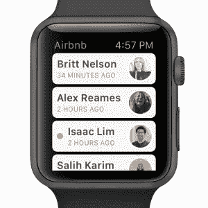
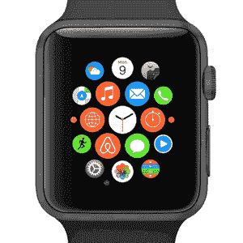
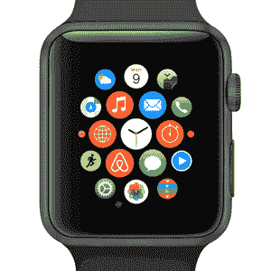
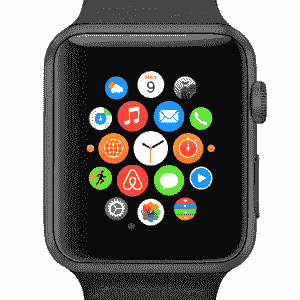
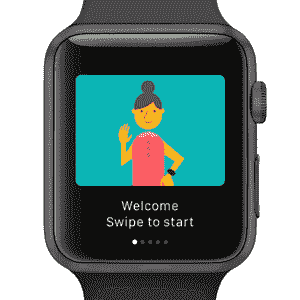

# 如何运作:构建 Airbnb Apple Watch 应用程序

> 原文：<https://medium.com/airbnb-engineering/how-it-ticks-building-the-airbnb-apple-watch-app-663288dc52e8?source=collection_archive---------1----------------------->

作者:艾萨克·林

Airbnb 希望出现在我们的主人和客人每天使用的所有设备上，以便我们可以将这种体验带给每个人，无论他们在哪里。今年夏天早些时候，我们中的一小群人开始定义 Airbnb 在一个全新的移动平台上的体验:Apple Watch。我们对这种固有的移动可穿戴设备可能带来的好处很感兴趣。

我们最初的想法可能是最自然的:*“让我们把我们的 iOS 应用移植到手表上吧！”*。因此，我们首先构建了一个原型手表应用程序，它能够浏览给定城市的列表，发送和接收消息，以及编辑和访问愿望列表。因为手表界面是使用 Xcode 中的 Interface Builder 构建的，所以这是一个相对快速的拖放过程，可以在每个屏幕上布置 UI 元素。所以，我们结束了，对吗？

不完全是。很快就发现，我们构建的原型并不是我们能够提供的最好的 Airbnb 体验。在小屏幕上浏览列表很困难，而且许多交互操作，比如保存到愿望列表，执行起来也很复杂。此外，我们无法显示主人和客人做出明智决定所需的所有细节，试图这样做将不可避免地导致信息过载。

# 简化

我们 Airbnb 的核心价值观之一是*简化*。Marco Arment 的[重新设计了 covery 的 Apple Watch 应用](http://www.marco.org/2015/05/08/overcast-apple-watch-redesign)，提醒我们将这一教训应用到 Watch 应用中，在那里，他详细介绍了展平不必要的复杂导航层。我们停止了移植 iOS 应用的尝试，从头开始。这一次，我们心中有一个非常具体的目标:*提供尽可能好的消息传递体验*。

Apple Watch 在很大程度上是一个辅助设备；iPhone 的第二块屏幕*，如果你愿意的话。很自然，我们的 Watch 应用应该就是这样:Airbnb iOS 应用的轻量级扩展。我们需要利用 Airbnb 体验中有针对性的重要部分，这体现了 Apple Watch 的移动性，而*消息*完全符合这一描述。我们今天发布的 Airbnb Apple Watch 应用终于开始成形了。*

# 使用 WatchKit 开发

## 权衡的游戏

使用 WatchKit 是一项有趣的权衡工作。因为 watchOS 1 应用程序与 iPhone 上的主应用程序有着内在的联系，所以在 WatchKit 扩展的框架内开发时有许多事情需要注意。各级 iOS 开发人员比以往任何时候都更需要认识到他们的代码对性能和电池使用的影响。

不断出现的一个问题是:像网络请求这样的重要计算是应该在 iPhone 的 WatchKit 扩展上执行，还是应该在后台唤醒父 iOS 应用程序，让它执行计算？

答案取决于现有代码的结构。如果复杂的业务逻辑已经嵌入到 iOS 应用中，那么最简单的选择就是在 WKInterfaceController 上调用 [openParentApplication:](https://developer.apple.com/library/prerelease/ios/documentation/WatchKit/Reference/WKInterfaceController_class/#//apple_ref/occ/clm/WKInterfaceController/openParentApplication:reply:) ，这样就不需要在手表应用中复制代码。这将触发父应用程序中的[handleWatchKitExtensionRequest:](https://developer.apple.com/library/ios/documentation/UIKit/Reference/UIApplicationDelegate_Protocol/#//apple_ref/occ/intfm/UIApplicationDelegate/application:handleWatchKitExtensionRequest:reply:)，它将包含所需计算结果的字典返回给 WatchKit 扩展。注意，因为结果需要序列化并通过蓝牙传输，所以它包含的所有值都必须符合 NSCoding。

在我们的例子中，因为我们已经在应用程序中有了一个单独的框架，AirbnbAPI，它封装了网络层，我们可以简单地将它导入 WatchKit 扩展，并在其中执行所有操作，而不必经常唤醒 iOS 应用程序。这减少了扩展和它的父扩展之间的通信开销，并且产生了更干净的代码。

在决定谁应该负责执行计算时，记住计算的复杂性和持续时间也很重要。越复杂，手表就越应该遵从 iPhone 的处理能力。今天在 watchOS 1 上，性能差异一般是看不出来的。然而，在即将发布的 watchOS 2 上，最大的变化之一是 WatchKit 扩展将从 iPhone 上移到手表上。因此，这种区别将变得更加清晰，因为扩展中的代码是直接在手表上执行的。现在，是让 iPhone 执行请求，然后通过蓝牙将结果发送回手表，还是让手表自己执行请求并完全避免通信开销，这样会更快？

# 努力思考什么才是真正重要的

作为一个平台，Apple Watch 的简单性和激光聚焦使它在开发的同时既是一种乐趣也是一种挑战。小屏幕意味着不是所有的内容都能在每个屏幕上显示，所以在设计的时候需要非常小心。在开始这段旅程之前，所有 Apple Watch 开发者和设计师都应该问自己这样的问题:

> 如果这个按钮会占据屏幕 30%的像素，那么它的重要性是成比例的吗？
> 
> 如果这个功能是一个人可以并且会经常执行的重要动作，那么它是否应该隐藏在 Force Touch 手势的背后？
> 
> 如果这个屏幕是人们最关心的，因为它显示最重要的数据，那么它应该只能通过“主屏幕”访问，否则会给手表应用程序带来美丽的正面？

投入到这些看似很小的决策中的努力、时间和深思熟虑将在开发的后期阶段得到回报。我们了解到，我们在确定什么是真正重要的方面投入的心思越多，主人和客人在导航手表应用程序上浪费的时间就越少，他们就能避免更多的挫折。衡量一款令人惊叹的手表应用的主要标准之一是，一个人能够以多快的速度完成预期的任务，从抬起手腕到放下手腕。

# 最终产品

## 信息中心

Airbnb Apple Watch 应用并不是为了取代或镜像主要的 iOS 应用而设计的。它是一个信息中心，帮助主人更快地回复客人，并让客人获得重要事件的通知。借助丰富的交互式通知，主办方可以直接通过手腕接受预订请求:

然后，客人可以使用内置的听写功能，在 Apple Watch 上收到通知后立即回复主人的欢迎信息:

我们更进一步，通过在 Xcode ( [Apple Watch 编程指南](https://developer.apple.com/library/ios/documentation/General/Conceptual/WatchKitProgrammingGuide/Settings.html))的主要 iOS 应用程序目标中添加 Settings-Watch.bundle，将 Watch 应用程序与 iOS 相集成，这使得主人和客人可以在他们 iPhone 上的 Apple Watch 设置应用程序中输入预先录制的快速响应。每当点击手表上的“回复”按钮时，这些响应就会显示出来，只需点击一次即可响应。我们希望这能帮助那些发现自己在回答客人的常见问题时反复输入的主人，比如“*wifi 密码是多少？*”。

# 每一帧都很重要

在 Airbnb，我们真的相信*每一帧都很重要*。因为手表仍然是一个年轻的平台，我们觉得许多人仍然不完全清楚手表上的应用程序能做什么，不能做什么。我们想确保我们的主人和客人知道新的手表应用程序如何帮助他们，所以我们为手表建立了一个**首次用户体验**；一些我们从未见过的事情。

手表团队的设计师布里特·纳尔逊(Britt Nelson)、萨利赫·阿卜杜勒·卡里姆(Salih Abdul-Karim)和海伦·曾(Helen Tseng)制作了一些精美的插图和动画序列，告诉人们手表应用程序的功能，以及为什么我们认为它是他们 Airbnb 体验的一个引人注目的补充。动画插图是有意的明亮和轻松，为应用程序设置一个友好和平易近人的基调。

# 时候到了！

我们非常兴奋地看到 Airbnb Apple Watch 应用程序今天在全球范围内向我们的主人和客人开放。在过去的几个月里，这是一个令人难以置信的有趣挑战，处理一个没有真正制定通用实践和没有充分探索边界的平台。

手表应用程序开始是一个宠物项目，它慢慢演变成了 Airbnb 移动体验的一等公民，这是整个团队都非常自豪的事情。展望未来，我们希望我们在创建这款应用时对细节的专注、纪律和关注不仅能激励其他开发者也这样做，还能激励我们自己继续改善 Airbnb 体验。

## 在 [airbnb.io](http://airbnb.io) 查看我们所有的开源项目，并在 Twitter 上关注我们:[@ Airbnb eng](https://twitter.com/AirbnbEng)+[@ Airbnb data](https://twitter.com/AirbnbData)

*原载于 2015 年 9 月 3 日 nerds.airbnb.com***。**