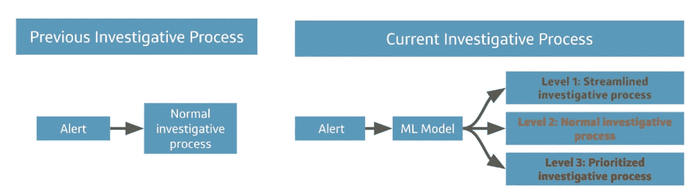

# 机器学习如何帮助打击洗钱

> 原文：<https://medium.com/capital-one-tech/how-machine-learning-can-help-fight-money-laundering-d22d8bed7cbc?source=collection_archive---------0----------------------->

## 机器学习模型如何帮助识别可疑账户活动并更好地支持反洗钱团队

***高级业务总监彼得·穆尼奥斯和软件工程总监雷克斯韦尔·明尼斯***

当大多数人想到金融犯罪时，他们会想到那些成为头条新闻的犯罪——身份盗窃、窃取信用卡号码、盗用公款——但这些只是金融机构应该防范的一小部分。[洗钱助长了世界范围内的犯罪集团和恐怖主义](https://www.state.gov/anti-money-laundering-and-countering-the-financing-of-terrorism/)，虽然很难衡量洗钱的影响和规模[，但联合国毒品和犯罪问题办公室(UNODC)曾估计犯罪收益占全球 GDP 的 3.6](https://www.unodc.org/unodc/en/frontpage/2011/October/illicit-money_-how-much-is-out-there.html)，其中 2.7%的全球 GDP 被洗钱。这是一个巨大的数字，相当于每年超过一万亿美元。

这个数字只是一个估计，但我们可以自信地引用另一个数字——根据美国财政部的数据，美国金融机构在 2020 年提交了 250 万份可疑活动报告，这些报告的数量多年来一直呈上升趋势。

解决这一问题的最佳实践传统上包括监控可疑行为和已知用于洗钱的策略。但是在我们全球化的网络经济中，犯罪分子不断采用复杂的新技术。随着传统的检测方法变得过时，金融行业正在发展我们的反洗钱(AML)策略，以包括机器学习(ML)来更快地适应客户和犯罪行为的变化。将洗钱纳入反洗钱工作是一个独特的机会，可以将反洗钱工作提升到一个新的水平，并有助于防止金融犯罪。

# 使用基于规则的监控系统从消防水龙带饮水

传统上，银行使用基于规则的确定性工具来监控洗钱交易。但是，为了更精确地关注触发器的正确组合，团队随着时间的推移添加参数和条件，这提高了性能，但也使规则更加难以维护。随着客户和犯罪行为的快速变化，我们需要变得敏捷。快速适应性并不是基于规则的系统的唯一弱点。即使使用高度复杂的基于规则的触发逻辑，输出通常仍然是二进制的:活动是否生成警报(提交调查)。调查人员认为这些警告就像一桌子包装好的礼物——几乎不知道先打开哪个。

# 使用机器学习在 Capital One 建立可疑活动监控系统

为了满足快速适应性和区分警报优先级的需求，2020 年 8 月，Capital One 开始将机器学习应用于可疑活动监控，反洗钱主题专家与数据科学家合作设计一个完整的系统。我们的目标是:

*   使用广泛的数据做出更好的决策
*   为反洗钱调查人员提供更多见解
*   优先考虑基于风险的调查
*   更快地适应犯罪和客户行为的变化
*   提供出色的透明度和治理

最初作为一个实验性的附带项目，其大规模打击洗钱的潜力很快就显现出来。该项目在黄金时间获得批准，并由一个全职团队负责开发、记录和生产该方法。

# 由随机森林模型驱动

该系统的核心模型利用了 scikit-learn 中内置的[随机森林模型](/capital-one-tech/random-forest-algorithm-for-machine-learning-c4b2c8cc9feb)，并用 Python 进行了编码，并对 PySpark 进行了一些可伸缩性增强。由于[可解释性是一个优先事项](https://www.capitalone.com/tech/machine-learning/an-integral-pragmatic-approach-to-explainable-ai/)，我们使用了开源工具和模型设计，使其他人能够训练一个相同的模型并验证我们的结果。这样我们的利益相关者——比如联邦监管者——就可以看到并理解这项工作。

虽然我们最初研究了逻辑回归、 [XGBoost](https://www.capitalone.com/tech/machine-learning/how-to-control-your-xgboost-model/) 和递归神经网络(RNN ),但我们选择了随机森林模型，因为它代表了该用例的模型准确性、性能和可解释性的最佳平衡。随着我们模型特征和设计的发展，这可能会在未来版本中改变。

在实践中，我们发现随机森林模型在两个主要指标上表现良好:

*   模型训练时间—比逻辑回归快一倍，比 XGBoost 快
*   模型性能——受试者操作特征(ROC)曲线可与 XGBoost 和 RNN 相比，且远高于逻辑回归

# 特征是模型识别潜在可疑活动的关键

为了构建该模型，我们首先根据客户和交易属性创建数百个可能与洗钱活动相关的特征。通过应用我们的功能，并通过一个随机森林模型运行数据，我们可以看到类似的交易是否被视为可疑。当显示客户的标识符时，模型提取相关的客户属性和交易数据，将其应用于模型，并生成一个分数，该分数表示客户活动被视为可疑的可能性。

为了保持事物的可解释性、灵活性和准确性，我们定期审计和删减模型中的特性数量。当我们拥有正确的功能组合时，我们的模型可以月复一月地保持其性能，而不是过于定制-过度适应-用于训练的时间段。

为了帮助关注数据集中的重要信号，我们从递归消除过程开始，以减少特征维度空间，允许我们确定哪些是要修剪的候选特征。然后，通过统计测试，我们识别出那些掩盖其他特征的特征，并消除它们。我们还不断调整我们的模型，以考虑客户不断变化的业务方式。例如，在新冠肺炎时代，许多以前使用现金的客户现在使用点对点(P2P)服务。

# 使用警报分数建立基于风险的调查程序

通过为每个警报生成一个分数，我们的模型帮助这些团队自己对警报进行分类。通过将警报分配到三个级别之一，我们的团队可以简化对低分值警报的调查，并对高分值警报的调查进行优先排序。

例如，一个客户出售他们的房子，并收到一笔异常大的存款，这可能会触发一个警报，即该模型评级为低风险。另一位客户存入现金，然后将资金汇往高风险管辖区可能会触发一个得分较高的警报，并被发送进行优先审查。

这些分数有助于对警报的严重性进行分类，反洗钱主题专家可以更好地将注意力集中在风险最高的活动上。这用基于风险的调查程序取代了传统的先进先出工作流程，从而带来更好、更高效的调查结果。

我们的可疑活动监控系统不能取代反洗钱主题专家的重要专业知识。人类仍然决定什么是可疑的，但在机器学习的帮助下，他们可以花更少的时间在误报上，花更多的时间在真正可疑的活动上。

# 机器学习和反洗钱主题专家之间的合作

但这一工具不仅是为我们的反洗钱团队打造的，也是与他们共同打造的。这是 [Capital One 的机器学习中心(C4ML)](https://www.capitalone.com/tech/machine-learning/machine-learning-in-the-enterprise-lessons-from-the-front-lines/) 与我们的反洗钱主题专家真正合作的产物，团队成员来自三大洲的五个不同国家。这给了我们更好地理解我们调查的交易所需的领域专业知识和国际视野。例如，我们的反洗钱主题专家帮助我们的机器学习团队了解在印度和中国常见的特定电汇模式，这两个国家是在美国学习的外国学生的两大来源，因此也是与学费相关的电汇的常见来源。该团队的另一名成员在马达加斯加长大，他帮助解释了为什么一些客户可能会在几周内，而不是典型的假期前几天，在海外亲戚家进行长期访问时，在国外 ATM 机上取款。

像这样由专业知识驱动的准确性很重要。我们的反洗钱专家是专家，已经调查了数千起案件，并提交了大量可疑活动报告。自然，我们不想采用一个多余的或笨重的工具，这只会妨碍他们。通过从第一天开始就将他们包括在流程中，我们能够精确定位机器学习可以为他们的流程提供的价值。

# 我们基于机器学习的可疑活动监控系统的结果

系统生成的绝大多数分数都会产生预期的调查结果。分配给单个警报的风险级别与手动评级过程密切相关，低、中和高警报的比例与历史趋势密切相关。总体而言，该系统已证明自己比基于规则的系统更不容易出错，效率更高。

我们持续监控该系统的结果，并采取多管齐下的方法来检测与我们的新程序相关的潜在反馈循环。这包括每月模型监控、严格的质量保证标准、警报准确性的跨级别测试，以及用于审查模型输出和运营影响的监控仪表板。这使我们能够不断提高模型的性能、稳定性和运营收益。

# 结论

金融机构在受到严格监管的环境中运营，反洗钱部门对错误的容忍度很低，有时不愿意成为新技术的早期采用者。许多机构认为监管者希望看到熟悉的反洗钱技术，因此它们在创新方面行动缓慢。通过在文档和可解释性方面的大量投资，Capital One 克服了这些症结，创建了一个行业领先的创新型机器学习解决方案，使我们能够更专注于真正可疑的活动，并更快地将信息提供给执法部门。

在 Capital One，我们致力于打击洗钱和其他滥用金融系统的行为。我们认为，机器学习在正确使用的情况下，代表着我们打击犯罪活动的强大新工具。

*披露声明:2021 资本一。观点是作者个人的观点。除非本帖中另有说明，否则 Capital One 不隶属于所提及的任何公司，也不被这些公司认可。使用或展示的所有商标和其他知识产权是其各自所有者的财产。*

*最初发表于*[T5【https://www.capitalone.com】](https://www.capitalone.com/tech/machine-learning/how-machine-learning-can-help-fight-money-laundering/)*。*