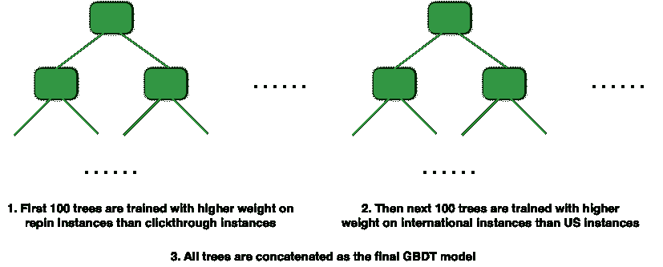

# 机器学习如何显著提高国外的参与度

> 原文：<https://medium.com/pinterest-engineering/how-machine-learning-significantly-improves-engagement-abroad-98c6ca937f9f?source=collection_archive---------3----------------------->

作者:郭| Pinterest 工程师，home feed

去年，Pinterest 成为一家真正的全球性公司，超过一半的人在美国以外使用我们的应用程序。我们投入了大量资金，让 Pinterest 对所有人都变得个性化、快速和可靠，无论语言、位置或设备如何，这在全球范围内都带来了巨大的保留率和参与度。例如，使用机器学习模型，我们在过去一年将美国以外国家的本地化 pin 数量增加了 250%。现在，每月访问 Pinterest 的 1.5 亿多人中的每一个人都会看到与他们的国家和语言最相关的大头针以及其他信号。最终，机器学习使我们能够扩展我们的系统，以更好地理解国际内容和 Pinners，并将体验本地化以加速增长。

虽然有许多团队和项目为我们的国际化努力做出了贡献，但在这篇文章中，我们将介绍机器学习如何改善国外 Pinners 的 home feed 体验，并导致去年 home feed 参与度的最大收益。

Pinterest home feed

## **Pinterest 首页提要**

如果我们不首先从流量最高的服务之一 home feed 开始，我们将看不到任何收益。我们 1.5 亿活跃 Pinners 中的每个人每次访问时都会获得一个个性化的 home feed，这需要机器学习应用程序来不断提高想法的相关性。(关于机器学习问题设置、训练实例生成、早期功能和我们在 home feed 排名中使用的线性模型的更多细节，请查看[之前的这篇博文](/@Pinterest_Engineering/pinnability-machine-learning-in-the-home-feed-64be2074bf60#.8sljzadrn)。)多年来，我们已经将我们的排名模型从逻辑回归发展到支持向量机(SVM)，现在又发展到梯度推进决策树(GBDT)。在接下来的章节中，我们将介绍建模和特征工程管道的三个主要改进。

## **从线性模型到梯度推进决策树(GBDT)**

我们面临的一个中心问题是为 Pinners 提供源源不断的相关和吸引人的内容，根据他们的品味和兴趣进行个性化。Home feed 通过使用机器学习模型(也称为 Pinnability)来解决这个问题，根据预测的相关性对一大组候选 pin 进行排序，并呈现最相关的 pin。Pinnability 模型的相关性预测的准确性在一定程度上是 Pinterest 成功的关键。以前，我们只使用线性模型，逻辑回归或具有线性核函数的 SVM 排名，来建立相关性预测模型。当相对少量的特征(<100) were used, the linear models were sufficient to explore the feature space and generate a good prediction outcome. However, as we added more features to Pinnability, the linear models were quickly reaching their limits in exploring the ever-complex feature space, so we applied more complex modeling techniques.

From our A/B experiments, we found [梯度增强决策树](https://en.wikipedia.org/wiki/Gradient_boosting) (GBDT)提供最佳参与结果时，所以我们在去年年初在 home feed 中完全生产了它们。GBDT 模型帮助 Pinners 在他们的主页中发现更多相关的、个性化的想法。因此，每天从家庭饲料中节省针的人数增加了 10%以上，这是去年家庭饲料参与量增加最多的一次。GBDT 模型特别提高了美国以外的人发现和保存的相关 pin 的数量，根据国家的不同，最多可达 18%。我们使用 [Apache Hive](https://cwiki.apache.org/confluence/display/Hive/Home#Home-ApacheHive) 和 [Cascading](http://www.cascading.org/) 生成训练数据，并使用 [xgboost](https://xgboost.readthedocs.io/en/latest/) 在单个 AWS r3.8xlarge 实例上离线训练我们的 GBDT 模型。对于更大的训练数据集，我们开发了在我们内部的 Spark 集群上分布式训练 GBDT 模型的能力。现在，我们在由 350 棵深度为 7 的树组成的生产模型中使用了 700 多个密集特征和一些稀疏特征。

## **语言和国家匹配特性**

起初，我们的模型不包含美国以外的 Pinners 的具体特征，因此来自不同国家的具有相似兴趣的人过去常常得到相同的相关性预测分数。为了改善这种体验，我们启动了一个本地化 home feed 的项目。正如你所料，根据我们的研究，美国以外的 Pinners 通常更喜欢以他们自己的语言显示文本的 pin。我们将 Pin 的语言和国家定义为保存 Pin 的外部网页的主要语言和国家。我们基于外部页面的文本开发了准确的语言检测模型，并添加了数十种国家/语言匹配功能，例如*Pin ner 的语言和国家是否与 Pin 的语言和国家相同、*以及*Pin ner 的语言是否是保存 Pin 的其他人使用的前 X 种语言。*我们总共定义了大约 40 种基于语言和国家的匹配特性，并将它们添加到我们的 GBDT 模型中。凭借这些模型特性，我们将每个国际 Pinner 节省的 pin 数量提高了 10%到 20 %,具体取决于国家/地区。

我们测量的另一个重要指标是本地源本地性，即本地源中使用 Pinner 第一语言的引脚的百分比。由于我们同时测量本地性和保存 pin 的人数，我们有时会观察到更多的人保存 pin 和更少的本地化 pin 之间的权衡，特别是对于排序的候选 pin 相对较少的语言。例如，一个生产排名模型将节省图钉的人数提高了 4 %,而本地性降低了 8%到 10%。我们通过为 GBDT 开发一个适应性培训流程来解决这个问题，这将在下一节中介绍。

## **GBDT 车型的适应性训练**

在我们的训练数据集中，保存的 pin 和点击的 pin 都是正面例子，而没有导致保存或点击的印象是负面例子。对于逻辑损失函数，我们使用 xgboost 的加权 GBDT 训练。我们开发了一个自适应训练过程，在训练过程中为不同的树指定不同的实例加权方案。例如，在训练中，我们可以指定保存的 Pin 的每个实例的权重是前 100 棵树的点进实例的两倍。然后，对于接下来的 100 棵树，全局保存的 Pin 的每个实例的权重是在美国保存的 Pin 的 3 倍。我们将为不同的树设置不同的实例权重的过程称为“自适应 GBDT 训练”(如图 1 所示)。

Fig 1: Illustration of an adaptively trained GBDT model

在实践中，我们应用三种不同的加权方案在我们的 prod GBDT 模型中生成 350 棵二叉树。我们首先训练 150 棵具有高 pin 保存权重的树，然后使用这 150 棵树模型作为基础，训练另外 100 棵具有针对 pin 保存和点击率的精确权重设置的树。最后，我们添加了 100 棵正面国际实例权重明显较高的树，其中包括美国以外任何 Pinner 保存的 pin 和点击率。每棵树都是由 80%随机抽样的训练实例生成的。为了获得最佳参与度，我们逐渐降低了三个适应性培训阶段的学习率。

我们发现，在适应性训练过程中适当地重新加权实例显著地改善了 Pinners 的体验。与我们之前的 GBDT 模型相比，仅这种适应性训练过程就使国外每天从家中节省别针的人数增加了 10%以上。

我们不断尝试新的方法来提高我们每天向 Pinners 提供的超过 100 亿条建议的相关性，机器学习模型是核心。除了 GBDT，我们已经开始开发基于 TensorFlow 的深度神经网络(DNN)模型，用于 home feed 相关性排名。如果你对解决这些机器学习挑战感兴趣，[加入我们](https://careers.pinterest.com/)！

*鸣谢:这是与德米特里·切奇克、刘鑫和穆昆德·纳拉辛汗的合作。*

【】我们也感谢陈晓芳、Derek Cheng、、Stephanie DeWet、Chris Pinchak、Fu、、、和 Dan Frankowski 富有成效的讨论和建议。