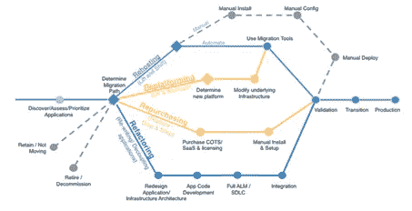
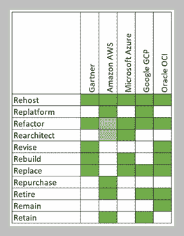

# 云迁移有多少个 R？

> 原文：<https://medium.com/version-1/how-many-rs-are-there-in-cloud-migration-b2d30492f9d8?source=collection_archive---------0----------------------->

Photo by [Billy Huynh](https://unsplash.com/@billy_huy?utm_source=medium&utm_medium=referral) on [Unsplash](https://unsplash.com?utm_source=medium&utm_medium=referral)

我们在一家云迁移咨询公司工作，习惯于使用 Gartner 十多年前首次定义的方法对应用程序进行评估和分类。Gartner 在 2010 年左右首次发布了“ [5 R 的](https://www.gartner.com/en/documents/1485116/migrating-applications-to-the-cloud-rehost-refactor-revi)”，为以云迁移为目标的应用程序定义了 5 个选项。这种简单的方法提供了一个快速的评估，为构成向云迁移的大型资产的应用程序提供了迁移路径的指示。

然而，能那么容易吗？我认为答案并不真的是“是”或“不是”。从我作为第 1 版首席顾问的经验来看，自从云的采用首次出现以来，我可以看到人们会说“是”——它可以这么简单，我同意作为一种工具，是的，这是一种可以加快决策的简单方法。

“不”的答案是驱使我写这篇文章的真正原因。我们经常看到客户请求针对 Gartner 5 R 进行评估，现在我们也看到客户更频繁地请求针对 6 R 进行评估；等等，5 什么时候变成 6 了？

答案就在亚马逊 AWS 于 2016 年发布的将应用程序迁移到云的 [6 策略中。这种方法引入了一种最常用的图形来说明 6 R，在采用 6 R 对您的遗产进行分类时，提供了一个出色的迁移工作流程。](https://aws.amazon.com/blogs/enterprise-strategy/6-strategies-for-migrating-applications-to-the-cloud/)

Amazon AWS 6 R’s

这种方法从 5 到 6 R 的时间推进，这可以被描述为云迁移的自然演进吗？是的，但是随着公共云市场中更多参与者的出现，这种演变变得更加复杂。微软 Azure 经历了巨大的增长，加入亚马逊成为公共云的领导者，那么他们的迁移方法是什么？

这在微软的云采用框架[云合理化的 5r](https://docs.microsoft.com/en-us/azure/cloud-adoption-framework/digital-estate/5-rs-of-rationalization)中有详细说明。我们回到了微软的 5r；然而，如本文后面所示，它们不同于最初的 Gartner 5 R。其他云提供商呢？

谷歌 GCP 也有一个[云采用框架](https://services.google.com/fh/files/misc/google_cloud_adoption_framework_whitepaper.pdf)，它有一个几乎与亚马逊相同的 6rs 方法。Oracle 也有一些关于云迁移的材料，推荐云迁移的[7r](https://learn.oracle.com/ols/course/seven-rs-of-cloud-migration/35644/35660)。

版本 1 每天都为 AWS、Azure 和 OCI 的迁移提供与云无关的咨询，所以我想了解每个提供商的“官方”路线。还要承认 Gartner 的咨询服务很久以前作为这种方法的来源所提供的价值(就云而言，11 年真的很长！)，我开始注意到他们在方法本身上有进一步的变化。例如，Gartner 在 2020 年发布了对遗留系统进行现代化的 [7 个选项](https://www.gartner.com/smarterwithgartner/7-options-to-modernize-legacy-systems/)(不再是 5 个), Amazon 在其[最佳实践中提到了 7 个 R(不再是 6 个),用于评估将在迁移过程中淘汰的应用](https://docs.aws.amazon.com/prescriptive-guidance/latest/migration-retiring-applications/overview.html)。

我想比较 R，这样我们就可以在所有公共云平台上为我们的客户提供建议。事实是，它们都有一些共同的分类，但是，有一些差异证实， ***云迁移是复杂的*** *！*

Comparison between vendors Cloud Migration R’s

下面是我在本文中提到的不同方法之间的比较。我们可以看到，对于五种不同的供应商方法，实际上有 11 个 Rs。如果我们要包括来自 Gartner 和 AWS 的更多变体，那么将增加到 12 个 R，加上 Amazon 的 Relocate 和 1 个 non-R，以及 Gartner 添加的封装。

其中一些是一直存在的，所有方法中都出现了 **Rehost** ，所有方法中都出现了 **Refactor** ，但是，微软云采用框架中的 **Refactor** 略有不同，重点是转移到 PaaS 服务，如 Azure SQL 或 Azure WebApps。微软的 Rearchitect 是一个新的云原生版本。AWS 将**重构**和**重新架构**混合为同一个选项(用较浅的绿色阴影表示)，类似于微软的**重新架构**。

**平台**在微软 5 R 中并不存在，但这是一个非常常见的分类，我们用它来解决技术债务并计划底层平台的变化，如操作系统升级或数据库版本升级。有些 R 有共同的结果，如**保留**或**保留**，同样的情况也可以说是**取代**或**回购**。我认为从中得出的结论是，人们普遍认为根据“***×R”***对应用程序进行分类是评估您的应用程序和迁移要求的一个非常强大的工具。

有一点没有涉及到，大概就是云迁移之旅中最重要的*。迁移的业务驱动因素和预算实际上是您如何对应用程序进行分类的*决定性因素。每个人都希望使用云原生设计来重新构建所有应用程序，以引入可用性、可扩展性和成本节约，但是否有时间或预算来实现这一点，我参与的大多数迁移项目的答案都是“没有”。**

**大规模数据中心迁移通常是由迫在眉睫的事件推动的，例如数据中心合同续订、硬件续订或技术债务。数据中心合同续约日期往往会导致项目具有非常高的主机托管分类级别，这是最快的迁移方式，但是，这并没有实现真正的云价值。留出足够的时间来规划此类事件可以实现迁移，从而战略性地利用所有迁移资源，并从您的预算中获得最大价值。**

**了解你的时间表和预算将真正决定你为每个应用选择 5，6，7 或 11 R 中的哪一个。**

****关于作者****

***Daragh McCormack 目前是第 1 版英国数字数据云实践的云实践主管&。关注第 1 版的媒体出版物，了解更多来自实践的云、数字和数据相关博客。***

**点击此处了解第 1 版的云迁移工厂服务。**

**[云迁移工厂—版本 1](https://www.version1.com/it-service/enterprise-cloud/cloud-migration-factory/)**