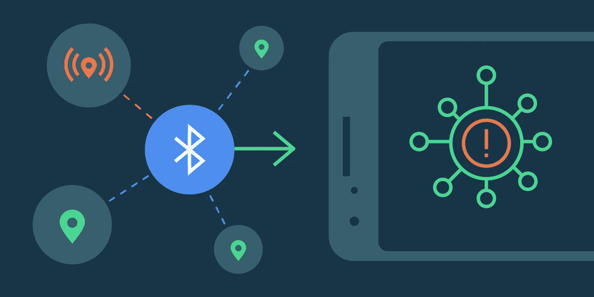
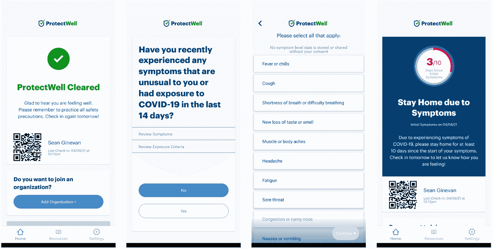
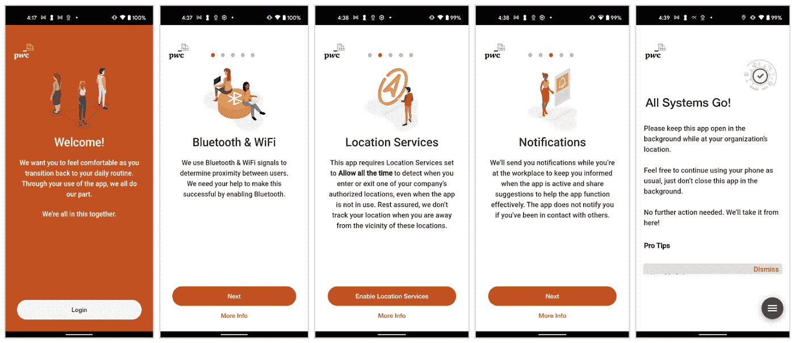
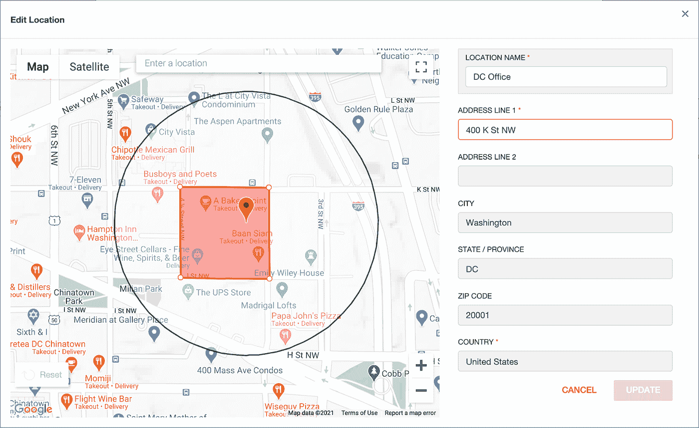
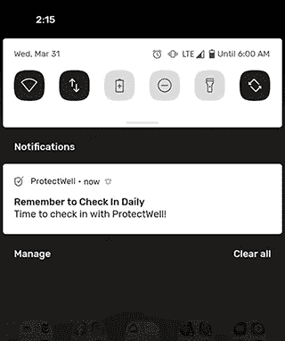
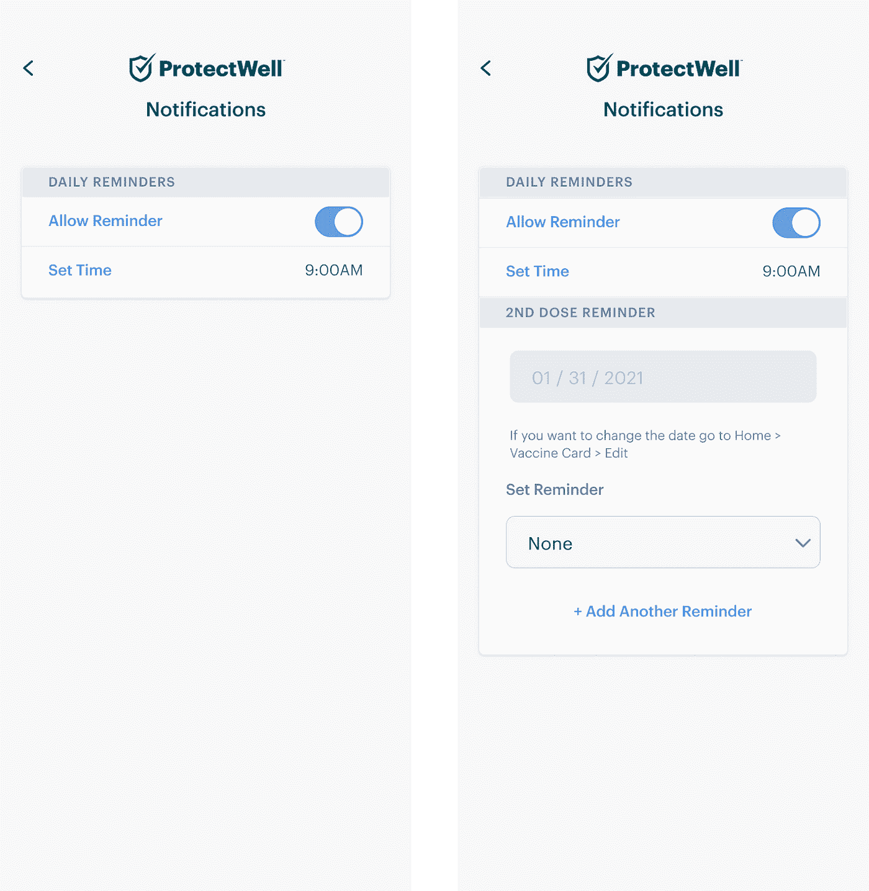
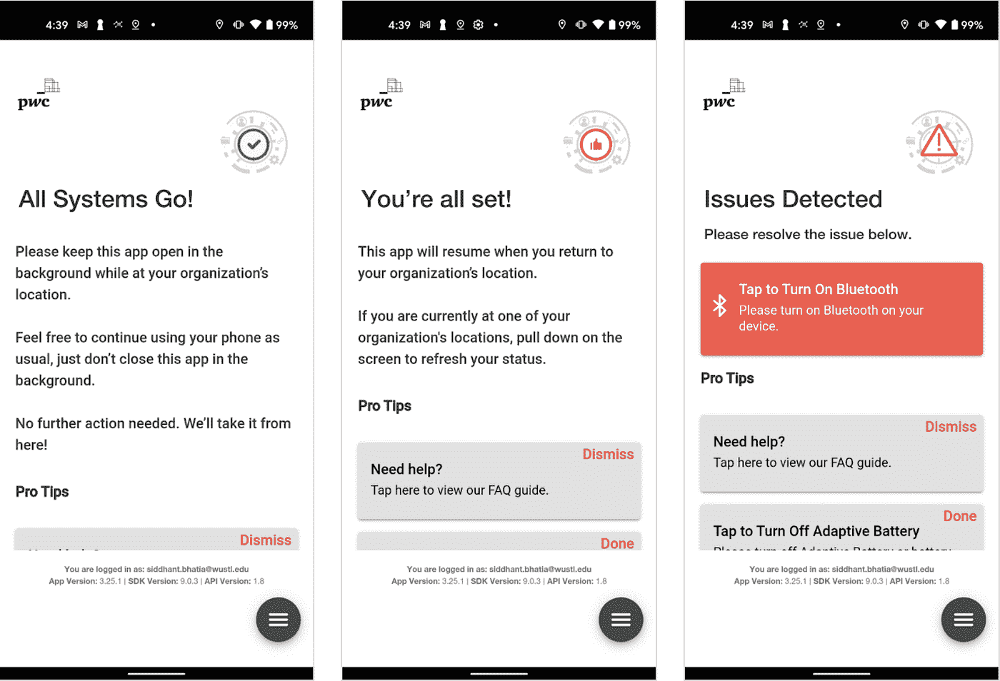

# 构建更好的工作场所安全应用

> 原文：<https://medium.com/androiddevelopers/how-mobile-apps-are-helping-with-workplace-safety-a46959587c7d?source=collection_archive---------6----------------------->

Illustration by [Virginia Poltrack](https://twitter.com/VPoltrack)

【Avani Agarwal、Todd Burner、Paul Ruiz 和 Sean Ginevan

在新冠肺炎疫情的最初几个月，开发人员面临着构建应用程序和功能以帮助企业管理工作场所安全的新要求。随着许多司法管辖区开始放松对可以保持开放的工作场所类型的限制，我们希望强调您作为开发人员可能面临的挑战，并向您展示如何克服这些挑战。使用 Android 让员工更安全的工具示例包括筛查调查、通知和工作场所的联系人追踪工具。

ProtectWell for UnitedHealth Group employee attestation screening user flow

开发人员面临着一个新的挑战，即如何在一个安全和保护隐私的环境中长期运行一个应用程序。向工作场所应用添加 COVID 功能时，保留隐私和设备交互的这些元素至关重要。

# 用户入职

让我们从基础开始。无论你重返工作经历需要什么，同理心和安全必须是你设计和实施的一部分。要认识到，对许多员工来说，重返工作场所会显得不同、陌生，甚至可能会不舒服。例如:根据您的解决方案，您可能需要将您的应用程序作为持续通知在前台运行。对于一些不理解为什么你想让这个新程序一直运行的用户来说，这看起来很可怕。在你的入职 UX 流程中，在要求用户接受之前，你应该单独公开所有需要的[权限](https://developer.android.com/training/permissions/requesting#principles)；包括可以采取的用户操作，包括:

PwC uses clear messaging to inform employees about Automatic Contact Tracing

*   位置。你的应用程序可能需要在后台使用[定位服务，例如](https://support.google.com/googleplay/android-developer/answer/9799150?hl=en)来运行联系人追踪功能或设置[地理围栏](https://developers.google.com/location-context/geofencing)来确保你的应用程序仅在工作时可用。

PwC allows admins to create geofences in a web UI that establishes tracing parameters

*   蓝牙。这可用于跟踪彼此靠近或接触的设备。蓝牙需要[位置许可](https://developer.android.com/guide/topics/connectivity/bluetooth#Permissions)。
*   通知(FCM)，唤醒设备并让用户知道任何相关信息。
*   持久前台通知对于证明服务保持活动状态并让用户知道正在发生什么非常有用。

ProtectWell notifications

*   应用范围:如果您的应用程序将处理敏感的工作流，如接触追踪或疫苗接种证明，您应该向用户明确您需要访问敏感信息(如健康数据或员工互动)的时间范围。

在设计重返工作岗位的工作流程时，请记住应用希克斯定律，这是一个简单的概念，即呈现给用户的选择越多，他们做出决定所需的时间就越长。这似乎是常识，但是急于快速完成一个功能尽可能多的应用程序可能会否定这条规则。

# 处理应用程序的通知

通知有其缺陷，建议您在不淹没用户的情况下小心行事。以下是一些用户反馈和从日常提醒通知中学到的经验:

*“我们建造了 ProtectWell，供日常使用，使我们的用户和他们周围的每个人都不会出现症状和暴露。由于 ProtectWell 主要由有员工和学生的组织使用，我们收到了用户不喜欢周末、节假日和假期期间的日常提醒的反馈。我们确实说过 COVID 不在周末休假’,所以我们总是鼓励我们的用户每天签到，不管他们是去工作还是去学校。然而，这是一个很好的反馈，帮助我们了解我们的产品是如何被使用的，以及我们需要做什么来不断迭代我们的设计。”* —产品和设计总监 Ishraf Ahmad | protect well

限制用户接收警报的次数，保持语言清晰，确保任何所需的操作都是直接的，甚至允许通过通知本身来解决问题，这一点很重要。让用户选择何时以及如何接收“每日提醒”可以创造更多的代理。

对于追踪应用程序，当应用程序运行追踪功能时提供指示也会创建代理。

*“几乎所有的用户都关心他们的数据是如何从雇主那里收集的，以及这些数据是保密的还是对外共享的。但他们表示愿意参与，以帮助保护工作场所。普华永道的产品副经理劳伦·米尔斯(Lauren Mills)说:“他们想清楚地了解应用程序何时‘开始’和‘停止’。*

通知有助于解决这一问题，它可以向员工提供有关追踪何时发生的更多上下文信息，尤其是当追踪功能受地理围栏限制时。除了基于位置绑定功能之外，开发人员还可以考虑让用户自动控制应用程序的运行时间，例如早上 8 点开机，下午 6 点关机，以减少应用程序的通知数量。

使用[Firebase Cloud Messaging SDK](https://firebase.google.com/docs/cloud-messaging/android/client)是通知员工工作政策变化的最快方式。首先转到 Firebase 控制台并设置 FCM，然后简单地将 FCM 导入到您的 [build.gradle](https://firebase.google.com/docs/cloud-messaging/android/client#add_firebase_sdks_to_your_app) 中。在那里，你可以通过 Firebase 控制台直接通知用户你的应用程序，也可以使用众多客户端 SDK 中的一个从[服务器端](https://firebase.google.com/docs/cloud-messaging/server)组件通知用户。如果您想要自动化消息传递，或者对您的用户进行细分，您可以使用额外的 FCM 功能。

ProtectWell for UnitedHealth Group designs for reminders

# 为应用程序启用追踪工作流

虽然暴露通知是一个有价值的框架来帮助员工了解他们的暴露风险，但有时您需要更细粒度的跟踪数据。在社交距离可能更加困难的场所或区域尤其如此。根据公开可用的信息，我们看到这是通过三种不同的方法实现的:

1.  使用固定和基于徽章的信标测量员工与蓝牙信标基础设施的交互。这使得公司可以调查整个公司大楼或校园内的员工移动和密度，并可能记录受感染的个人去过的地方。
2.  基于人对人追踪技术的商业部署。这些技术旨在通过测量蓝牙和 Wi-Fi 信号来调查员工互动。
3.  内部开发的基于人对人的追踪技术。这种方法基于开源框架，如 Herald、BlueTrace 或 PACT。

如果您需要开发自己的工具，可以使用[near Connections API](https://developers.google.com/nearby/connections/overview)以对等方式与其他本地设备对话。这可以按如下方式工作:每个应用程序将把自己宣传为一个端点，同时发现其他设备。这一点很重要，因为所有设备都需要能够互相访问。在这里，关注连接生命周期对于跟踪设备彼此靠近的时间量非常重要。这可以用来发出警告，让用户知道他们已经在一起太久了，或者让会议室里的人知道他们是否处于安全的容量。

请记住，使用“附近”等功能需要使用后台位置，许多用户可能不会选择正确的权限。普华永道(PwC)的劳伦·米尔斯(Lauren Mills)指出，根据他们的经验，“许多用户对要求后台位置权限感到困惑，并对给予应用程序权限‘始终’犹豫不决。即使在位置权限屏幕上有副本，许多人还是选择了错误的选项(使用时允许)，只是在我们的状态屏幕上被引导纠正了它。”

在设计您的应用程序时，您会希望检查[是否理解](https://developer.android.com/training/permissions/requesting#already-granted)您的用户是否在运行时授予了正确的权限。如果您的应用程序发现权限检查失败，请确保提供简单易懂的指导来解决问题。

PwC provides clear guidance to users on what to do if a permission check fails

# 敏感数据保护

如果你正在构建一个需要用户交互的持久化或访问敏感健康信息的应用，你可能想看看我们的[生物识别 API](https://developer.android.com/training/sign-in/biometric-auth)，以确保设备上的用户是你期望的用户。有时，您需要验证设备上的用户是否是您期望的人。如果您的应用程序需要个人身份信息(PII)，如用户的健康数据，那么我们会建议检查我们的生物识别 API，以确保用户在场。

所有敏感的 PII 数据以及健康信息都应该使用[EncryptedSharedPreferences](https://developer.android.com/topic/security/data)进行加密，这是 [Jetpack 安全套件](https://developer.android.com/jetpack/androidx/releases/security)的一部分。

Example Code to encrypt data using Jetpack Security

# 电池寿命考虑因素

因为企业追踪应用程序不能在后台持久化，开发者将不得不考虑几个优化问题。需要很好地理解电源管理和电池优化的最佳实践，例如用于提高设备电池寿命的[电源管理限制](https://developer.android.com/topic/performance/power/power-details)。在某些情况下，电池优化需要关闭或调整，以处理与[后台服务](https://developer.android.com/guide/background)的频繁检查。开发人员还应该了解并测试他们的应用程序如果放在 [doze](https://developer.android.com/training/monitoring-device-state/doze-standby) 中会如何运行，并利用像[前台服务](https://developer.android.com/guide/components/foreground-services)和[工作管理器](https://developer.android.com/topic/libraries/architecture/workmanager)这样的框架来保持应用程序运行，只要您的用例需要。如果由于使用[高优先级消息](https://firebase.google.com/docs/cloud-messaging/concept-options#setting-the-priority-of-a-message)的电源管理导致连接断开，应用程序也可以被远程唤醒。Android 12 中前台服务有[额外的限制，请注意这些限制，以确保您的服务将按预期开始运行。](https://developer.android.com/about/versions/12/foreground-services)

# 部署

对于在他们自己的组织内发布的企业，你应该期望尽可能使用[管理的 Google Play](https://support.google.com/googleplay/work/answer/6138458?hl=en) 来发布响应新冠肺炎的应用。这将确保普通消费者不会将您组织中的应用程序与其他旨在帮助抗击疫情的应用程序相混淆。这样，如果不再需要这些应用程序，您也可以轻松地将其从员工的设备上删除。

如果你的应用需要发布到更广泛的谷歌 Play 商店，你需要确保你符合 Google Play 的[新冠肺炎应用政策](https://support.google.com/googleplay/android-developer/answer/9889712?hl=en)。根据您的使用案例，这可能需要您的组织和相关公共卫生机构进行协调，以获得授权证明，从而发布到 Play Store。

组织应确保只有企业内的授权用户才能访问您的应用程序..实现这一点的一种方法是通过使用 OpenID 的 AppAuth [企业认证](https://github.com/openid/AppAuth-Android)库，该库提供了使用 [Chrome 定制标签](https://developer.chrome.com/docs/android/custom-tabs/overview/)认证本地应用的示例和样本代码。

通过使用技术引导员工变得更安全，有许多选择可以保护您的工作场所。Android 有能力提供这些工具，无论是通过使用蓝牙堆栈、员工 id 卡和/或地理围栏 API。编码快乐！