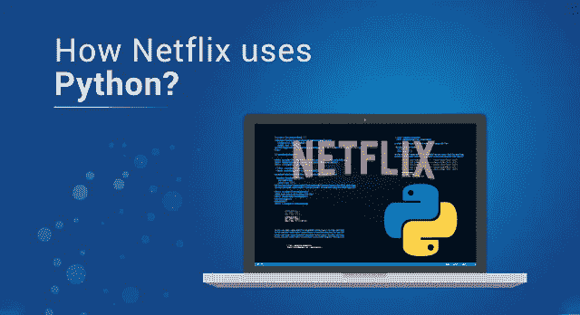

# Python 和网飞:当你播放一部电影时会发生什么？

> 原文：<https://medium.com/edureka/how-netflix-uses-python-1e4deb2f8ca5?source=collection_archive---------0----------------------->

How Netflix Uses Python? — Edureka

每个电影迷的一站式目的地当然是网飞。但是，如果你正在看你最喜欢的电影，它会时不时地缓冲一下呢？你只需关闭应用程序，选择另一个选项。但是，它如何快速管理数百万用户的流量呢？感谢 ***巨蟒*** 。在本文中，让我们探索网飞如何使用 Python。

让我们先快速浏览一下这篇文章的主题:

*   网飞简介
*   网飞如何使用 Python？

1.  打开连接
2.  需求工程团队
3.  机器学习基础设施
4.  大数据
5.  科学实验
6.  视频编码/媒体云工程
7.  网飞动画和 NVFX
8.  信息安全
9.  监控和自动补救

所以让我们开始吧。:)

# 网飞简介

网飞是一家提供视频点播服务的美国公司。总部位于加州洛斯加托斯的网飞在全球拥有大约 1.48 亿用户，而且这个数字每天都在增长。在大约二十年的时间里，网飞已经成为世界上最大的电视剧和电影的“家族之王”。作为美国增长最快的品牌，2019 年的收入为 205 亿美元，这足以让它成为一个“引人注目的品牌”，从而吸引所有人对其技术领域的兴趣。

基于同样的兴趣领域，网飞展示了它如何将最流行的语言 Python 用于其基础设施。

现在让我们来看看网飞实际上是如何使用 Python 的？

# 网飞如何使用 Python？

> 我们在整个内容生命周期中使用 Python，从决定资助哪些内容，一直到运营为 1.48 亿会员(网飞的工程师)提供最终视频的 CDN

从管理领域到可靠性和数据科学到机器学习等等，网飞几乎在他们业务的每个方面都使用 Python。

现在让我们更深入地了解一下 Python 是如何在网飞的各个领域中使用的:

## 打开连接:

网飞使用的 CDN(内容交付网络)是 Open Connect。当你点击“播放”按钮时，打开连接基本上进入画面。交付给最终用户的所有内容都由这个 CDN 负责。

Open connect 需要各种其他软件系统来设计、构建和操作它，而这些软件系统又是用 Python 编写的。不仅如此，这个 CDN 底层的网络设备是 Python 应用，因为 Python 在解决网络问题方面很突出。

## 需求工程团队:

需求工程团队负责处理网飞云的区域故障转移、流量管理、容量运营管理(关注内容可服务的上限)和设备效率。该团队使用的 Python 元素有:

***NumPy 和 SciPy:***

NumPy 和 SciPy 是用于科学计算的库。网飞使用这些 Python 库来执行数值分析，从而允许管理区域故障转移。

***Boto3:***

Boto3 是用于 Python 的 AWS(亚马逊网络服务)的软件开发工具包(SDK)。这有助于 Python 开发人员将 Python 集成到 AWS 中，从而允许在基础设施中进行开发。

***RQ (Redis 队列):***

这是一个 Python 库，有助于跟踪队列中出现的任务，并允许执行这些任务，从而允许管理异步工作负载。

***烧瓶:***

最后，网飞使用 Flask (Python Web 开发库)API 将前面的所有部分绑定在一起。

网飞使用的 **Jupyter Notebook** 是一款开源的 web app，与**interact**(Jupyter 的扩展)一起大规模用于 Python 开发。众所周知，Jupyter 在数据分析方面很受欢迎。它在运营数据分析和可视化方面非常有用，这反过来有助于检测容量退化。

## 机器学习基础设施:

机器学习的范围从创建个性化算法到找出用例。个性化算法有助于按照网飞标准训练机器学习模型。它提供个性化推荐、每日概要、标签生成等。

学习深度神经网络所需的库有 **TensorFlow** 、 **Keras** 和 **Pytorch** 而梯度提升决策树的 **XGBoost** 和 **LightGBM** 。他们还开发了相当多的高级库，有助于与事实记录、特征提取、发布等工作领域相结合。除此之外，网飞还使用 **MetaFlow** 创建机器学习项目。

> Metaflow 推动了 Python 的极限:我们利用良好并行化和优化的 Python 代码以 10Gbps 的速度读取数据，处理内存中的数亿个数据点，并在数万个 CPU 内核上协调计算。”——网飞

## 大数据:

大数据团队负责执行 ETL(提取、转换、加载)和临时管道。这个编排的主要部分是用 Python 编写的。该团队使用一个在 Jupyter 笔记本电脑上运行的调度程序，通过 papermill 生成带有模板的作业类型，例如 Spark、Presto 等。

除此之外，该团队还创建了一个完全基于 Python 的事件驱动平台。他们已经创建了许多事件，并将其合并成一个单一的允许网飞过滤，反应和路由事件。Pygenie 也是这个基础设施的一部分，它与 genie(特色作业执行服务)接口。

## 科学实验:

这是一个由科学实验团队创建的平台，允许 **A/B 测试**以及其他一些实验。在这里，科学家和工程师可以展示数据、统计和可视化方面的新创新。

这里实现的 Python 框架是 **Metrics Repo** ，它基于 **PyPika** 并允许编写可重用的参数化查询。对于统计部分，使用了 **PyArrow** 和 **RPy2** 来计算 Python 或 r 中的统计数据。

## 视频编码/媒体云工程:

该团队负责网飞目录的编码和重新编码任务。Python 大约用于 50 个项目，如 **VMAF** (视频多方法评估融合) **MezzFS** (夹层文件系统)**计算机视觉解决方案**(处理图像)使用 **Archer** 等。

## 网飞动画和 NVFX:

Python 是网飞所有动画和视觉效果(VFX)的基础。所有的 Maya 和 Nuke 联盟都是在 Python 上完成的。

## IS(信息安全):

网飞将 Python 驱动的 IS 系统用于自动补救、安全自动化、风险分类等。这个团队最活跃的开源 Python 项目是**安全猴**。网飞还使用 **BLESS** (Bastion 的 Lambda 短命 SSH 服务)来保护 **SSH** (安全外壳)资源。 **RepoKid** 用于授予 **IAM** 权限，TLS 证书通过 Lemur 分配。这两项任务都主要依赖于 Python。

## 监控和自动补救:

这个团队被称为洞察工程团队。他们构建并执行用于运营洞察、诊断、自动补救和变更的工具。对于它的大多数服务，这个团队使用 Python，例如，旁观者 Python 客户端库。该库用于记录维度时间序列。除了这些库，像 Winston 和 Bolt 这样的产品也是基于 Python 框架构建的，这些框架包括 Flask、Gunicorn 和 Flask-RestPlus。

综上所述，人们很容易认为 Python 是网飞的驱动力。至此，关于“网飞如何使用 Python？”的这篇文章到此结束。我希望你清楚所讨论的一切。

如果你想查看更多关于人工智能、DevOps、道德黑客等市场最热门技术的文章，你可以参考 Edureka 的官方网站。

请留意本系列中的其他文章，它们将解释 Python 和数据科学的各个方面。

> 1. [Python 教程](/edureka/python-tutorial-be1b3d015745)
> 
> 2. [Python 编程语言](/edureka/python-programming-language-fc1015de7a6f)
> 
> 3. [Python 函数](/edureka/python-functions-f0cabca8c4a)
> 
> 4.[Python 中的文件处理](/edureka/file-handling-in-python-e0a6ff96ede9)
> 
> 5. [Python Numpy 教程](/edureka/python-numpy-tutorial-89fb8b642c7d)
> 
> 6. [Scikit 学习机器学习](/edureka/scikit-learn-machine-learning-7a2d92e4dd07)
> 
> 7. [Python 熊猫教程](/edureka/python-pandas-tutorial-c5055c61d12e)
> 
> 8. [Matplotlib 教程](/edureka/python-matplotlib-tutorial-15d148a7bfee)
> 
> 9. [Tkinter 教程](/edureka/tkinter-tutorial-f655d3f4c818)
> 
> 10.[请求教程](/edureka/python-requests-tutorial-30edabfa6a1c)
> 
> 11. [PyGame 教程](/edureka/pygame-tutorial-9874f7e5c0b4)
> 
> 12. [OpenCV 教程](/edureka/python-opencv-tutorial-5549bd4940e3)
> 
> 13.[用 Python 进行网页抓取](/edureka/web-scraping-with-python-d9e6506007bf)
> 
> 14. [PyCharm 教程](/edureka/pycharm-tutorial-d0ec9ce6fb60)
> 
> 15.[机器学习教程](/edureka/machine-learning-tutorial-f2883412fba1)
> 
> 16.[Python 中从头开始的线性回归算法](/edureka/linear-regression-in-python-e66f869cb6ce)
> 
> 17.[面向数据科学的 Python](/edureka/learn-python-for-data-science-1f9f407943d3)
> 
> 18.[Python 中的循环](/edureka/loops-in-python-fc5b42e2f313)
> 
> 19. [Python 正则表达式](/edureka/python-regex-regular-expression-tutorial-f2d17ffcf17e)
> 
> 20. [Python 项目](/edureka/python-projects-1f401a555ca0)
> 
> 21.[机器学习项目](/edureka/machine-learning-projects-cb0130d0606f)
> 
> 22.[Python 中的数组](/edureka/arrays-in-python-14aecabec16e)
> 
> 23.[在 Python 中设置](/edureka/sets-in-python-a16b410becf4)
> 
> 24.[Python 中的多线程](/edureka/what-is-mutithreading-19b6349dde0f)
> 
> 25. [Python 面试问题](/edureka/python-interview-questions-a22257bc309f)
> 
> 26. [Java vs Python](/edureka/java-vs-python-31d7433ed9d)
> 
> 27.[如何成为一名 Python 开发者？](/edureka/how-to-become-a-python-developer-462a0093f246)
> 
> 28. [Python Lambda 函数](/edureka/python-lambda-b84d68d449a0)
> 
> 29.[Python 中什么是套接字编程](/edureka/socket-programming-python-bbac2d423bf9)
> 
> 30. [Python 数据库连接](/edureka/python-database-connection-b4f9b301947c)
> 
> 31. [Golang vs Python](/edureka/golang-vs-python-5ac32e1ef2)
> 
> 32. [Python Seaborn 教程](/edureka/python-seaborn-tutorial-646fdddff322)
> 
> 33. [Python 职业机会](/edureka/python-career-opportunities-a2500ce158de)

*原载于 2019 年 6 月 22 日*[*https://www.edureka.co*](https://www.edureka.co/blog/how-netflix-uses-python/)*。*