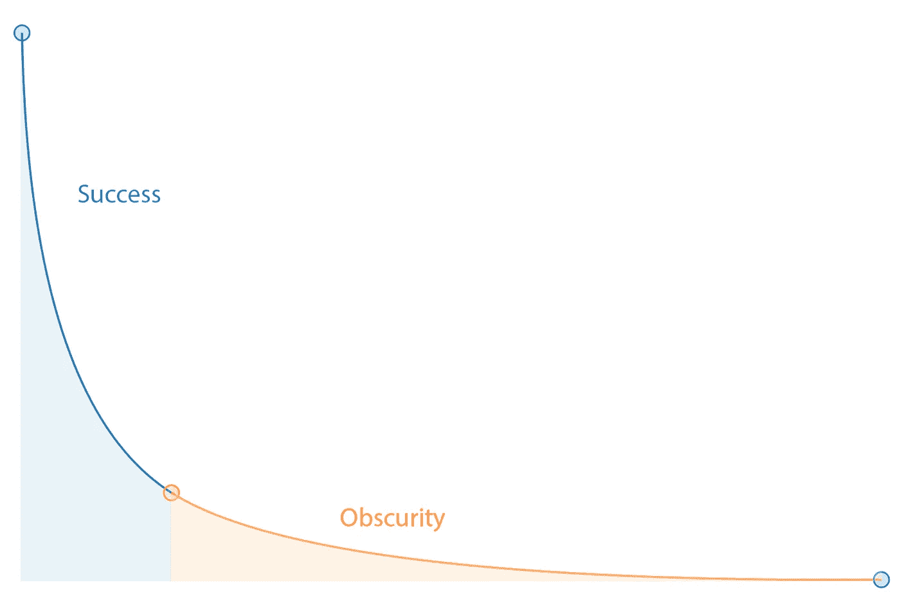

# 一张吉拉门票如何让我的雇主每月赚 100 万美元:7 个真正重要的指标

> 原文：<https://medium.com/javascript-scene/how-one-jira-ticket-made-my-employer-1mm-month-7-metrics-that-actually-matter-ffb5b2376a6b?source=collection_archive---------1----------------------->

Photo: Kai Friis (CC BY-NC-ND 2.0)

> “你只能得到你衡量的东西，所以要小心你衡量的东西。”

在我职业生涯的前半部分，我咨询了各种各样的企业，如何利用数字存在(指应用程序和网站)来移动核心业务 KPI。我的推销很简单:让我 100%负责工程组织，我会显著提高底线，否则你不付钱。

我不是靠添加功能做到的。我通过将工程资源集中在重要的指标上做到了这一点。在十年左右的时间里，我一直专注于各种形式和规模的企业，这给我上了非常重要的一课:关注正确的数字，完全忘记其他数字的存在。不要被噪音分散注意力。

也许你听说过“可测量的得到管理”，但这只是其中的一半:

> “被度量的东西会得到管理，即使度量和管理它毫无意义，即使这样做会损害组织的目的。”~彼得·德鲁克

换句话说，衡量正确的事情非常重要——甚至**更重要的是不要衡量错误的事情**。

我有一些坏消息要告诉你。如果你像今天大多数软件开发团队一样，**你正在测量错误的东西**。

## 为什么敏捷是一个肮脏的词？

最近，我看到了另一篇谴责“敏捷”的流行博文。但是作者并没有谈论敏捷。作者谈到了 **scrum 会议、计票和速度测量-微观管理**。

从总体上看，稳定的已关闭票证流看起来像是完成了工作。同意。要获得任何商业价值，你必须完成任务，因此，*任务数量=交付的价值数量*。**对吧？**

不不我的朋友。你大错特错了。

几年前，我在一家世界领先的零售商那里工作，推着购物车。有一天，我停止了在吉拉写代码和关闭车票(当时选择的车票追踪器)。我加了一张票:“可用性研究。”

一年多来，我们一直致力于重新设计我们的购物车，新版本的发布时间很快就要到了。到目前为止，我们还没有对新的结账体验进行任何最终用户可用性测试:所以我花了一周时间。我们提前接触了 1000 名最铁杆的支持者，并进行了一项调查来收集反馈。我分析了结果，注意到注释和日志文件中有一个令人不安的模式:

购物车放弃率高达两位数。一场即将到来的灾难！因此，我开始计划亲自录制可用性测试的视频。我把新手放在新的购物车前，给他们一些要完成的任务，然后让他们开始工作。我什么也没说。只是看着他们用推车。

我注意到在结账时，人们很难接受结账表单中的错误反馈。有了这些数据，我对 GitHub 上的一个开源项目做了一些小小的修改(注意:是在 GitHub 上记录的，而不是在我们自己的问题跟踪器中)。

过了一会儿，我又做了和以前一样的分析。购物车放弃率下降了两位数:这个差额价值超过每月 100 万美元。

那一周，我在吉拉*关了*一票*。一张价值数百万美元的彩票。*

当你看错票的时候，它们不仅仅是无意义的…它们是可怕的误导。任务仅与总体价值**相关**，并且**仅与对业务和营销团队**的“承诺”无关。

在 scrum 鼓励的微观层面上，**票有任意的值**，在幂律曲线上不同，但它们都被视为相同。

什么是幂律？

前 20%的门票占公司成功的 80%。门票并不是生来平等的，但我们对它们一视同仁。

> 任务对于商业价值就像是摩天大楼的最后一颗钉子。相反，一个任务可能是“浇注基础”。

如果没有那一个任务，这座建筑甚至不可能存在。有时我们会给门票任意打分，希望能更真实地衡量它们，但老实说，这就像试图用水桶舀起大海一样。这是一个注定失败的事业。开始明白我的意思了吗？

> 不要浪费你的时间在会议上指指点点。

管理层纠结于一场持续的斗争中，以迫使速度与承诺相匹配。他们认为给门票赋予任意的价值就能实现这一点。但是从来没有效果。他们总是对开发团队总是承诺过多而交付过少感到沮丧。总是有人头落地的威胁。听起来熟悉吗？

我告诉你:这些东西都不是敏捷的。 **Scrum 并不敏捷。**点票不敏捷。速度测量不灵活。

什么是敏捷？你的团队适应和应对变化的能力是敏捷的。

去照照镜子，问问自己:

> “我是希望我的团队重视关闭的票证数量，还是希望他们重视我们的关键业务 KPI？”

> 敏捷的本质是不断提高效率的过程。

这是你真正需要知道的关于敏捷的唯一事情，以便在你的组织中把它投入到(生产性的)工作中。您应该重视:

> **个人和互动**流程和工具
> **工作软件**综合文档
> **客户协作**合同谈判
> **响应变更**遵循计划

如果这看起来不熟悉，[你真的需要读一下这个](http://agilemanifesto.org/)。

我将添加一些我最喜欢的开发团队价值观:

> **技能**超过头衔
> 连续交付超过期限
> 支持超过责备
> 协作超过竞争

为什么你的团队的敏捷过程如此混乱？很有可能你正在失去对这些价值的追踪，并且你正试图把同样的旧的混乱的瀑布塞进敏捷的陷阱中，比如 scrum 会议和回顾。

**面对面的 scrum 会议可能会适得其反**,因为它们鼓励竞争而不是合作(员工互相比较)，鼓励指责而不是支持，鼓励截止日期而不是持续交付(“我们必须在周五前完成 x 张票，否则我们周末就得工作！”)，以及像癌症一样感染一个团队的尊卑顺序。

敏捷宣言中哪里说“每天站起来 15 分钟，感觉**慢羞愧**因为你对面的程序员昨天完成了 6 张票，而你只完成了一张”？

总有令人讨厌的超额完成者，他每天早出晚归，完成的订单是团队中其他人的两倍。注:几乎都是一个相对没经验，但是超级渴望，超级让人印象深刻的。太糟糕了，他们拖了团队其他人的后腿。

**同样，总会有慢性子的人关闭一两张票。奇怪。他们是伟大的导师，他们总是插在别人的票上，帮助他们摆脱困境，教学，并给出很好的建议。他们应该能比我们其他人多完成 10 倍的罚单，对吗？他们在时间管理上一定很糟糕。(提示:它们不是。你在评估员工方面很差劲。**

> 票证计数和“速度跟踪”是自瀑布混沌以来软件开发管理中最糟糕的想法。

## 别管数票了

忘分。忘记估计和承诺。估计都是毫无价值的谎言。试试每周演示。让营销团队大肆宣传你上个月完成的功能，而不是你认为下个月可能完成的功能。

为自己建立一个良好的功能切换和营销发布管理系统，你仍然可以根据营销宣传时间表发布功能，但你会宣传已完成的功能，而且你的团队再也不用在晚上 T29 周末紧张的时候筋疲力尽了。

提示:你的营销和销售团队永远不应该被允许讨论“正在进行中”的特性，你的销售和业务开发团队永远不应该在没有一个真正灵活的 MVP(最小可行产品)计划的情况下承诺一个截止日期。当我说灵活时，我指的是灵活:

例如，埃隆·马斯克要带我们去火星。初始销售 MVP:让气球飞上云端。

工程估算通常会有几个数量级的误差，但是没有人愿意面对这个事实，去面对现实。

## 我们应该衡量什么？

> 软件开发中唯一重要的事情是用户喜欢你的软件。

列表中的其他内容都是为了这个目的。记住这一点。现在带上**真正的度量标准！**

这些指标的前 5 个都是几乎每个应用开发者的**基本业务关键绩效指标(KPI)**。

你可能会奇怪为什么我要和一群开发人员分享这些，并告诉你这些是你需要关注的指标，但是请耐心听我说。剩下的指标将为您澄清这一点。

## 1.收入

如果你破产了，其他指标都没有任何意义。如果你用完了燃料，游戏就结束了。你完了。收拾好你的办公室回家吧。

**核心战术:**

*   转化率优化
*   可抓取的内容
*   可共享内容
*   页面加载和性能

> 优化保持灯亮着。

## 2.每月活跃用户(MAU)

有用户吗？你有比上个月多的吗？如果你是一家风险投资的初创公司，你最好祈祷自己成长得足够快。开始时，如果你努力工作，你可以逐月翻倍。当然，所有曲棍球棒曲线实际上都是伪装的 S 曲线，但是很有可能你还有很大的增长空间。

**核心战术:**

*   页面加载和性能
*   可共享内容
*   TDD 和代码审查

> 为增长而优化。

## 3.净推介值(NPS)

记得我说过如果你没油了，游戏就结束了吗？我骗了你，是吗？你以为我说的是钱。

> 钱不是你的燃料。粉丝是你的燃料。

粉丝是解锁更多钱的关键。更多分享。更多增长。更多的快乐。更多的魔法。

**核心战术:**

*   TDD 和代码审查
*   页面加载和性能
*   与支持和质量保证人员协作

> 优化把用户变成布道者。

## 4.病毒因子

也称为 k 因子或病毒商。如果你没有衡量这一点，现在就开始:

*k = i * c*

*i* =每个用户的邀请数量(例如，份额)

c =每股转换率

*   *k = 1* 很稳。没有增长。没有下降。
*   *k > 1* 表示指数增长。
*   *k < 1* 表示指数下降。

你应该在办公室的中央放一个巨大的屏幕，上面有一个 k 系数表，亮红色代表 *< 1* ，绿色代表 *> 1* ，覆盖在你的 3 个月 MAU 增长图上。

**核心战术:**

*   可共享内容
*   将共享整合到核心产品中
*   转化率优化
*   页面加载和性能

> 优化分享和新访客转化。

## 5.支持票

没有什么比给客户支持的电子邮件更能说明“这垃圾坏了”。上一次有人联系支持人员只是为了告诉你你有多酷是什么时候？

支持票是你在煤矿里的金丝雀。当有人说某样东西坏了，不要想“它对我有用！”。即使是用户失误，也不是用户失误。很有可能这个设计存在缺陷，而另外 1000 个人也受到了困扰。1，000 个其他人对 1 个关心到写信给你抱怨的人。1000 个宁愿点击后退按钮也不愿在你的应用上多浪费一秒钟时间的人。

理想情况下，你应该以零支持票为目标。您永远也不会达到那个标准(如果您幸运的话)，但是您应该把每一张支持票都看作是一个 bug 报告。开始把常见的分类。对它们进行计数，并使用它们来确定修复的优先级。

我不是说顾客永远是对的。有时候顾客不知道他们想要什么，直到你给他们。我是说，如果它在你的收件箱里，你就做错了。

**核心战术:**

*   TDD 和代码审查
*   CI/CD
*   功能切换和展示
*   定期的 bug 烧毁黑客马拉松
*   与支持和质量保证人员协作

> 优化无问题的客户体验。

# 关键工程关注指标

如约而至。解开商业 KPI 之谜的钥匙。结果是，**你可以用两个杠杆移动上面所有的针:**

## 6.错误计数

这里有一个震惊。**有些票计数是有好处的。**注意把所有的 bug 票都归类为 bug，然后就可以看到一个 bug 数了。

所有的软件都有缺陷，但不是所有的缺陷都需要修复。如果一个 bug 只出现在一部老式手机上，而且这部手机只被你的软件的一个用户使用，而这个用户甚至不是付费用户，你需要修复这个 bug 吗？大概不会。关上它，继续前进。优先处理对用户伤害最大的 bug。

忙起来，把它们压扁。

**核心战术:**

*   TDD 和代码审查
*   定期的 bug 烧毁黑客马拉松
*   与支持和质量保证人员协作

> 为无 bug 体验而优化。

## 7.表演

这次我有点作弊了。这一项将包含 3 个更重要的指标:

1.  **加载时间:**用户点击图标或点击你的网址后，你的 app 可以使用的时间。 ***瞄准< 1 秒。*** *超过那个，你就失去用户了。您可以削减的每一个 ms 负载时间都会给上述每个指标带来可衡量的好处。*
2.  **响应时间:**从用户操作(比如点击)到应用程序中出现可见响应的时间。**瞄准<100msT5*。再多就感觉滞后了。***
3.  **动画时间:**绘制一帧动画所需的最大时间。 ***瞄准 10ms。*** *任何超过 16 毫秒的时间都会引起明显的抖动，甚至可能使用户感到有点反胃。你需要一点喘息的空间。保持在 10ms 以下。*

加载时间是这个列表中最重要的迷你指标。它将像我提到的任何其他东西一样推动业务 KPI 指针。但是响应时间和流畅的动画产生了神奇的副作用。用户用了你的 app 后更开心。你看，每一个小小的小故障，每一个小小的延迟响应都会让用户在潜意识里感到不舒服。

给同一个用户同样的应用程序，性能问题得到解决，他们会报告更高的满意度，即使他们不知道为什么。

我们的小秘密。

**核心战术:**

*   定期性能黑客马拉松
*   深入的绩效审计
*   10 毫秒，100 毫秒，1000 毫秒，重复

> 优化无噪音体验。

## 还有很多事情要做

当然，这个小小的咆哮不能深入到开发者如何直接操纵病毒因子和 MAU 数，但是我会给你一个提示:你可以。当这些数字每天都摆在你面前，你知道移动它们是你的工作，而不是管理的工作，不是营销的工作，而是你的工作，T21，我相信你会想出一些创造性的想法来实现它。

如果你的经理认为你有更好的事情要做，把这个链接发给他们。

现在，走出去，推动一些真正重要的指标。

# [告诉你的 JavaScript 团队高速开发真正意味着什么](https://ericelliottjs.com/product/high-velocity-development-team-lifetime-access-for-3/)

***Eric Elliott*** *著有《编程 JavaScript 应用程序》* *(O'Reilly)，以及* [*《学习通用 JavaScript 应用程序开发与节点&*](https://leanpub.com/learn-javascript-react-nodejs-es6/)*。他为 Adobe Systems******尊巴健身*******华尔街日报*******【ESPN*******BBC****等顶级录音师贡献了软件经验******

**他大部分时间都在旧金山湾区和世界上最美丽的女人在一起。**