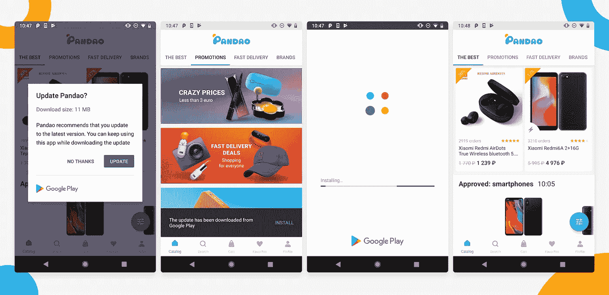
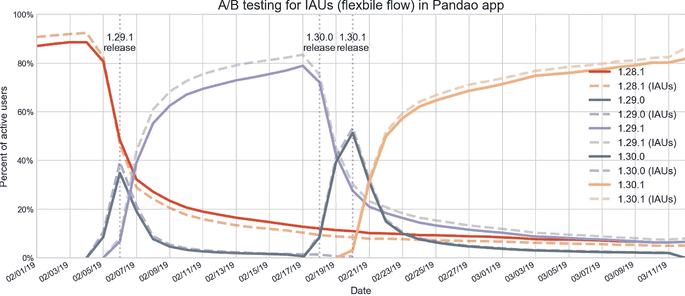
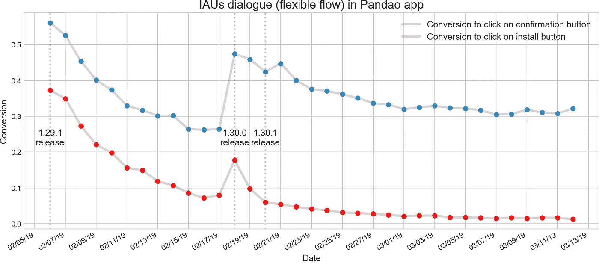

# Pandao 如何使用应用内更新灵活流程来加速 Android 上的应用更新过程

> 原文：<https://medium.com/androiddevelopers/how-pandao-uses-the-in-app-updates-flexible-flow-to-speed-up-the-app-update-process-on-android-5c00632680ed?source=collection_archive---------4----------------------->

客座作者:Pandao 的 Android 开发人员 Sergey Smetanin

在 [Google I/O](https://android-developers.googleblog.com/2019/05/whats-new-in-play.html) 上宣布的各种新工具和功能中，最令人兴奋的是应用内更新(IAU) API，它允许开发者为活跃用户更快地提供功能、错误修复和性能改进。作为中国商品市场平台 [Pandao](https://play.google.com/store/apps/details?id=store.panda.client&hl=en) 的开发人员，我和我的团队使用 API 让更多的用户进行更新。在本文中，我将分享我们团队对 IAU API 的了解，推荐一些用户流，并让您看看我们的一些代码示例。我还会介绍一下我们是如何将 IAU 集成到 Pandao 应用程序中的。

IAU API 允许开发者发起一个新的应用内更新请求流来敦促活跃用户进行更新。应用内更新补充了现有的 Google Play 自动更新机制，该机制可能并不总是启用或能够完成。IAU 请求可以通过两种方式实现，用户体验完全不同:

1.  **灵活流程**提示用户在后台下载更新并在方便时安装。这意味着即使新版本已经发布，用户仍然可以使用旧版本的应用程序。
2.  **即时流程**要求用户在继续使用应用之前下载并安装更新。这是为了在应用更新之前阻止应用程序的使用对开发人员来说非常重要的情况下使用。

由于后者与 Pandao 应用程序的相关性较小，我们将重点关注前者。

## IAU 灵活流程集成:用例

灵活的 IAU 流程由以下步骤组成:

1.  该应用程序请求 Google Play 使用 Play 核心库来检查可用的更新。
2.  如果有可用的更新，该应用程序会请求 Google Play 显示 IAU 的对话。Google Play 向用户显示更新请求对话框。
3.  如果用户接受更新请求，Google Play 会在后台下载更新。
4.  如果下载过程在应用程序处于后台时完成，Google Play 会自动完成安装。如果下载在应用程序处于前台时完成，我们必须为更新完成定义自定义逻辑。考虑这些实施的最佳做法:

a.下载更新后，显示一个对话框或提示，让用户确认他们准备好重新启动和更新应用程序。一旦他们同意更新，Google Play 将在重启应用程序之前显示一个显示安装进度的屏幕。**这是我们推荐的流程。**

b.如果应用程序没有提示用户应用更新，Play 将在下次应用程序进入后台时尝试更新。一方面，从用户体验的角度来看，这个选项的侵入性较小。但另一方面，它要求开发者实现一个巧妙的功能，以便在应用程序进入后台时进行检测。

在特殊情况下，更新的完成将自动推迟到 Google Play 后台任务。不建议明确使用此选项，因为它不能保证何时或是否会安装更新。

## 手动测试的基本要求

为了在测试设备上手动执行完整的更新流程，你应该拥有至少两个版本号不同的应用程序:一个**源**版本和一个**目标**版本。

*   版本号较高的源版本应该发布在 Google Play 上。这是将被 Google Play 识别为可用更新的版本。具有较低版本号和集成 IAU 功能的目标版本应安装在您的设备上。这是将要更新的版本。当应用程序请求 Google Play 检查可用更新时，它会将已安装应用程序的版本号与 Google Play 中最新可用版本的版本号进行比较，因此只有当 Google Play 中的版本号高于设备上应用程序的实际版本时，才会触发 IAU 功能。
*   源版本和目标版本都需要有**相同的包**名称，并且应该签署有**相同的发布证书**。
*   你的测试设备需要运行 Android API 21+。不支持前棒棒糖设备。

## 示例代码

首先，让我们创建一个 IAU 管理器的实例，并向 *AppUpdateInfo* 任务添加回调。结果包含有关更新可用性的信息、开始更新的意图(如果可用)以及更新下载的当前进度(如果已经开始)。

要在代码中从 Google Play 触发更新请求对话，您可以通过调用*startUpdateFlowForResult*来启动更新流，将之前收到的 *AppUpdateInfo* 对象作为参数传递。该对话框要求用户开始更新。

为了监视更新状态，您可以将*InstallStateUpdatedListener*添加到 IAU 管理器中。请确保您的*installstateupdated listener*是生命周期感知的。

一旦下载了更新(下载状态)，应用程序需要重新启动以完成更新。您可以通过调用*appupdatemanager . complete update()，*来启动重新启动，但是您可能希望显示一个 snackbar 来允许用户明确地确认他或她已经准备好立即重新启动应用程序。

## “更新不可用”错误

如果您看到此错误，请仔细检查“基本实现要求”一节中的要求。如果你已经完成了上面列出的步骤并满足了所有要求，但是 *onSuccess* 回调说更新仍然不可用，最可能的原因是由于内部缓存机制，Google Play 还不知道更新。为了确保手动测试时有一个新的缓存，请在 Google Play 应用程序的“我的应用程序&游戏”屏幕刷新缓存版本。或者，您可以在设置中清除 Google Play 应用程序的缓存。请注意，这只是一个测试问题，并不影响最终用户，因为缓存每天都会更新。

## 盘岛 IAU 柔性流

作为早期访问计划的一部分，Pandao 在应用程序中集成了 IAU 灵活流程(推荐实施)。IAU 的对话显示在主屏幕上，因此最大数量的用户能够与之互动。最初，我们决定每天最多播放一次 IAU 对话，以免打扰我们的用户。

由于 A/B 测试是每个新功能生命周期中的关键步骤，我们决定评估 IAU 对 Pandao 应用程序的影响。我们将用户随机分为两个不重叠的组。第一个是没有 IAU 的对照组，代表“不变”基线，第二个是有 IAU 对话的试验组。

Fig. 1\. Confirmation rate at IAU dialogue (flexible flow) in the Pandao app (Source: Pandao)

在过去的几个版本中，我们测量了每个应用版本的活跃用户百分比。我们发现，在拥有最新可用版本的活跃用户中，大多数人属于 B 组，即看过 IAU 的用户。从图 1 中的紫色线条可以看出，在版本 1.29.1 发布后的最初几天，拥有 IAU 功能的活跃用户数量超过了没有该功能的用户数量。之前版本的应用程序可以观察到相反的情况——参见 1.29.1 版本发布后的蓝色和红色线条。根据我们的测试，IAU 用户似乎倾向于更快地更新应用程序。

Fig. 2\. Confirmation rate at IAU dialogue (flexible flow) in Pandao App (Source: Pandao)

根据 Pandao analytics 的数据(见图 2)，在 IAU 对话中点击确认按钮的转换在发布的第一天达到峰值，然后稳步下降，直到下一次应用更新。在单击 snackbar 中的 install 按钮的转换中可以观察到相同的模式，这将启动下载的更新的安装。因此，两种情况下的平均转换率似乎与发布频率成正比。对于盘道来说，一个月内点击确认按钮的平均转化率超过 35%，点击安装按钮的平均转化率超过 7%。

在查看数据后，我们认为确认率随着时间的推移而下降是一个用户体验问题，因为对新版本的应用程序感兴趣的人会更新得很快，而那些不感兴趣的人会继续忽略它。基于这些信息，我们决定放弃一些对更新不感兴趣的用户，而不是每天都问他们。基于“陈旧性”尝试不同的请求逻辑似乎是一个好的实践，例如，他们的版本有多旧，用户已经被要求更新多少次，等等，而不是冒着打扰我们的用户的风险。

作为我们测试的结果，IAU 展示了有价值的结果，所以我们向所有用户推出了这个功能。

应用内更新 API 现在对所有开发者开放。查看[文档](https://developer.android.com/guide/app-bundle/in-app-updates)了解更多信息。

## 感谢

我要感谢我的同事们对本文的贡献。感谢 Maryna Pliashkova、Alexander Chernyy、Ilia Nazarov、Gleb Bodyachevskiy、Daniil Polozov、Anastasia Kulik、Vladislav Breus 和 Vladislav Goldin。