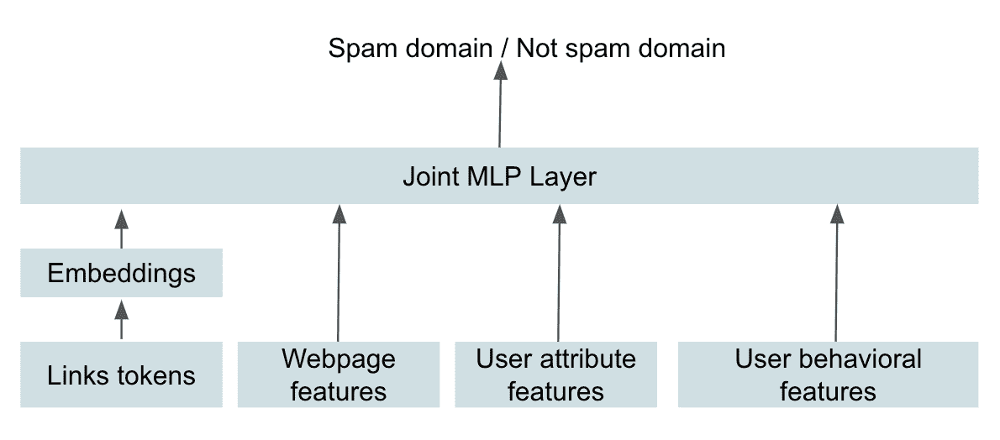
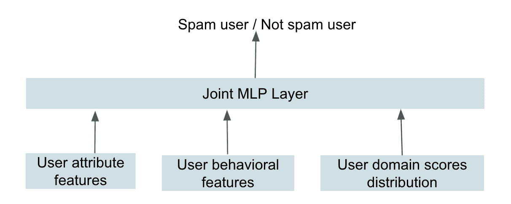
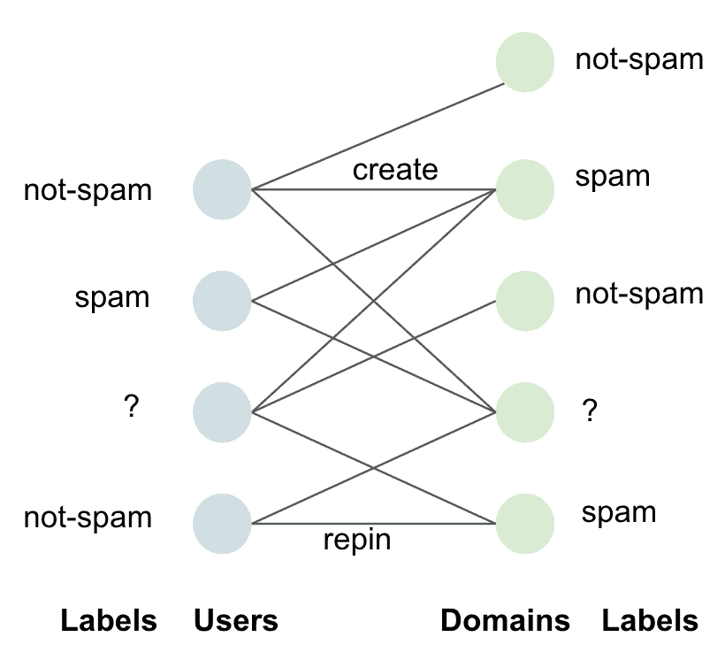

# Pinterest 如何使用机器学习来打击垃圾邮件

> 原文：<https://medium.com/pinterest-engineering/how-pinterest-fights-spam-using-machine-learning-d0ee2589f00a?source=collection_archive---------1----------------------->

Vishwakarma Singh |信任与安全机器学习主管

每个月都有数亿人访问 Pinterest，在数十亿个图钉中发现创意。灵感是一个很高的门槛，因此我们必须保持警惕，确保 Pinners 不会看到垃圾邮件、有害内容或错误信息。为了执行我们的[社区政策](https://policy.pinterest.com/en/community-guidelines)，我们使用机器学习来构建自动系统，以检测和应对垃圾邮件。

我们的反垃圾邮件系统由被动和主动两部分组成，以对付滥用者。我们的主动系统由复杂的机器学习模型组成。反应系统包括在[实时规则引擎](/pinterest-engineering/fighting-spam-with-guardian-a-real-time-analytics-and-rules-engine-938e7e61fa27)中执行的规则和轻量级机器学习模型。随着时间的推移，我们通过添加新数据和探索新的技术突破来迭代这些模型，以提高性能。

恶意行为者使用的一种策略是滥用 Pin 的图像并链接到恶意的外部网站。在这些情况下，我们的模型检测垃圾邮件载体(如 Pin 链接)以及参与垃圾邮件行为的用户。我们限制带有垃圾邮件链接的 pin 的分发，并对那些被确定参与垃圾邮件行为的人采取行动。然后，我们执行手动审查，以限制误报并通知用户。

# 机器学习模型

## 垃圾邮件域模型

我们使用深度神经网络分类器来识别垃圾邮件链接(如图 1 所示)。为了最大化影响，我们的模型学习将一个域分类为垃圾邮件而不是链接。我们对链接属于同一域的所有 pin 应用相同的强制措施。该模型在人工标记的域上进行训练，以实现更高的召回率和更低的误报率。我们使用从链接、网页文本和媒体、用户域交互和用户行为创建的特征作为输入。对于每个域，我们对链接和网页进行采样以创建特征。我们将链接分割成语义标记，并且仅使用频繁标记作为特征。我们随着时间的推移分析用户行为中的异常模式，以创建行为特征。PySpark 作业使用 Tensorflow、Spark SQL 和 UDF 定期批量推断该模型。

Figure 1\. Deep Neural Network for domain classification

## 垃圾邮件用户模型

识别参与垃圾邮件活动的用户是对抗垃圾邮件的最终解决方案，但这很难实现。因此，我们利用监督和非监督模型来建立一个有效的垃圾邮件用户识别系统。

## 分类模型

我们的垃圾邮件用户分类模型是一个深度神经网络(如图 2 所示)，是我们主动系统的一部分。它使用在最少人工监督下生成的合成标记数据进行训练，以确保质量。我们使用从用户属性和他们过去的行为创建的特征作为输入。我们还使用用户-域交互，概括为每个用户的域分数分布，其中域分数从垃圾邮件域模型中重用，作为输入。该模型通过定期批量推断，由 PySpark 作业使用 Tensorflow、Spark SQL 和 UDF 对数百万个 Pinners 进行评分。

Figure 2\. Deep Neural Network for user classification

## 使聚集

我们开发了轻量级集群模型，用于早期检测可疑用户和机器人。这种技术还解决了我们的分类模型中的差距(除非用新的标记数据重新训练，否则分类模型不知道新出现的模式)。我们根据能够高精度隔离可疑群体的属性对用户进行聚类。专家通过研究可疑用户的行为以及他们使用资源创建垃圾内容来识别这些属性。我们使用 PySpark 和 SparkSQL 实现这个模型，并每天执行它。

## 垃圾邮件用户域模型

如图 3 所示，用户与域的交互由异构二分图显式捕获。我们将用户和域表示为图中的节点，如果用户已经创建或保存了带有域链接的 Pin，则在用户和域之间创建一条边。该图有助于使用半监督学习同时识别垃圾邮件用户和域。我们使用一小组已标记的用户和域来运行标签传播算法，并学习未标记用户和域的分数。我们在 Spark 中实现了这个迭代算法，并定期运行它。

Figure 3\. Bipartite graph of users and domains for label propagation

# 尺寸

我们通过计算包含垃圾邮件链接或由参与垃圾邮件活动的用户创建的 Pin 展示的数量来衡量垃圾邮件的流行程度。我们定期抽样并手动审查印象深刻的 pin 和用户。我们通过从印象深刻的头部域进行采样和审查来扩展我们的测量，然后将覆盖范围扩展到尾部域。这些样本用于测量整体垃圾邮件的流行程度，以及训练我们的机器学习模型。

我们通过一系列机器学习模型来对抗恶意用户和垃圾内容，努力保护 Pinners 的体验。我们将继续投资发展我们的社区指南和技术，以应对不可避免的威胁。

# 感谢

*感谢、Omkar Panhalkar、刘、曾庆龙、Attila Dobi、Abhijit Mahabal、Alok Singhal、Samuelson 以及 Trust and Safety 团队的其他成员为开发垃圾邮件机器学习模型所做的贡献。感谢哈里·沙曼斯基帮助发表这篇博文。*

*要在 Pinterest 了解更多关于工程的信息，请查看我们的* [*工程博客*](https://medium.com/pinterest-engineering) *，并访问我们的*[*Pinterest Labs*](https://labs.pinterest.com/)*网站。要查看和申请空缺职位，请访问我们的* [*职业*](https://www.pinterestcareers.com/homepage) *页面。*