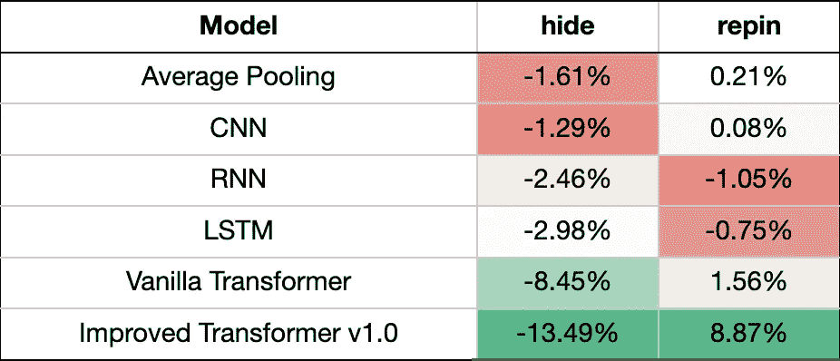

# Pinterest 如何在推荐中利用实时用户操作来提高 Homefeed 参与量

> 原文：<https://medium.com/pinterest-engineering/how-pinterest-leverages-realtime-user-actions-in-recommendation-to-boost-homefeed-engagement-volume-165ae2e8cde8?source=collection_archive---------0----------------------->

夏雪，软件工程师，Homefeed 排名；能谷，软件工程师，内容与用户理解；Dhruvil Deven Badani，工程经理，Homefeed 排名；Andrew Zhai，软件工程师，先进技术集团

Image from [https://wallpapercave.com/neural-networks-wallpapers#google_vignette](https://wallpapercave.com/neural-networks-wallpapers#google_vignette)

在这篇博文中，我们将从机器学习模型设计的角度展示我们如何通过利用 Homefeed 推荐系统中的实时用户操作功能来提高 Pinterest Homefeed 的参与量。

# 背景

Pinterest 的主页是 pinners 发现灵感的最重要的平台之一，并在整体用户参与度中占很大比例。显示在主页顶端位置的引脚需要个性化，以创建一个引人入胜的 pinner 体验。我们从 Pinterest 上创建的大量 pin 中检索一小部分，根据用户兴趣、关注的论坛等作为 Homefeed 候选 pin。为了向 pinners 呈现最相关的内容，我们然后使用一个 Homefeed 排名模型(又名 [Pinnability](/pinterest-engineering/pinnability-machine-learning-in-the-home-feed-64be2074bf60) 模型)通过准确预测它们与给定用户的个性化相关性来对检索到的候选内容进行排名。因此，Homefeed 排名模型在改善 pinner 体验方面发挥了重要作用。Pinnability 是一个最先进的神经网络模型，它消耗 pin 信号、用户信号、上下文信号等。并且预测给定 pin 的用户动作。高层架构如图 3 所示。

Figure 1\. What Homefeed Ranking (Pinnability) does — image from [Pinnability: Machine learning in the home feed](/pinterest-engineering/pinnability-machine-learning-in-the-home-feed-64be2074bf60)

Pinnability 模型一直使用一些预先训练的用户嵌入来模拟用户的兴趣和偏好。例如，我们使用[pinner former](https://arxiv.org/abs/2205.04507)(pinner sage V3)，这是一种静态的、离线学习的用户表示，通过利用用户过去在 Pinterest 上的交互历史来捕捉用户的长期兴趣。

然而，仍有一些方面是 PinnerSAGE 等预训练嵌入没有涵盖的，我们可以通过使用实时用户操作序列功能来填补这一空白:

*   **模型 pinners 的短期兴趣** : PinnerSAGE 是用成千上万的用户长期行为训练出来的，所以它主要捕捉的是长期兴趣。另一方面，实时用户动作序列模拟短期用户兴趣，是对 PinnerSAGE 嵌入的补充。
*   **响应更快**:实时信号能够更快地响应，而不是其他静态特性。这是很有帮助的，尤其是对于新的、临时的和复活的用户，他们过去没有太多的参与。
*   **推荐模型目标的端到端优化**:我们使用用户动作序列特征作为推荐模型的直接输入特征，直接针对模型目标进行优化。与 PinnerSAGE 不同，我们可以通过每个单独的序列动作来参与 pin 候选特征，以获得更大的灵活性。

为了向 pinners 提供他们最近行为的实时反馈，并改善用户在 Homefeed 上的体验，我们提出将实时用户行为序列信号纳入推荐模型。

# 特征:实时用户动作序列

一个稳定、低延迟、实时的特征管道支持一个健壮的在线推荐系统。我们将最新的 100 个用户操作作为一个序列，用 pin 嵌入和其他元数据填充。整个架构可以分为事件时间和请求，如图 2 所示。

Figure 2\. Realtime Feature Generation Pipeline

为了最大限度地减少应用停机时间和信号故障，我们在以下方面做出了努力:

ML 侧

*   功能/模式强制验证
*   延迟源事件处理以防止数据泄漏
*   一段时间内的逐项行动跟踪数据转移

运营端

*   对核心作业运行状况、延迟/吞吐量等进行统计监控。
*   全面的随叫随到服务，最大限度地减少应用停机时间
*   事件恢复策略

我们为 Homefeed 推荐模型生成了以下特征:

Table 1\. Realtime User Action Sequence Features — learn more about [pinSAGE](https://arxiv.org/pdf/1806.01973.pdf)

# 建模:变压器编码器

图 3 是我们的 Homefeed 排名模型的概述。该模型消耗一个 **<用户，pin >** 对，并预测用户对候选 pin 采取的动作。我们对可定位性模型的输入包括各种类型的信号，包括 pinner 信号、用户信号、pin 信号和上下文信号。我们现在添加一个独特的、实时的用户序列信号输入，并使用一个序列处理模块来处理序列特征。随着所有特征的转换，我们将它们提供给具有多个动作头部的 MLP 层，以预测用户在候选 pin 上的动作。

Figure 3\. Pinterest Homefeed Ranking (Pinnabilty) Model

最近的文献已经使用变压器进行推荐任务。有些人将推荐问题建模为序列预测任务，其中模型的输入是(S1，S2，…，SL-1)，其预期输出是同一序列的“移位”版本:(S2，S3，…，SL)。为了保持当前的可定位架构，我们仅采用这些模型中的**编码器**部分。

为了构建 transformer 输入，我们利用了三个重要的实时用户序列特性:

1.  参与 pin 嵌入:用户历史中过去 100 个参与 pin 的 pin 嵌入(已学习的 GraphSage 嵌入)
2.  动作类型:用户动作序列中的参与类型(例如，重复、点击、隐藏)
3.  时间戳:用户参与用户历史的时间戳

我们还使用候选 pin 嵌入来执行与上述实时用户序列特征的早期融合。

Figure 4\. initial architecture of user sequence transformer module (v1.0)

如图 3 所示，为了构建序列转换器模块的输入，我们将**【candidate _ pin _ emb，action_emb，engaged _ pin _ emb】**堆叠成一个矩阵。在线和离线实验证明，候选 pin 和用户序列的早期融合是非常重要的。我们还在序列中的条目上应用了一个**随机时间窗口掩码**，其中动作是在请求时间的一天内发生的。随机时间窗口掩码用于降低模型的响应性，并避免多样性下降。然后我们把它输入变压器编码器。对于最初的实验，我们只使用一个 transformer 编码器层。变压器编码器的输出是一个形状为 ***【序列长度，隐藏尺寸】的矩阵。然后，我们将输出展平为一个矢量，并将其与所有其他特征一起输入 MLP 层，以预测多头用户的动作。***

在用户序列模块(1.1 版)的第二次迭代中，我们在 1.0 版架构上做了一些调整。我们增加了变压器编码器层数，并压缩了变压器输出。我们没有展平整个输出矩阵，而是只取了前 10 个输出标记，将它们与 max pooling 标记连接起来，并展平为一个长度为***(10+1)* hidden _ dim***的向量。前 10 个输出令牌捕获用户最近的兴趣，最大池令牌可以代表用户的长期偏好。因为输出尺寸变得更小，所以在完整的功能集上应用带有 [DCN v2](https://arxiv.org/abs/2008.13535) 架构的显式功能交叉层是可以承受的，如图 2 所示

Figure 5\. improved architecture of user sequence transformer module (v1.1)

## 挑战 1:参与率下降

通过在线实验，我们看到在进行实时动作序列处理的小组中，用户参与度指标逐渐衰减。图 6 展示了对于相同的模型架构，如果我们不对其进行重新训练，那么参与度的提高要比我们对新数据进行重新训练时小得多。

Figure 6\. Engagement Rate Decay

我们的假设是，我们具有实时特性的模型对时间非常敏感，需要频繁的重新训练。为了验证这一假设，我们同时对控制组(没有实时用户动作特征)和处理组(具有实时用户动作特征)进行了再训练，并且我们对两种模型的再训练效果进行了比较。如图 6 所示，我们发现治疗模型中的再培训收益比控制模型中的多得多。

Figure 7\. Retrain Comparison Between Control and Treatment

因此，为了应对参与度衰减的挑战，我们每周重新培训两次实时序列模型。通过这样做，参与率变得稳定多了。

## 挑战 2:为有机规模的大型模型提供服务

随着转换器模块被引入推荐器模型，复杂性显著增加。在这项工作之前，Pinterest 一直在 CPU 集群上服务 Homefeed 排名模型。我们的模型将 CPU 延迟增加了 20 倍以上。然后，我们迁移到为排名模型服务的 GPU，并能够以相同的成本保持中性延迟。

# 结果

在 Pinterest 上，最重要的用户操作之一是 repin，或 save。列宾是该平台用户参与度的关键指标之一。因此，我们用列宾数量来估计用户参与度，并使用列宾数量来评估模型性能。

## 离线评估

我们对处理实时用户序列特征的不同模型进行离线评估。具体来说，我们尝试了以下架构:

*   **平均池**:最简单的架构，使用用户序列中嵌入的 pin 的平均值来表示用户的短期兴趣
*   **(卷积神经网络(CNN):** 使用 CNN 对一系列 pin 嵌入进行编码。CNN 适合于捕捉跨局部信息的依赖关系
*   **递归神经网络(RNN):** 使用 RNN 对一系列 pin 嵌入进行编码。与 CNN 相比，RNN 更好地捕捉了长期依赖。
*   **失去短期记忆(LSTM):** 使用 LSTM，一个更复杂的 RNN 版本，通过使用记忆细胞和门控，比 RNN 更好地捕捉长期依赖关系。
*   **普通转换器:**直接使用转换器模块仅对引脚嵌入序列进行编码。
*   **改进的 Transformer v1.0:** 改进的 Transformer 架构如图 4 所示。

特别是对于 Homefeed surface，两个最重要的指标是 HIT@3 for repin 和 hide prediction。对于列宾，我们尽量提高 HIT@3。对于隐藏，目标是减少命中@3。

Table 2\. Offline Evaluation Metrics

离线结果显示，即使使用普通变压器和仅有引脚嵌入，性能也已经优于其他架构。改进的变压器架构显示出非常强劲的离线结果:离线列宾+8.87%，隐藏下降-13.49%。从 vanilla transformer 改进的 transformer 1.0 的增益来自几个方面:

1.  使用动作嵌入:这有助于模型区分积极参与和消极参与
2.  候选 pin 和用户序列的早期融合:根据在线和离线实验，
3.  随机时间窗掩码:有助于多样性

## 在线评估

然后，我们使用改进的 transformer 模型 v1.0 对总流量的 1.5%进行了在线 A/B 实验。在在线实验过程中，我们观察到整体用户的 repin 量增加了 6%。我们将新的、临时的、复活的用户集合定义为 ***非核心用户*** 。我们观察到，非核心用户的 repin 交易量增长可以达到 11%。与离线评估一致，生皮体积减少了 10%。

最近，我们尝试了 transformer 版，如图 4 所示，我们在 1.0 版的基础上实现了额外 5%的 repin 增益。隐藏音量在 1.0 版中保持中性。

Table 3\. Online Experiment Metrics for Homefeed Surface

## 生产指标(全流量)

我们想提出一个有趣的观察:在线实验低估了实时用户动作序列的力量。当我们将该模型作为生产 Homefeed 排名模型推广到全流量时，我们观察到了更高的收益。这是因为正反馈循环的学习效应:

1.  当用户看到一个响应性更强的主页时，他们倾向于使用更相关的内容，他们的行为也发生了变化(例如，更多的点击或重复)
2.  随着这种行为变化，实时记录他们行为的实时用户序列也发生了变化。例如，序列中有更多的列宾动作。然后，我们用这个移位的用户序列特征生成训练数据。
3.  当我们用这个转移的数据集重新训练 Homefeed 排名模型时，有一个积极的复合效应，使重新训练的模型更加强大，从而提高了参与率。然后我们回到 1。

Figure 8\. Feedback Loop of Realtime Sequence Model

我们在将该模型交付生产后观察到的实际 Homefeed repin 数量增长高于在线实验结果。不过，我们不会在这篇博客中透露确切的数字。

# 结论

我们在 Pinterest 的 Homefeed 推荐系统中使用实时用户动作信号的工作极大地提高了 Homefeed 的相关性。在其他传统的序列建模方法中，Transformer 架构表现得最好。一路走来有各种各样的挑战，要解决这些挑战并不容易。我们发现，用实时序列重新训练模型对于保持用户参与度非常重要。并且 GPU 服务对于大规模、复杂的模型是不可或缺的。

# 未来的工作

看到这项工作的巨大收获是令人兴奋的，但更令人兴奋的是，我们知道还有很大的改进空间。为了继续改善 Pinner 体验，我们将从以下几个方面着手:

1.  **特性改进:**我们计划开发一个更细粒度的实时序列信号，包括更多的动作类型和动作元数据。
2.  **GPU 服务优化:**这是第一个使用 GPU 集群为有机规模的大型模型提供服务的用例。我们计划提高 GPU 服务的可用性和性能。
3.  **模型迭代**:我们将继续进行模型迭代，以便充分利用实时信号。
4.  **在其他界面上的采用**:我们将在其他界面上尝试类似的想法:相关的 pin、通知、搜索等。

# 确认

这项工作是 Pinterest 多个团队合作的结果。非常感谢对本项目做出贡献的以下人员:

*   GPU 服务优化:Po-王巍，Pong Eksombatchai，Nazanin Farahpour，张志远，Saurabh Joshi，唐力
*   关于 ML 的技术支持:Nikil Pancha
*   信号生成和服务:周奕彤
*   快速可控性分布收敛:Ludek Cigler

*要在 Pinterest 上了解更多工程知识，请查看我们的* [*工程博客*](https://medium.com/pinterest-engineering) *，并访问我们的*[*Pinterest Labs*](https://www.pinterestlabs.com?utm_source=medium&utm_medium=blog-article-link&utm_campaign=xia-nov-4-2022)*网站。要探索 Pinterest 的生活，请访问我们的* [*职业*](https://www.pinterestcareers.com?utm_source=medium&utm_medium=blog-article-link&utm_campaign=xia-nov-4-2022) *页面。*