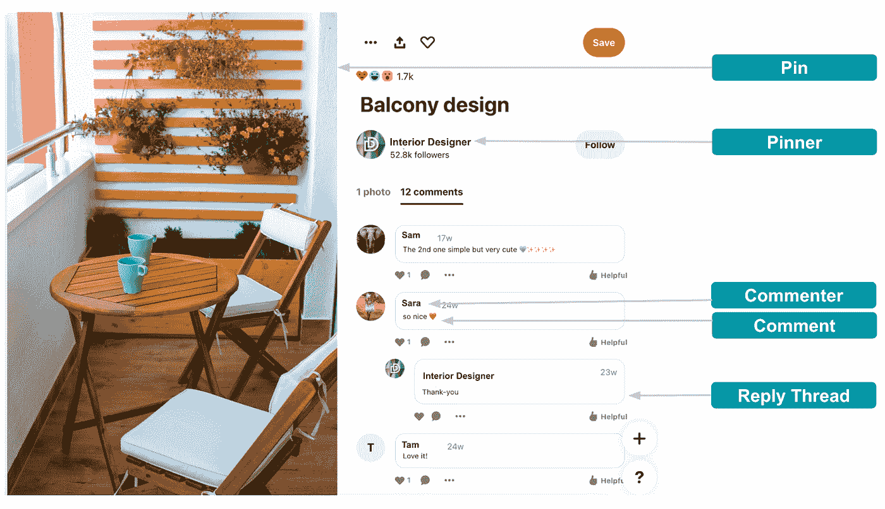
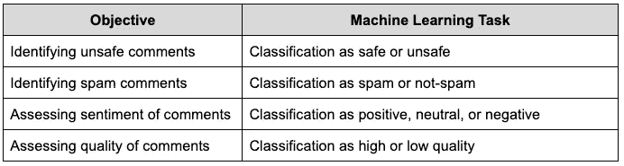
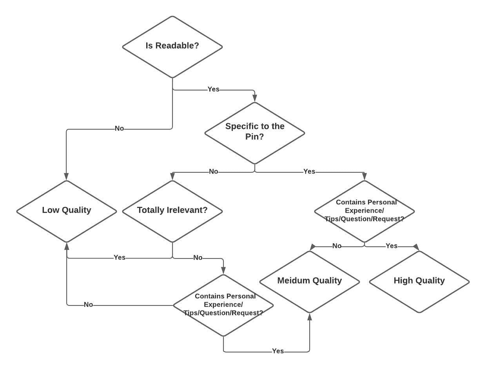
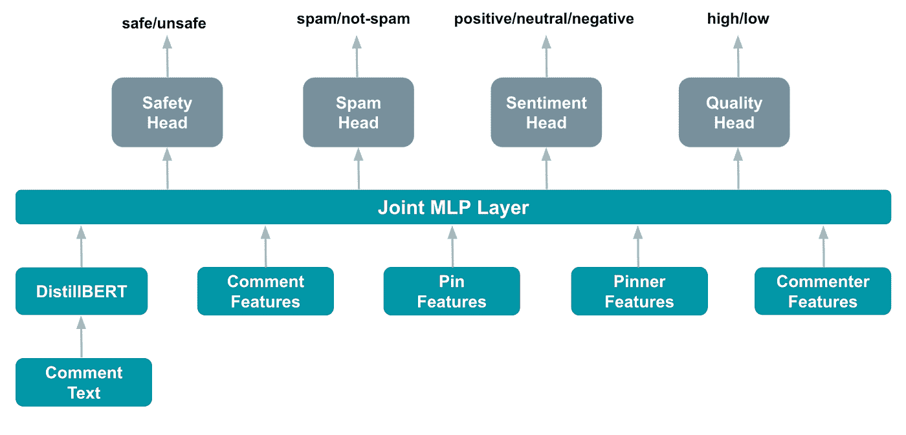
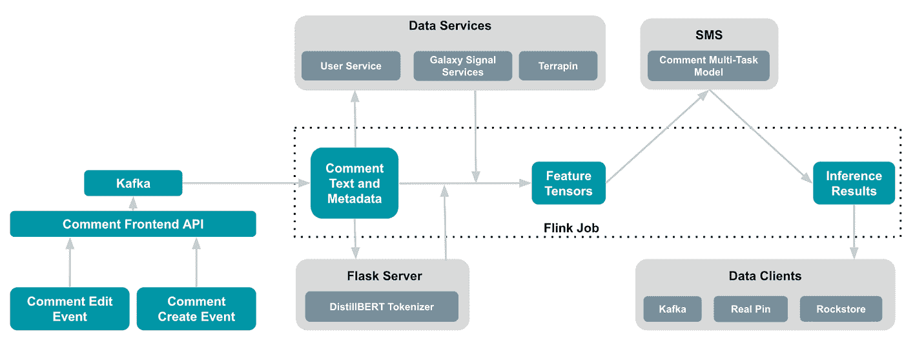

# Pinterest 如何通过机器学习推动健康的评论生态系统

> 原文：<https://medium.com/pinterest-engineering/how-pinterest-powers-a-healthy-comment-ecosystem-with-machine-learning-9e5c3414c8ad?source=collection_archive---------0----------------------->

宋远方|机器学习工程师，信任与安全；曾庆龙|工程经理，内容质量信号；和 Vishwakarma Singh |机器学习领导，信任和安全

随着 Pinterest 继续从一个只是保存想法的地方发展成为一个发现激发行动的内容的平台，创作者直接发布到 Pinterest 的原生内容越来越多。随着 Pinterest 上的创作者生态系统不断发展，我们致力于通过像[创作者守则](https://business.pinterest.com/creator-code/)这样的举措来确保 Pinterest 仍然是一个积极和鼓舞人心的环境，这是一项内容政策，在创作者可以发布想法 pin 之前，强制接受准则(如“善良”和“核实事实”)。我们还在 Idea Pin 评论上设置了护栏，包括正面提醒、评论删除和关键词过滤工具以及垃圾邮件预防信号。在技术方面，我们使用机器学习中的尖端技术来近乎实时地识别和执行违反社区政策的评论。我们还使用这些技术首先展示最鼓舞人心和最高质量的评论，以便带来更富有成效的体验和推动参与。

自从 3 月份推出机器学习解决方案，在报告之前自动检测潜在的违反政策的评论并采取适当的措施，我们已经看到评论报告率(每 100 万次评论展示的用户评论报告)下降了 53%。

在这里，我们分享了我们如何构建一个可扩展的近实时机器学习解决方案，以识别违反政策的评论并按质量对评论进行排名。

**Figure 1: Comment ecosystem on Pinterest**

# 评论的各个方面

我们大致确定了评论的四个方面:不安全，或者评论违反了我们的[社区指南](http://policy.pinterest.com/en/community-guidelines)；垃圾邮件；感悟；和质量。评论的情感可以是积极的、中性的或消极的。评论的质量可高可低。我们通过使用内在维度来衡量评论的质量:可读性、与 Pin 的相关性和细微差别。如果一个评论没有错误并且可以理解，那么它就是可读的。相关注释是特定的，并且与 Pin 的内容相关。细致入微的评论是问题、提示、建议、请求或描述评论者的个人经历或与 Pin 的互动。细致入微、可读性强且与 Pin 相关的注释被认为是高质量的。

# 机器学习解决方案

我们利用机器学习技术来识别违反政策(不安全和垃圾)的评论，以及评估评论的情绪和质量。我们将这些任务建模为分类任务，如表 1 所示。我们的机器学习解决方案目前支持多种语言(英语、法语、德语、葡萄牙语、西班牙语、意大利语和日语)，未来将扩展到其他语言。

**Table 1\. Comment objectives transformed into classification tasks**

## 培训用数据

我们仅使用英语的标记注释来训练模型。我们采用混合方法来限制收集标记数据的成本。不安全、垃圾邮件和非垃圾邮件标记的评论是通过对社区报告的评论进行人工验证而获得的。安全标签评论是通过对 Pinterest 上的所有评论进行随机抽样生成的，因为不安全评论的数量非常低。正面和负面情感类别的标记数据是通过对随机采样的评论进行人工标记而获得的。由于负面评论的流行率也非常低，我们使用 [Vader 情绪分析器](https://github.com/cjhutto/vaderSentiment)对评论进行采样，以进行负面情绪标记。对于质量标签，我们收集了评论者对评论中每个质量定义因素的回应。最后，我们使用图 2 所示的决策流程图将这些响应分为三个质量等级。目前，我们将所有中等质量的评论视为高质量的评论，并将在未来探索一种单独的处理方式，以便更好地控制评论质量排名。

**Figure 2: Labeling a comment for quality using intrinsic factors**

## 模型

我们设计了一个多任务模型，如图 3 所示，它通过微调一个强大的最先进的预训练 transformer 模型(多语言 [DistilBERT](https://huggingface.co/distilbert-base-multilingual-cased) )来利用迁移学习。这种设计选择在整体性能、生命周期成本和开发速度方面产生了最佳价值。成本降低来自于使用预先训练的模型，该模型需要相对少量的标记数据用于进一步训练，并且必须在整个生命周期中维护单个模型。我们的评估表明，对于每个分类任务，多任务模型的性能与独立模型相当。我们利用了多语言预培训模型，因为它帮助我们将模型的覆盖范围扩大到除英语之外的许多语言，而不需要针对这些语言的任何特定培训，尽管性能有所下降。

为了带来上下文并提高模型的性能，我们还使用了 Pin、Pinner、commenter 和附加评论功能，这些功能是 Pinterest 评论生态系统的组件(如图 1 所示)。这些特征与 DistilBERT 的最后一个隐藏层输出连接在一起，并输入到一个联合多层感知器(MLP)中，该感知器还允许特征之间的交叉学习。Pin 特征包括 [PinSage](https://arxiv.org/abs/1806.01973) 嵌入和 Pin 语言。品酒师和评论者特征包括使用[品酒法](https://arxiv.org/abs/2007.03634)嵌入和像语言这样的简档特征导出的他们之间的口味相似性。附加的注释特性是注释长度和语言。

**Figure 3: Multi-task comment model architecture**

每个任务头都有自己的输出层，它可以生成各个类的分数分布。二进制分类头使用 sigmoid 激活进行输出，使用二进制交叉熵进行损失。情感分类头使用 softmax 输出层和交叉熵损失。对于每个训练数据实例，只有那些任务头对数据点具有标签的总损失函数有贡献。该模型使用 Tensorflow 和 Keras 实现，并使用多个 GPU 上的数据并行性进行训练。我们对召回率和误报率进行了优化。我们学习了一个分数临界值来识别不安全、垃圾和负面情绪的评论。

## 推理

我们使用 [Pinterest 的流媒体数据平台](/pinterest-engineering/unified-flink-source-at-pinterest-streaming-data-processing-c9d4e89f2ed6) ( [Flink](https://flink.apache.org/) )对新创建/编辑的评论进行近实时评分，如图 4 所示。我们在 Pinterest 的在线模型服务平台([短信](/pinterest-engineering/building-a-dynamic-and-responsive-pinterest-7d410e99f0a9))托管多任务评论模型。为了准备 DistilBERT 的输入，我们在 Python [Flask](https://flask.palletsprojects.com/en/2.0.x/) 中托管了来自 [hugging face](https://huggingface.co/distilbert-base-multilingual-cased) 的相应标记器作为服务。Flink 作业从由前端 API 服务在新的 comment-create 或 comment-edit 事件上填充的 [Kafka](https://kafka.apache.org/intro) 队列中接收注释及其关联的元数据。该作业使用注释的语言作为过滤器，仅推断受支持语言的注释。它通过 HTTP 与 Flask 服务通信，以获取 DistilBERT 输入。它从 Pinterest 的一堆数据服务(如 [Galaxy Signal Service](/pinterest-engineering/pinterest-visual-signals-infrastructure-evolution-from-lambda-to-kappa-architecture-f8f58b127d98) 和 [Terrapin](/pinterest-engineering/open-sourcing-terrapin-a-serving-system-for-batch-generated-data-7aa2f38c4472) )中获取模型所需的其他输入特征。Flink 作业将所有特征转换为张量，然后向 SMS 发出请求进行预测。最终，它将推理结果汇集到几个数据客户端，如 Rockstore、RealPin 和 Kafka，供其他消费者使用。Rockstore 是一个分布式键值存储，也是 Pinterest KVStore 平台的一个管理和协调 API & MySQL 后端存储。RealPin 是一个高性能的对象检索系统，具有高度可定制的排序、聚合和过滤功能。

**Figure 4\. Inference workflow for scoring comments**

# 服务

我们有两个独立的服务工作流，它们使用推理输出、执行策略以及对评论进行排名。工作流的分离提供了逻辑模块化，并有助于简化操作、管理和诊断。第一个工作流过滤不安全和垃圾评论，另一个工作流使用情感和质量分数等因素采取适当的过滤或排名行动。我们目前将回复视为独立评论，并提供类似的处理方式。

# 结论

我们的机器学习解决方案针对可能违反政策的评论提供了强大的防御，并确保我们的 Pinner 社区有一个安全的生态系统来参与和受到启发。识别有害的评论和评估评论的质量将继续发展，因为上下文、发展趋势和其他细微差别，如讽刺、否定、比较、语气、极性、情感转变、意义转变等都在发挥作用。我们计划反复改进我们的解决方案，并修订我们的社区指南。我们也看到了将该模式用于其他用例的机会，如隐藏式字幕、直接消息传递和其他基于文本的用户参与形式。

*要在 Pinterest 了解更多关于工程的信息，请查看我们的* [*工程博客*](https://medium.com/pinterest-engineering) *，并访问我们的*[*Pinterest Labs*](https://www.pinterestlabs.com/?utm_source=medium&utm_medium=blog-article-link&utm_campaign=song-et-al-december-3-2021)*网站。要查看和申请空缺职位，请访问我们的* [*职业*](https://www.pinterestcareers.com/?utm_source=medium&utm_medium=blog-article-link&utm_campaign=song-et-al-december-3-2021) *页面。*

# 感谢

非常感谢尼娜·王启尧、比阿特丽斯·张、阿布舍克·贾森和在模型开发和部署过程中做出的贡献。我们感谢蔡美诗·萨缪尔森和 Ashley Chin 的分析、产品见解和支持。感谢安德烈·古塞夫的见解和帮助。感谢沙基·陈楠·昆努梅尔和尼尔什·戈赫尔分享他们的技术见解。最后，我们感谢哈里·沙曼斯基对发表这篇博客的支持。