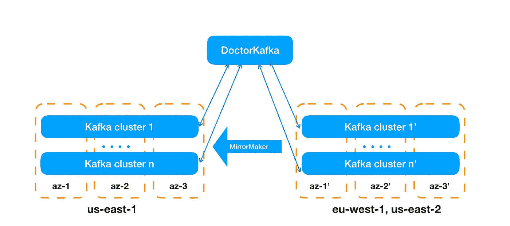
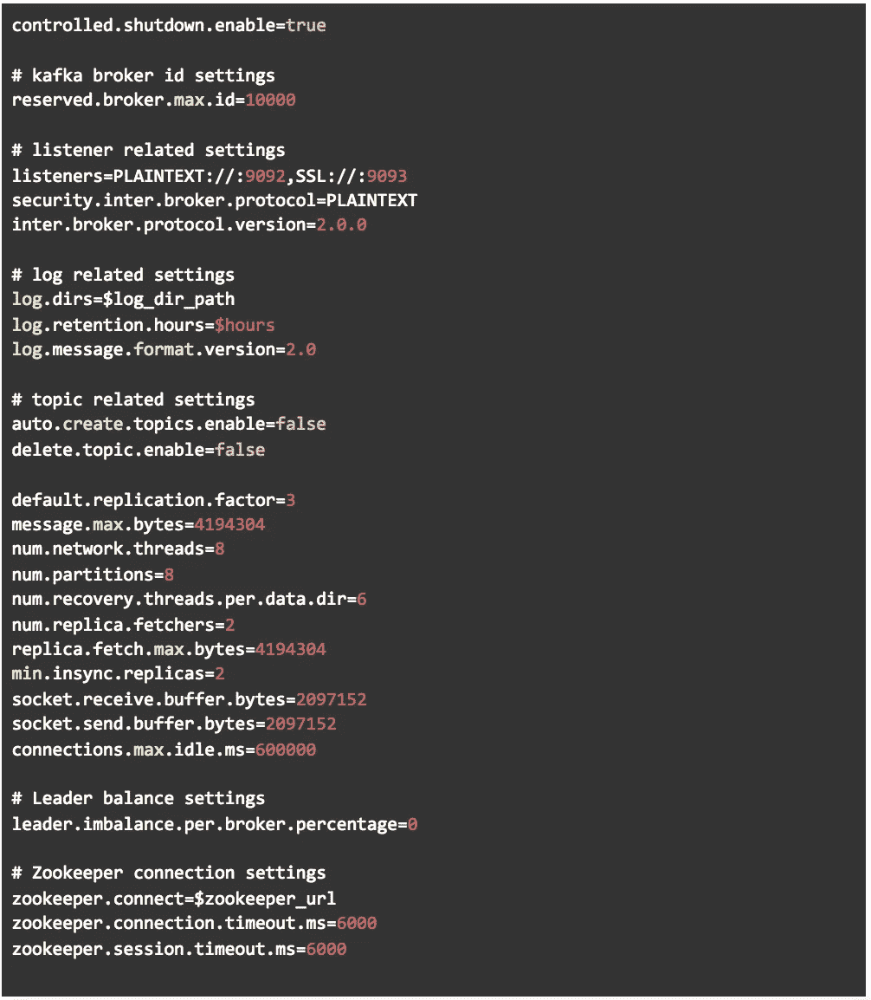
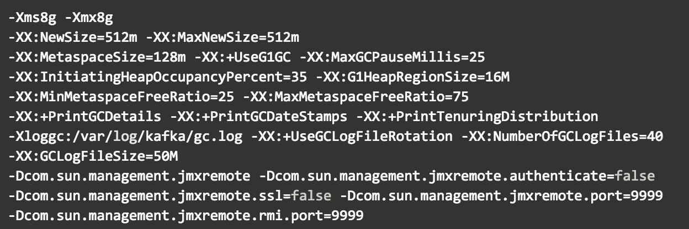
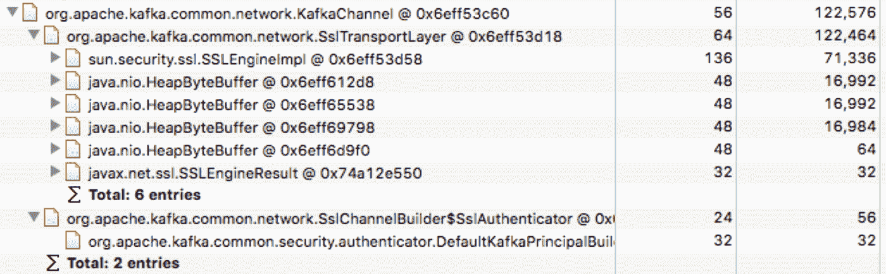

# Pinterest 如何规模化经营卡夫卡

> 原文：<https://medium.com/pinterest-engineering/how-pinterest-runs-kafka-at-scale-ff9c6f735be?source=collection_archive---------0----------------------->

杨宇| Pinterest 工程师，数据工程

Pinterest 在云中运行最大的 Kafka 部署之一。我们广泛使用 [Apache Kafka](https://kafka.apache.org/) 作为消息总线来传输数据和支持实时流媒体服务，最终帮助全球超过 2.5 亿 Pinners 发现和做他们喜欢的事情。

正如在[早先的帖子](/@Pinterest_Engineering/scalable-and-reliable-data-ingestion-at-pinterest-b921c2ee8754)中提到的，我们使用 Kafka 将数据传输到我们的数据仓库，包括像印象、点击、特写和重复这样的关键事件。我们还使用 Kafka 来传输我们内部服务的可见性指标。如果与指标相关的 Kafka 集群有任何故障，我们就无法准确地监控我们的服务或生成发出问题信号的警报。在实时流媒体方面，Kafka 用于支持许多流媒体应用程序，如新鲜内容索引和推荐、垃圾邮件检测和过滤、实时广告商预算计算等。

我们已经在 2018 年 [Kafka 峰会](https://kafka-summit.org/kafka-summit-san-francisco-2018/schedule/)上分享了关于[使用 Kafka](https://www.confluent.io/kafka-summit-sf18/pinterests-story-of-streaming-hundreds-of-terabytes) 增量 db 摄取和[使用 kafka streams](https://www.confluent.io/kafka-summit-sf18/building-pinterest-real-time-ads-platform-using-kafka-streams) 构建实时广告平台的经验。亚马逊网络服务上运行着> 2，000 个代理，每天传输>8000 亿条消息和>1.2 Pb，在高峰时段每秒处理> 1，500 万条消息，我们经常被问到我们的 Kafka 设置以及如何在云中可靠地运行 Kafka。我们借此机会分享我们的经验。

**Pinterest 卡夫卡设置**

图 1 显示了 Pinterest Kafka 服务的设置。目前我们在 AWS 的三个地区有 Kafka。大多数卡夫卡经纪人都在美国东部 1 区。我们在美国东部-2 和欧盟西部-1 的足迹较小。我们使用 MirrorMaker 在这三个区域之间传输数据。在每个区域，我们将代理分布在多个集群中，以实现主题级隔离。因此，一个集群故障只会影响有限数量的主题。我们将每个集群的最大规模限制为 200 个代理。

我们目前使用 d2.2xlarge 作为默认的代理实例。d 2.2x 大型实例类型适用于大多数 Pinterest 工作负载。我们还有一些小型集群使用 d 2.8 x 大型实例进行高扇出读取。在选择使用本地存储的 d2 实例之前，我们尝试对 Kafka 工作负载使用弹性块存储 st1(吞吐量优化硬盘)。我们发现使用本地存储的 d2 实例的性能优于 EBS st1 存储。

*Figure 1\. Pinterest Kafka setup*

我们将*default . replication . factor*设置为 3，以防止一个集群中出现最多两个代理故障。截至 2018 年 11 月，AWS [分布放置组](https://docs.aws.amazon.com/AWSEC2/latest/UserGuide/placement-groups.html#placement-groups-spread)将每组每个可用性区域的运行实例限制为 7 个。由于这一限制，我们无法利用分布放置组来保证将副本分配给同一可用性分区中的不同物理主机。相反，我们将每个 Kafka 集群中的代理分布在三个可用性区域中，并确保每个主题分区的副本分布在可用性区域中，以承受每个集群最多两个代理故障。

**卡夫卡集群自愈**

随着数以千计的代理在云中运行，我们几乎每天都有代理失败。处理代理故障需要手工操作。这大大增加了团队的运营开销。2017 年，我们构建并开源了 [DoctorKafka](https://github.com/pinterest/doctorkafka) ，这是一项 Kafka 运营自动化服务，用于在运营自动化的代理故障期间执行分区重新分配。

事实证明，仅仅重新分配分区是不够的。2018 年 1 月，我们遇到了由于硬件降级而仅通过分区重新分配无法修复的代理故障。当底层物理机降级时，代理会陷入意外的糟糕状态。尽管 DoctorKafka 可以将故障代理上的主题分区分配给其他代理，但依赖服务的生产者和消费者仍可能试图与故障或降级的代理对话，从而导致依赖服务出现问题。快速替换失败的经纪人对于保证 Kafka 服务质量非常重要。

在 Q1 2018 中，我们改进了 DoctorKafka 的代理替换功能，允许它使用用户提供的脚本自动替换失败的代理，这帮助我们保护 Kafka 集群免受不可预见的问题。在短时间内更换过多的代理会导致数据丢失，因为我们的集群只存储三个数据副本。为了解决这个问题，我们在 DoctorKafka 中构建了一个速率限制特性，允许它在一段时间内只为一个集群替换一个代理。

还值得注意的是， [AWS ec2 api](https://docs.aws.amazon.com/cli/latest/reference/ec2/assign-private-ip-addresses.html) 允许用户替换实例，同时保持主机名和 IP 地址不变，这使我们能够最大限度地减少代理替换对依赖服务的影响。从那以后，我们已经能够将与 Kafka 相关的警报减少 95%,并在最少人工干预的情况下保持> 2000 个经纪人在云中运行。在 DoctorKafka 中，我们的代理替换配置见[这里](https://github.com/pinterest/doctorkafka/blob/master/drkafka/config/doctorkafka.properties#L51)。

**与 Kafka 开源社区合作**

Kafka 开源社区一直在积极开发新功能和修复已知问题。我们建立了一个内部构建，在发布分支中不断地引入最新的 Kafka 变更，并以每月一次的节奏将它们推向生产。

我们自己也改进了 Kafka，并将这些变化反馈给了社区。最近，Pinterest 的工程师对卡夫卡做出了以下贡献:

*   [KIP-91](https://cwiki.apache.org/confluence/display/KAFKA/KIP-91+Provide+Intuitive+User+Timeouts+in+The+Producer) 向 Kafka producer 添加 delivery.timeout.ms
*   [KIP-245](https://cwiki.apache.org/confluence/display/KAFKA/KIP-245%3A+Use+Properties+instead+of+StreamsConfig+in+KafkaStreams+constructor) 在 KafkaStreams 构造函数中使用属性而不是 StreamsConfig
*   [KAFKA-6896](https://issues.apache.org/jira/browse/KAFKA-6896)KAFKA 流中的出口生产者和消费者指标
*   [KAFKA-7023](https://issues.apache.org/jira/browse/KAFKA-7023) 自定义 RocksDBConfigSettters 后调用 Move prepareForBulkLoad()
*   [KAFKA-7103](https://issues.apache.org/jira/browse/KAFKA-7103) 在初始化期间对 RocksDBSegmentedBytesStore 使用批量装载

我们还提出了几个正在讨论中的 Kafka 改进方案:

*   [KIP-276](https://cwiki.apache.org/confluence/display/KAFKA/KIP-276+Add+StreamsConfig+prefix+for+different+consumers) 为不同的消费者添加配置前缀
*   [KIP-300](https://cwiki.apache.org/confluence/display/KAFKA/KIP-300%3A+Add+Windowed+KTable+API+in+StreamsBuilder) 添加窗口式 KTable API
*   [KIP-345](https://cwiki.apache.org/confluence/display/KAFKA/KIP-345%3A+Introduce+static+membership+protocol+to+reduce+consumer+rebalances) 通过静态会员资格减少消费者再平衡

**下一步**

尽管我们已经对 Pinterest 的 Kafka 服务进行了改进，但要将服务提升到一个新的水平，还有许多有趣的问题需要解决。例如，我们将在 Pinterest 探索 Kubernetes 作为卡夫卡的抽象层。

我们目前正在研究为 Kafka 集群使用两个可用性区域来降低区域间数据传输成本，因为两个可用性区域同时出现故障的可能性很低。AWS 最新一代实例类型经过 EBS 优化，拥有专用的 EBS 带宽和比前几代更好的网络性能。因此，我们将评估这些利用 EBS 实现更快 Kafka broker 恢复的最新实例类型。

Pinterest engineering 有许多有趣的问题需要解决，从构建可扩展、可靠和高效的基础设施到应用尖端的机器学习技术来帮助 Pinners 发现和做他们喜欢的事情。查看[我们开放的工程职位并加入我们](https://careers.pinterest.com/careers)！

**:非常感谢 Henry Cai、Shawn Nguyen、yiyi Yin、裴礼泉、陈柏扬、、Robert Claire、Jayme Cox、和 Ambud Sharma，他们改进了 Pinterest 的 Kafka 服务。**

***附录:***

*1.我们对 d 2.2x 大型实例使用的 Kafka broker 设置。这里我们只列出与 Kafka 默认值不同的设置。*

**

*2.以下是 Pinterest Kafka java 参数。*

**

*我们在 Pinterest 上为 Kafka 启用了 TLS 访问。从 Kafka 2.0.0 开始，每一个具有 ssl 连接的 KafkaChannel 需要花费~122K 内存，Kafka 可能会因为频繁的重新连接而积累大量未关闭的 Kafka channel(详见 [KAFKA-7304](https://issues.apache.org/jira/browse/KAFKA-7304) )。我们使用 8GB 的堆大小来最小化 Kafka 遇到长暂停 GC 的风险。在启用 TLS 之前，我们对 Kafka 进程使用了 4GB 的堆大小。*

**

**Figure 2\. The size of a KafkaChannel object with an SSL connection.**