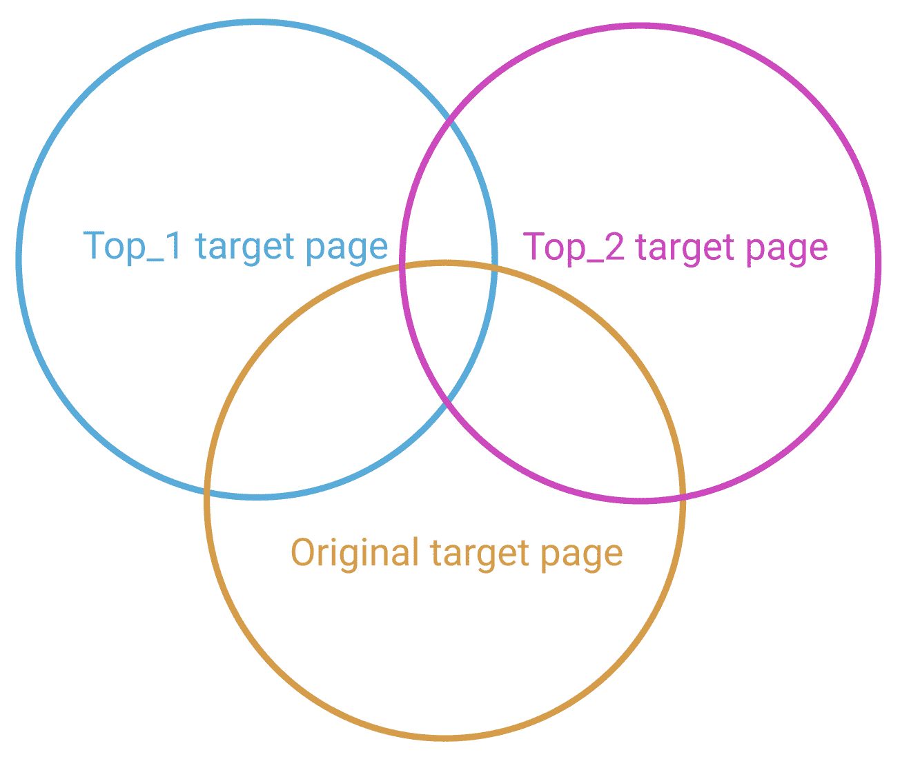
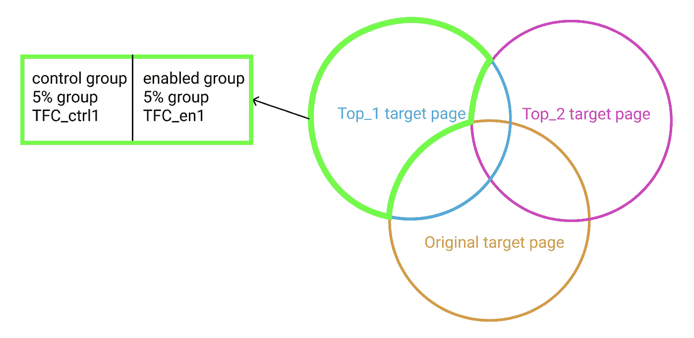
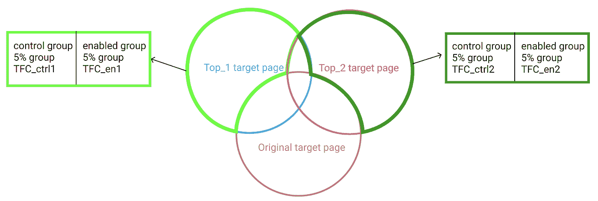
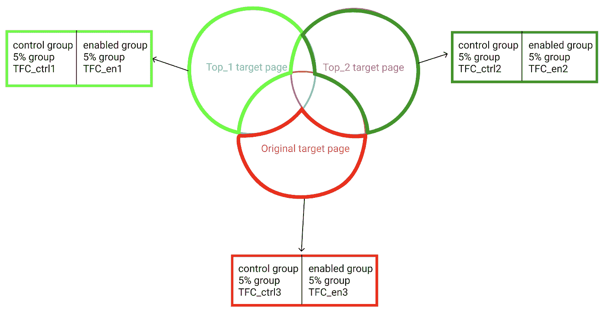

# Pinterest 如何为 SEO 运行基于流量的链接实验

> 原文：<https://medium.com/pinterest-engineering/how-pinterest-runs-traffic-based-interlinking-experiments-for-seo-9cb2cbdba6f8?source=collection_archive---------2----------------------->

*James Ouhyoung |增长的搜索流量，余家安|增长的搜索流量*

搜索引擎优化(SEO)是人们在 Pinterest 上寻找想法和灵感的重要渠道，也可以帮助新用户接触第一次使用案例，如发型教程或家庭办公室设置。

我们获得成功的 SEO 展示的方法之一是通过使用链接来展示最好的内容(在数十亿个 Pinterest 页面中)。

在 Pinterest 成长团队中，我们支持使用实验来验证假设和结果。经过一些广泛的研究，我们决定我们最好的前进道路是开发一个我们自己的标准链接框架，我们一直用它来衡量链接的影响。

# 什么是互联？

链接是一种 SEO 策略，创建内部链接，将网站的一个页面连接到同一域中的另一个页面。这很有帮助，因为:

1.  它帮助用户在网站中导航。
2.  它帮助搜索引擎理解你的网站结构。
3.  它有助于确定站点内的页面权限和排名。

由于上述原因，我们经常看到搜索引擎奖励那些有好的链接的网站更高的排名，从而推动更多的搜索引擎优化流量到满足用户意图的有用网站。

Pinterest 内部链接的一个例子如下。在许多 Pinterest 页面上，我们有一个名为 Related Pins(在图 1 中用蓝色突出显示)的部分，它将 Pinner 从这个页面带到 Pinterest 上的其他 Pin 页面。

Figure 1\. Pinterest Related Pins interlinks.

使用上面的示例，让我们假设您有一个新的推荐算法来选择一组更好的相关 pin 以改善用户体验。要了解这种变化如何影响当前页面、旧的相关 pin 和新的相关 pin 的 SEO 流量，您需要运行一个链接实验。

# 为什么一个链接实验是特殊的？

致力于发展的人通常熟悉 A/B 测试的概念。然而，仔细看看当你改变一个内部链接时会发生什么，你会发现影响是双重的，一个简单的 A/B 实验是不够的。解释一下:

1.  影响的第一部分是*源页面*(包含内部链接的页面)上 SEO 流量的变化，我们可以通过一个简单的 A/B 实验来衡量对源页面的影响。

*   控制组:选择一组页面，使用旧的内部链接。
*   治疗组:选择一组页面并使用新的内部链接。

2.影响的第二部分是*目标页面*(内部链接链接到的页面)的 SEO 流量的变化，我们可以用 Pinterest 的链接实验框架来衡量这一点，本文稍后将对此进行说明。

*   控制组:选择作为旧的内部链接的目的地的页面集。
*   处理组:选择作为新内部链接目的地的页面集。

# TLDR 论学习

1.  挑选现有的获胜者。如果我们在寻找最大的搜索引擎优化会话，选择在搜索结果中表现良好的目标页面(从而推动良好的搜索引擎优化流量会话)实际上有助于提高总流量。
2.  **现有的 SERP(搜索引擎结果页面)排名比你想象的更有粘性。**正如你所料，当我们将一个内部链接指向一个新页面时，这个新页面会从搜索引擎获得更大的流量。我们通常会在两周内看到这种增长。令人惊讶的是，当内部链接不再指向旧页面时，旧页面并没有受到太大影响。(指标在 8 周内保持不变。)
3.  **期待快速的结果。**我们承认，影响新内部链接的时间很大程度上取决于域名、抓取率等。也就是说，我们已经看到流量变化在 4 天内开始，并在大约 2 周内稳定下来。

对于希望进行链接实验的人来说，让我们直接进入实际的 Pinterest 链接框架。

# Pinterest 的链接框架

## 步骤 1:定义假设

如果我们想一想，当我们将一个链接的目的地从 A 页更改为 B 页时会发生什么，我们会向搜索引擎发出信号，提示我们提升到 B 页，而降级到 A 页。

为了完全确认您的新选择算法选择了最佳的目标页面，需要验证以下假设。

1.  如果你有两个相同的新网页(相同的内容，布局，域名权限，创建时间等。)，从内部链接链接的页面会比另一个没有链接的页面有更多的流量。
2.  链接到一个新页面所增加的 SEO 流量应该大于取消旧页面链接所损失的流量。这是为了确保我们避免简单地将流量从页面 A 转移到页面 b 的完全自相残杀。
3.  链接(或选择)算法通常涉及以优先级或分数的形式排列页面目的地。那么链接到具有较高分数**的页面**应该比链接到具有较低分数**的页面具有更高的会话流量增益。**

在实践中，为了证明上述所有假设，我们需要根据目标页面的得分创建三个实验组: **Top_1 目标页面、Top_2 目标页面和原始目标页面。**

*   **Top_1 Target Pages** 是根据您的新选择算法，以**最高分数**排名的目标页面的集合。
*   **Top_2 Target Pages** 是一组目标页面，在您的新选择算法中排名第二位**。**
*   ****原始目标页面**是我们之前链接到的一组目标页面，但现在已被您的新选择算法移除。**

**通过比较 **Top_1 目标页面与原始目标页面的部分，**我们可以证明假设(1)和(2)。**

**通过比较 **Top_1 目标页面与 Top_2 目标页面，**我们可以证明假设(3)。**

## **第二步:建立实验小组**

**现在我们知道了这三组是什么，让我们来想象一下这个实验。**

**请注意，在大多数情况下，原始目标页面、Top_1 目标页面和 Top_2 目标页面之间会有重叠。(目标页面“可爱的猫收藏”可以同时是链接“可爱的小猫”的第一选择和链接“可爱的宠物”的第二选择)**

**下图 2 揭示了重叠部分:**

****

**Figure 2\. Experiment groups with overlaps**

**接下来，为了获得这些组的流量收益和损失，我们划分目标页面并创建 3 组控制与启用组。**

**从唯一属于 Top_1 目标页面(以绿色突出显示)的目标页面中，我们随机选取 10%的页面，并将它们分成 5%的控制组和 5%的启用组，如下所示。**

**有了这一对控制使能组，我们将能够衡量每 1 个 Top_1 页面通过链接获得推广后的流量增益。把这写下来:**

*   **TFC_en1 是链接推广后 Top_1 页面的日均流量(启用组)**
*   **TFC_ctrl1 是在没有变化的情况下(对照组)每个前 1 页的日平均流量**

****

**Figure 3\. Top_1 gain: control-vs-enabled groups**

**类似地，从唯一的 Top_2 目标页面池中，我们获得了第二个 control-vs-enabled 组。然后，我们将衡量通过链接获得推广后，每前 2 页的流量增益。**

*   **TFC_en2 是链接推广后(启用组)前 2 页的日均流量**
*   **TFC_ctrl2 是在没有任何变化的情况下(对照组)前 2 个页面的日平均流量**

****

**Figure 4\. Top_2 gain: control-vs-enabled groups**

**最后，我们构建了唯一的旧目标页面池，并从中获得第三组实验页面。与第三组实验组，我们将能够衡量交通损失后，每旧网页失去推广链接。我们定义了以下内容:**

*   **TFC_en3 是通过链接失去推广后可以获得的每旧页面日均流量**
*   **TFC_ctrl3 是在没有任何变化的情况下可以获得的每个旧页面的日平均流量**

****

**Figure 5\. Original target pages loss: control-vs-enabled groups**

## **第三步:计算和分析**

**首先，让我们定义以下内容:**

*   **∂TFC1 = TFC_en1 — TFC_ctrl1**
*   **而∂TFC1 是 Top_1 目标页面的每日流量中的每页增益。**

**类似地:**

*   **∂TFC2 = TFC_en2 — TFC_ctrl2**
*   **而∂TFC2 是 Top_2 目标页面的每日流量中的每页增益。**
*   **∂TFC3 = TFC_en3 — TFC_ctrl3**
*   **和∂TFC3 是每天的流量增加到原来的目标网页的每一页。**

****为了证明假设#1:** 在所有条件相同的情况下，从内部链接链接的页面会比没有链接的页面有更多的流量。**

**我们需要:**

*   **∂TFC1 > 0**

**此外，最好有，但不是必需的:**

*   **∂TFC2 > 0**

****为了证明假设 2:** 链接一个新页面带来的 SEO 流量增加应该大于取消旧页面链接带来的流量损失。**

**我们需要:**

*   **∂TFC1 + ∂TFC3 > 0**

****为了证明假设#3:** 假设你的新链接算法给目标页面分配**分数**，链接到具有**较高分数**的页面应该比链接到具有**较低分数的页面具有更高的增益。****

**我们需要:**

*   **∂TFC1 > ∂TFC**

**如果三个假设都满足，你的新算法确实比旧算法好很多。因此，你可以通过取消旧页面的链接并链接到新的 Top_1 目标页面来获得更多的 SEO 流量。**

# **未来的工作**

**成长搜索流量团队已经用这个互连框架做了几个互连算法变化的实验，还会继续做更多。**

**我们希望这说明了试验和评估你的网站的新链接策略的必要过程，考虑到人口重叠和同类相食的影响。**