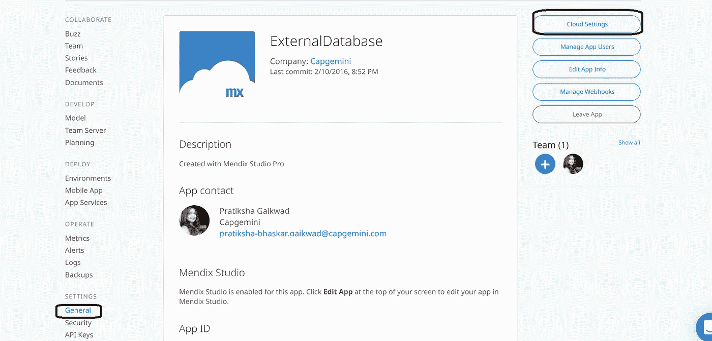
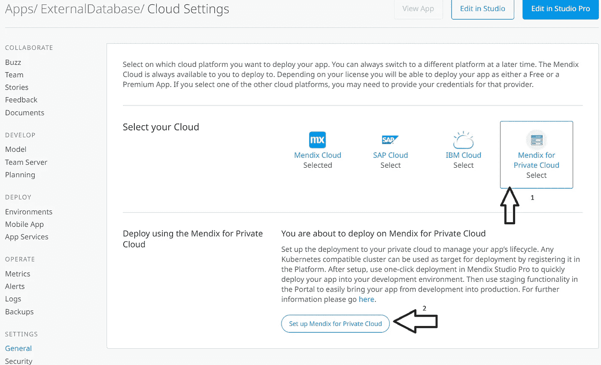
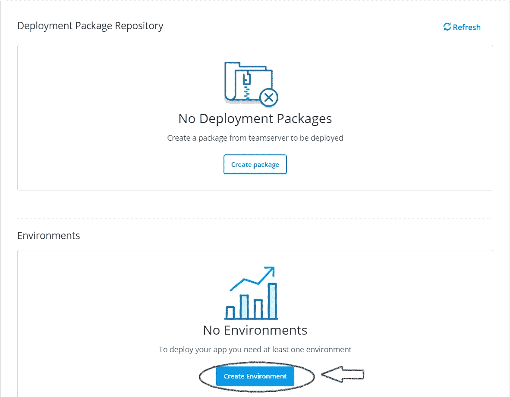
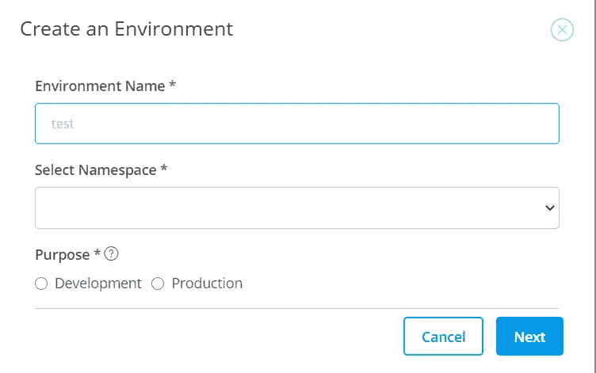
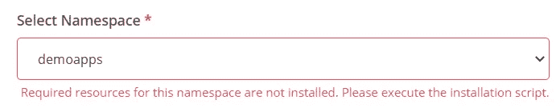
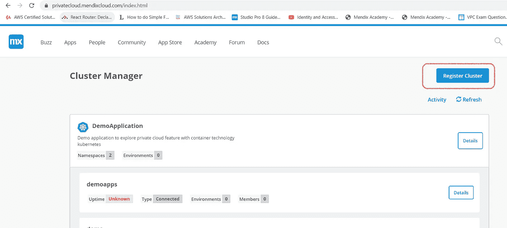
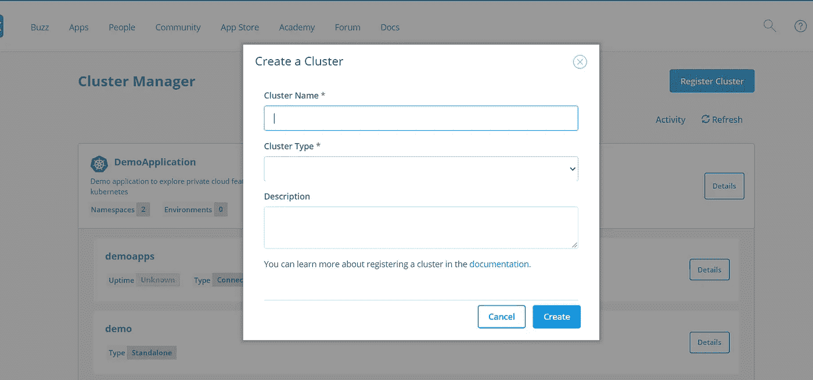
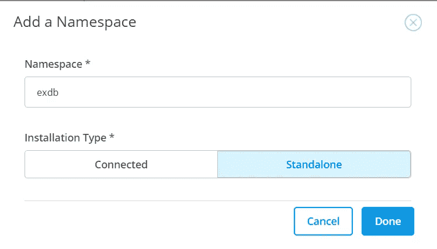
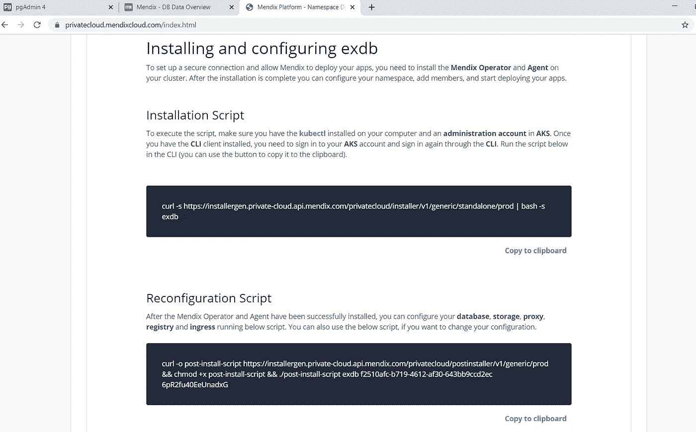
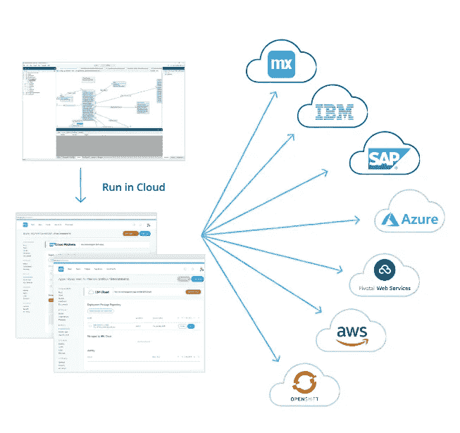

# 如何在 Mendix 中使用私有云

> 原文：<https://medium.com/mendix/how-private-cloud-can-be-used-in-mendix-b5e706dad1d4?source=collection_archive---------0----------------------->

# Mendix 提供了在 Kubernetes 私有云集群的帮助下在私有云上部署应用程序的工具。它有助于自动化数据库供应、监控和日志记录等操作。

在应用程序中，如果要求是私有云，那么这可能是因为法律要求或希望完全控制您的数据。在 Docker 和 Kubernetes 的帮助下，很容易把配置拿到私有云。

以下是 Mendix 官方支持的一些私有云:

1)红帽 OpenShift

2)亚马逊网络服务弹性 Kubernetes 服务(AWS_EKS)

3) Azure Kubernetes 服务(AKS)

[https://bit.ly/MXW21](https://bit.ly/MXW21)

**要在云上部署应用程序，您有两种选择:**

1.  在开发者门户内(更多信息请参考[私有云](https://docs.mendix.com/developerportal/deploy/private-cloud-deploy)

2.创建 CI/CD 管道并在集群内部署应用程序(更多信息请参考本 [CI/CD](https://docs.mendix.com/developerportal/deploy/private-cloud-operator) )

当您通过开发人员门户进行部署时，这可以由任何已被授予对已注册集群的适当权限的 Mendix 用户来完成。

***将应用配置到私有云的步骤:**

打开开发者门户，在我的应用程序中打开您想要部署到云上的应用程序，在设置中转到“常规”并单击“云设置”，如图所示。

1.  在云设置中选择“私有云 mendix ”,点击“设置私有云 mendix ”,如图所示。

2.单击“为私有云设置 Mendix”后，它会要求在“环境”中创建环境。

3.要创建环境，请给出环境名称，选择名称空间和用途，然后单击“下一步”按钮。

4.为了选择名称空间，它将要求运行脚本。如图所示。

(Mendix for Private cloud 是 Mendix 的一项高级产品，您需要额外的许可证才能将其用于您的应用程序。此操作员许可证允许您通过 Mendix 操作员和可选的 Mendix 网关代理来管理群集中的 Mendix 应用程序。每个要管理的命名空间都需要一个许可证。)

要获取脚本，首先需要创建集群。

5.如何注册集群:

Mendix 开发人员门户>>应用程序(在顶部导航栏)>>集群管理器> >注册集群。

从现有集群中选择集群，或者创建/注册新的集群。许多组织都有自己的集群，因此如果您属于该组织，您可以使用相同的集群。

对于新的集群，请参考下图，并单击创建。

6.之后，点击细节并添加名称空间。

1)给出名称空间名称。

2)和安装类型，然后单击完成。

7.一旦你点击完成，你会得到两个脚本，如图所示。

1.安装脚本

2.重新配置脚本

要建立安全连接并允许 Mendix 部署您的应用程序，您需要在您的集群上安装 **Mendix 操作器**和**代理**。安装完成后，配置您的名称空间，添加成员，并开始部署您的应用程序。

# 1)安装脚本:

要执行该脚本，请确保您的计算机上安装了 [kubectl](http://kubernetes.io/) ，并且在 **AKS** 中有一个**管理帐户**。一旦您安装了 **CLI** 客户端，您需要登录到您的 **AKS** 帐户，并通过 **CLI** 再次登录。在 CLI 中运行下面的脚本 **( *您可以使用按钮将其复制到剪贴板)。***

# 2)重新配置脚本:

成功安装 Mendix 操作器和代理后，您可以配置您的**数据库**、**存储**、**代理**、**注册表**和**入口**运行下面的脚本。如果您想更改配置，也可以使用重新配置脚本。

一旦运行完脚本，Mendix portal 就会向 Kubernetes 集群发送消息，触发集群下载必要的工件来构建和部署应用程序。之后，根据所选的私有云登录到您的帐户，并从群集列表中，选择您的群集，并检查应用程序是否已部署。

**Mendix 中的多私有云:**名字本身就暗示了多云的意思。对于单个应用程序，我们可以通过在不同的 Kubernetes 集群中创建多个环境来使用多个云。

示例:

如果应用可以在 Azure AKS 上开发，在 RedHat OpenShift 上生产。

**结论:**

Mendix for Private Cloud 基于 Kubernetes 本地运营商架构。Mendix 操作员负责 Mendix 应用程序的部署、供应、备份/恢复、扩展和构建。Mendix for Private Cloud 选项仅限于 Azure、AWS 和 OpenShift。对于大多数虚拟私有云解决方案来说，这可能已经足够了，但对于不使用 Azure Stack 或 AWS Outposts 的内部运行私有云的客户来说，这仍然是一个挑战。Mendix for Private Cloud 是一个有趣的新选项，尽管作为内部部署的私有云解决方案仍有局限性。简而言之，Mendix 为许多不同的云解决方案提供了出色的低代码体验。
总之，多云和混合云是 Mendix 的未来。

如果您想了解更多关于 Mendix 云的机会，并想开始行动，我们推荐以下资源:

[https://www . mendix . com/evaluation-guide/app-capabilities/mendix-cloud-overview](https://www.mendix.com/evaluation-guide/app-capabilities/mendix-cloud-overview)
[https://www . mendix . com/evaluation-guide/app-capabilities/mendix-for-private-cloud](https://www.mendix.com/evaluation-guide/app-capabilities/mendix-for-private-cloud)

[https://www . mendix world . com/session/know-your-options-with-mendix-multi-cloud-deployment/](https://www.mendixworld.com/session/know-your-options-with-mendix-multi-cloud-deployment/)

[https://www . mendix world . com/session/demo-how-to-configure-deploy-in-mendix-private-cloud/](https://www.mendixworld.com/session/demo-how-to-configure-deploy-in-mendix-private-cloud/)

[https://www . mendixworld . com/session/reduce-risk-and-cost-with-a-defined-cloud-deployment-approach/](https://www.mendixworld.com/session/reduce-risk-and-cost-with-a-defined-cloud-deployment-approach/)

[https://getting started . Mendix Cloud . com/link/path/101/Mendix-for-Private-Cloud](https://gettingstarted.mendixcloud.com/link/path/101/Mendix-for-Private-Cloud)

*来自发布者-*

*如果你喜欢这篇文章，你可以在我们的* [*媒体页面*](https://medium.com/mendix) *或者我们自己的* [*社区博客网站*](https://developers.mendix.com/community-blog/) *找到更多喜欢的。*

*希望入门的创客可以注册一个* [*免费账号*](https://signup.mendix.com/link/signup/?source=direct) *，通过我们的* [*学苑*](https://academy.mendix.com/link/home) *获得即时学习。*

有兴趣更多地参与我们的社区吗？你可以加入我们的 [*闲散社区频道*](https://join.slack.com/t/mendixcommunity/shared_invite/zt-hwhwkcxu-~59ywyjqHlUHXmrw5heqpQ) *或者想更多参与的人，看看加入我们的* [*遇见 ups*](https://developers.mendix.com/meetups/#meetupsNearYou) *。*