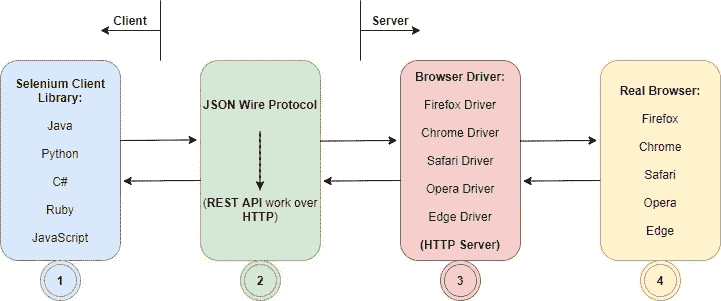
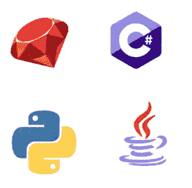
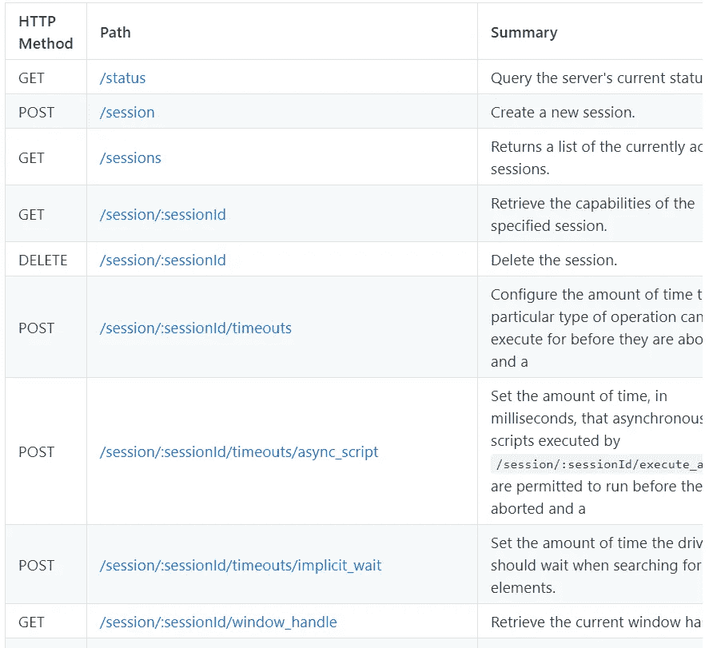
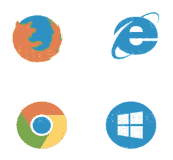

# 硒是如何工作的？

> 原文：<https://medium.easyread.co/how-selenium-works-1414c3ac5d3f?source=collection_archive---------0----------------------->

## 了解更多关于硒的工作原理

Photo by [Arisa Chattasa](https://unsplash.com/@golfarisa?utm_source=unsplash&utm_medium=referral&utm_content=creditCopyText) on [Unsplash](https://unsplash.com/s/photos/robot-driver?utm_source=unsplash&utm_medium=referral&utm_content=creditCopyText)

在疫情期间，我的日常生活远离了生产。怎么会呢，新冠肺炎几乎影响了人类生活的所有活动，我也不例外。在这段时间里，我很难找到让我兴奋的富有成效的事情。但有一次，我被感动了，想改变糟糕的生命周期，试着写点有用的东西，这大概会在我们成功打败了我们的敌人 ***【科罗娜】*** 后想起。

在这种情况下，我试图了解一下 **Selenium** ，虽然它实际上不是我在办公室使用的主要工具，但我对学习它非常感兴趣。

Selenium 熟悉软件质量保证。为什么，Selenium 是一个非常流行的自动化测试框架。事实上，用户名单包括谷歌和脸书！

# 什么是硒

SELENIUM 是一个免费的(开源)自动化测试框架，用于验证跨不同浏览器和平台的 web 应用程序。您可以使用 Java、C#、Python 等多种编程语言来创建 Selenium 测试脚本。使用 Selenium 工具完成的测试通常被称为 Selenium 测试。

> **但是在它流行的背后，你知道 Selenium 是怎么工作的吗？**

Selenium 采用客户机-服务器设计。客户机-服务器设计是一种软件体系结构模型，由两部分组成，即通过计算机网络或在同一台计算机上通信的客户机系统和服务器系统。要了解更多细节，让我们看看下面的 Selenium 架构:

[Selenium Architecture](https://drive.google.com/file/d/1sRSozHVOROPuLhwli22ZGrlUAcKZguZB/view?usp=sharing)

*   因此，在上面的图片中，第一个点是充当客户端的 **Selenium 客户端库**。 **Selenium 客户端库**促进了多语言支持的能力。您可以使用自己熟悉的语言来编写自动化脚本，Selenium 会完成剩下的工作。

[Selenium Client Library](https://www.edureka.co/blog/selenium-webdriver-architecture/)

当您在 IDE 中编写脚本代码时，无论是用 Java、C #、Python、Ruby 还是 Javascript，首先要做的就是通过 API 将脚本发送到 Json Wire 协议。

*   **Json Wire Protocol** 位于图中的第二点，作为一个连接器，促进客户端和服务器之间的通信，以便它们可以相互理解。 **Json 有线协议**促进了在 web 上的客户机和服务器之间传输数据的能力。这是一个 REST API，它提供了一种传输机制，并使用 JSON over HTTP 定义了 RESTful web 服务。

[Selenium Json Wire Protocol](https://www.edureka.co/blog/selenium-webdriver-architecture/)

无论我们在 IDE 中键入什么脚本(POST/GET)，Json Wire 协议都将是客户机和服务器之间的连接器。所以实际上，Json Wire 协议有一个 REST API，它具有 Json 格式，旨在通过 HTTP 向浏览器驱动发送请求。可以通过 Json Wire 协议发送的任何 API 细节可以在 Json Wire 协议 GitHub 链接上的 JWP 文档中看到，下面显示了一些列表:

[Json Wire Protocol Github](https://github.com/SeleniumHQ/selenium/wiki/JsonWireProtocol)

*   第三点是浏览器驱动程序。每个浏览器驱动程序都有一个 HTTP 服务器，接受来自客户端的由 JWP 发送的请求。

[Browser Driver](https://www.edureka.co/blog/selenium-webdriver-architecture/)

浏览器驱动程序用于与真实的浏览器进行交互，并将自动化脚本指令传递给真实的浏览器以转化为动作。

> ***也许你心中有一个疑问，为什么不直接从 JWP 发送到浏览器？***

原因是因为直到我写这篇文章时，浏览器都不想向第三方开放它们的功能，在这种情况下，Selenium 是第三方，这就是为什么我们需要一个可以与真正的浏览器交互的组件，我们称之为**浏览器驱动程序**。

*   最后一点就是**真正的浏览器**。Selenium Webdriver 最棒的地方在于它支持所有主流浏览器，如 Google Chrome、Mozilla Firefox、Internet Explorer 和 Safari。每个浏览器都有特定的 web 驱动程序来执行自动化脚本。

[Real Browser](https://www.edureka.co/blog/selenium-webdriver-architecture/)

比如 **Chrome-chrome 驱动，Firefox-gecko 驱动，Safari-safari 驱动，Opera-opera 驱动，Edge-edge 驱动。**

关于上面的 Selenium 架构设计图纸，有一点额外的解释，发送的每个请求都会得到响应。

希望这篇短文对你有用，最重要的是**保持健康、保持高效和保持精神。希望这个疫情会很快过去，我们可以像往常一样重新开始我们的活动。**

温暖的问候和嘉友！！！

> **“高效不是完成很多事情。这是关于完成重要的事情。”**

# **参考**:

1.  [Selenium 还是最好的测试自动化工具吗？](https://dzone.com/articles/is-selenium-still-the-best-browser-automation-tool)
2.  [硒是什么？硒自动化测试介绍](https://www.guru99.com/introduction-to-selenium.html)
3.  [客户端-服务器|彭二天，Fungsi &实现](https://markey.id/blog/development/client-server)
4.  [硒是如何工作的？](https://drive.google.com/file/d/1sRSozHVOROPuLhwli22ZGrlUAcKZguZB/view)
5.  [Selenium web driver 完全指南](https://hackr.io/blog/complete-guide-selenium-webdriver)
6.  [硒入门循序渐进](https://www.udemy.com/course/selenium-basics-step-by-step-for-beginners/learn/lecture/10165700#overview)