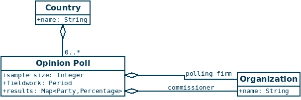
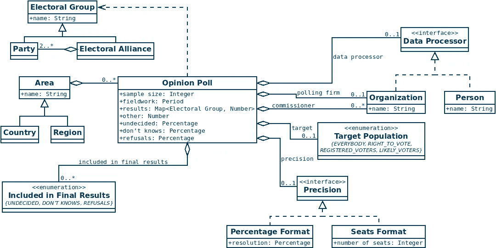

# “简单的事情”如何在软件开发中迅速变得复杂

> 原文：<https://medium.com/compendium/how-simple-things-quickly-become-complicated-in-software-development-9cf52233226d?source=collection_archive---------0----------------------->

“我们希望看到自动化的小东西”——你有多长时间没有听到过这句话，知道它根本不是小东西？或者也许你自己也说过，尽管你知道得更清楚？为什么在软件开发中简单的事情永远不会简单，这阻碍了我们“正确地”实现功能，而不会因为知道这里或那里缺少一些小东西而感到沮丧，并且为了使一切工作至少足够好以赶上项目的下一个截止日期，您必须在其他地方创建一些快捷方式？

我和其他来自欧洲选举的人一起有一个小爱好项目，从一些欧洲国家的民意调查中收集 T2 的关键数据。对于这个项目，我需要建立基础设施来捕获所有的信息。听起来不会太复杂吧？反正每个国家的民意调查看起来不都一样吗？它们不就是一些政党投票偏好的简单列表，有样本大小、实地调查周期和民意调查公司吗？嗯，实际上，不，它一点也不简单，这很好地说明了表面上看起来非常简单的事情是如何迅速变得复杂的。

UML class diagram illustrating a naive approach to capture the key data for opinion polls in European countries

让我们从挪威开始，在那里它实际上非常简单。几乎所有在挪威进行和报道的民意调查都有一个实地调查期、一个样本量和一个民意调查公司，并且通常(但不总是)有一个为人民付费的专员。或者两个委员一起为投票买单。哦，开始了，已经开始了！

挪威政党的名单目前是固定的，但你不必回到过去那么多年才能找到没有报告 RDT 或 MdG 的民意调查。因此，这是我们的第二个难题:新政党可能会突然出现，而不是每个民调公司都立即开始报道它们。或者小的现有政党突然变得足够受欢迎，所以他们开始被包括在一些民意调查中。

让事情变得更加复杂的是:在德国，CDU 和基社盟经常被报道为联盟。在英国，苏格兰民族党(SNP)和威尔士格子党(PC)有时会被一起报道为民族主义者。在波兰，目前的民调是根据 2019 年大选的选举联盟进行报道的，而不总是政党。但是在某个时间点，政党会重新组合。所有这些都必须以某种方式解决。

挪威的民意测验结果通常在小数点后保留一位数字。在英国，它通常是一个整数，而在德国和奥地利，你可以看到一半。你也必须捕捉这些信息，因为 10.0%(实际上区间[9.95%，10.05%[)不同于 10%(区间[9.5%，10.5%[)或 10%(区间[9.75%，10.25%[)。在荷兰，选举结果通常以席位来表示，没有投票权，所以你也必须考虑到这一点。不，荷兰众议院没有 100 个席位，它有 150 个席位，因此 10 个席位的结果代表区间[6.333%，7%][就投票份额而言。

但是，即使你已经确定精度是 0.1%，10.0%可能意味着不同的事情。拒绝参与投票的人被排除在结果之外了吗？那些说不知道或者犹豫不决的人呢？在许多国家，犹豫不决的选民被排除在结果之外，但在克罗地亚，他们没有。此外，我们说的是全体人口中的 10.0%，即有投票权的人、登记选民或可能的选民吗？是的，在民意调查进行时，可能的选民可能还没有决定。

民意调查是在哪里进行的？似乎是一个微不足道的问题，但英国的“国家”民意调查通常只涵盖英国，但其中一些确实涵盖了整个英国。在比利时，民意调查在佛兰德斯、布鲁塞尔或瓦隆大区进行，目前结果总是分开的。因此，即使是“国家”这个概念也有一点复杂。

但是，即使是一件看似简单的事情，如谁进行了民意调查，也是一件复杂的事情。在马耳他，民意调查有时由出版报纸进行。在德国，INSA 有时进行采访，而 YouGov 处理数据并得出结果。在西班牙，CIS 有时只发布原始数据，研究人员或其他公司根据这些数据为不同的媒体提供结果，当然，结果会略有不同。

More elaborate, yet still incomplete UML class diagram to store the key data for opinion polls in European countries

那么，存储欧洲所有国家民意调查的关键数据，最好是存储在一套统一的表格中，有多难呢？这肯定不像乍看上去那么简单，如果你想了解完整的故事，还有更多的复杂问题需要讨论。例如，政党改变名称，或合并在一起，或假设的情况。老实说，我很确定我也没有完全理解欧洲民意调查的复杂性，更不用说世界其他地方的情况了。

但是这个例子清楚地说明了简单的事情是如何变得相当复杂的，以及为什么在软件开发中从第一次开始就把一切都做好是如此困难。当人类着眼于大局时，他们非常善于抽象出小细节，从而抽象出问题的全部复杂性。这也是为什么我们倾向于低估问题的复杂性，以及我们在软件项目中需要的时间。另一方面，计算机需要知道它需要处理的每一个细节。它不知道什么时候一组数字的总和应该是 100%，或者由于舍入误差接近 100%，以及“接近 100%”的真正含义是什么，除非我们解释它——详细说明并实现它——每一个细节。

我也确信我不是唯一一个时不时有这种感觉的软件开发人员:如果我们不走任何捷径，只花我们需要的所有时间来模拟问题的全部复杂性，这样我们就可以*完成*它，会怎么样？那不是很好吗？恐怕这是不可能的，而且在我们的软件领域模型中总会有一些烦人的捷径。重要的是要知道对于你要解决的问题，有多少捷径是可以接受的。很多时候，这只是有足够的经验来知道什么时候足够好就足够好的问题。