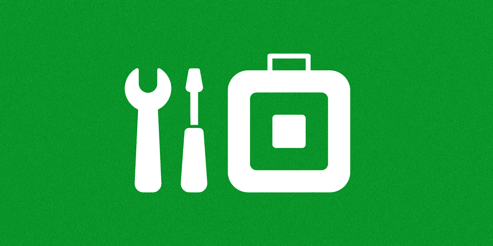

# Square 如何制作其 SDK

> 原文：<https://medium.com/square-corner-blog/how-square-makes-its-sdks-6a0fd7ea4b2d?source=collection_archive---------5----------------------->

## 在 Square，我们利用 OpenAPI 标准、Swagger Codegen & GitHub 以可扩展的方式构建和交付我们的客户端 SDK。

> 注意，我们已经行动了！如果您想继续了解 Square 的最新技术内容，请访问我们在 https://developer.squareup.com/blog[的新家](https://developer.squareup.com/blog)

Square 的开发者平台团队与大多数团队有所不同。我们不是为我们的开发人员产品构建单独的 API，而是专注于公开我们的第一方产品用来为开发人员创建无缝体验的 API。我们有许多上游团队，他们是我们面向外部的 API 的利益相关者，不断地想要展示新的特性并做出改进。在决定我们应该如何构建我们的 SDK 时，这是一个重要的因素；我们不希望我们的团队成为瓶颈，在发布新功能之前，产品团队必须等待我们完成 SDK 的更新。我们避免这种情况的主要方法是 SDK 生成。

# SDK 生成

我们使用了一个非常依赖 SDK 生成的过程，而不是手动编写我们的每个 SDK(这不仅耗时、容易出错，而且会减慢 SDK 中新功能的发布)。SDK 的生成有很多种，所以如果你正在考虑为你的 SDK 采用类似的方法，一定要考虑各种可能性，找到适合你的。我们的首选风格使用 OpenAPI 规范来定义我们的 API 端点，并使用 Swagger Codegen 以编程方式为 SDK 生成代码。

## 美国石油学会技术规格

我们使用 [OpenAPI](https://www.openapis.org/) 标准来定义我们的 API。对我们来说，这是一个`JSON`文件，它定义了 url、要发出什么样的 HTTP 请求，以及要提供什么样的信息，或者期望为每个 API 端点获取什么样的信息。我们的规范由 3 个主要部分组成:一般信息/元数据、路径和模型。

## 一般信息/元数据

规范的这一部分包含了 API 整体的一些描述性信息，比如在哪里可以找到许可信息，或者联系谁寻求帮助。

## 小路

这些描述了 API 的各个端点(或 URL 路径)。它描述了发出什么样的`HTTP`请求，应该如何授权，应该在请求中添加什么样的信息，以及应该期望得到什么样的回报。在下面的例子中，你可以看到这是一个`POST`请求，在 URL 中有两个必需的参数，在主体中还有一个，你得到的是一个`CreateRefundResponse`对象。

## 模型

模型描述了 API 与之交互的不同对象。它们主要用于将来自 API 的 JSON 响应序列化为每种语言的本地对象。在这个`CreateRefundResponse`中，你可以看到它包含了几个其他的模型，还有一个描述，甚至是一个响应的例子。

你可以在 GitHub 上的[Connect-API-Specification](https://github.com/square/connect-api-specification/blob/master/api.json)repo 中看到我们规范的最新版本。

规范是我们生成过程的重要部分，因为它是关于我们的 API 如何工作的事实的来源。当其他团队想要扩展他们的 API，发布新的 API，或者只是增加模型描述的清晰度时，他们可以对这个文件进行编辑，并将他们的更改传播到所有的客户端 SDK。我们实际上从描述内部服务到服务通信的文件中生成我们的大部分规范，以实现更多的流程自动化和更容易的更改。

# 斯瓦格代码根

既然我们已经准备好了 API 的规范，那么我们如何将它转化为面向客户端的 SDK 呢？答案是 Swagger Codegen。Swagger Codegen 是一个由 [Smartbear](https://smartbear.com/) (就像其他 Swagger 工具一样)支持的开源项目，它将您的开放 API 规范应用于一系列不同语言的 SDK 模板，并加入了一些配置。

## 模板

模板使用一种叫做 [mustache](https://mustache.github.io/) 的语言来定义它们的部分，并且在很大程度上看起来和读起来像是一个期望语言的文件。下面这个是我们 PHP SDK 模板的一部分。您可以看到，像代码注释这样有用的东西也是自动生成的，所以最终 SDK 可以内置文档、片段等。

## 配置

这些实际上并不复杂，本质上是描述你的 SDK 的各个方面的小`json`文件，通常围绕着它如何适合相关的包管理器。

因为 Codegen 项目非常活跃，所以我们实际上为每个支持的 SDK 签入了模板文件的副本，并固定到特定的 Codegen 版本，以确保我们不会因为所有的自动化而意外地将重大更改推送给我们的用户。您可以在与我们的规范文件相同的存储库中看到支持{Java、PHP、C#、Python、Ruby、JavaScript } SDKs 的所有模板和配置文件:[Connect-API-Specification](https://github.com/square/connect-api-specification/tree/master/swagger-templates)。

## 其他想法

我们的流程有了很大的发展，Travis CI 等工具在流程中产生了巨大的影响。您可以使用 CI & CD 工具来使这个过程更加自动化，但是要确保您有一套好的测试覆盖范围来帮助防止意外的变化悄悄进入您发布的代码。

希望您喜欢我们的 SDK 生成流程。你也可以在这里看到我在 DevRelCon 上关于这个主题的演讲录音。如果你想了解更多关于我们的 SDK，或者 Square 的其他技术方面，一定要关注这个[博客](https://medium.com/square-corner-blog)，我们的[推特](https://twitter.com/SquareDev)账号，并注册我们的[开发者简讯](https://www.workwithsquare.com/developer-newsletter.html?channel=Online%20Social&sqmethod=Blog)！