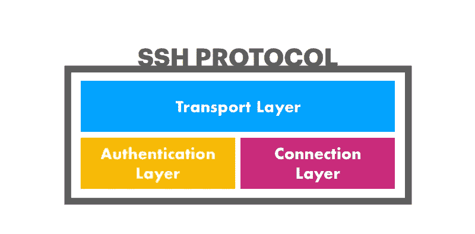

# SSH 如何工作

> 原文：<https://medium.com/quick-code/how-ssh-works-9349293cdf61?source=collection_archive---------0----------------------->

如果你在 IT 行业工作，你肯定听说过 ssh。但是它是如何工作的呢？

SSH(安全外壳)是一种网络协议，允许两台计算机通过互联网安全连接。SSH 使用加密来防止黑客读取两台相连设备之间发送的数据。

SSH 分为三层:

[https://phoenixnap.com/kb/wp-content/uploads/2021/04/layers-of-ssh-protocol-1.png](https://phoenixnap.com/kb/wp-content/uploads/2021/04/layers-of-ssh-protocol-1.png)