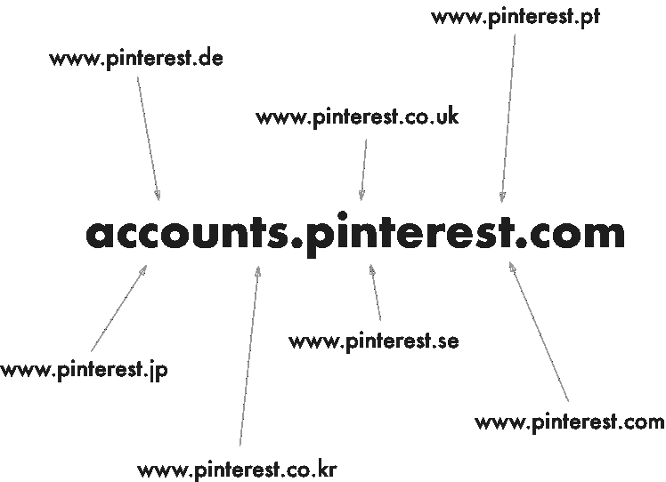
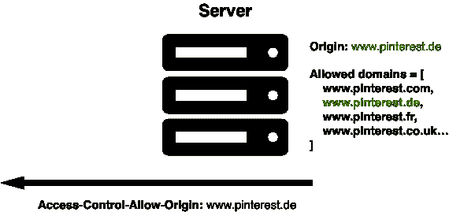

# 转换我们的域名结构如何开启国际增长

> 原文：<https://medium.com/pinterest-engineering/how-switching-our-domain-structure-unlocked-international-growth-e00c8184d5dd?source=collection_archive---------0----------------------->

Christian Miranda |软件工程师，成长

Pinterest 上的 2 亿月度活跃用户中，超过一半在美国以外使用我们的应用程序。随着我们继续为全球用户提供更好的 Pinterest，我们将流量转移到了国家代码顶级域名(ccTLDs)。一个例子是在德国的 www.pinterest.de 上而不是在 www.pinterest.de 的 T2 提供网站服务。在这里，我们将深入探讨这一变化如何帮助促进增长的细节，并讨论我们在整个过程中遇到的一些工程挑战。

# 都在名字里

自从 2010 年 Pinterest 成立以来，网站的每一页都由 www.pinterest.com 的[托管。](http://www.pinterest.com.)几年后，我们引入了国家子域名(如 de.pinterest.com ),以便根据国家对我们的内容进行细分，并为 Pinners 提供更加本地化和相关的体验。这改善了搜索引擎优化(SEO)和总体增长，因为随着国家子域名在全球搜索结果中排名的提高，更多的人找到了他们语言的相关内容。

下一步是实施 ccTLDs。通过研究，我们了解到，其他一些做出改变的网站看到了中性或负面的增长影响，尽管行业对 ccTLDs 的看法是，它们在许多搜索引擎算法中提供了更强的地理定位信号，用户更有可能点击以本地域名结尾的结果(这可能会导致更高的点击率，从而对搜索排名产生积极影响)。我们想测试他们，看看他们如何为 Pinterest 和我们多样化的内容目录工作。

# 不仅仅是重定向:转换域名的挑战

从表面上看，该项目似乎相当简单——我们所要做的就是提供我们想要的新 ccTLDs，并设置重定向以开始为它们提供流量。然而，很明显，改变我们网站的顶级域名需要对我们的基础设施进行重大改变。

## 跨域身份验证

Pinterest 上的认证相当标准。我们有一个内部用户服务，处理用户名/密码组合的注册，我们采用 OAuth 开放标准对第三方(即脸书)进行认证。后端会返回一个访问令牌，用户每次访问[www.pinterest.com 时，我们都会检索这个令牌来验证用户。](http://www.pinterest.com.)

随着 ccTLDs 的引入，我们需要支持对用户进行身份验证的能力，无论他们访问哪个域。我们的解决方案是建立一个中央域(accounts.pinterest.com ),作为所有登录信息的唯一来源。

简而言之，Pinterest ccTLDs 与中央域进行通信，以确定身份验证状态，并设置客户端 cookie 进行镜像。下一节将详细描述这种通信，我们称之为认证握手。

## 认证握手

授权握手的一般流程是:

1.  在注册或登录期间，从访问域(比如说， [www.pinterest.abc)](http://www.pinterest.abc)) 向 accounts.pinterest.com 发出 API 调用，以确定身份验证状态。
2.  如果用户登录 accounts.pinterest.com，他们将自动登录 [www.pinterest.abc.](http://www.pinterest.abc.)
3.  如果用户没有登录到 accounts.pinterest.com，我们将生成一个访问令牌，并在两个域的 cookie 中设置它。这将引导中央域进行后续访问，因此它可以满足第二步的要求。

第一步中存在一个问题:同源策略声明“如果两个页面具有相同的来源，则一个页面上的脚本只能访问另一个页面上的数据。”这是互联网安全的基础，也是防止恶意网站上的 Javascript 访问个人或敏感信息的基础。在授权握手的情况下，由于域名不匹配(例如 pinterest **。com**vs Pinterest**。abc** 。

为了解决这个问题，我们使用了跨源资源共享(CORS ),它为 web 服务器提供了跨域访问控制，以实现跨域的安全数据传输。这是通过在数据传输中向 HTTP 请求和响应添加新的特定于 CORS 的报头，并相应地处理它们来实现的。

## 在握手中使用 CORS

让我们通过一个使用 auth 握手在 [www.pinterest.de](http://www.pinterest.de) 上注册 Pinterest 的简单示例来了解这个过程。首先，客户端指定它希望使用用户的凭证向 accounts.pinterest.com 发出跨域请求。此时，浏览器会自动向请求添加一个 Origin 头，指定当前域。

当请求到达服务器时，我们创建访问令牌并在 accounts.pinterest.com 上验证用户。用户登录后，握手会在对客户端的响应中发回一个自定义令牌。这个令牌可以用来交换一个访问令牌，供 [www.pinterest.de](http://www.pinterest.de) 用来进行身份验证。

服务器会跟踪我们列入白名单进行身份验证的所有 ccTLDs。在我们返回响应之前，我们检查原始请求头的值是否存在于白名单中。如果是，服务器会在响应中添加特殊的 CORS 报头。这些报头中最重要的是 Access-Control-Allow-Origin；该报头的存在向客户端发出是否允许跨域传输的信号。

当客户端收到响应时，它会看到值为“https://www.pinterest.de”的 Access-Control-Allow-Origin 标头，因为这与客户端的来源匹配，所以它会继续处理响应。自定义令牌被检索并用于获取访问令牌，允许用户登录 [www.pinterest.de.](http://www.pinterest.de.)

你可以在[官方 Mozilla 文档](https://developer.mozilla.org/en-US/docs/Web/HTTP/CORS)中读到更多关于跨来源资源共享和这些请求中涉及的全套头文件。

## 通过搜索引擎优化提高可发现性

一旦我们建立了新的本地域，下一步就是帮助它们变得更容易被发现。引导流量的最简单方法之一是实现重定向到新的域。在适用的情况下，我们使用了从旧的现有国家/地区子域名到新的相关 ccTLDs(例如 de.pinterest.com→[www . Pinterest . de)。](http://www.pinterest.de).)使用永久重定向允许我们将旧域名上的大部分页面排名和权限转移到新域名上。

我们还使用了一些间接方法来提高新 ccTLDs 的流量质量。Hreflangs 是可以包含在网页标记中的属性，用于告诉搜索爬虫关于网页的不同语言版本。当搜索引擎看到这种标记时，它们会根据搜索者的语言环境显示与本地相关的页面。我们还使用名为 sitemaps 的文件来帮助提高搜索引擎抓取我们网站的效率和速度。网站地图是用来列出你的网站的网页，并告诉搜索引擎关于你的内容组织的文件。通过将这些文件直接提供给搜索机器人，他们可以更容易地找到新的内容进行抓取和排名。

# 结果

迄今为止，我们已经观察到，在我们已经推出的国家中，流量正增长，点击量和浏览量增加。通过这一过程，一个更有趣的发现是，我们更多的页面可以被索引，因为不同的顶级域名为搜索机器人开辟了一个单独的“爬行预算”。

展望未来，我们将继续为我们的国际内容投资 ccTLDs，并寻求进一步加强 accounts.pinterest.com，使其成为所有 Pinterest 网站的中央认证中心。

鸣谢:德文·伦德伯格、乔希·恩德斯、萨姆·梅德、杰斯·马勒斯、伊万·琼斯、杰夫·埃弗里、格雷·斯科尔、朱莉·特里尔、瓦迪姆·安东诺夫、基南·拉隆、伊芙琳·奥巴莫斯&国际队