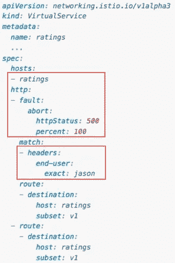

# 混沌工程将如何保证您的服务的弹性

> 原文：<https://medium.com/oracledevs/how-the-chaos-engineering-will-guarantee-the-resilience-of-your-services-20a01471fa8e?source=collection_archive---------1----------------------->

有一个事实:有时候，会出问题。你的服务准备好了吗？不仅仅是预测任何一种失败，而是如何应对不可预测的事情。问问你自己:我的服务有弹性吗？
在本文中，我们将讨论混沌工程如何提供方法，让您的应用程序准备好迎接任何挑战。换句话说，混乱如何给你的服务带来秩序。

# 关于混乱、失败和弹性的一些想法

在深入我们的主题之前，陈述一些定义和假设是很重要的。

> 混沌工程是**在一个系统上做实验**的学科，目的是建立对该系统承受**生产**中的动荡条件的能力的信心

这个定义来自“*混沌工程原理*”(1)网站，这是一个关于这个学科的定义和思想的合作集合。

> 弹性是系统**适应**自身变化、故障和异常的能力

韧性的一个很好的例子是当你的 Gmail 在经典模式下工作时。它的很多功能你都用不了，但是还能用。它使用适度降级来为应用程序提供弹性。

> 有时候有些事情会失败。即使有最好的系统。

你可以建造最好的基础设施。你可以写出最好的代码。即使这样，某些时候还是会出问题。

> 在意外发生之前，故意注入故障。找到弱点并解决它们。

如果失败总是会发生，为什么不利用它来提高你面对失败的能力呢？

# 应该往哪里注入混沌？

通常，我们的服务是一组不同的技术、环境和资源。他们都有不同的角色，通常，他们都可能失败。所以，如果你想开始尝试，这里有一些建议，你可以从哪里开始。

## 应用层

您的代码具有特性、行为和流程。试试看。

## 缓存层

现代应用程序越来越依赖缓存。如果缓存不可用怎么办？如果在你试图访问它的时候它已经在构建了呢？如果失败，是否有任何替代存储库？

## 数据库层

关闭数据库，拿起你的爆米花，坐下来看。

## 云层

在云原生时代，您的云原生应用程序准备好应对云问题了吗？如果一个实例停止运行会怎样？如果政策被其他人改变了怎么办？整个数据中心就这么完蛋了？

# 混沌工程的 5 个阶段

为了快速总结混沌工程的各个阶段，你可以查看这张图片:

Chaos Engineering Phases

## 阶段 1:稳定状态

这是您的服务基于其*业务度量*的常规行为。

*业务指标* it *the*指标！是向您展示您的最终用户对您的系统的真实体验的指标。

下面的例子摘自网飞的一篇文章(2):

Steady-state of SPS at Netflix

该图显示了网飞的 SPS(每秒数据流)的稳定状态。这是他们的业务指标。所以他们可以一周又一周地跟踪它的行为，直到找到它的常规用法。那是一个稳态。

因此，每当您监视您的系统时，或者在我们的情况下，规划和执行您的失败注入时，您的所有跟踪都将基于业务度量。

## 第二阶段:假设

在您定义了您的业务指标并了解您的稳定状态后，就该开始提问了。

如果:

*   服务退货单 404？
*   数据库停止工作？
*   请求意外增加？
*   延迟增加 100%？
*   一个集装箱停止工作？
*   端口变得不可访问？

当然，这些只是例子。重要的部分是:提出你真的不知道答案的问题(这个应该很明显吧？).因此，例如，如果您已经知道您的服务没有高可用性环境，测试它就没有任何意义。首先，构建它，然后围绕它尝试各种可能性。

## 阶段 3:设计实验

现在你有了一个假设，你不知道答案，值得尝试，开始设计你的实验。

围绕它的一些最佳实践是:

*   从小处着手
*   尽可能接近生产环境
*   最小化爆炸半径
*   有一个紧急停止按钮

实现它的一种方法是使用一种金丝雀部署方法:

Minimize the blast radious

了解图像中发生了什么:

*   稳态:常规行为
*   控制组:处于相同稳态条件下的一小组用户
*   实验组:与控制组的规模相同，但它是混沌注入的地方

为了在实验结束时比较结果，我们有相同大小的控制组和实验组。

例如，要将这两个组从稳定状态流中分离出来，可以在请求头中包含一个属性并使用它。它可以在负载平衡器中完成，而无需对应用程序本身进行任何更改。

## 阶段 4:学习和成果

在实验结束时，是时候收集结果并吸取教训了。所以在这里你会评价:

*   检测故障需要多少时间？
*   通知某人需要多长时间？
*   多少时间开始优雅的退化？
*   恢复需要多长时间(部分恢复和完全恢复)？
*   回到稳定状态需要多少时间？

## 阶段 5:修复

嗯…这是不言自明的部分！

请记住，当在混沌工程方法中工作时，一切都是关于从失败中学习。这就是为什么你要在一个受控和管理的环境中故意创建它们。

> 我们从失败中学习，而不是从成功中——德拉库拉，布莱姆·斯托克

# Kubernetes &混沌工程

使用 Kubernetes 来谈论混沌工程是有意义的，原因有两个:

*   K8s 有一些固有的弹性特性
*   它管理 pod 状态，并根据它执行重启
*   K8s 集群可以有分布在不同区域/AZs/ADs 的节点，因此也有分布在不同区域/AZs/ADs 的 pod

所以这是一个很好的环境来玩混乱！

此外，有一套很好的工具，您可以使用 Kubernetes 来应用混沌。其中一些是:

*   伊斯迪奥
*   混沌工具包
*   混沌猴
*   库伯猴

让我们简单检查一下。

## 伊斯迪奥

Istio 有非常好的特性，只需处理它的 YAML 文件，就可以帮助将故障注入到服务中。例如:

Causes a 7s delay for user "jason"

Returns a HTTP 500 to user "jason"

Istio 团队提供了关于(3)处故障注入的完整文档。

## 混沌工具包

如下图所示，它为许多云提供商和平台提供了一系列驱动因素:

Chaos Toolkit integrations

好的方面是它完全基于这篇文章中提到的混沌工程的 5 个阶段。

它还特别支持基于 YAML 文件的 Kubernetes (5 ):

Chaos Toolkit configured to randomly kill pods

您可以在(4)上查看 Github 资源库的更多信息。

## 混沌猴

它会杀死生产环境中的容器和/或虚拟机。如果您使用的是 Spinnaker (6)，它已经集成在盒子外面了。

您可以在(7)上查看 Github 资源库的更多信息。

## 库伯猴

它基于 Kube Monkey，但专门为 Kubernetes 制作。您的服务需要选择加入被杀死的 pod:

Enables your deployment to have pods killed by Kube Monkey

您还可以根据自己的需要安排它执行:

Schedule configuration

定义列入黑名单的名称空间也很重要(如上图所示)。因此，举例来说，您不会遇到杀死集群的管理单元的风险(即使一些疯子选择了它们)。

请在(8)查看更多详细信息。

# 轮到你了！

开始进入混沌工程世界是关于…开始！正如本帖中所提到的，从小事做起…一小步一小步地去赢得胜利。

选择你的服务中最小和最容易的部分，并应用这里的原则。如果你需要任何帮助，就说出来！

# 参考

①[http://principlesofchaos.org/](http://principlesofchaos.org/)

(2)[https://medium . com/网飞-tech blog/SPs-the-pulse-of-网飞-流媒体-ae4db0e05f8a](/netflix-techblog/sps-the-pulse-of-netflix-streaming-ae4db0e05f8a)

(3)[https://istio . io/docs/tasks/traffic-management/fault-injection/](https://istio.io/docs/tasks/traffic-management/fault-injection/)

(4)[https://github.com/chaostoolkit/chaostoolkit](https://github.com/chaostoolkit/chaostoolkit)

(5)[https://github.com/chaostoolkit/chaostoolkit-kubernetes](https://github.com/chaostoolkit/chaostoolkit-kubernetes)

(6)[https://www.spinnaker.io/](https://www.spinnaker.io/)

(7)[https://github.com/netflix/chaosmonkey](https://github.com/netflix/chaosmonkey)

(8)[https://github.com/asobti/kube-monkey](https://github.com/asobti/kube-monkey)