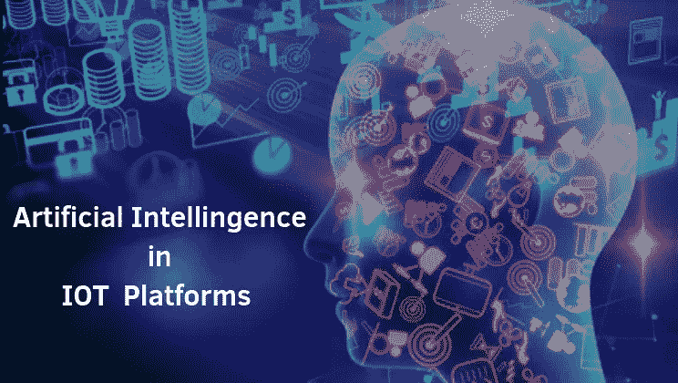

# 物联网与人工智能的关系。

> 原文：<https://medium.com/quick-code/how-the-internet-of-things-relates-to-artificial-intelligence-95d37bf36744?source=collection_archive---------2----------------------->

IOT 代表物联网，IOT 只不过是一个由相互关联的计算设备、数字机器和物体、人类或动物组成的系统，所有这些都具有特定的标识符，它能够通过网络传输数据，而不需要人对人或人对计算机的通信

它表明物理现象的不断增长的结构以网络连接的 IP 位置为特征。

如果你刚刚进入物联网，如果你正在计划一个开始学习的地方，或者即使你是物联网产品和服务的专业人士，这个物联网博客议程将帮助你开始和开发你的项目。这个物联网博客将帮助您更好地了解不断发展的物联网技术，并通过物联网趋势新闻找到最新信息。学习物联网是一个漫长的过程，涉及不同技术领域的新旧知识。

**什么是 IOT 平台？**

IOT 平台对我的业务有何用处，为什么需要它？

实际上，IOT 平台是一个组件的集合，可以部署应用程序来监控、管理和控制所有连接到服务器的设备，该套件还允许连接的设备相互传输和收集数据。

物联网平台是一种多元化的技术，能够在 IoT 宇宙中实现互联设备的直接供应、管理和自动化。

**先进的 IOT 平台**

我们几乎没有区分物联网平台的基本要素，例如可扩展性、可定制性、与第三方软件的结合、部署选项和输入保护级别。

**可扩展—** 先进的物联网平台确保了客户可能需要的任意数量终端的弹性可扩展性。

**可定制** —决定交货速度的因素。它几乎与集成 API 的灵活性有关，API 更足以运行小规模的低要求物联网解决方案

**安全—** 这些是如何在您的物联网解决方案中避免潜在的可协商漏洞的基础。例如，数据安全涉及加密、全面的身份管理和灵活的部署。端到端数据流加密，包括静态数据、设备身份验证、用户访问权限管理和敏感数据的私有云基础架构

**为什么 IOT 很重要？**

IOT 如今如此重要，因为它能为每个问题找到解决方案。进一步的工业革命将以前所未有的方式改变我们的生活，IOT 技术的快速变化使最专业的专家预测该领域标准化的未来成为一项艰巨的任务。对于天性适度混乱的人类来说，物联网是一个惊人的进步。

**IOT 平台的战略趋势**

下一代商业生态系统将变得更加数字化、智能化和互联化。

**Digital twins:**Digital twins 提供了真实世界设备和系统的全面数字表示，从而改善了它们的状态监控，并能够更快地向内部和事件输出。

digital twins 的运营非常广泛，从库存和预测性维护到事件模拟和使用分析。在未来，它们有望成为所有高效物联网生态系统的基石。

**IOT 的人工智能是什么？**

人工智能基于云的物联网，物联网是近年来推出的一种语言，用于确定能够通过互联网连接和传输数据的对象。物联网生态系统通常要求开发人员对整个系统、其源代码、集成接口、部署选项、数据模式、连接和安全机制等有更大程度的控制。

我们已经可以与 Siri 或 Alexa 等虚拟助手交谈，搜索电影或订购送货上门的新东西。为什么我们不能在其他事情上做同样的事情？

人工智能和物联网成功合作的最佳例子是特斯拉汽车公司的自动驾驶汽车。汽车充当“东西”，并使用人工智能的能力来预测不同情况下汽车和行人的行为。

**人工智能如何帮助 IOT 发展**

围绕人工智能有很多有趣的事情专家告诉我们，人工智能有望以非凡的方式改变我们的生活。

有许多关于人工智能的文章。人工智能有望执行许多智能功能，如语音识别、决策、语言理解等。

**物联网的 5 项关键无线技术:**

基于云的物联网用于将车辆、移动设备、传感器、工业类型的设备和制造机器等广泛的事物联系起来，以促进不同的智能系统。它包括智能城市和智能家庭、智能电网、智能工业、智能车辆、智能健康和智能环境监控。

在物联网中，云计算环境可以轻松处理耦合设备产生的少量数据，并按需为物联网设备提供资源。

最近对顶级 IT 高管的调查表明，不仅物联网和人工智能是目前最受欢迎的技术。寻求增强能力和竞争优势的企业的未来投资首选。

但为什么物联网和 AI 至今走在边缘计算或区块链等其他热门技术的前面？

逻辑非常简单，将 IOT 与快速发展的 IOT 技术相结合，可以创造出所有的“智能机器”，它们可以复制出色的行为，在很少或没有人为干预的情况下做出明智的决定。一个小小的奇迹在 IOT 和艾组织中迅速发展

**AI 在 IOT 的例子？**

让我们看看较早前成功减费的工商业。在 IOT 用人工智能创造新的商业理念。这些行业会让你考虑在业务中实现 AI 和 IoT。

*   工业物联网(IIoT)
*   卫生保健
*   智能家居

*最初发表于*[T5【https://www.mytectra.com】](https://www.mytectra.com/blog/How-the-Internet-of-Things-relates-to-Artificial-Intelligence/)*。*