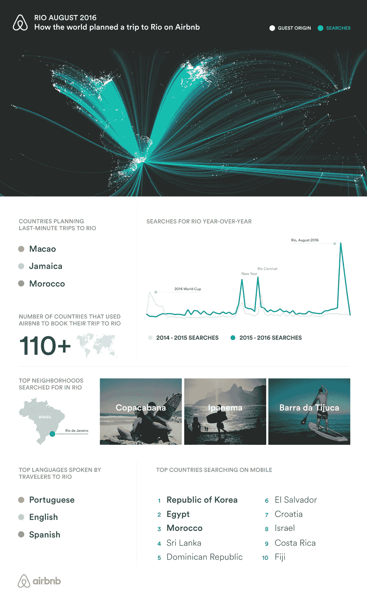
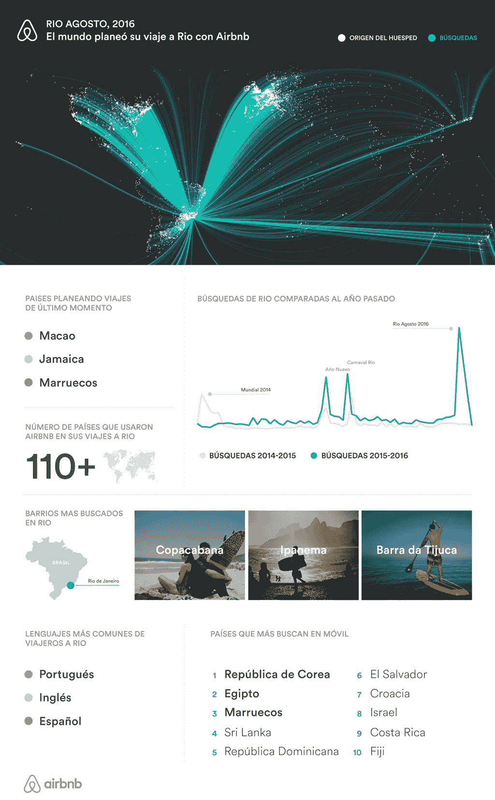
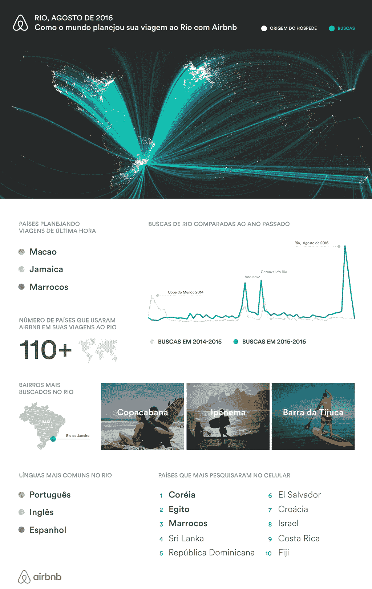

# 里约 2016 年 8 月

> 原文：<https://medium.com/airbnb-engineering/how-the-world-planned-a-trip-to-rio-on-airbnb-232d42979a89?source=collection_archive---------0----------------------->

# 世界如何在 Airbnb 上计划去里约的旅行

# 西班牙语

# 葡萄牙语

 [## 里约热内卢度假租赁和别墅- Airbnb

### 从里约热内卢的人那里租，13 美元/晚起。在 191 个国家/地区寻找独特的住宿地点。属于…

www.airbnb.com](https://www.airbnb.com/s/Rio-de-Janeiro--Brazil)