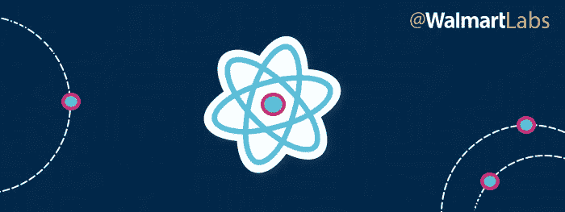

# 如何使用 React 组件实现可重用性

> 原文：<https://medium.com/walmartglobaltech/how-to-achieve-reusability-with-react-components-81edeb7fb0e0?source=collection_archive---------0----------------------->

可重用性是当今软件工程中最常见的术语之一。它被各种各样的框架、工具和范例所承诺，每一个似乎不仅有自己的方法来实现可重用性，而且有自己的定义。

# 那么，我们所说的可重用性是什么意思呢？

真正的可重用性不是一个特别的过程，而是一种开发策略。可重用组件必须从底层开始构建，并牢记可重用性，这涉及到仔细的规划和感同身受的 API 设计。此外，虽然现代开发工具和框架可以支持和鼓励代码重用，但可重用性不能仅通过技术来实现——它需要在团队中一致实现的过程，以及组织所有级别的承诺。

因此，当我们讨论可重用性时，它不仅仅是一个技术讨论。它还包括企业文化、培训和一系列其他考虑因素。我们将在这里触及其中的一些，但重点是**可重用性是一个涉及开发的每个阶段和组织的每个级别的过程**。

沃尔玛由几个品牌组成，包括山姆会员店、阿斯达以及像沃尔玛加拿大和沃尔玛巴西这样的地区分店。在这些品牌中，我们有几十个由数百名开发人员构建和维护的前端应用程序。

因为每个品牌都有自己的在线形象，每个品牌都有开发人员开发所有沃尔玛品牌通用的组件——例如，图像转盘、面包屑、弹出按钮、信用卡表单组件等导航元素。重复另一个团队已经完成的工作是对时间和金钱的浪费，同时也为 bug 创造了更多的空间。消除这种重复使开发人员能够将更多的时间花在为客户体验带来新价值的项目上。

在后端，跨品牌共享代码更加直观:单个服务可以接受来自多个不同品牌的请求，并返回该品牌的适当数据(基于数据的形状有几种处理方法)。在前端，情况更复杂，因为它涉及到获取后端提供的数据，并应用主题和其他适合特定品牌和视图的转换。以促进重用的方式做这件事并不是一个完全解决的问题。

# 在@WalmartLabs 上实现组件重用

对于 Walmart.com，我们选择 React 作为我们的前端框架，我们选择它的原因之一是它的组件模型为代码重用提供了一个很好的起点——特别是当它与 Redux 一起用于状态管理时。尽管如此，在像沃尔玛这样规模的组织中，前端代码重用仍然面临着巨大的挑战。

# 共享代码的技术能力

第一个挑战涉及共享代码的技术手段——组件需要版本化、易于安装和可升级。我们将所有的 React 组件放在一个单独的 GitHub 组织中。目前，基于创建回购的团队，组件被捆绑到回购中，但我们正在向功能性回购转移，例如包含面包屑、标签和侧导航链接组件的“导航”回购。组件随后会在我们的私有 npm 注册表中发布，这意味着开发人员可以轻松安装特定的组件版本，确保他们的应用不会在升级时突然中断。

在这一点上，由于代码是跨团队共享的，我们需要确保数百个组件的一致结构和编码标准，即使依赖关系被升级和需求改变。这就是为什么我们为[组件](https://github.com/electrode-io/electrode/tree/master/packages/electrode-archetype-react-component)和[应用](https://github.com/electrode-io/electrode/tree/master/packages/electrode-archetype-react-app)创建了[电极原型](http://www.electrode.io/docs/what_are_archetypes.html)。原型包括林挺、传输和捆绑的配置文件，并提供了一个中心点，我们可以从中管理核心依赖关系&任务/脚本。从一个公共结构开始，并在所有项目中建立一致的编码标准，使我们能够在整个组织中保持现代的最佳实践，并增加开发人员对彼此代码的信心，提高可重用组件实际被重用的机会。一个严格的持续集成/持续部署系统进一步增强了这种信心，包括 lint 代码规则、衡量性能以及跨多种设备、浏览器和屏幕分辨率的测试。CI 系统可以包含一些规则，用于在提交 PR 时发布组件的 beta 版本，并运行使用该组件的所有应用程序的功能测试，以确保 PR 不会破坏任何东西。

# 元团队

在这个项目的早期，大部分共享组件都是由少数几个团队贡献的，而且这些组件往往变化得非常快。最终，我们选择了一些对电极框架和沃尔玛内部有着深刻理解的开发人员，并创建了一个我们称之为 meta team 的团队。这些人每隔几周就会花几个小时或一天的时间来审查进入组件组织的代码，确保所有的最佳实践都得到遵循，并且通常会尽可能地提供帮助。该团队还全面了解了整个组织的建设情况，并在自己的团队中担任了[电极](http://www.electrode.io/)项目的大使。Meta 团队成员还将有关待定原型变更的信息带到他们的团队，并收集反馈以与电极核心团队分享。

这些步骤是一个很好的开始，但是我们仍然看到了进一步提高组织代码重用的机会。

# 数百个组件的可发现性问题

我们开始注意到在我们的 Slack 频道中有很多信息都有一个共同的主题。开发人员想知道是否已经为某个任务创建了一个组件。UX 团队希望能够看到哪些组件是可用的。项目经理想看看其他团队正在构建什么组件。所有这些信息的共同点是可发现性。我们需要一种快速、简单的方法来发现哪些组件可用，查看它们的使用情况并与之交互，以及了解它们的实现、配置和依赖关系。

我们对这个问题的答案是[电极探测器，我在以前的帖子](/walmartlabs/spotlight-on-electrode-explorer-react-component-reuse-without-the-hassle-6447763365b2#.etp9o5wr0)中讨论过。Explorer 使我们的开发人员能够浏览@WalmartLabs 中的数百个可用组件，阅读它们的文档并查看它们的外观，甚至浏览它们的版本历史以查看它们是如何随着时间的推移而变化的。因为电极资源管理器为组织中的所有 React 组件提供了一个 web 界面，所以开发人员不需要“npm 安装”一个组件来查看它并与之交互。

# 从裂缝中溢出的复制品

但是，即使使用了所有这些工具和过程来促进代码重用，我们仍然会看到问题。一个问题是团队经常开发新的组件，却没有意识到它们可能对其他团队有用。如果组件不包含在可重用生态系统中，它们就不能被重用。即使在共享组件系统中，我们也看到了许多重复，或者对非常相似的问题采用稍微不同的方法的组件。我们意识到技术解决方案是不够的——需要在整个公司范围内改变思维，所有层次的利益相关者都采取可重用性优先的方法。这包括花时间一般化组件以便重用更容易，扩展现有组件而不是从头开始，以及有意识地寻找机会尽可能共享代码。

为了帮助这种思维上的改变，我们创建了一个组件提议流程。在这种体系下，开发人员在开始工作之前会讨论新的组件。这为其他团队的开发人员提供了建议现有解决方案或替代方法的机会，并让组织中的其他人知道发生了什么。

> 提议系统和元过程有助于避免重复。

# CI/CD 的重要性

我们遇到的一个大问题是，一个团队开发一个组件，会破坏另一个团队的应用程序。如果您没有锁定您的组件版本，您的 CI/CD 可能会由于组件被另一个团队修改而失败——这是一种可怕的感觉，并且它会导致许多团队将组件锁定到一个非常特定的版本，在那里他们甚至可能不会采用新的补丁版本。

这就是 CI/CD 发挥作用的地方。当组件版本更新时，自动化应该检查它是否破坏了该主要版本上的任何消费应用程序——即使应用程序锁定了它的组件版本，它也应该检查这一点。如果没有中断，我们希望 CI/CD 系统发送一个 PR 请求，将锁定的版本更新为没有中断应用程序的新版本。如果有中断，应该通知两个团队来讨论问题是什么。

# 内源

正如 [Laurent Desegur](https://twitter.com/ldesegur) 在之前的[帖子](/walmartlabs/beyond-open-source-walmartlabs-e690c934fe35#.lqc0e6x3b)中所描述的，我们实现可重用性方法的基础是我们对开源/内部资源理念的拥护。@ WalmartLabs 多年来一直是开源的用户和贡献者，如哈比神、 [OneOps](https://github.com/oneops) 和[电极](https://github.com/electrode-io)等项目所证明的。在公司外部不太明显的是我们对内源的承诺，这是开源模型的内部应用。在内部资源方法中，没有团队或开发人员“拥有”一个组件——所有组件在整个组织中共享。这消除了瓶颈，并使开发人员能够改进现有的组件。

这些政策极大地增加了重用的机会——但更重要的是，它们向开发人员表明了我们作为一个公司对合作和协作哲学的承诺。它们使开发人员能够在最需要的地方使用他们的时间和专业知识，而不是等待瓶颈消除，并且它们以真实、可测量的方式使公司受益。

# 结论

可重用性不仅仅是一个技术决策，也是一个哲学决策，需要组织的承诺，并且具有深远的影响。在@WalmartLabs，我们已经看到了它可以带来的好处——现在我们正在将 SamsClub.com 转移到[电极平台](https://github.com/electrode-io)，我们的开发人员正在重新使用数百个来自 WalmartLabs 的组件，并对其进行主题化，以匹配山姆会员店品牌。

告诉我们您的可重用性故事——您遇到了什么障碍？你是怎么解决的？你看到了哪些进一步改进的机会？