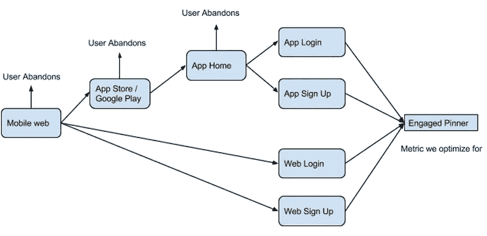
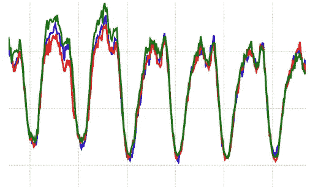
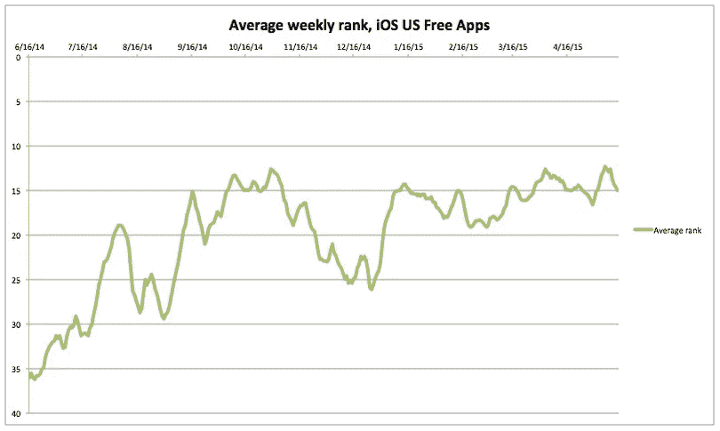

# 如何通过增长工程获取移动用户

> 原文：<https://medium.com/pinterest-engineering/how-to-acquire-mobile-users-through-growth-engineering-d87d6646e5fb?source=collection_archive---------1----------------------->

张信哲| Pinterest 工程师，成长

适用于 iPhone、iPad 和 Android 的 Pinterest 应用程序允许 Pinners 在旅途中体验产品，从在市场上查找食谱，到阅读他们在地铁上保存的文章，或者在五金店检查项目创意。超过 80%的 Pinners 通过移动应用访问 Pinterest，在移动平台注册的 Pinners 的参与度是在桌面平台注册的 Pinners 的三倍，这使得移动 Pinners 的持续收购和参与成为重中之重。

## 利用数据推动战略

我们相信使用数据为我们的增长战略提供信息。因此，我们进行了许多实验，并且很早就学会了。我们的许多实验实际上都失败了。然而，每个实验，不管它是否击败了对照组，都给了我们有价值的信息，告诉我们什么是成功的，什么是失败的，并让我们对未来的实验更加明智。当探索新机会的实验成功时，我们大量迭代，直到我们看到收益递减。进行快速实验还可以让我们避免花太多时间投资在不是好机会的领域。我们没有花几个月的时间来设计和构建我们认为优化渠道的最佳方式，而是首先通过快速实验来验证这是一个很好的机会。

我们在数据分析方面也很严谨，以便最大限度地学习。例如，我们按组件对数据进行分类，如 Pinner 是否登录、平台和国家，以避免错误地认为不同部分的工作方式相同。最大化所有实验运行的累积收益会产生最佳增长，为此，我们尝试在运行尽可能多的实验和运行影响最大的实验之间取得平衡。例如，我们已经在移动网络上运行了许多实验，因为来自初始测试的数据表明它是获取移动 Pinners 的有效方式。经过几个月在移动网络上运行和发布许多实验后，我们的应用程序日安装量增加了数万。

## 确定正确的指标

移动网络面临的一个挑战是，通过推广该应用，一些指标会受到积极影响(参与度)，而其他指标会受到消极影响(移动网络注册)，并且会因新老用户而异。

为了更好地理解这些权衡，我们必须首先确定我们想要优先考虑哪个指标。如果我们只是优化注册总数，优先考虑移动网络会产生更高的数字，因为注册的障碍更少。然而，因为我们知道移动网页 Pinners 的激活率比应用程序 Pinners 低，所以我们决定不优化总注册数，如果这导致整体参与 Pinners 较少的话。因此，用于评估实验的关键指标是长期参与 Pinners 的数量，这使我们能够捕捉到推广应用程序的所有参与度变化的副作用，如注册转化率的下降，或网络注册激活的下降。分析之后，我们进行了一些实验，增加了参与 Pinners 的数量，尽管总体注册人数有所下降。这项检查是必要的，因为我们希望确保获得 X 个应用安装，但失去 Y 个移动网络注册，仍然会导致更多的 Pinterest 长期用户。

*每个箭头都有一定的转化率。为了评估一个实验，我们希望最大化参与 Pinners 的数量，而不管他们是如何参与的，这样我们就可以考虑每个步骤的所有转化率。每个箭头也代表一个优化的机会。*

## 监控指标

应用安装增长的另一个挑战是归属和监控。有很多不同的因素会影响应用程序的安装，例如你带了多少人到应用程序商店，你的应用程序是否在 Google Play 中有特色，以及是否是购买新设备的流行时间，如假期或新 iPhone 发布。我们需要能够判断我们的整体应用安装数量的变化是由于有机渠道(App Store/Google Play 搜索结果、排行榜)的变化还是由于推荐渠道(移动网络、电子邮件)的变化，以便了解我们构建的功能是否实际上促成了我们看到的变化。为了做到这一点，我们使用一种归属服务来跟踪某人在下载 Pinterest 应用程序后，是否点击了我们的应用程序推广链接。这些事件随后会按照平台和位置进行细分，因此我们可以看到 App Store/Google Play 的每个入口点在一段时间内的表现。

有四个关键图表用于确定我们的移动采集系统的健康状况:iOS 上的推荐安装、Android 上的推荐安装、iOS 上的非推荐安装和 Android 上的非推荐安装。我们还覆盖了过去两周的数据，这使得判断是否有变化变得非常容易，因为如果没有采取任何措施来增加或减少应用程序安装，这些图表将保持一致。这给了我们一个中心位置来判断是否有东西坏了。例如，如果其中一个应用程序市场离线，我们会在我们的非参考 iOS 图表中注意到它，但不会在任何其他图表中注意到它。如果我们的 Android 移动网络转化率开始下降，我们会在 Android 参考图中注意到。

通过将本周的数据与上周的数据叠加，我们可以很容易地发现异常。蓝色是当前周，红色是 7 天前，绿色是 14 天前。如果部署了一个 bug 或者发生了任何其他导致异常的事件，它会非常清楚地出现在这个图中，我们可以精确地确定它发生的时间。

## 从实验中吸取的教训

通过我们进行的所有实验，我们能够了解到很多关于如何提高手机使用率的知识。我们还可以量化以前不可测量的组件的影响，如应用程序商店中的一个功能或季节性变化。在投资移动收购的几个月内，我们在两个平台(Android 和 iOS)上的每日应用安装数量翻了一番，并始终保持在 iOS 免费应用排名的前 15 位左右，所有这些都没有任何付费收购。

*鸣谢:Ludo Antonov 和 Casey Winters 也是移动收购体验发展的关键人物。*