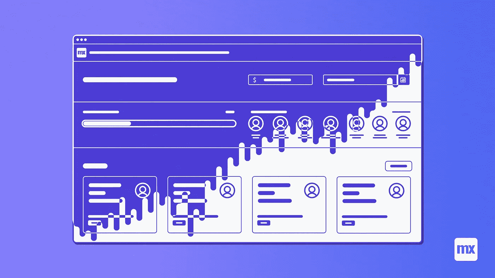
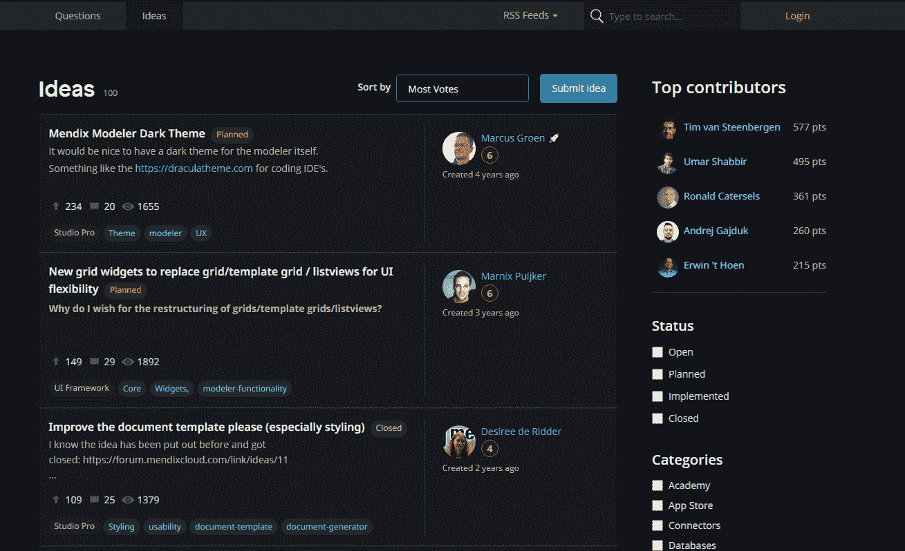

# 如何在 5 分钟内给你的 Mendix app 添加一个黑暗主题？

> 原文：<https://medium.com/mendix/how-to-add-a-dark-theme-to-your-mendix-app-in-5-minutes-6c050693c78a?source=collection_archive---------5----------------------->



# 是的，我知道这个标题似乎有点好得令人难以置信。每个 web 应用程序都有许多定制样式和公司品牌，在设计深色主题时需要考虑这些。通常，这个过程需要很长时间。您必须选择正确的调色板，然后重构 CSS 以支持两种不同的颜色主题。因此，几乎整个 CSS 都必须重写，因为老实说，没有人真正提前为这样的场景做好计划。

那么，这一切怎么可能在短短五分钟内完成呢？简单，按照以下步骤操作:

1.  将市场上的[黑暗主题模块](https://marketplace.mendix.com/link/component/116773)添加到你的 Mendix 应用程序中
2.  向您选择的布局、导航或页面添加一个(或三个)纳米流按钮
3.  从 nanoflow 调用 java 脚本动作`JSA_ApplyTheme`
4.  运行您的应用程序并查看结果。

我为市场模块 [Atlas UI Resources](https://marketplace.mendix.com/link/component/104730) 完成了这些步骤。你可以在[https://darkreader-sandbox.mxapps.io/](https://darkreader-sandbox.mxapps.io/)找到结果。这是一个黑暗主题的很好的示例应用程序，因为它有所有的 Mendix 组件。你可以很容易地看到它们在黑暗主题模式下的样子。

希望你觉得这个模块有用，它可以帮助你构建更好的 Mendix 应用程序。

等等，等等…你一定是在问这个模块实际上是如何工作的。答案很简单:

🧙‍♂️魔术。

嗯。看起来你很想知道。好了，做好准备，这可能是技术性的。

# 魔力

让我告诉你整个故事。

一个美好的冬日，我在寻找一种方法让 Duolingo 网站对我的眼睛更友好(我正在学习荷兰语，以防你想知道)。在过去，我尝试了几个 chrome 的黑暗主题扩展，我的体验并不好。但是这次我偶然发现了一个非常好用的扩展。然后我想我每天被所有像 Sprintr，Market Place 和 the Forum 这样的 light Mendix 网站折磨得有多痛苦。事实证明，对于没有大量动画或复杂样式的 Mendix 网站来说，这个扩展甚至更好。



我的第一个想法是与每个人分享这个扩展，但我知道大多数网络用户并不喜欢安装一个可以访问他们所有网站内容的第三方依赖项。幸运的是，在仔细查看了扩展之后，发现它是完全开源的。它甚至附带了一个 javascript API，因此可以在没有 Chrome 扩展的网站上使用。

所以这个模块只是这个开源库的一个包装器—[https://darkreader.org/](https://darkreader.org/)。

毕竟没有魔法😢

尽管《黑暗阅读器》运行得很好，但还是有一些小部件或页面需要调整，以便看起来更好。这里有一些技巧，基于我在一个真实的、正在运行的 Mendix 应用程序中添加黑暗主题支持的经验。

# 技巧

*   首先选择主要的前景色和背景色。黑暗读者会给你一些建议，但是如果根据公司品牌选择特定的颜色，可能会看起来更好。这些可以在主题选项中调整。
*   使用整体设置来调整你喜欢的主题。在我个人看来，将灰度设置为 0.25 会将 Mendix 倾向于拥有的大多数非常强烈的颜色调暗到一个可接受的水平，而不会牺牲太多。
*   反转过暗或过亮的图像。这可以通过为图像指定一个 css 选择器并在动态主题修复中传递它来实现。查看 github 的例子[https://github.com/darkreader/darkreader](https://github.com/darkreader/darkreader)。或者，一些 jpg 和 png 可以用 glyphicons、fontawesome 或其他支持颜色变化的技术来替换。这可能是[更喜欢图标字体而不是 png](https://www.lambdatest.com/blog/its-2019-lets-end-the-debate-on-icon-fonts-vs-svg-icons/)的另一个原因。
*   将用户偏好存储在`Account`对象上是一个好主意。随意使用`Enum_Theme`枚举作为属性类型。如果您正在寻找在加载时运行 java script 动作的方法，而不需要用户点击按钮，那么可以考虑微流计时器小部件。有趣的是，它还支持纳流。
*   谨慎添加 CSS 覆盖。当一个元素在深色主题中不好看时，很容易用`!important`抛出一个深色主题 css，然后就到此为止。但是在更仔细地检查了一些令人不快的元素之后，我发现它们经常有不好的 css 做法，比如硬编码的内嵌背景颜色等等。事实证明这干扰了黑暗阅读器。在这种情况下，最好重构 CSS，让 Dark Reader 完成它的工作。我想你可以在避免内联样式的一长串理由中加入黑暗主题支持。
*   当应用 CSS 覆盖时，使用黑暗阅读器 CSS 变量。这将使将来切换背景色和前景色变得容易得多。可用 CSS 变量列表:`darkreader-neutral-background`、`darkreader-neutral-text`、`darkreader-selection-background`、`darkreader-selection-text.`

# 表演

黑暗阅读器的工作原理是不断扫描你的网站，并生成适当的黑暗主题的 css 规则。这可能会降低客户端的速度，尤其是如果有很多动态内容，如动画和图表。实际上有两种方法来指示黑暗阅读器不要扫描这样的内容:

*   忽略图像分析-专门针对背景图像
*   忽略内联样式—不会扫描元素的内联(硬编码)样式(这特别适用于由倾向于使用大量内联样式的图表库生成的元素)

另一个更极端的选择是完全抛弃 java script，只依赖生成的 CSS。如果你确定你的网站在未来不会改变太多，也就是说，如果用户界面在相当长的一段时间内(比如几个月)相当稳定，我会推荐你这么做**。**

如果您的应用程序是这种情况，那么您可以在本地运行 java 脚本并导出生成的 CSS。

`DarkReader.exportGeneratedCSS()`

然后，您可以将这个 css 添加到`index.html`中，并通过`disabled`属性用 java 脚本切换它。

```
// index.html, css is disabled by default
// <link id="darkreader" href="darkreader-generated.css" disabled="disabled"/>// javascript snippet
var el = document.getElementById('darkreader');
var osPreferenceIsDark = window.matchMedia && window.matchMedia('(prefers-color-scheme: dark)').matches;
if ( theme == "Dark" || 
    (theme == "System" && osPreferenceIsDark ) ) {
    el.removeAttribute("disabled");
} else {
    el.setAttribute("disabled", "disabled");
}
```

# 结论

在这篇博客文章中，我们看到了如何在 Mendix 应用程序中添加黑暗主题支持，而不必完全重构 CSS 和花几天时间参加设计会议。我个人的希望是，我们会看到越来越多的 Mendix 应用支持黑暗主题，尤其是那些公开可用的应用。

在那之前，记住你可以一直使用分机:[https://darkreader.org/](https://darkreader.org/)

如果你觉得这个模块或者扩展很有用，可以考虑捐给[https://darkreader.org/](https://darkreader.org/)他们确实做得很好，值得我们尊敬。

[](https://www.notion.so/gajduk/How-to-add-a-dark-theme-to-your-Mendix-app-in-5-minutes-27ea7559165b46e3a3aac2f19cef8836) [## 如何在 5 分钟内给你的 Mendix app 添加一个黑暗主题？

### 是的，我知道这个标题似乎有点好得令人难以置信。每个 web 应用程序都有许多定制样式和公司品牌…

www . opinion . so](https://www.notion.so/gajduk/How-to-add-a-dark-theme-to-your-Mendix-app-in-5-minutes-27ea7559165b46e3a3aac2f19cef8836) 

*来自发布者-*

*如果你喜欢这篇文章，你可以在我们的* [*媒体页面*](https://medium.com/mendix) *或我们自己的* [*社区博客网站*](https://developers.mendix.com/community-blog/) *找到更多类似的内容。*

*希望入门的创客，可以注册一个* [*免费账号*](https://signup.mendix.com/link/signup/?source=direct) *，通过我们的* [*学苑*](https://academy.mendix.com/link/home) *获得即时学习权限。*

有兴趣更多地参与我们的社区吗？你可以加入我们的 [*闲散社区频道*](https://join.slack.com/t/mendixcommunity/shared_invite/zt-hwhwkcxu-~59ywyjqHlUHXmrw5heqpQ) *或者想更多参与的人，看看加入我们的* [*遇见 ups*](https://developers.mendix.com/meetups/#meetupsNearYou) *。*