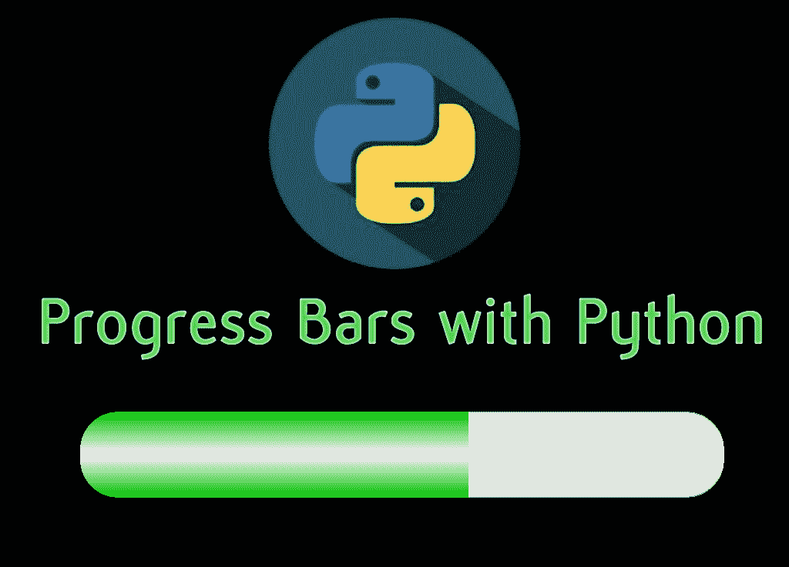
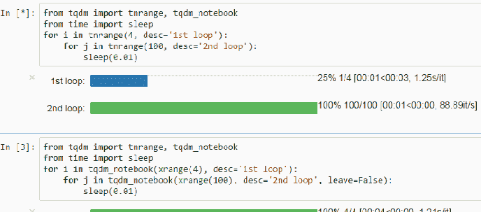

# 如何用 tqdm 给 Python 添加进度条

> 原文：<https://medium.com/quick-code/how-to-add-a-progress-bar-to-python-with-tqdm-74d625c445e5?source=collection_archive---------0----------------------->

了解如何在几秒钟内将一个很酷的进度条添加到您的 Python 进程和迭代中！

你用 Python 做机器学习迭代、长时间计算或需要大量时间的过程的频率是多少，你必须等待几分钟？现在，你不知道完成这项任务需要多少时间！你可能要等 30 秒或 2 小时，却不知道要花多少时间。

就这样，直到现在。这是您将要创建的内容的一个示例:

在这一课中，你将学习如何使用 TQDM Python 库给你的迭代器一个很酷的、可定制的进度条，它可以计算需要多少时间。

这个 Python 库专注于为用户创建一个可视化的帮助，以进度条的形式，正因为如此，这一课将只采用视频格式。在这里观看:

# 资源:

TQDM 文档:
[https://github.com/tqdm/tqdm](http:// https://github.com/tqdm/tqdm)

Pypi 包:
【https://pypi.org/project/tqdm/ 

[我的 Youtube 教程视频](https://www.youtube.com/channel/UC9OLm6YFRzr4yjlw4xNWYvg?sub_confirmation=1)

[在 Twitter 上联系我](https://twitter.com/DavidMM1707)

[阅读更多教程](https://letslearnabout.net/category/tutorial/)

*原载于 2019 年 9 月 18 日*[*letslearnabout.net*](https://letslearnabout.net/python/how-to-add-a-progress-bar-to-python-with-tqdm/)*。*