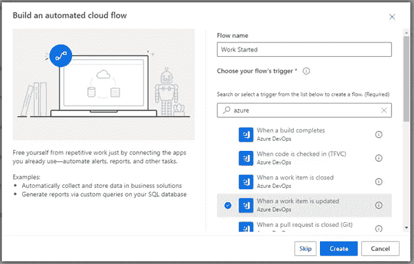
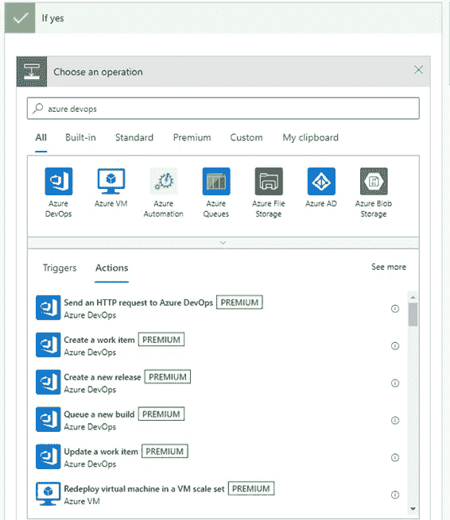

# 如何向 Azure Devops 板添加自动化周期时间

> 原文：<https://medium.com/version-1/how-to-add-an-automated-cycle-time-to-azure-devops-boards-8a12d3641e81?source=collection_archive---------0----------------------->

除了故事点和速度之外，我强烈支持用周期时间和吞吐量来度量流程。Azure Devops 有一个很好的仪表板小部件，如下所示，它只在工作完成后显示这些内容。

看板、Scrum，甚至更传统的交付团队都可以从他们的工作项目单上看到正在进行的周期时间而获得价值。我们在日常通话中使用周期时间来快速查看和讨论哪些工作项目进展慢于预期。目前，您不能单独从 Azure Devops 计算周期时间，但您可以与 power Automate 集成，后者通常与您的 Office 365 订阅捆绑在一起。

在这篇文章中，我将展示我每天自动添加和更新周期时间的步骤，我估计在您设置访问权限后，完成这些步骤需要一个小时。

首先，你需要:

*   Azure Devops 中用于修改流程模板的管理员访问权限
*   用于设计流程的 Power Automate 订阅(我的订阅包含在 Office 365 许可证中)

我假设你理解 Azure Devops 流程模板。我还假设您使用了与我相同的字段名和值，但是您可以根据自己的需要进行调整。

# 在 Azure Devops 中添加新字段

你需要两个字段，周期时间和开始日期。当一个工作项被移动到我们的第一个工作列时，我们的开始日期字段将被填充。对我来说，这是“发展中”。

转到组织设置，然后选择左侧菜单中“纸板”下的处理。如上所述，编辑流程模板只能由管理员完成。

选择要编辑的过程模板。然后导航到您将添加周期时间的工作项类型。我用的是“任务”。

## 周期

选择[新字段]

创建一个字段并命名，我用“周期时间”。

选择“整数”作为类型。

## 开始日期

选择[新字段]

创建一个字段并命名，我用“开始日期”。

选择“日期/时间”作为类型。

完成后，你应该得到类似下面的东西。我创建了一个新组来添加我的流场。

Azure Devops Process Template

# 创造你的动力自动化流程

这里的第一件事是在 https://powerautomate.microsoft.com/[设立你的 Power Automate 账户](https://powerautomate.microsoft.com/)你将需要这些流量的高级许可证，我的包括在我的 Office 365 订阅中。

接下来，创建到 Azure Devops 的连接。通过左侧菜单上的[数据]-[连接]来完成此操作。

选择[新连接]并在搜索中输入“azure devops”以过滤连接。

Setting your connection

添加连接并填写所需的值。

准备好后，您可以点击左侧菜单中的[创建]或“我的流程”页面中的[新流程]。

您将需要两个流程:

*   一个由 Azure DevOps 工作项更新触发
*   一个计划在你选择的频率下运行。

# 工作开始流程

创建新流程并选择“自动化云流程”

在搜索框中键入“azure”并选择“当工作项更新时”

Choosing the trigger

创建后，您可以向“工作项更新时”框中添加值

When a work item is updated

我们正在将周期时间添加到我们的任务中。在本例中，选择您要添加周期时间的类型。

完成后，单击[New step]并将“condition”输入过滤器。从结果中选择条件，您的流程应该如下所示:

Using condition logic

现在我们增加了一个条件，就是我们希望电力自动化要注意。这是一个没有开始日期的工作项，也没有您想要测量周期时间的状态。对于我们来说，就是在

中选择你的字段，点击进入“选择一个值”框。您将从您的工作项中获得一个可用字段的列表。使用搜索过滤器帮助您找到您的字段。然后选择开始日期。

Setting the conditon field

现在您需要为开始日期“选择一个值”。选择字段，当对话框打开时，选择表达式选项卡，键入“null”并单击确定。

Setting the condition value

在“条件”框中，添加一个组并添加每个活动状态。然后输入你要找的州。

注意:自从创建了这个流之后，我观察到一些任务被直接转移到了 review 状态，所以我在我的逻辑中包含了所有的活动状态。

您的条件框现在应该如下所示:

Condition box

我们检查开始日期*为空*，这样我们只设置了一次。如果没有这一点，每当用户在活动状态之间移动他们的工作项时，我们将重置日期并重置周期时间。

好了，现在我们有了逻辑，我们需要在 Yes 条件下更新工作项。在“是”框中单击[添加操作]。在搜索过滤器中键入“azure devops ”,然后单击[更新工作项目]

Setting Yes condition operation

现在，在“更新工作项”框中，再次添加您的组织名称。此外，添加您的项目名称。对于工作项 id，在字段中单击并从动态内容中选择[Id]。这个 Id 是从上一步“当一个工作项被更新时”传递过来的。

选择您正在使用的工作项类型，在本例中为“Task”。

然后选择[高级选项]。在“其他字段”中，单击进入“输入关键字”，并键入“开始日期”作为关键字。在“输入值”框中，使用对话框搜索“更改日期”。

您的“是”框现在应该是这样的:

Updating the work item

这是第一个完整的流程。现在点击保存，我们可以测试它的工作。

在我们测试之前，我们要检查流量是否打开。转到“我的流”并查看流上是否显示禁用图标。要打开它，点击 3 个点并选择“打开”

Disabled flow

现在，流已经启动并正常工作，应该可以正常工作了。但是您可以通过在测试模式下设置流量来更快地测试它。要进行测试，再次编辑流程，然后单击屏幕右上角的[测试]。选择手动测试，然后单击[测试]按钮。

现在导航到 Azure DevOps 并将一个工作项移动到“开发中”状态。这应该会更快地触发流，并且您可以验证开始日期已经被填充。

工作开始流程现在正在运行，我们可以创建周期时间流程。

# 循环时间流程

对于这个流，我们需要在 Azure DevOps 中定义一个查询。在我的例子中，我需要所有处于开发中、审查中或准备审查状态的活动任务。添加开始日期不为空的检查。没有开始日期，我们的流无法计算 CycleTime，如果为空，将会出错。我假设你理解查询，但下面的截图显示了这个查询。确保将其保存为共享查询，并通过列选项将周期时间和工作开始时间列添加到结果中。

Azure Devops query

现在我们有了 Azure Devops 中的查询，我们回到 Power Automate。

您需要创建一个“预定云流程”。命名它，并选择它何时运行。我选择了星期，选择了星期一到星期五，时间是早上 8 点。

Creating a scheduled flow

创建流程后，单击[新步骤]。搜索 Azure Devops 并选择“获取查询结果”

Get Azure Devops query results

希望这是一个简单的步骤，并给你这个:

Get query results parameters

接下来，我们初始化一个新变量，称之为工作日。这将用于保存扣除周末后的工作日数。

增加一个步骤。在搜索中键入“变量”并选择“初始化变量”。将其命名为“工作日”，选择 Integer 作为类型，并赋予其值 0。如下图所示:

Initialize variable

添加一个新步骤，搜索“应用于每个”。选择“应用于每个”，并将“值”的动态内容添加到框中。

Apply to each

这将遍历查询结果，对每个结果应用以下操作。

在框中添加另一个操作，并再次搜索 azure devops。选择“get work item details ”,像以前一样添加您的值，并为工作项 Id 添加动态值“ID”。

Get work item details

下一步要添加的是“撰写”，你的应用到每一步现在应该看起来如下。

Compose the Cycle Time

点击“添加动态内容”,并复制以下公式:

div(sub(ticks(format datetime(utc now()，' yyyy-MM-dd '))，ticks(format datetime(outputs(' Get _ work _ item _ details ')？[' body/fields/Microsoft _ VSTS _ Scheduling _**start date**']，' yyyy-MM-dd '))，864000000000)

此公式将日期转换为刻度。一天有 864000000000 个滴答。然后，我们使用 sub 从 utcNow(当前日期)中减去 StartDate，最后，我们将它除以 1 天的刻度，得到天数的差值。

接下来的几个步骤我们将放入一个范围内，没有别的原因，只是为了让我们在处理流程时可以折叠/展开这个部分。添加一个步骤，搜索“范围”。

在作用域内添加一个新步骤——“设置变量”。然后添加来自 CycleTime 的动态内容“输出”。

Dynamic outputs

您对每个框的申请将如下所示:

Apply to each logic

现在，在作用域内，添加一个“递减变量”步骤。名称为“工作日”,并添加以下公式作为表达式:

mul(div(sub(outputs('CycleTime ')，1)，7)，2)

Decrement variable

在 Scope 中，添加另一个“递减变量”步骤。如果周末的开始日期晚于结束日期，此步骤将扣除两天。例如，周四-周一将包括周末。这将需要公式:

if(less(sub(day ofweek(format datetime(utc now()，' yyyy-MM-dd '))，day ofweek(format datetime(outputs(' Get _ work _ item _ details ')？[' body/fields/Microsoft _ VSTS _ 日程安排 _ 开始日期']，' yyyy-MM-dd '))，0)，2，0)

您的范围现在将如下所示:

Second Decrement variable

注意:我对上面的一些步骤进行了重命名，以使流程的工作更加清晰。

在范围之后，为 Azure Devops 添加一个新步骤。“更新工作项”。像以前一样添加连接信息，并添加 CycleTime 作为键，添加动态值“工作日”作为值。您的最后一步应该如下所示:

保存你的流量。然后，使用创建工作开始流时描述的步骤，开始并启用该流。

您现在可以运行一个测试流程，方法是将流程置于编辑状态，然后单击屏幕右上角的[Test]。选择手动，然后点击“运行流程”开始。然后，您可以导航到测试页面，查看流程是否完成。

如果您在流程中没有任何错误，那么您现在将在您的工作项中填充周期时间。您可以像我们一样，在 Devops 板上编辑标签的外观来显示周期时间。

Cycle Time displaying on tickets

周期时间有助于团队在日常通话中快速看到进展缓慢的工作项目。如果您正在使用看板，您可能还想测量某个项目在特定列中的天数。通过修改上面的步骤，您可以很容易地添加票据移动列/状态后的天数。这确实有助于找出你工作中的瓶颈。

感谢阅读！请分享您的任何反馈。

关于作者:
Simon wraitt 是版本 1 中的 scrum 大师。